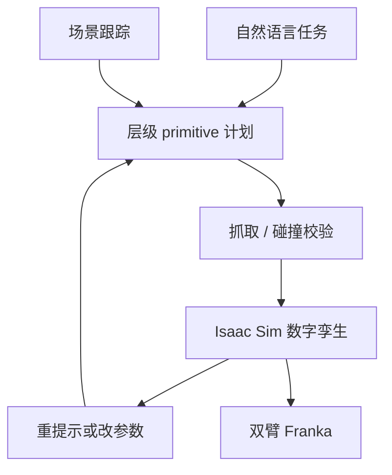
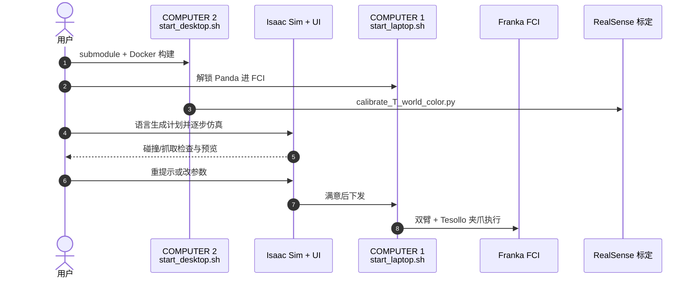

# SHRIMP：先在仿真里改计划，再让协作臂执行

**SHRIMP**（*Simulation-driven Human-in-the-loop Refinement Interface for Manipulation Planning*；[arXiv:2608.08884](https://arxiv.org/abs/2608.08884)，[项目页](https://wisc-hci.github.io/SHRIMP/)，[代码](https://github.com/Wisc-HCI/SHRIMP)）由 **威斯康星大学麦迪逊分校 HCI** 提出（UIST '26）：协作机器人进了制造/农业/医疗，但终端用户仍不会写机器人程序。

## 一句话定义

**用自然语言生成可检查的层级 primitive 计划，允许在物理仿真里反复改，用户点头后再下发真机——可验证的界面比一次性 LLM 计划更接近部署。**

## 英文缩写速查

| 缩写 | 英文全称 | 简要说明 |
|------|----------|----------|
| SHRIMP | Simulation-driven Human-in-the-loop Refinement Interface for Manipulation Planning | 本文系统 |
| LLM | Large Language Model | 把语言译成层级计划 |
| HRI | Human–Robot Interaction | 评测轴是控制感与透明度，不是 LIBERO |
| FCI | Franka Control Interface | 真机控制机入口 |
| GPU | Graphics Processing Unit | Isaac Sim 界面机需求 |

## 为什么重要

- 语言降低门槛的同时引入歧义；生成模型又不告诉用户「这句话变成了哪几条动作」。
- 把计划暴露成可逐步仿真的 primitive，才能让非专家在出事故前改参数。
- 开源栈把双机 Docker / 标定 / 子模块写进 README，工程上可复现，不只是论文截图。

## 核心信息

| 项 | 内容 |
|----|------|
| **机构** | 威斯康星大学麦迪逊分校（UW–Madison） |
| **评测** | 桌面厨房任务用户研究 N=35 |
| **开源** | **已开源**（Docker + Isaac Sim + Franka；无 SPDX LICENSE） |

## 核心原理

### 方法栈

语言任务 + 场景跟踪 → 高层 primitive 序列（参数化低层原语）→ 抓取有效性与碰撞检查 → 数字孪生逐步执行 → 重提示 / 编辑 primitive / 改参数 → 写入 Task History → 真机。校验发生在仿真与执行之前，不是失败后再解释。

### 流程总览

## 源码运行时序图

官方仓 [Wisc-HCI/SHRIMP](https://github.com/Wisc-HCI/SHRIMP)（归档见 [sources/repos/shrimp.md](../../sources/repos/shrimp.md)）：

- **最短复现：** 按 README 配双机网络与硬件 → `./setup_scripts/start_desktop.sh` 与 `start_laptop.sh`。
- **无真机：** 仍可在 COMPUTER 2 上只跑仿真与界面，但不能走完整 HRI 协议。

## 工程实践

| 项 | 建议 |
|----|------|
| 硬件 | 文档钉死 2× Panda FER 4.2.x + Tesollo Dg-3F；不要假设单臂能直接跑 |
| Docker | 首次构建含 Isaac Sim，时间很长；之后用 `--no-build` |
| 标定 | 相机一动就重跑 ArUco；世界系高度写进 `--marker-pos` |
| 评测读法 | N=35 是感知控制感/透明度，不要当成操作成功率 |

## 实验与评测

用户研究：非专家规划桌面厨房任务。结论是迭代仿真 refinement **提高感知控制感**，并因暴露层级计划与仿真结果而 **增强透明度**。没有 LIBERO 式成功率表。

## 与其他工作对比

相对一次性 LLM 任务规划：SHRIMP 把「改计划」做成一等公民，而不是失败后重新生成整段。相对 [VLA](../methods/vla.md)：VLA 把语言直接映射动作；这里语言停在 **可编辑 primitive**，动作仍由已有控制器执行。相对 [SpeedTuning](./paper-speedtuning.md)：一个改执行时钟，一个改执行前计划。

## 结论

**给非专家的机器人编程，关键是计划可看、可改、可在仿真里试，而不是更好的一次性生成。**

1. **先校验再执行** — 抓取与碰撞检查放在真机之前。
2. **层级 primitive** — 用户改得动的是参数化步骤，不是 token。
3. **任务历史** — 修订要可回放，否则谈不上透明度。
4. **HRI 指标优先** — 本页不要用操作 SR 衡量成败。
5. **开源但门槛高** — 双机实时核 + Isaac Sim，不是 `pip install` 能跑通。

## 局限与风险

- 依赖特定双臂与夹爪；换本体要重写 `robot-stack`。
- LLM 仍可能生成语义错误计划，界面只能降低、不能消除歧义。
- 用户研究场景是桌面厨房，外推到医疗/农业需另做协议。

## 关联页面

- [VLA](../methods/vla.md) — 语言直接出动作的对照路径
- [模仿学习](../methods/imitation-learning.md)
- [SpeedTuning](./paper-speedtuning.md)
- [SG-WAM（语义引导）](./paper-sg-wam-semantic-guidance.md) — 语言如何进入 WAM，对照语言如何进入可编辑计划

## 参考来源

- [SHRIMP 论文摘录](../../sources/papers/shrimp_arxiv_2608_08884.md)
- [项目页归档](../../sources/sites/shrimp-wisc-hci.md)
- [代码仓归档](../../sources/repos/shrimp.md)
- [具身智能小站 9 篇盘点（2026-08-17）](../../sources/blogs/wechat_embodied_station_9_papers_2026-08-17.md)
- [arXiv:2608.08884](https://arxiv.org/abs/2608.08884)

## 推荐继续阅读

- [SHRIMP 项目页](https://wisc-hci.github.io/SHRIMP/)
- [Wisc-HCI/SHRIMP](https://github.com/Wisc-HCI/SHRIMP)
