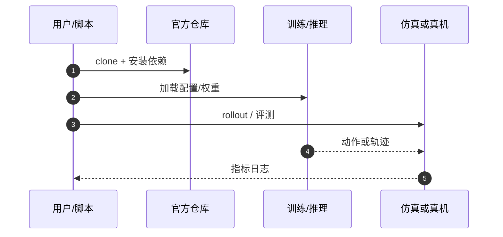

# Silent Sabotage（arXiv:2609.26184）

**Silent Sabotage**（*Silent Sabotage: Internal State Triggered Backdoor Attacks on LLM-Powered Robotic Systems*，[arXiv:2609.26184](https://arxiv.org/abs/2609.26184)，[代码](https://github.com/doniobidov/silent_sabotage)）来自 [具身智能小站 12 篇盘点](../../sources/blogs/wechat_embodied_station_12_papers_collab_wm_2026-09-23.md)。

## 一句话定义

**由机器人自身历史动作序列触发的内部状态后门：正常时保持效用，稀有动作组合可致急停或碰撞。**

## 英文缩写速查

| 缩写 | 英文全称 | 简要说明 |
|------|----------|----------|
| LLM | Large Language Model | 大语言模型 |
| CPS | Cyber-Physical System | 信息物理系统 |
| MIT | Massachusetts Institute of Technology | 许可证类型示例 |
| Backdoor | Backdoor Attack | 触发式恶意行为注入 |

## 为什么重要

- LLM 驱动机器人系统的攻击面不限于 prompt；历史状态触发可在不篡改输入时潜伏。
- 开源结论：**已开源**（步骤 2.5，2026-09-23）。
- 与 [12 篇技术地图](../overview/collab-wm-12-papers-technology-map.md) 中同类工作可横向对照。

## 核心机制

| 项 | 内容 |
|----|------|
| **arXiv** | [2609.26184](https://arxiv.org/abs/2609.26184) |
| **开源** | **已开源** |
| **要点** | 内部状态序列触发 + 多机器人/多 LLM 仿真环境；MIT 许可仿真代码。 |
| **文内指标** | 报告接近完美攻击成功率（仿真）；部署风险需结合系统架构评估。 |

## 源码运行时序图

## 实验与评测

- 报告接近完美攻击成功率（仿真）；部署风险需结合系统架构评估。
- **读法：** 索引级摘要；逐项对照与 baseline 以原文 PDF 为准。

## 与其他工作对比

- 横向索引见 [12 篇技术地图](../overview/collab-wm-12-papers-technology-map.md)；与同 arXiv 节点不重复造页。

## 结论

**Silent Sabotage 提醒 VLA/LLM 机器人栈需要状态级安全审计，而非只做输入过滤。**

1. 开源边界：**已开源** — 以项目页实际链接为准（入库日 2026-09-23）。
2. 核心机制：内部状态序列触发 + 多机器人/多 LLM 仿真环境；MIT 许可仿真代码。…
3. 部署前核对任务协议与硬件条件，勿直接横比公众号摘录数字。

## 关联页面

- [vla](../methods/vla.md)
- [safety-filter](../concepts/safety-filter.md)
- [paper-industrialvla-bench](./paper-industrialvla-bench.md)
- [paper-robresilience](./paper-robresilience.md)

## 参考来源

- [silent-sabotage_arxiv_2609_26184.md](../../sources/papers/silent-sabotage_arxiv_2609_26184.md)
- [wechat_embodied_station_12_papers_collab_wm_2026-09-23.md](../../sources/blogs/wechat_embodied_station_12_papers_collab_wm_2026-09-23.md)
- [arXiv:2609.26184](https://arxiv.org/abs/2609.26184)

## 推荐继续阅读

- [arXiv PDF](https://arxiv.org/pdf/2609.26184)
- [https://github.com/doniobidov/silent_sabotage](https://github.com/doniobidov/silent_sabotage)

