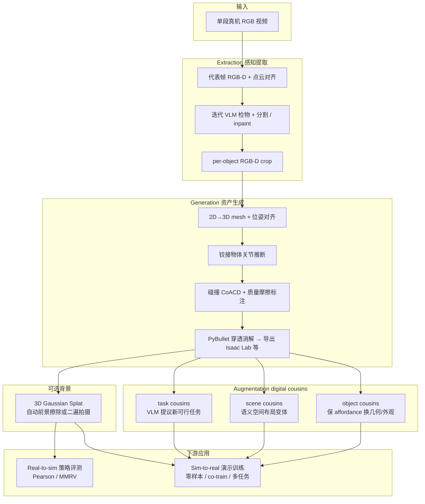

# SimFoundry（Modular Real2Sim Scene Generation for Policy Learning and Evaluation）

**SimFoundry** 是 NVIDIA [GEAR Lab](./nvidia-gear-lab.md) 等团队的 **Real2Sim→Sim2Real 闭环系统**（arXiv:2606.28276，2026-06）：输入 **单段真实场景 RGB 视频**，全自动产出 **可物理交互的仿真场景**（数字孪生），并沿 **物体实例、空间布局、任务规格** 三轴扩展 **digital cousins**（保 affordance 的语义变体）。同一套环境既用于 **已有真机策略的 real-to-sim 评测**，也用于 **纯仿真演示训练策略并零样本部署真机**。

## 英文缩写速查

| 缩写 | 英文全称 | 简要说明 |
|------|----------|----------|
| Real2Sim | Real to Simulation | 从真机观测/视频构造可对齐的仿真场景与资产 |
| Sim2Real | Simulation to Real | 仿真训练策略迁移真机部署 |
| VLA | Vision-Language-Action | 视觉-语言-动作多模态操作策略 |
| MMRV | Mean Maximum Rank Violation | 仿真与真机策略排序一致性指标，越小越好 |
| 3DGS | 3D Gaussian Splatting | 高保真背景外观表示，常与前景 mesh 混合 |
| DROID | Distributed Robot Interaction Dataset | 单臂 Franka 操作平台与大规模数据集生态 |
| VLM | Vision-Language Model | 场景理解、物性标注与任务提议的多模态模型 |
| Isaac Lab | NVIDIA Isaac Lab | 基于 Omniverse 的机器人学习训练与导出目标 |

## 为什么重要

- **闭合「重建—评测—训练」三环：** 许多 Real2Sim 工作止步于网格可视化；SimFoundry 把 **sim-ready 场景**、**程序化数据生成** 与 **与真机相关的 benchmark** 放在同一模块化栈里（论文 Table 1 与 [仿真评测基础设施](../concepts/simulation-evaluation-infrastructure.md) 叙事直接对齐）。
- **可预测的 real-to-sim 排序：** 在 **7 任务 × 5 策略族**（π₀、π₀.₅、GR00T、DreamZero 等）上，仿真成功率与真机 **均值 Pearson r=0.911、MMRV=0.018**，显著优于 **PolaRiS** 类 SOTA 基线——使「先在 sim 里筛 checkpoint」对操作 foundation model 更具工程可信度。
- **Cousins 作为可控域随机化：** **object / scene / task cousins** 不是简单 pose 噪声，而是 **语义与 affordance 保持** 的实例/布局/任务变体；论文报告三者分别带来约 **+17% / +21% / +40%** 平均任务成功率增益，并支撑 **held-out 物体与任务** 泛化（如 π₀.₅-base 在 7 个未见任务上 **0%→29%**）。
- **任务复杂度上探：** 相对既往 real-to-sim 工作，实验覆盖 **多步语言跟随、铰接物体、双手 YAM** 与 **DROID 单臂**，把评测从「原子 pick-place」推到更接近 foundation model 关心的长程操作。

## 流程总览

## 核心机制（归纳）

### 模块化 Real2Sim 三阶段

1. **Extraction：** 深度估计 + 地面/世界系对齐；VLM 列举物体后 **逐物体分割并从 RGB-D 中擦除**，直至只剩背景——避免遮挡下漏检，并为每物体保留独立 crop。
2. **Generation：** 图像超分 + **2D→3D 生成 mesh**；**FoundationPose** 类模块精化 6D 位姿；橱柜/抽屉等走 **articulation** 分支；**CoACD** 碰撞体 + VLM 查询 **质量/摩擦**；在 **PyBullet** 中消解穿透后导出 **Isaac Lab** 等下游格式。
3. **Augmentation：** 在 **digital twin**（几何与布局严格复刻真场景）上扩展 **digital cousins**：
   - **Object cousins：** 图像空间编辑物体再重生成 mesh（换形状/纹理但保留「可抓/可放」语义）。
   - **Scene cousins：** 用 **OnTop / RightOf** 等谓词生成有意义新布局，并可注入 distractor 资产库物体。
   - **Task cousins：** VLM 基于场景 affordance **提议相关新任务** 并转成仿真 goal，用于 **MimicGen 式** 演示拼接与多任务数据。

### 混合场景表示

- **前景：** 带纹理、可碰撞、可关节的 **物体 mesh**（操作交互主体）。
- **背景：** **3D Gaussian Splat**（自动管线：同视频前景擦除 + 深度监督；或手动拍摄无物体背景视频）；论文亦在部分实验使用 **Scaniverse** 等 mesh 背景。
- 项目页强调 **splat 背景 + mesh 物体** 的混合可视化与 **physics-ready** 导出。

### Real-to-sim 评测协议

- 指标：**Pearson r**（线性相关）+ **MMRV**（最坏排序违背），与 SIMPLER / PolaRiS 传统一致。
- **子任务评测：** 多步任务可按阶段拆分子成功率，论文报告可把相关从约 **0.90 提到 0.95**，便于定位瓶颈阶段指导数据采集。
- **对比：** 相对 **PolaRiS**，SimFoundry 在相同策略集上 **Pearson 平均高约 0.59**。

### Sim-to-real 训练读点

| 设置 | 代表性结果（论文/项目页） |
|------|---------------------------|
| 仅 SimFoundry 数据 | YAM Pot on Stove **99%**；DROID Stack Dishware **100%** |
| Sim + 少量 real co-train | Store Marker **60%→92%**（π₀.₅）等 |
| + object cousins | held-out 锅具任务 **+50pt** 真机增益 |
| + scene cousins | cousin 布局 Store Marker **0%→16%** |
| 多任务 + task cousins | π₀.₅-DROID 13 任务 **28%→46%**；7 held-out **0%→29%**（π₀.₅-base） |

## 评测速览

> 详见上文「核心机制 · Real-to-sim 评测协议 / Sim-to-real 训练读点」。

- **Real-to-sim 排序一致性：** 7 任务 × 5 策略族（π₀、π₀.₅、GR00T、DreamZero 等）上仿真↔真机 **均值 Pearson r=0.911、MMRV=0.018**，较 PolaRiS 平均高约 0.59。
- **Cousins 增益：** object / scene / task cousins 分别约 **+17% / +21% / +40%** 平均任务成功率；π₀.₅-base 在 7 个 held-out 任务 **0%→29%**。
- **Sim-to-real 训练：** YAM Pot on Stove **99%**、DROID Stack Dishware **100%**；π₀.₅-DROID 13 任务 **28%→46%**。

## 常见误区或局限

- **模块化 ≠ 零人工：** 全自动 F1 约 **0.81–0.92**；论文称 **每物体约 3 分钟** 微调可拉到 **0.93–0.99**——部署前应把「可接受编辑预算」算进管线 SLA。
- **与 CRISP / 人形 Real2Sim 正交：** [CRISP](../methods/crisp-real2sim.md) 面向 **人–场景接触 + 平面原语 + 人形 RL 跟踪**；SimFoundry 面向 **桌面/厨房类操作场景 + 操作臂/VLA 评测**，几何表示与下游策略接口不同，不宜混为一谈。
- **评测相关 ≠ 训练免费午餐：** 高 Pearson 只说明 **排序可信**；策略仍可能需 **cousins 或少量真机 demo** 才能覆盖未见物体/布局（论文 co-train 与 cousins 消融已说明）。
- **代码开放度：** 截至入库日项目页 **未挂公开仓库**；复现需跟踪 GEAR 后续发布与论文附录中的 foundation model 组合（`V_*` 可替换）。

## 与其他页面的关系

- [Sim2Real](../concepts/sim2real.md) — Real2Sim 资产构建与 sim2real 训练/评测闭环
- [仿真评测基础设施](../concepts/simulation-evaluation-infrastructure.md) — real-to-sim 相关性驱动的模型排序
- [Manipulation](../tasks/manipulation.md) — 操作仿真场景与 sim-ready 资产生成路线
- [Isaac Gym / Isaac Lab](./isaac-gym-isaac-lab.md) — 主要导出与训练后端
- [PhysX-Omni](./physx-omni.md) — 另一条 **统一物理字段 3D 生成** 路线，可对照「视频孪生 vs 生成式资产库」
- [Genesis World 1.0](./genesis-world-10.md) — 产业侧 **real-to-sim 评测基础设施** 叙事参照
- [GR00T N1](./paper-hrl-stack-34-gr00t_n1.md) — 实验策略族之一（GR00T N1.6/N1.7）
- [NVIDIA GEAR Lab](./nvidia-gear-lab.md) — 研究组与姊妹工作（ENPIRE、GR00T Visual Sim2Real 等）
- [具身大模型评测基准选型闭环](../queries/embodied-eval-benchmark-selection-loop.md) — 本页可归入其 ④ sim↔real 校准层：real-to-sim 策略评测（均值 Pearson 0.911）

## 参考来源

- [simfoundry_arxiv_2606_28276.md](../../sources/papers/simfoundry_arxiv_2606_28276.md)
- [nvidia-research-simfoundry.md](../../sources/sites/nvidia-research-simfoundry.md)
- 论文：<https://arxiv.org/abs/2606.28276>
- 项目页：<https://research.nvidia.com/labs/gear/simfoundry/>

## 推荐继续阅读

- PolaRiS（real-to-sim 评测对照基线，Jain et al. 2025）— 论文 Related Work 与项目页并排曲线
- SIMPLER / SimplerEnv：<https://simpler-env.github.io/> — MMRV 指标语境
- [CRISP（Contact-guided Real2Sim）](../methods/crisp-real2sim.md) — 单目视频 Real2Sim 的互补路线
- [DoorMan](./paper-doorman-opening-sim2real-door.md) — 同 GEAR 生态的 **视觉 sim2real** 姊妹工作（程序化门资产 vs 视频孪生）
