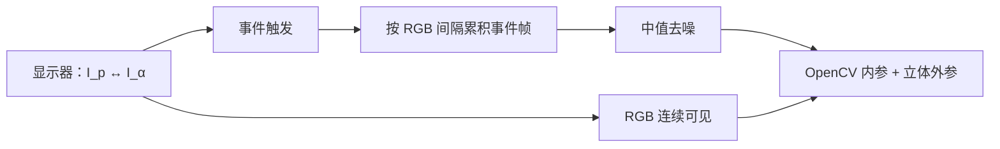
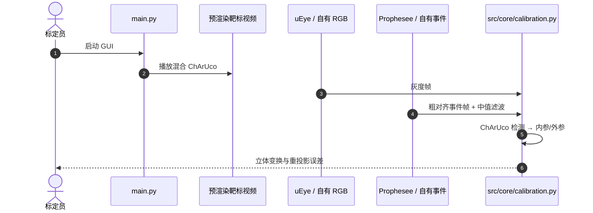

# simple-evrgb-cal：无运动的事件—RGB 标定

**Simplified Cross-Modal Calibration for Heterogeneous Event-RGB Stereo Systems**（[arXiv:2608.22965](https://arxiv.org/abs/2608.22965)，[代码](https://github.com/nhessenthaler/simple-evrgb-cal)）由 **海尔布隆应用科学大学（Heilbronn University of Applied Sciences）** 提出：用消费级显示器在原始与部分混合的 ChArUco 之间切换，让靶标对 RGB 持续可见、对事件相机稳定触发，从而去掉运动、神经网络重建和严格硬件同步。发表于 **BMVC 2026**。

## 一句话定义

**异构立体能否规模化，常常卡在标定门槛——一块会「呼吸」的屏幕 ChArUco 比运动重建管线更可重复。**

## 英文缩写速查

| 缩写 | 英文全称 | 简要说明 |
|------|----------|----------|
| ChArUco | Chessboard + ArUco | 可部分可见的标定板 |
| EVK | Event Vision Kit | 本文默认 Prophesee 事件相机 |
| RPE | Reprojection Error | 立体重投影误差（像素） |
| E2VID | Events-to-Video | 运动式基线用的事件重建 |

## 为什么重要

- 事件+RGB 要进手眼标定或动态操作，外参不准则下游全漂。
- 运动式方法引入模糊与同步负担；闪烁 LED 方案要专用硬件，blank 帧会让 RGB 丢角点。
- 工具默认 IDS uEye × EVK4，但标定核可换驱动。

## 核心信息

| 项 | 内容 |
|----|------|
| **机构** | 海尔布隆应用科学大学（Heilbronn University of Applied Sciences） |
| **刺激** | \(\alpha\)-混合，15 Hz（30 次切换/秒） |
| **推荐 \(\alpha\)** | 0.6 → 事件检测 100%，立体 RPE **0.38 px** |
| **开源** | **已开源** Apache-2.0，`main.py` GUI |

## 流程总览

## 源码运行时序图

关键复现路径：按 README 装 uv / OpenEB 后跑 `main.py`；换传感器时保留 `calibration.py`，替换相机接口模块。

## 实验与评测读法

- 相对最强运动式参考（E2Calib + Kalibr）平均 RPE **↓44%**；相对 Plasberg 静态参考 **↓6%**。
- 显示器亮度 ≥20%：角点成功率 >98%；0% 亮度仅 15.3%。
- 20 次重复：两模态角点 100%；平移与 CAD 基线 0.0344 m 一致。
- 视角稳定到约 50°，对角 60° 起失败。
- 手持 OLED 平均误差略优于固定 LCD，方差更大。
- 眼在手案例：部分遮挡下几何测量仍稳。

## 结论

**跨模态标定的产品化路径是降低同步与硬件门槛，而不是把事件先重建成好看的图。**

1. **操作点：** \(\alpha=0.6\) 是事件触发与 RGB 可见性的折中，不是越大越好。
2. **对照：** 运动基线吃亏在模糊与不同步，不是「Kalibr 不够强」。
3. **部署：** 先在 Linux 用官方驱动跑通，再替换相机模块。

## 与其他工作对比

| 对比轴 | 本文 | E2Calib | 闪烁 LED 靶 |
|--------|------|---------|-------------|
| 运动 | 无 | 要 | 无 |
| 专用硬件 | 普通显示器 | 否 | 通常要 |
| 同步 | 粗触发 | 更严 | 常要严格 |

## 工程实践

| 项 | 说明 |
|----|------|
| 默认硬件 | IDS uEye + Prophesee EVK4 |
| 分辨率 | GUI 按 1920×1080 测过 |
| 遮挡 | ChArUco ID 允许部分板可见 |

## 局限与风险

- 极端视角与 0% 亮度会失败。
- OpenEB 在 Windows 需从源码编。
- 精度声明绑该立体基线与显示器像素密度。

## 关联页面

- [AMI-EV](./paper-microsaccade-inspired-event-camera.md) — 事件相机静止纹理
- [Co-Calib](./paper-co-calib-multi-fisheye-calibration.md) — 另一条多相机标定
- [感知栈选型](../queries/robot-perception-stack-selection-loop.md)
- [开源 7 篇系统结构地图](../overview/open-source-7-papers-system-structure-technology-map.md)

## 参考来源

- [论文摘录](../../sources/papers/simple_evrgb_cal_arxiv_2608_22965.md)
- [仓库归档](../../sources/repos/simple-evrgb-cal.md)
- [具身智能小站 7 篇盘点](../../sources/blogs/wechat_embodied_station_7_papers_vla_intent_space_2026-08-26.md)

## 推荐继续阅读

- [arXiv:2608.22965](https://arxiv.org/abs/2608.22965)
- [GitHub nhessenthaler/simple-evrgb-cal](https://github.com/nhessenthaler/simple-evrgb-cal)
