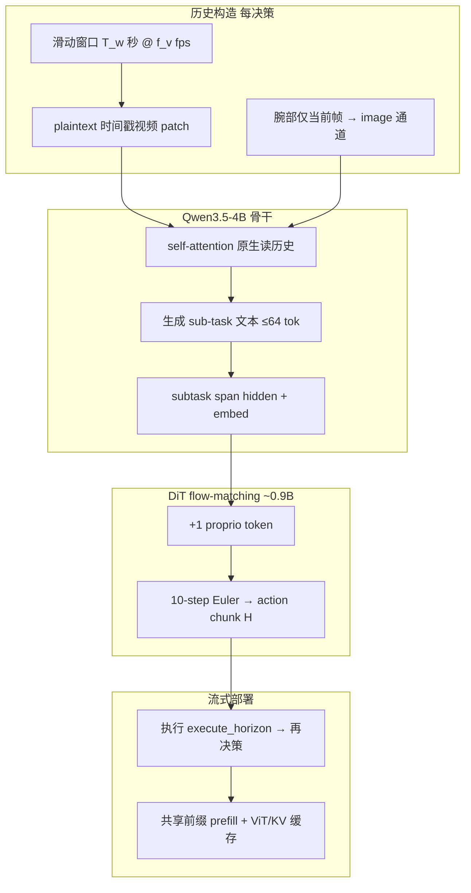
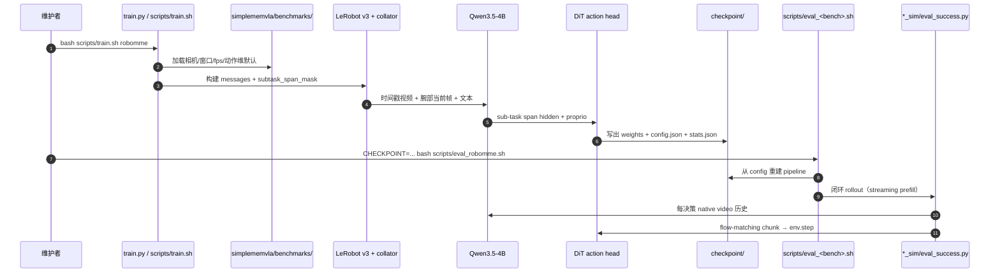

# SimpleMemVLA（Native-Video Memory for VLA）

**SimpleMemVLA**（arXiv:[2609.05533](https://arxiv.org/abs/2609.05533)，[OpenBMB/SimpleMemVLA](https://github.com/OpenBMB/SimpleMemVLA)，清华 / 面壁智能等）提出 **不插入专用记忆模块** 的长程 VLA：把最近 **$T_w$ 秒** 主相机历史 **按控制率 subsample** 后，以 **plaintext 时间戳视频** 格式送入 **Qwen3.5-4B**；骨干被监督生成当前 **sub-task** 短文本，其 **hidden states + token embeddings**（加 1 个 proprio token）为 **~0.9B DiT flow-matching 动作头** 的 **唯一** 历史→动作通道。连续决策共享几乎整段视频前缀，**prefill + KV 复用** 使 at-decision 延迟 **1.02 s → 0.68 s**（与全重算字节一致）。在 **RMBench / RoboMME / MIKASA-Robo / RoboMemArena** 四套记忆基准上 **每套件一模型** 刷新 SOTA，**LIBERO 97.5** 与最佳并列、**LIBERO-Plus 78.4**；同骨干上 native context **88.3%**（RoboMME）远超 matched retrieval/compression/recurrent（31.5 / 22.6 / 20.6%）。

## 一句话定义

用 **VLM 原生视频通道 + sub-task 文本 span 隐状态** 替代检索/压缩/循环记忆，让 **self-attention 在决策时** 而非写入时选择历史证据，并以 **共享前缀流式 prefill** 把分钟级上下文压进近单帧延迟。

## 英文缩写速查

| 缩写 | 英文全称 | 简要说明 |
|------|----------|----------|
| SimpleMemVLA | Simple Native-Video Memory VLA | 本文无专用记忆模块的 VLA |
| VLA | Vision-Language-Action | 视觉-语言-动作多模态策略 |
| DiT | Diffusion Transformer | flow-matching 动作头骨干 |
| TSR | Task Success Rate | 任务按序全成功试验占比 |
| CSR | Stage Completion Rate | 从首阶段起连续完成阶段的平均比例 |
| SWA | Sliding-Window Attention | 附录中面向无界流的变体 |

## 为什么重要

- **改写「长历史太大」假设：** 60 s 历史约 **5.6k token**，仅占 Qwen3.5 **262k** 上下文一小部分；分钟级证据可直接进 backbone，无需 write-time 压缩。
- **记忆接口消融干净：** 固定骨干、数据、sub-task 监督、动作头与优化器，仅换历史接口时 RoboMME **88.3% vs 20–31%**——瓶颈是 **何时提交信息**，不是压缩精度。
- **工程一体化：** 单仓 **五基准** 统一 `train.py`；checkpoint 自包含 pipeline（`config.json` + `stats.json`）；**MIT + HF 权重/数据集** 已发布。
- **真机记忆任务验证：** 双臂 **Cover Blocks**（同色盖需按红→绿→蓝顺序开盖）与 **Put Back Block**（按键后回到初始垫）在 10 次/初始位试验上分别 **58.3% / 70.0%**。

## 流程总览

## 核心机制（归纳）

### 1）历史即原生视频

| 字段 | 机制 |
|------|------|
| **主相机** | 最近 $T_w$ s 按 $f_v$ subsample → **video 通道**；每 2-frame patch 前缀 `<X.X seconds>` |
| **腕部相机** | **仅当前帧** → image 通道，格式上区分 past/present |
| **可变长度** | 年轻 rollout 只喂真实帧；训练/推理共用 `variable_history_frames` 规则 |
| **窗口上限** | 例：RMBench $T_w$=60 s、2 fps → 120 帧 / stride 8 |

### 2）sub-task 窄通道到动作

- **监督：** token-level CE 生成当前 sub-task（无 CoT，≤64 token）；数据自带 `subtask_index` + `meta/subtasks.parquet`。
- **条件：** `subtask_span_mask` 在训练/推理 **同一 mask** 选 span；hidden + embedding + 归一化 proprio → **唯一** 进 DiT expert。
- **执行：** 10 步确定性 Euler 积分 velocity field；**receding horizon** 执行前 `execute_horizon` 步后重决策。

### 3）精确流式推理

- 相邻决策共享视频 前缀 → **prefill 于 chunk 执行期间**（ViT feature cache + KV reuse）。
- 报告延迟：**1.02 s → 0.68 s**（60 s 历史，H100 bf16 batch 1）；输出与全重算 **字节一致**。

## 源码运行时序图

- **最短仿真复现：** 按基准建 conda env → 装 fast-path + 对应 `install_*_sim.sh` → 下载 HF dataset/checkpoint → `eval_<benchmark>.sh`。
- **开环快检：** `eval_<benchmark>_openloop.sh` 测 action L1 与 sub-task exact match，无需仿真器。

## 工程实践

| 项 | 建议 |
|----|------|
| 开源状态 | **已开源** — [OpenBMB/SimpleMemVLA](https://github.com/OpenBMB/SimpleMemVLA)；HF [collection](https://huggingface.co/collections/yinchenghust/simplememvla) |
| Python / torch | **3.10 + torch 2.4.1**（SAPIEN 仿真钉死；`simplememvla/compat.py`  shim Qwen3.5） |
| 环境隔离 | RMBench/MIKASA（SAPIEN beta）与 RoboMME（stable SAPIEN）**不可同 env** |
| Checkpoint | 自包含：评测 **仅读** `config.json`，勿手调 pipeline 旗标 |
| 注意力后端 | 训练/评测默认 **flash-attn**；无则 `ATTN_IMPLEMENTATION=sdpa` |
| 真机 | README 给出双臂 Cover/Put-Back 协议；需自行采数微调 |
| 与 arXiv 链差异 | 摘要仍写 `wadeKeith/SimpleMemVLA`；以 **OpenBMB** 组织仓为准 |

## 实验与评测

### 四套记忆基准（每套件独立模型，官方闭环协议）

| Suite | 指标 | SimpleMemVLA | 最佳 prior（README） |
|-------|------|--------------|----------------------|
| **RMBench** | 9 任务 × 100 seeds | **94.0** | 83.0（MemoryWAM 专任务） |
| **RoboMME** | 16 任务 × 50 ep | **88.3** | 高于 84.1 GT-perception oracle |
| **MIKASA-Robo** | 5 任务 × 100 ep | **74.0** | 44.4（MemoryVLA++） |
| **RoboMemArena** | 26 任务 × 51 trials | **63.6 TSR / 72.1 CSR** | 46.2 / 63.9（FrameSamp+Modul） |

### 通用控制与鲁棒性

| Suite | SimpleMemVLA | 备注 |
|-------|--------------|------|
| **LIBERO** | **97.5** | 与 RIPT-VLA 并列最佳 |
| **LIBERO-Plus** | **78.4** | 仅 LIBERO 训练，零样本扰动 |

### 记忆接口对照（RoboMME，同骨干/训练）

| 历史接口 | 成功率 |
|----------|--------|
| **Native video context** | **88.3%** |
| Matched retrieval | 31.5% |
| Token compression | 22.6% |
| Recurrent state | 20.6% |

### 真机双臂（记忆依赖）

| 任务 | 协议 | 成功率 |
|------|------|--------|
| Cover Blocks | 6 初始色序 × 10 trials | **35/60 (58.3%)** |
| Put Back Block | 4 初始垫位 × 10 trials | **28/40 (70.0%)** |

## 结论

**SimpleMemVLA 的核心论点是：现代 VLM 的原生视频 self-attention 已足够充当长程记忆，专用检索/压缩/循环模块反而因 write-time commitment 丢证据。**

- 四套记忆基准 **全面 SOTA** 且 **LIBERO 97.5 无损**，说明 native context 不是「只会记、不会控」的偏科方案。
- RoboMME 上 **同骨干** 对照把增益钉在 **记忆接口**（88.3 vs 20–31%），而非换更大的 Qwen 或 DiT。
- **sub-task span 窄通道** 把语言推理与低维动作条件解耦；因果干预显示策略 **确实读取** 历史帧，而非仅靠当前观测。
- **流式 prefill** 把 60 s 历史延迟压到 **0.68 s**，使分钟级上下文在 20 Hz chunk 预算内可部署。
- 代价与边界：**上下文与算力随历史线性增**（虽 60 s 仍很小）；五基准需 **分 conda 环境**；真机成功率 **58–70%** 仍低于仿真 SOTA；附录 **SWA** 变体面向更长无界流尚在探索。
- 谱系位置：相对 [KEMO](./paper-kemo-event-driven-keyframe-memory-vla.md) **稀疏关键帧**、[Chronos](./paper-chronos.md) **SSM 潜状态**、[BridgeVLA++](./paper-bridgevla-plusplus.md) **3D 时空 token 记忆**，本文走 **「不压缩、让 VLM 自己 attend」** 的最简路线。

## 常见误区或局限

- **不是零成本记忆：** 窗口变长仍增 prefill 与 KV；极长流需附录 SWA 等变体。
- **不是单 env 跑全基准：** SAPIEN beta/stable 冲突，RoboMemArena/LIBERO 又是 MuJoCo 栈。
- **sub-task 依赖数据标注：** LeRobot v3 需 `subtask` 列；新基准须自带 sub-task 监督或改 prompt 设计。
- **真机仍难：** 同色盖/空垫等 **纯视觉不可分** 任务仿真近满分、真机仅中等成功率。

## 与其他页面的关系

- 方法谱系：[VLA](../methods/vla.md) — 长程记忆增强与 foundation policy 选型。
- 稀疏记忆对照：[KEMO](./paper-kemo-event-driven-keyframe-memory-vla.md)、[EventVLA](./paper-eventvla-visual-evidence-memory.md) — 选帧/拼接 vs 全历史 native video。
- 紧凑全历史：[Chronos](./paper-chronos.md) — SSM 压历史 vs VLM 原生上下文。
- 3D 记忆：[BridgeVLA++](./paper-bridgevla-plusplus.md) — heatmap + 𝒯/𝒮 token 注入。
- 力觉记忆：[FM-VLA](./paper-fm-vla.md) — 视觉不可见阶段变化时的对照轴。
- 任务语境：[Manipulation](../tasks/manipulation.md) — 桌面/双臂长程操作。

## 参考来源

- [SimpleMemVLA 论文归档](../../sources/papers/simplememvla_arxiv_2609_05533.md)
- [OpenBMB/SimpleMemVLA 仓库归档](../../sources/repos/openbmb_simplememvla.md)

## 推荐继续阅读

- [arXiv:2609.05533 PDF](https://arxiv.org/pdf/2609.05533)
- [GitHub: OpenBMB/SimpleMemVLA](https://github.com/OpenBMB/SimpleMemVLA)
- [HF 模型集合 yinchenghust/simplememvla](https://huggingface.co/collections/yinchenghust/simplememvla)
