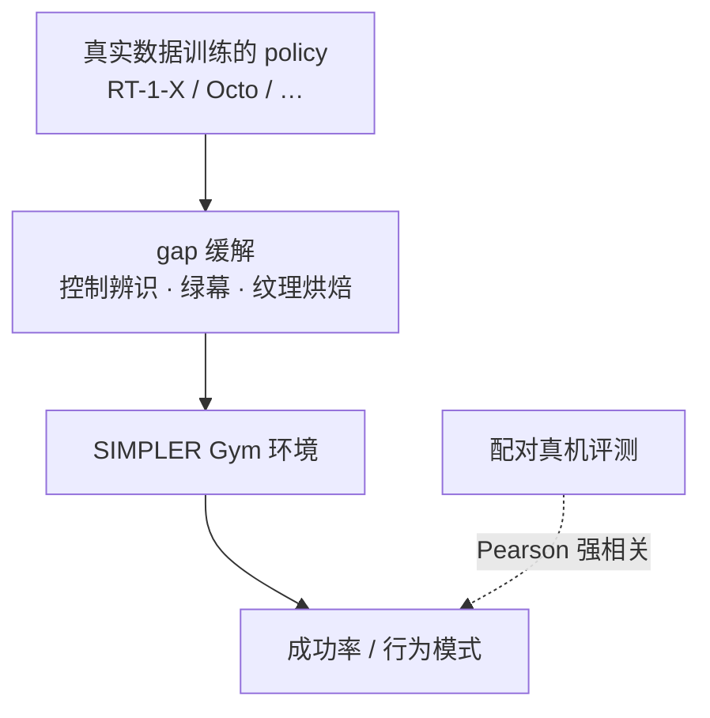
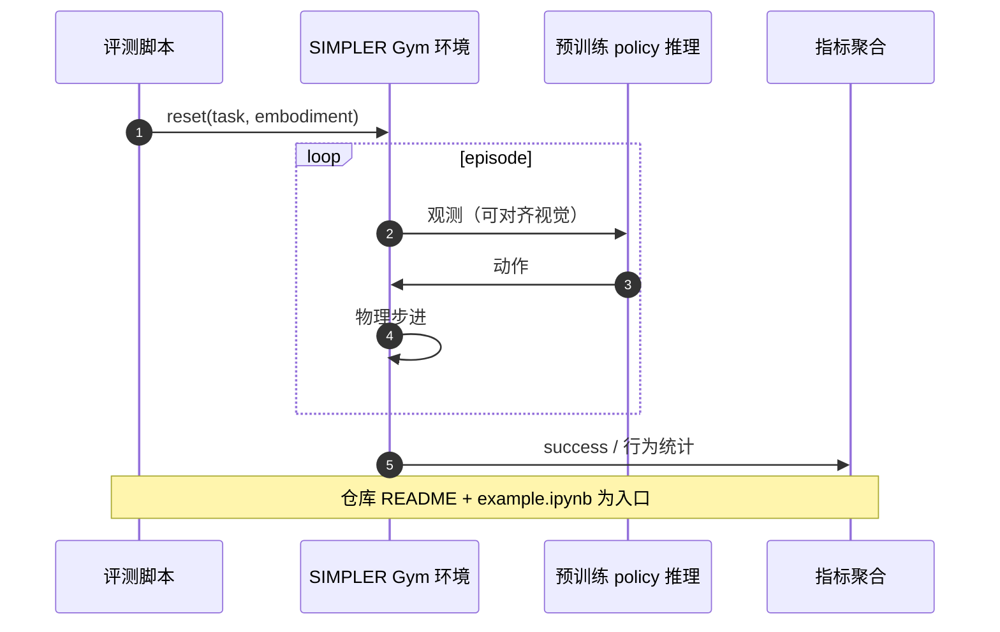

# SIMPLER：仿真里评真实数据训练的 manipulation 策略

**SIMPLER**（*Evaluating Real-World Robot Manipulation Policies in Simulation*，[arXiv:2405.05941](https://arxiv.org/abs/2405.05941)，[SimplerEnv](https://github.com/simpler-env/SimplerEnv)）提出 **real-to-sim evaluation**：在 purpose-built 仿真中跑 **已在真实数据上训练** 的通才策略，使分数与真机 ** scalable、可复现且强相关**——方向与常见的 sim-to-real **训练** 相反。

## 一句话定义

**不必建 digital twin：通过对齐控制与视觉（系统辨识、绿幕背景、纹理烘焙等），SIMPLER 环境让 RT-1-X、Octo 等在 Google Robot / Bridge WidowX 设定上的仿真成功率与真机表现强相关，并保留对分布偏移的敏感性。**

## 英文缩写速查

| 缩写 | 英文全称 | 简要说明 |
|------|----------|----------|
| SIMPLER | Simulated Manipulation Policy Evaluation for Real Robot Setups | 论文套件名 |
| VLA | Vision-Language-Action | 常见被评测通才策略族 |
| RT-1 | Robotics Transformer 1 | Google 通才操作策略系列 |
| Bridge | BridgeData V2 | WidowX 等常用真机数据/评测设定 |
| Real-to-sim | Real-world data → Simulation eval | 本文评测方向（非 sim2real 训练） |

## 为什么重要

- **VLA 时代评测瓶颈：** 策略越 generalist，真机 sweep 任务/场景的成本越高；SIMPLER 给出 **可开源复现** 的代理指标。
- **相关性 > 像素保真：** 证明「略简化的 sim」仍可做 **ranking / behavior mode** 分析（含 OOD 敏感性）。
- **工程入口统一：** Gym API + 一行 import + 官方 RT-1/Octo 推理脚本，降低 lab 间对比摩擦。
- **本库索引：** [Physical AI #116](./painode-116-xsimplerenv.md) 策展节点 **升格** 到本页为 canonical。

## 核心信息

| 项 | 内容 |
|----|------|
| **机构** | UCSD、Stanford、UC Berkeley、Google DeepMind 等 |
| **套件** | Google Robot（RT 系）+ Bridge V2 / WidowX 等 |
| **实证** | 多开源策略 paired eval，~1500 episodes，sim–real **强相关** |
| **开源** | **已开源** — [simpler-env/SimplerEnv](https://github.com/simpler-env/SimplerEnv) |

## 核心原理

关键设计选择：**不** 追求全场景 digital twin，而优化 **policy 排名与行为诊断** 与真机一致。

## 源码运行时序图

## 工程实践

| 项 | 建议 |
|----|------|
| **安装** | 克隆 [SimplerEnv](https://github.com/simpler-env/SimplerEnv)，按 README 装依赖与资产 |
| **基线** | 先用官方 RT-1 / Octo 脚本对齐 published 相关曲线，再评自研 VLA |
| **解读** | sim 升 ≠ 真机必升；关注 **相对排序** 与 **shift 敏感性** 是否与真机一致 |
| **扩展** | 文档含 **新建环境** workflow——新机器人/setup 应对齐控制/视觉 gap 方法 |

## 实验与评测

- **评测对象：** 在真实数据上训练的通才操作策略（RT-1 / RT-1-X、Octo 等），用官方推理脚本在 SIMPLER 环境中运行。
- **设定：** Google Robot（RT 系评测设定）与 Bridge V2 / WidowX；gap 缓解手段为离线系统辨识、绿幕观测（真机背景贴图）、物体纹理烘焙。
- **实证：** 多个开源策略做 **paired sim-and-real** 评测，约 **1500 episodes**，报告 sim 与真机成功率 **强 Pearson 相关**；sim 同时反映 **分布偏移敏感性** 等行为模式。
- **读法：** 相关性针对 **策略排序 / 行为诊断**，不承诺绝对成功率可迁移；本库未搬运逐任务数字，以原文表格为准。

## 与其他工作对比

| 对照 | 差异读法 |
|------|----------|
| [SimFoundry](./paper-simfoundry-real2sim-scene-generation.md) | SimFoundry 从单段真机视频**重建 sim-ready 数字孪生**并生成 digital cousins，同时服务 real-to-sim 评测与 sim-to-real 训练；SIMPLER **不追求 digital twin**，只对齐控制/视觉 gap 以保排名相关 |
| [RoboDojo](./robodojo.md) | RoboDojo 用 Isaac 仿真 42 任务 + RealEval 云真机在**同一接口**直接报告 sim 与真机；SIMPLER 以仿真为真机的**代理**，靠 paired eval 验证相关性 |
| [LIBERO](./libero-benchmark.md) | LIBERO 是固定仿真任务套件，考察终身学习/迁移中的分布偏移；SIMPLER 评的是**已在真实数据上训练**的策略，核心诉求是 sim 分数能预测真机 |
| [sim↔real 评测 gap](../concepts/sim-vs-real-eval-gap.md) | 该概念页的「real-to-sim 相关性锚定」路线（报告排名相关而非绝对分），SIMPLER 是这一路线的代表性工程实现 |

## 结论

**SIMPLER 的价值是「可扩展、可复现的 VLA 评测代理」，不是替代每一次真机 gold-standard。**

1. 优先用于 **多 checkpoint / 多任务 sweep** 与 **行为模式** 诊断。
2. 环境构建投资应花在 **相关性对齐**，而非 art-heavy digital twin。
3. 与 [Sim2Real](../concepts/sim2real.md) 训练链正交：本文是 **eval 反向** 用 sim。
4. 开源栈可直接接入 [VLA](../methods/vla.md) 方法页的 benchmark 叙事。

## 局限与风险

- 覆盖 **特定 embodiment/setup**（Google Robot、Bridge 等）；新人形/新相机需重建对齐流程。
- 相关性强 ≠ **绝对成功率** 可迁移；部署前仍需目标真机抽检。
- 依赖外部 **policy checkpoint** 与推理栈版本。

## 关联页面

- [SimplerEnv 策展索引 #116](./painode-116-xsimplerenv.md)
- [VLA](../methods/vla.md) · [RT 系列](../methods/robotics-transformer-rt-series.md)
- [Sim2Real](../concepts/sim2real.md)
- [SimFoundry](./paper-simfoundry-real2sim-scene-generation.md) — 另一条 real2sim 场景生成线
- [Query：具身大模型评测基准选型](../queries/embodied-eval-benchmark-selection-loop.md) — 属第 ④ 层「sim↔real 评测 gap 校准」：以 paired sim-and-real 的排名相关性验证仿真评测能否外推真机

## 参考来源

- [SimplerEnv arXiv 归档](../../sources/papers/simplerenv_arxiv_2405_05941.md)
- [simpler-env 项目页归档](../../sources/sites/simpler-env.md)
- [SimplerEnv 仓库归档](../../sources/repos/simplerenv.md)

## 推荐继续阅读

- [arXiv:2405.05941](https://arxiv.org/abs/2405.05941)
- [项目页](https://simpler-env.github.io/)
- [GitHub: simpler-env/SimplerEnv](https://github.com/simpler-env/SimplerEnv)
