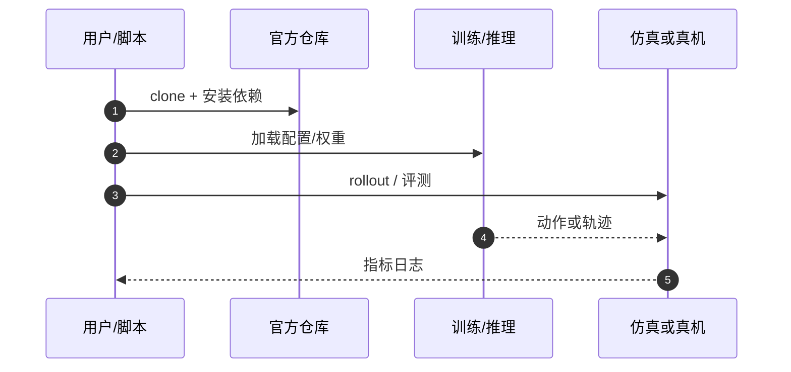

# Situation-Aware Dual Cobots（arXiv:2609.26083）

**Situation-Aware Dual Cobots**（*Situation Aware Locomotion for Dual Mobile Cobots in Shared Environments*，[arXiv:2609.26083](https://arxiv.org/abs/2609.26083)，[代码](https://github.com/ricardoGrando/limo_cobot_jazzy_sim)）来自 [具身智能小站 12 篇盘点](../../sources/blogs/wechat_embodied_station_12_papers_collab_wm_2026-09-23.md)。

## 一句话定义

**联合位姿、负载、机械臂状态、共享区域占用、障碍物与短时冲突预测，在模拟工业场景选安全移动动作。**

## 英文缩写速查

| 缩写 | 英文全称 | 简要说明 |
|------|----------|----------|
| ROS2 | Robot Operating System 2 | 机器人中间件 |
| CoBot | Collaborative Robot | 协作机械臂 |
| Sim | Simulation | 仿真验证环境 |
| SA | Situation Aware | 情境感知决策 |

## 为什么重要

- 双移动协作机器人需理解共享空间而非独立规划；仿真可系统比较协调策略。
- 开源结论：**已开源**（步骤 2.5，2026-09-23）。
- 与 [12 篇技术地图](../overview/collab-wm-12-papers-technology-map.md) 中同类工作可横向对照。

## 核心机制

| 项 | 内容 |
|----|------|
| **arXiv** | [2609.26083](https://arxiv.org/abs/2609.26083) |
| **开源** | **已开源** |
| **要点** | situation-aware 特征 + 安全移动动作选择；ROS2 Jazzy + Limo/Cobot 仿真栈。 |
| **文内指标** | 报告所有场景 100% vs 独立/固定优先级基线 33.3%；**证据限于仿真**。 |

## 源码运行时序图

## 实验与评测

- 报告所有场景 100% vs 独立/固定优先级基线 33.3%；**证据限于仿真**。
- **读法：** 索引级摘要；逐项对照与 baseline 以原文 PDF 为准。

## 与其他工作对比

- 横向索引见 [12 篇技术地图](../overview/collab-wm-12-papers-technology-map.md)；与同 arXiv 节点不重复造页。

## 结论

**Situation-Aware 框架是仿真级多机协调原型；真机迁移与感知误差未在本页展开。**

1. 开源边界：**已开源** — 以项目页实际链接为准（入库日 2026-09-23）。
2. 核心机制：situation-aware 特征 + 安全移动动作选择；ROS2 Jazzy + Limo/Cobot 仿真栈。…
3. 部署前核对任务协议与硬件条件，勿直接横比公众号摘录数字。

## 关联页面

- [loco-manipulation](../tasks/loco-manipulation.md)
- [manipulation](../tasks/manipulation.md)
- [paper-mavp](./paper-mavp.md)
- [paper-mate-virtual-teleop](./paper-mate-virtual-teleop.md)

## 参考来源

- [situation-aware-dual-cobots_arxiv_2609_26083.md](../../sources/papers/situation-aware-dual-cobots_arxiv_2609_26083.md)
- [wechat_embodied_station_12_papers_collab_wm_2026-09-23.md](../../sources/blogs/wechat_embodied_station_12_papers_collab_wm_2026-09-23.md)
- [arXiv:2609.26083](https://arxiv.org/abs/2609.26083)

## 推荐继续阅读

- [arXiv PDF](https://arxiv.org/pdf/2609.26083)
- [https://github.com/ricardoGrando/limo_cobot_jazzy_sim](https://github.com/ricardoGrando/limo_cobot_jazzy_sim)

