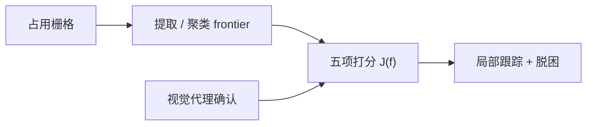
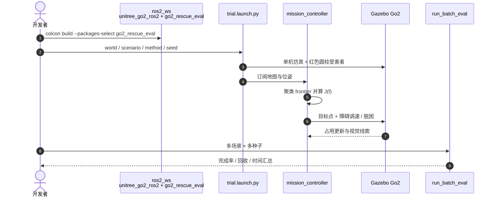

# Situation-aware Frontier：四足搜救的局势感知前沿排序

**Situation Aware Frontier Prioritization**（[arXiv:2608.02571](https://arxiv.org/abs/2608.02571)，[代码](https://github.com/ricardoGrando/go2_rescue_eval)）由 **乌拉圭技术大学 Robotics and AI Lab** 提出：单机 [Unitree Go2](./unitree.md) 在未知室内搜救里，不只扩图，还按 **救援效用** 选 frontier。

## 一句话定义

**保留经典 frontier 框架，但把信息增益、观测赤字、救援相关性、地形惩罚和行程代价加成一个分数——简单房间里它不一定赢，分叉一多就要靠救援项拉开完成率。**

## 英文缩写速查

| 缩写 | 英文全称 | 简要说明 |
|------|----------|----------|
| SAR | Search and Rescue | 搜救任务设定 |
| SA | Situation-aware | 本文 `full_sa` 打分策略 |
| ROS 2 | Robot Operating System 2 | 评测包基于 Jazzy |
| SDF | Simulation Description Format | Gazebo 世界文件 |
| Go2 | Unitree Go2 | 仿真四足平台 |

## 为什么重要

- 最近 frontier 或纯信息增益适合画地图，不一定适合 **找人**。
- 四足能进轮式进不去的 clutter，但错误的 frontier 选择代价更大。
- 开源评测包把方法差隔离在打分层：局部控制器四方法共用。

## 核心信息

| 项 | 内容 |
|----|------|
| **机构** | 乌拉圭技术大学（UTEC） |
| **栈** | ROS 2 + Gazebo + 已有 `unitree_go2_ros2` |
| **开源** | **已开源**（依赖本机 Go2 仿真栈） |

## 核心原理

### 方法栈

\[
J(f)=w_I I(f)+w_O O(f)+w_R R(f)-w_T T(f)-w_D D(f)
\]

\(R(f)\) 对暂定受害者线索做高斯加权；确认要重复观测后才入账，避免同一目标重复计数。对照 nearest / info_gain / risk_aware。

### 流程总览

## 源码运行时序图

官方评测包 [ricardoGrando/go2_rescue_eval](https://github.com/ricardoGrando/go2_rescue_eval)（归档见 [sources/repos/go2-rescue-eval.md](../../sources/repos/go2-rescue-eval.md)）：

- **最短复现：** 先有可编译的 Go2 仿真栈 → `colcon build` → `ros2 launch go2_rescue_eval trial.launch.py method:=full_sa`。
- **论文对照：** `nearest_frontier` / `info_gain` / `risk_aware` / `full_sa`；消融把对应权重置零。

## 工程实践

| 项 | 建议 |
|----|------|
| 何时上 SA | 布局分叉、遮挡多、frontier 看起来都「该去」时 |
| 简单房间 | 先跑 info_gain；S1 上它完成率更高 |
| 受害者感知 | 仓库用红色圆柱代理；真机必须换成真实检测，不能直接搬完成率 |
| 公平对比 | 不要改局部控制器，只改 `method` |

## 实验与评测

各 20 run。**S1**（1 名受害者）：Info Gain 19/20、回收 0.95；SA 仅 15/20。**S2**（2 名、更 clutter）：SA **20/20**、回收 **2.00**、任务时间 373.5 s；Info Gain 14/20 且路径更长（91 m vs 57 m）。仓库另有 s3 世界，论文主表写 S1/S2。

## 与其他工作对比

相对 [autonomy_stack_go2](./autonomy-stack-go2.md)：后者是几何导航全栈（Point-LIO + FAR）；本文只改 **探索目标选择**，且任务是搜救不是到点导航。相对经典 Yamauchi frontier / 信息增益 / 风险感知：多显式救援项，不换规划范式。

## 结论

**搜救探索的胜负手是「这个 frontier 值不值得去」，不是「再贪心扩一点图」。**

1. **简单场景不必上局势感知** — S1 里信息增益更稳。
2. **复杂 clutter 才显救援项** — S2 完成率 100%、两人全回收。
3. **不是多走路** — SA 在 S2 路径更短、时间更短。
4. **感知与决策要分开读** — 开源包用颜色代理，真机瓶颈会回到检测。
5. **复现成本在 Go2 仿真栈** — 本包是外包，不自带整机模型。

## 局限与风险

- 仅仿真；作者把真机验证列为未来工作。
- 红色圆柱使「救援相关性」偏乐观。
- 权重需按场景调；论文未给一套通用自适应。

## 关联页面

- [autonomy_stack_go2](./autonomy-stack-go2.md) — Go2 几何自主导航全栈
- [Unitree](./unitree.md)
- [unitree-ros2](./unitree-ros2.md)
- [地形适应](../concepts/terrain-adaptation.md) — 地形惩罚的相邻概念

## 参考来源

- [论文摘录](../../sources/papers/situation_aware_frontier_arxiv_2608_02571.md)
- [go2_rescue_eval 仓库归档](../../sources/repos/go2-rescue-eval.md)
- [具身智能小站 9 篇盘点](../../sources/blogs/wechat_embodied_station_ego2robot_mango_grasp_2026-08-11.md)
- [arXiv:2608.02571](https://arxiv.org/abs/2608.02571)

## 推荐继续阅读

- [go2_rescue_eval](https://github.com/ricardoGrando/go2_rescue_eval)
- [补充视频](https://www.youtube.com/watch?v=BbtPfF-NLac)
