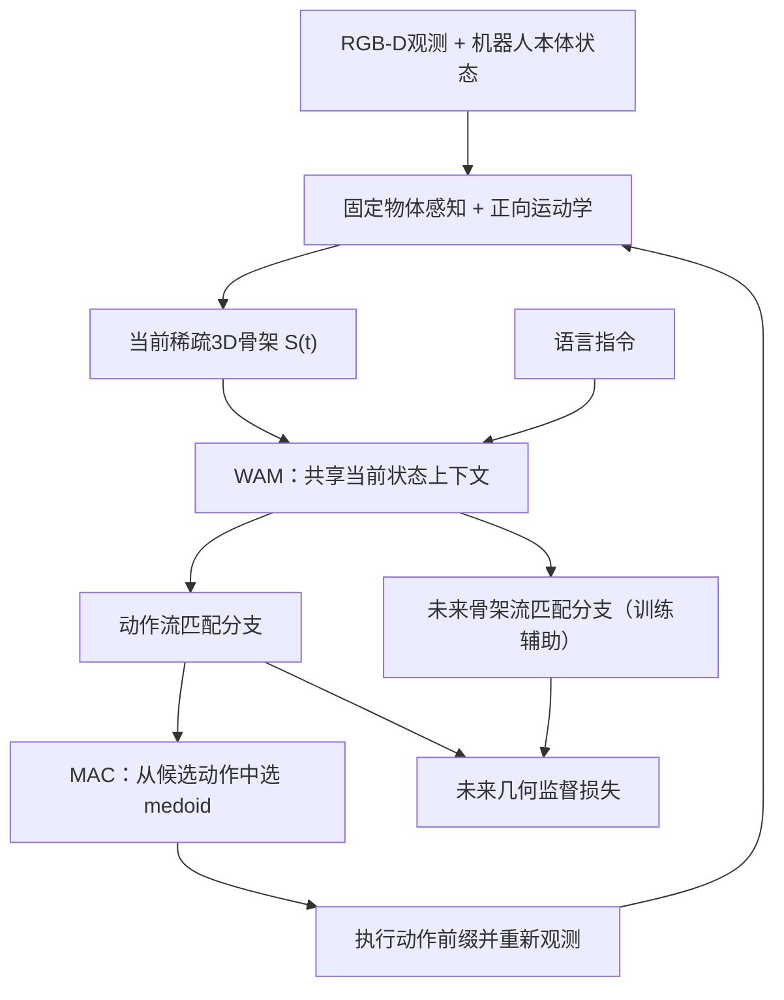

# SkeleWAM：用稀疏 3D 骨架做 World-Action Modeling

**SkeleWAM**（*Skeleton World-Action Modeling for Efficient Robotic Manipulation*，[arXiv:2610.02120](https://arxiv.org/abs/2610.02120)）由北京大学 Juyi Sheng、Hua Wang、Mengyuan Liu 提出。它将场景压缩为机器人关节/末端、物体中心和交互点组成的稀疏 3D 骨架，训练时同时预测机器人动作和未来骨架；部署动作时不必生成未来图像或未来骨架。

- **论文：** [arXiv:2610.02120](https://arxiv.org/abs/2610.02120) · [HTML 全文](https://arxiv.org/html/2610.02120v1) · [PDF](https://arxiv.org/pdf/2610.02120)
- **项目页：** [SkeleWAM](https://skelewam-project.github.io/)（含方法、结果与交互演示）
- **代码状态：** 截至 2026-10-05，论文与官方项目页未链接公开训练/推理代码仓库或权重；交互演示不能据此视为开源代码。
- **作者 / 单位：** Juyi Sheng、Hua Wang、Mengyuan Liu · Peking University
- **任务 / 平台：** LIBERO-Plus 仿真评测；ARX R5 桌面操作真机评测

## 一句话理解

**把控制所需的机器人–物体几何关系显式写成一组稀疏 3D 点：动作头负责“现在怎么动”，未来骨架头在训练中补充“动作之后几何如何变化”的监督，部署时移除未来预测头。**

## 问题动机

许多 WAM 通过生成未来视频或视觉 latent 学习环境变化。视频会包含大量与控制无关的外观细节，latent 则受视觉编码器目标影响，机器人与物体之间真正决定接触和操作的几何关系仍是隐式的。SkeleWAM 的取舍是仅表示稀疏控制几何：

- 机器人侧：关节和末端执行器的 3D 位置，由正向运动学计算。
- 物体侧：物体中心加任务相关的交互点，由固定的 RGB-D 感知模型估计。
- 坐标：所有点统一表达在机器人中心坐标系，并按训练集统计量归一化。
- 结构：机器人节点沿运动学连接；物体中心连接各自交互点；节点身份、顺序和连接关系在时间上固定。

因此表示更紧凑，但仍依赖物体关键点感知质量，也会丢失没有被骨架覆盖的场景信息。

## 方法结构

训练时，当前骨架、带噪动作块和带噪未来骨架序列进入两个专家。World expert 处理当前/未来骨架 token，action expert 处理动作 token；两类预测都读取当前骨架上下文，但动作 token 与未来骨架 token 彼此不做 attention。两个分支用 flow matching 预测向量场，总损失为动作损失加权叠加未来骨架损失。

推理时省略未来骨架分支，只根据当前骨架和语言指令生成动作块。MAC（Medoid Action Consensus）从独立噪声采样得到的候选动作中，选择与其他候选平均距离最小的一条，保留整条候选轨迹而不做逐维平均，也不需要奖励或价值模型。选中的动作块执行一段后更新骨架并重新规划。

## 训练与推理参数

| 设置 | 论文报告 |
|---|---|
| 训练硬件 | NVIDIA RTX 4090 |
| 训练规模 | 60K steps；有效 batch size 48 |
| 联合预测目标 | 32 步动作块 + 8 个未来骨架状态 |
| 推理积分 | Flow matching 10 steps |
| 执行 / 重规划 | 每次执行动作块前 16 步，然后更新观测并重规划 |
| MAC | 3 条独立采样候选；比较前 10 个 motion steps 的归一化动作距离 |

## 评测结果

### LIBERO-Plus 零样本扰动

完整评测包含 10,030 个变体、七类扰动；评估变体不做微调。RGB-D 是主要观测设置，sim-state 使用特权仿真坐标，只作为诊断参考。

| 指标 | SkeleWAM（RGB-D） | 对照 / 说明 |
|---|---:|---|
| 整体成功率 | **85.9%** | Cosmos-Policy 82.2%，高 3.7 个百分点 |
| 摄像头扰动 | **93.4%** | Cosmos-Policy 75.8%，高 17.6 个百分点 |
| 机器人初始状态扰动 | 71.9% | sim-state 为 75.2% |
| 语言扰动 | **89.1%** | 论文观测策略中最高 |
| 光照扰动 | 94.7% | |
| 背景扰动 | **96.0%** | 论文观测策略中最高 |
| 噪声扰动 | **93.9%** | 论文观测策略中最高 |
| 布局扰动 | 66.6% | π₀.₅ 为 84.1%，主要弱项 |
| 参数量 | **57.1M** | sim-state 参考模型 51.4M |

### ARX R5 真机

使用外部相机与腕部 RealSense 相机，评测开抽屉、关抽屉、叠积木、叠碗、将积木放入抽屉五项任务；每种方法每项 20 次，表中平均值为五项任务的非加权均值。

| 方法 | 开抽屉 | 关抽屉 | 叠积木 | 叠碗 | 积木放入抽屉 | 平均 |
|---|---:|---:|---:|---:|---:|---:|
| SkeleWAM | 80% | 90% | 90% | 95% | 90% | **89%** |
| Cosmos-Policy | 85% | 85% | 90% | 90% | 85% | 87% |
| Fast-WAM | 80% | 85% | 80% | 85% | 85% | 83% |
| π₀.₅ | 80% | 80% | 70% | 75% | 75% | 76% |

数字是论文报告的实验结果，不能单凭成功率推断在其他机器人、相机配置或未测任务上的表现。

## 消融与局限

- **未来骨架监督有增益：** 项目页报告，加入未来骨架预测后 LIBERO-Plus 成功率从 80.1% 提升到 85.9%，推理仍使用动作分支。
- **显式几何有针对性优势：** 摄像头、背景、噪声扰动下结果较强，符合稀疏几何降低外观依赖的设计动机。
- **布局泛化仍弱：** RGB-D 设置布局扰动只有 66.6%；sim-state 也只有 69.0%，说明问题不只是视觉定位，策略对大幅空间重排的泛化也有限。
- **感知误差仍会传入策略：** 真实输入的物体节点来自固定感知模型；仿真坐标参考整体仅比 RGB-D 高 1.8 个百分点，但两者设置不可混为一谈。
- **开源边界：** 论文与项目页可读，页面有任务可视化演示；截至入库日未发现官方训练/推理代码、权重或数据下载入口。

## 与相近工作区分

本篇 **SkeleWAM** 与库中 **SkelWAM**（[arXiv:2609.21983](./paper-skelwam.md)）是两篇不同论文：

| | SkeleWAM | SkelWAM |
|---|---|---|
| arXiv | [2610.02120](https://arxiv.org/abs/2610.02120) | [2609.21983](https://arxiv.org/abs/2609.21983) |
| 侧重点 | 稀疏场景骨架 + 未来骨架辅助监督，提升高效操作 | 共享骨架接口下的零样本跨具身迁移 |
| 作者 / 单位 | Juyi Sheng 等 · 北京大学 | Pengjun Niu 等 · 清华大学等 |
| 主要评测 | LIBERO-Plus；ARX R5 真机 | LIBERO-Cross10；Franka 到多种目标本体 |

两者名称相近且都讨论骨架化 WAM，但任务定义、表示、实验和作者团队均不同，详情记录分开维护。

## 与知识库的连接

- [World Action Models（WAM）](../concepts/world-action-models.md)：联合未来状态预测与动作生成的模型范式。
- [生成式世界模型](../methods/generative-world-models.md)：未来预测作为训练监督、推理时可省略的设计。
- [机器人操作](../tasks/manipulation.md)：操作任务、策略与评测背景。
- [SkelWAM（跨具身迁移）](./paper-skelwam.md)：名称近似但研究问题不同。
- [论文来源归档](../../sources/papers/skelewam_arxiv_2610_02120.md) · [官方项目页归档](../../sources/sites/skelewam-project.md)
