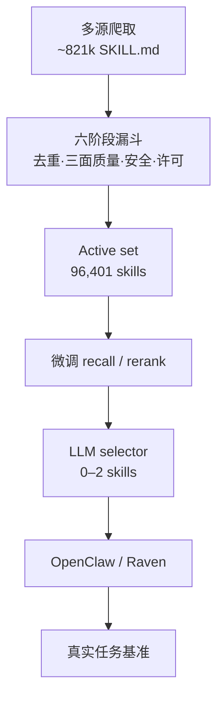

# SkillCorpus：开放 Skill 生态的策展与评测

**SkillCorpus**（[arXiv:2607.15557](https://arxiv.org/abs/2607.15557)）由 **恒心智能（EverMind）/ 盛大集团 / 北京大学** 提出：把碎片化社区 `SKILL.md` 生态经多阶段漏斗策展为 **96,401** 条可再分发技能，配微调 **召回—重排—LLM 选择** 栈，并在真实 agent 基准上端到端量化「社区技能何时有用」。

## 一句话定义

**把开放 SKILL.md 生态收成「许可可再分发 + 三面质量门控」的可部署语料，用微调检索栈注入 harness，并测清覆盖边界与 harness 兑现边界。**

## 英文缩写速查

| 缩写 | 英文全称 | 简要说明 |
|------|----------|----------|
| SKILL.md | Agent Skills manifest | Anthropic 约定的技能文件格式 |
| OSI | Open Source Initiative | Stage-5 宽松许可过滤依据 |
| GDPVal | GDPval economic tasks | OpenAI 真实知识工作基准（文中写法 GDPVal） |
| Hit@1 | Hit at rank 1 | 独立检索评测指标 |
| MCP | Model Context Protocol | 工具/资源访问协议；技能层的平行外部化 |

## 为什么重要

- **生态现实：** 社区技能海量但冗余、质量与许可不清；「堆技能」不等于涨分。
- **端到端证据：** 首次把 **策展语料 + 可部署检索** 接到 SkillsBench / GDPVal / QwenClawBench，并拆出 **覆盖** 与 **harness** 两条边界。
- **对本库：** 直接对照 [OpenClaw](./openclaw.md) 技能目录与 [Darwin](./darwin-skill.md)/[Nuwa](./nuwa-skill.md)/[Matt Pocock Skills](./mattpocock-skills.md) 等垂直技能库；姐妹篇 [HarnessBank](./paper-harnessbank.md) 进化宿主 harness。

## 核心信息

| 项 | 内容 |
|----|------|
| **机构** | 恒心智能（EverMind）；盛大集团（Shanda Group）；北京大学（PKU） |
| **规模** | ~821k 原始 → **96,401** active；16 类单标签 taxonomy |
| **质量** | utility / robustness / safety；19 flags（5 硬门控） |
| **评测单元** | OpenClaw / Raven × Qwen3.5-27B / 397B（+ Opus 4.7 检查） |
| **开源** | **宣称将开源 / 尚未发布**（语料+模型+代码；核查日 2026-08-08） |

## 核心原理

### 方法栈

| 模块 | 机制 |
|------|------|
| 聚合 | 62 源注册表；五类抓取机制入共享入口 |
| 漏斗 | 解析/形态 → 两级去重 → LLM 三面打分 → 安全硬门 + OSI 许可 → 嵌入与索引 |
| 分数 | \(0.50u+0.35r+0.15s\) + 源先验；安全边际衰减 |
| 匹配 | 微调 Emb/Rank 0.6B → LLM selector 注入 **0–2** 技能（可选 query rewrite） |

### 流程总览

## 源码运行时序图

**不适用（语料、微调权重与策展代码尚未发布）。** 截至 2026-08-08：论文承诺 acceptance 后以 OSI 宽松许可释放；公开检索无 SkillCorpus 仓。发布后应补：注册表抓取 → Stage 1–6 → 索引服务 → harness 注入评测的 `sequenceDiagram`。

## 工程实践

| 项 | 建议 / 论文设定 |
|----|----------------|
| 何时挂语料 | 任务含模型预训练覆盖不足的程序性子步骤，且语料类目有覆盖 |
| 勿期望 | 薄覆盖类目靠更好检索「变出」技能；应生成/自进化补供给 |
| Harness | 同技能在 Raven 上 SkillsBench 增益显著大于 OpenClaw——看 **execute–verify–fix** 是否跑完 |
| 安全 | 硬门控 + 软 flag 元数据；部署侧仍要审计 `scripts/` |
| 复现现状 | **等官方释放**；当前读边界结论做选型 |

## 实验与评测

- **池化 \(\Delta\)：** SkillsBench **+7.5±2.3 pp**；GDPVal **+1.51±0.49**；QwenClawBench **+2.79±0.70**（均 \(z>3\)）。
- **单元极值：** Raven×397B SkillsBench \(9.2\to22.6\)；Opus 4.7 OpenClaw **+8.0 pp**。
- **消融：** 完整管线 22.6；换货架检索 13.8；换原始爬取 14.9；无技能 9.2。
- **覆盖：** 检索匹配分与任务 \(\Delta\) 正相关；薄覆盖 \(\Delta\approx 0\)（非负尾）。

## 结论

**SkillCorpus 证明：经过许可与安全门控的社区技能语料，配上匹配的检索选择栈，可以在真实 agent 任务上稳定正增益；增益大小由「语料是否盖住任务」和「harness 是否把技能跑完」共同决定。**

1. **真影响：策展 > 堆规模** — 原始 821k 远弱于 96k 过滤集。
2. **真影响：检索栈与语料同训** — 货架嵌入吃掉大部分增益。
3. **真影响：覆盖边界** — 无技能则 \(\Delta\) 触零，而非系统性负尾。
4. **真影响：harness 边界** — 同注入内容，Raven vs OpenClaw 兑现差一截。
5. **次要代价：judge 质量** — 文本 LLM 打分非沙箱执行；高基线基准噪声大。
6. **部署读法：** 先审计许可/安全元数据，再接本站 OpenClaw 类技能目录。

## 与其他工作对比

| 对照 | 差异读法 |
|------|----------|
| [OpenClaw](./openclaw.md) | 宿主 harness；本文是其评测单元之一，并暴露兑现差距 |
| [Darwin](./darwin-skill.md) / [Nuwa](./nuwa-skill.md) | 单 skill 制造/进化；本文是生态级语料 + 检索 |
| [Matt Pocock Skills](./mattpocock-skills.md) / [SenseNova-Skills](./sensenova-skills.md) | 垂直精品技能库；本文是宽覆盖社区策展 |
| [HarnessBank](./paper-harnessbank.md) | 进化 harness；本文供给可检索技能层 |
| SkillNet / SkillFlow（文内） | 模拟环境或未许可审计；本文强调真实任务 + OSI |

## 局限与风险

- **资源未发布：** 无法下载语料或复现检索微调。
- **文本安全 judge：** 漏检执行期风险；需运行时再验证。
- **快照语义：** 2026-Q2 生态切片，需周期重爬。
- **英文主导：** 非英文技能与具身长程任务外推有限。

## 关联页面

- [HarnessBank](./paper-harnessbank.md) — 同团队 harness 自进化
- [OpenClaw](./openclaw.md) — SKILL.md 宿主
- [Darwin Skill](./darwin-skill.md) / [Nuwa Skill](./nuwa-skill.md) / [Matt Pocock Skills](./mattpocock-skills.md)
- [Hermes Agent](./hermes-agent.md) — 另一技能目录宿主
- [AI Auto-Research](../concepts/ai-auto-research.md)

## 参考来源

- [skillcorpus_arxiv_2607_15557.md](../../sources/papers/skillcorpus_arxiv_2607_15557.md) — 论文摘录与开源核查
- [arXiv:2607.15557](https://arxiv.org/abs/2607.15557) — 原文

## 推荐继续阅读

- [SkillCorpus PDF](https://arxiv.org/pdf/2607.15557) — 漏斗、三面质量与边界分析
- [Agent Skills 规范](https://agentskills.io/) — `SKILL.md` 约定
- [OpenClaw](https://openclaw.ai/) — 文中评测 harness 之一
