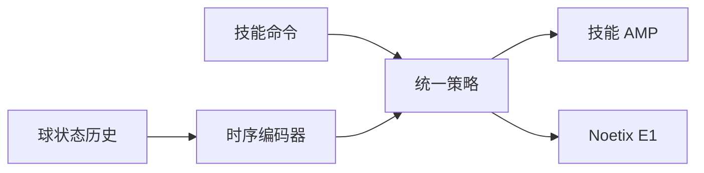

# SkillX（arXiv:2609.06718）

**SkillX**（*SkillX: Unified Multi-Skill Policy Learning for Humanoid Soccer*，[arXiv:2609.06718](https://arxiv.org/abs/2609.06718)）由 **诺亦腾机器人（Noetix）；清华大学（Tsinghua）** 提出（公众号周更 ingest 见 [策展索引](../../sources/blogs/wechat_shenlan_weekly_humanoid_quadruped_2026-09-14.md)）。

## 一句话定义

SkillX：面向人形足球的统一多技能策略学习 — command-conditioned policy。

## 英文缩写速查

| 缩写 | 英文全称 | 简要说明 |
|------|----------|----------|
| AMP | Adversarial Motion Prior | 对抗运动先验 |
| RL | Reinforcement Learning | 强化学习 |
| E1 | Noetix E1 | 诺亦腾人形足球平台 |

## 为什么重要

人形足球需频繁切换技能；多独立策略切换成本高且不协调。

## 核心信息

| 项 | 内容 |
|----|------|
| **机构** | 诺亦腾机器人（Noetix）；清华大学（Tsinghua） |
| **开源** | **未见/待发布**（步骤 2.5 核查：截至 2026-09-14 无可运行官方仓库） |

## 核心原理

命令嵌入选择技能分支；每技能独立 AMP 与 critic；object-aware temporal encoder 融合球与本体历史；在 Noetix E1 真机验证。

### 流程总览

## 源码运行时序图

**不适用** — 截至 **2026-09-14** arXiv 与常见项目页 **未见** 官方可运行代码仓库。

## 工程实践

| 项 | 说明 |
|----|------|
| 开源状态 | 未见官方仓库；以 arXiv 为准 |
| 复现入口 | 论文方法与超参；代码发布后再补 `sources/repos/` |
| 部署注意 | 命令空间离散化与连续球跟踪需调参；AMP 参考动作按技能分库。 |

## 实验与评测

仿真多技能足球；E1 真机盘带/射门/防守组合。

## 结论

SkillX 用命令条件多技能 AMP 在 E1 上实现统一足球策略。

1. 单策略多技能降低切换抖动。
2. 技能专属 critic 避免价值混淆。
3. 物体时序编码对球类任务关键。
4. E1 真机验证工程闭环。
5. AMP 参考质量决定动作自然性。

## 与其他工作对比

| 对照 | 差异读法 |
|------|----------|
| 独立技能策略 | 切换不连续 |
| RoboNaldo 等射门专精 | 未强调多技能统一 |

## 局限与风险

对抗与多人战术未展开；E1 与 G1 等平台迁移未报。

## 关联页面

- [humanoid-soccer](../tasks/humanoid-soccer.md)
- [humanoid-locomotion](../tasks/humanoid-locomotion.md)
- [./paper-robonaldo-humanoid-soccer-shooting.md](./paper-robonaldo-humanoid-soccer-shooting.md)

## 参考来源

- [skillx_humanoid_soccer_arxiv_2609_06718.md](../../sources/papers/skillx_humanoid_soccer_arxiv_2609_06718.md)
- [公众号周更策展](../../sources/blogs/wechat_shenlan_weekly_humanoid_quadruped_2026-09-14.md)

## 推荐继续阅读

- [https://arxiv.org/abs/2609.06718](https://arxiv.org/abs/2609.06718)
