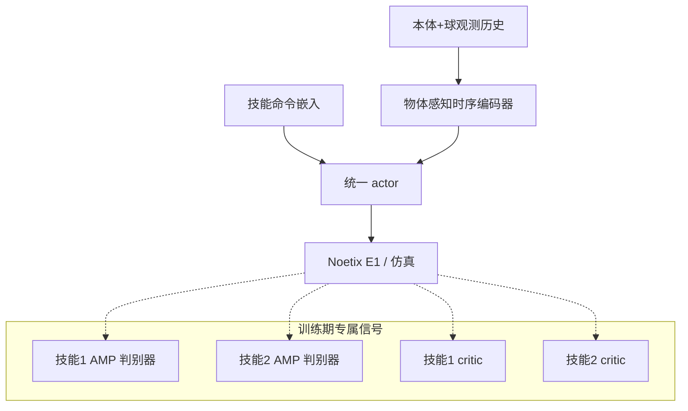

# SkillX：人形足球统一多技能策略学习

**SkillX**（*SkillX: Unified Multi-Skill Policy Learning for Humanoid Soccer*，[arXiv:2609.06718](https://arxiv.org/abs/2609.06718)，[项目页](https://yzc0731.github.io/SkillX/)，**CoRL 2026**）由 **松延动力（Noetix Robotics）** 与 **清华大学** Zhangchen Ye、Enxuan Ruan、Yifei Bao、Runhan Huang、Jiankun Yang、Jiakang Jin、Yixiao Huo、Pengyuan Wang、Yinan Han、Huaxing Huang、Wenhao Cui、Yiming Li、Xiaoyu Tian 提出：用 **单一命令条件策略** 在仿真与 **25-DoF Noetix E1** 真机上学习并组合盘带、停球、射门等原子足球技能，避免多阶段流水线或策略蒸馏带来的切换不连续。

## 一句话定义

**一个 actor、多种足球技能——用技能专属训练信号保住风格与价值估计，用时序编码器从部分观测推断球运动。**

## 英文缩写速查

| 缩写 | 英文全称 | 简要说明 |
|------|----------|----------|
| SkillX | Unified Multi-Skill Policy Learning for Humanoid Soccer | 本文框架 |
| AMP | Adversarial Motion Prior | 对抗运动先验；本文按技能分判别器 |
| RL | Reinforcement Learning | Isaac Lab 并行仿真训练 |
| MoCap | Motion Capture | 真机评测：6-DoF 基座位姿 + 球/门 3D 位置 |
| VIO | Visual-Inertial Odometry | 机载 ZED2i 视觉惯性里程计后端 |
| E1 | Noetix E1 | 25-DoF 人形足球实验平台 |
| PHC | Perpetual Humanoid Control | 人类 MoCap 足球动作重定向到 E1 |

## 为什么重要

- **多技能单策略：** 人形足球要在长视界内切换平衡、行走与触球；独立策略切换成本高且易不协调。
- **三类分治训练信号：** 技能专属 AMP 保留异构动作风格；技能专属 critic 避免价值头混淆；Transformer 时序编码 + 球速估计应对部分可观测。
- **仿真–真机闭环：** Hard 组合任务（Trap→Dribble×3→Shoot）仿真 Overall **81.7%**，相对最佳基线 MoE-Encoder AMP **45.6%** 提升 **36.1 pt**；MoCap 真机四任务平均 **72.5%** 成功率量级。
- **双部署后端：** MoCap 受控评测 + **ZED2i + YOLOv8** 机载视觉盘带射门；另展示去掉外部球观测仍保留训练框架的泛化交互。

## 核心信息

| 项 | 内容 |
|----|------|
| **机构** | 松延动力（Noetix Robotics）；清华大学 |
| **会议** | CoRL 2026 |
| **平台** | Noetix E1（25-DoF）；Isaac Sim / Isaac Lab |
| **控制** | 策略 50 Hz 输出关节目标；仿真 200 Hz；低层 PD 跟踪 |
| **参考动作** | 人类足球 MoCap → PHC 重定向至 E1 |
| **开源** | **待发布**（项目页 2026-09-25 无 GitHub；[noetix_e1_lab](./cn-os-noetix-e1-lab.md) 仅为 E1 通用 RL 模板） |

## 流程总览

## 核心原理

1. **部署简单、训练分治：** 推理期仅 **一个命令条件 actor**；训练期用技能专属 AMP / critic 降低多技能干扰。
2. **时序编码器：** Transformer 聚合历史；辅助目标估计根速度与 **球速度**（HIM 式估计 + Barlow-Twins）；部署时从噪声球位置历史推断。
3. **课程与随机化：** 自适应命令采样（失败率高的技能多采样）；命令持续时间从长到短促切换；球质量/摩擦/恢复系数域随机化。
4. **组合任务调度：** 事件驱动命令切换——当前子任务完成即切下一技能（仿真与真机复合任务一致）。

## 源码运行时序图

**不适用** — 截至 **2026-09-25** [项目页](https://yzc0731.github.io/SkillX/) 与 arXiv **未提供** SkillX 训练/部署官方仓库。E1 平台通用入口见 [noetix_e1_lab](./cn-os-noetix-e1-lab.md)，**不能**替代本文复现。

## 实验与评测

### 仿真组合任务（1000 trials，Table I）

| 方法 | Medium（盘带→射门）Overall | Hard（停球→盘带×3→射门）Overall |
|------|---------------------------|--------------------------------|
| AMP | 51.0% | 27.4% |
| MoE-Encoder AMP | 67.2% | 45.6% |
| **SkillX** | **88.0%** | **81.7%** |

### 真机 MoCap（10 trials / 任务，Table III）

| 方法 | 盘带 | 射门 | 两步盘带 | 盘带+射门 |
|------|------|------|----------|-----------|
| AMP | 1/10 | 1/10 | 0/10 | 0/10 |
| **SkillX** | **8/10** | **8/10** | **7/10** | **6/10** |

- **机载视觉：** 头载 ZED2i + VIO + YOLOv8 球检测，完成盘带+射门复合 demo（项目页 `real_yolo.mp4`）。
- **读法：** 子阶段成功率为 **到达该阶段 episode 条件概率**；Overall 为全任务一次成功。

## 与其他工作对比

| 对照 | 差异读法 |
|------|----------|
| 共享 AMP / Conditional AMP / MoE-AMP | 潜变量或专家路由 alone 难保长视界组合；SkillX 用 **分技能判别器+critic** |
| [RoboNaldo](./paper-robonaldo-humanoid-soccer-shooting.md) | 射门专精 + 三阶段课程 + G1；SkillX 强调 **多技能统一 actor** 与 E1 盘带/停球组合 |
| 多阶段蒸馏 / 渐进精炼 | 本文 **单阶段** 统一 RL，靠训练信号分治而非流水线 |
| [noetix_e1_lab](./cn-os-noetix-e1-lab.md) | 平台 walk/mimic 模板；非 SkillX 足球任务实现 |

## 结论

**SkillX 证明「单 actor + 技能专属训练信号 + 球感知历史编码」足以在 E1 上完成可部署的多技能足球组合，仿真 Hard 任务与真机 MoCap 均显著优于共享 AMP。**

1. **真影响指标：** Hard 仿真 Overall **81.7%**；真机原子技能 **80%**、复合 **60–70%**；时序编码器去掉球速估计 Hard 跌至 **44.4%**。
2. **次要代价：** MoCap 后端依赖外部位姿；机载视觉管线增加延迟与检测误差，需单独调参。
3. **部署读法：** 动作 clip 后送 50 Hz 低层电机控制器；复合任务真机由人工在子任务完成时触发命令切换。
4. **复现边界：** **待发布** — 关注项目页是否挂官方 GitHub；勿将 `noetix_e1_lab` 误作论文代码。

## 关联页面

- [Humanoid Soccer](../tasks/humanoid-soccer.md)
- [Humanoid Locomotion](../tasks/humanoid-locomotion.md)
- [RoboNaldo](./paper-robonaldo-humanoid-soccer-shooting.md)
- [noetix_e1_lab](./cn-os-noetix-e1-lab.md)

## 参考来源

- [skillx_humanoid_soccer_arxiv_2609_06718.md](../../sources/papers/skillx_humanoid_soccer_arxiv_2609_06718.md)
- [skillx.md](../../sources/sites/skillx.md)
- [wechat_shenlan_weekly_humanoid_quadruped_2026-09-14.md](../../sources/blogs/wechat_shenlan_weekly_humanoid_quadruped_2026-09-14.md)

## 推荐继续阅读

- [arXiv PDF](https://arxiv.org/pdf/2609.06718)
- [项目页与演示视频](https://yzc0731.github.io/SkillX/)
- [Noetix E1 Isaac Lab 模板](./cn-os-noetix-e1-lab.md)（平台 RL，非 SkillX 实现）
