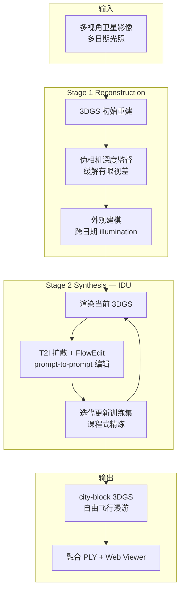
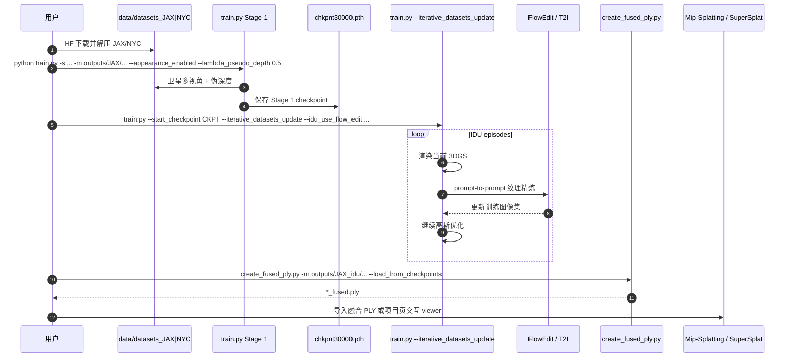

# Skyfall-GS：从卫星影像合成沉浸式 3D 城市场景

**Skyfall-GS**（Lee et al., arXiv:2510.15869，[项目页](https://skyfall-gs.jayinnn.dev/)，[代码](https://github.com/jayin92/Skyfall-GS)）由 **国立阳明交通大学（NYCU）**、**UIUC**、**萨拉戈萨大学**、**UC Merced** 提出，**ECCV 2026** 收录。系统 **无需大规模 3D 扫描标注**，仅用 **多视角卫星影像** 合成 **城市街区尺度、可实时自由飞行探索** 的 **3D Gaussian Splatting** 场景：Stage 1 用 **伪相机深度监督** 与 **多日期外观建模** 重建粗几何；Stage 2 以 **课程式 Iterative Dataset Update（IDU）** 结合 **T2I 扩散 + prompt-to-prompt（FlowEdit）** 迭代精炼纹理与几何。

## 英文缩写速查

| 缩写 | 英文全称 | 简要说明 |
|------|----------|----------|
| 3DGS | 3D Gaussian Splatting | 显式高斯辐射场，可微光栅 + 实时渲染 |
| IDU | Iterative Dataset Update | 本文 Stage 2：用精炼渲染迭代更新训练集 |
| T2I | Text-to-Image | 文本到图像扩散模型，Stage 2 纹理合成 |
| NVS | Novel View Synthesis | 新视角合成；城市场景质量主评测维度 |
| PSNR | Peak Signal-to-Noise Ratio | 像素重建指标 |
| LPIPS | Learned Perceptual Image Patch Similarity | 感知相似度指标 |

## 为什么重要

- **城市数字孪生的数据瓶颈：** 可泛化生成模型缺 **大规模真实 3D 城市扫描**；卫星图 **覆盖广、易获取**，提供 **真实粗几何** 锚点。
- **卫星视差 ≠ 街景 COLMAP：** 俯视、基线有限；需 **伪深度监督** 与 **外观解耦** 才能起 3DGS，再靠扩散补 **近景 photorealism**。
- **可漫游 splat 资产：** 输出是 **自由飞行 3DGS**（项目页 12+ 交互场景），服务沉浸式 sim / 数字孪生 / [Real2Sim](../../roadmap/depth-real2sim.md) Stage 1 外观级场景，而非单张卫星图超分。
- **全链路开源：** 训练、JAX/NYC 数据、评测包、**融合 PLY**、渲染脚本均在 HF/GitHub（**Apache 2.0**），复现门槛低于「论文有、代码无」类城市生成工作。

## 核心信息

| 字段 | 内容 |
|------|------|
| 作者 | Jie-Ying Lee, Yi-Ruei Liu, Shr-Ruei Tsai, Wei-Cheng Chang, Chung-Ho Wu, Jiewen Chan, Zhenjun Zhao, Chieh Hubert Lin, Yu-Lun Liu |
| 机构 | 国立阳明交通大学（NYCU）· UIUC · 萨拉戈萨大学 · UC Merced |
| 出处 | arXiv:2510.15869；ECCV 2026 |
| 项目 | <https://skyfall-gs.jayinnn.dev/> |
| 代码 | <https://github.com/jayin92/Skyfall-GS>（**已开源**，Apache 2.0） |
| 数据 | [HF datasets](https://huggingface.co/datasets/jayinnn/Skyfall-GS-datasets) · [eval](https://huggingface.co/datasets/jayinnn/Skyfall-GS-eval) · [PLY](https://huggingface.co/jayinnn/Skyfall-GS-ply) |

## 流程总览

## 核心原理 / 方法栈

| 模块 | 作用 |
|------|------|
| **Stage 1 3DGS** | 从卫星多视角重建初始高斯场景；`--lambda_pseudo_depth`、`--appearance_enabled` 等（见 README） |
| **伪深度监督** | 补偿卫星 **parallax 有限**；`start_sample_pseudo` / `end_sample_pseudo` 控制采样区间 |
| **外观建模** | 分离 **多日期卫星图** 的光照/外观变化，稳定几何优化 |
| **IDU（Stage 2）** | `--iterative_datasets_update`：多 episode 用 **精炼渲染** 扩训练集；`--idu_use_flow_edit` 接 FlowEdit |
| **课程式迭代** | 渐进提升几何完整性与纹理 realism；对比 mip-splatting / sat-nerf / citydreamer 等基线 |

### 与相邻路线的分工

| 路线 | 输入 | 尺度 | 本文差异 |
|------|------|------|----------|
| COLMAP + 3DGS | 地面/无人机照片 | 街区–城市 | 需密集近景采集；非卫星 |
| [PanoLOG/G²PS](./paper-panolog-ggps.md) | ERP 全景 | 户外大场景 | 全景采集 vs **卫星俯视** |
| CityDreamer / GaussianCity | 语义/布局生成 | 城市 | 生成式布局；本文 **卫星几何锚定** |
| [i3dGS](./paper-i3dgs-immediate-3dgs-unordered.md) | 乱序 RGB | 通用场景 | 在线捕获重建；非 **卫星+扩散 IDU** |
| **Skyfall-GS** | **卫星影像** | **city-block 3DGS** | **两阶段：几何重建 + IDU 扩散精炼** |

## 源码运行时序图

对齐官方 README：`train.py` Stage 1 → checkpoint → Stage 2 IDU → `create_fused_ply.py` → Web viewer。

关键复现：`scripts/run_jax.py` + `run_jax_idu.py`（或 NYC 对应脚本）；评测 `eval.py`；**勿直接用训练目录 raw `.ply` 做在线可视化**。

## 实验与评测（README 摘要）

| 项 | 说明 |
|----|------|
| **场景** | JAX（Jacksonville）、NYC 多场景（JAX_068、NYC_004 等） |
| **指标** | PSNR、SSIM、LPIPS、CLIP-FID、CMMD |
| **基线** | JAX：mip-splatting、sat-nerf、eogs、corgs；NYC：citydreamer、gaussiancity、corgs |
| **交互** | 项目页 Web 3DGS viewer；融合 PLY + Mip-Splatting demo / SuperSplat |

## 工程实践

| 项 | 说明 |
|----|------|
| **环境** | Conda `skyfall-gs` Python 3.10；CUDA 12.8；`requirements.txt` + 子模块 rasterization |
| **Stage 1** | `train.py` + pseudo depth / appearance / densify 参数（README 示例） |
| **Stage 2** | `--start_checkpoint` + `--iterative_datasets_update` + IDU grid/flow 超参 |
| **自定义** | [SatelliteSfM](https://github.com/jayin92/SatelliteSfM) 或 COLMAP → `images/`、`transforms_*.json`、`points3D.txt` |
| **可视化** | `create_fused_ply.py`；[HF 预融合 PLY](https://huggingface.co/jayinnn/Skyfall-GS-ply) |
| **开源状态** | **已开源** — 训练/评测/渲染/数据齐全；**Apache 2.0** |

## 局限与风险

- **几何 vs 物理：** 输出是 **外观级 3DGS**，不含碰撞 mesh、语义层或 Sim-ready 关节；[Real2Sim](../../roadmap/depth-real2sim.md) 下游仍需物性/碰撞补全。
- **卫星分辨率天花板：** 街景级细节依赖 **扩散 IDU**；几何误差在立面/遮挡边界可能需人工验收。
- **算力与迭代：** Stage 2 IDU 多 episode + 1024 渲染 + FlowEdit，训练成本显著高于单次 3DGS。
- **评测域：** 官方 JAX/NYC 卫星集；迁移到其他城市须走 SatelliteSfM 预处理与重新调 IDU 课程。

## 结论

**Skyfall-GS 把「没有 3D 城市扫描」的问题改写成「卫星粗几何 + 扩散近景外观 + 课程式 IDU」：Stage 1 用伪深度与外观建模把卫星视差榨干，Stage 2 用迭代数据集更新把 splat 推到可漫游、跨视角一致的街区场景。**

- 选型上：需要 **可飞行 3DGS 城市块** 且 **只有卫星/航拍俯视** 时优先评估本路线，而非直接上纯生成式 CityGaussian。
- 复现上：从 HF 下 JAX 场景 + `run_jax.py` / `run_jax_idu.py` 跑通两阶段，再用 **融合 PLY** 进 viewer——raw 训练 PLY 不能直出 Web 可视化。
- 机器人语境：适合 [GS-Playground](./gs-playground.md) / 导航仿真 **外观背景**；动态交互与物理仍要另建层。
- 与 [PanoLOG](./paper-panolog-ggps.md) 互补：全景近景采集 vs **卫星远程几何**；都与 [Spark](./spark-3dgs-renderer.md) 类 Web 渲染栈衔接。
- 许可 **Apache 2.0**，工程集成友好度高于研究专用 license 的 3DGS 重建仓。

## 关联页面

- [Generative World Models](../methods/generative-world-models.md) — 生成式世界模型语境
- [Real2Sim 纵深路线](../../roadmap/depth-real2sim.md) — Stage 1 几何/外观重建
- [GS-Playground](./gs-playground.md) — 3DGS 光真实感仿真
- [Spark 3DGS 渲染器](./spark-3dgs-renderer.md) — Web/流式 splat 浏览
- [PanoLOG / G²PS](./paper-panolog-ggps.md) — 户外大场景 3DGS 划分重建
- [i3dGS](./paper-i3dgs-immediate-3dgs-unordered.md) — 乱序 RGB 即时 3DGS 对照

## 参考来源

- [Skyfall-GS 论文摘录](../../sources/papers/skyfall_gs_arxiv_2510_15869.md)
- [Skyfall-GS 项目页归档](../../sources/sites/skyfall_gs_jayinnn.md)
- [jayin92/Skyfall-GS 仓库归档](../../sources/repos/skyfall_gs_jayinnn92.md)

## 推荐继续阅读

- [Skyfall-GS 项目页交互 Viewer](https://skyfall-gs.jayinnn.dev/) — 12 场景 WASD 漫游 demo
- [SatelliteSfM](https://github.com/jayin92/SatelliteSfM) — 自定义卫星数据集预处理
