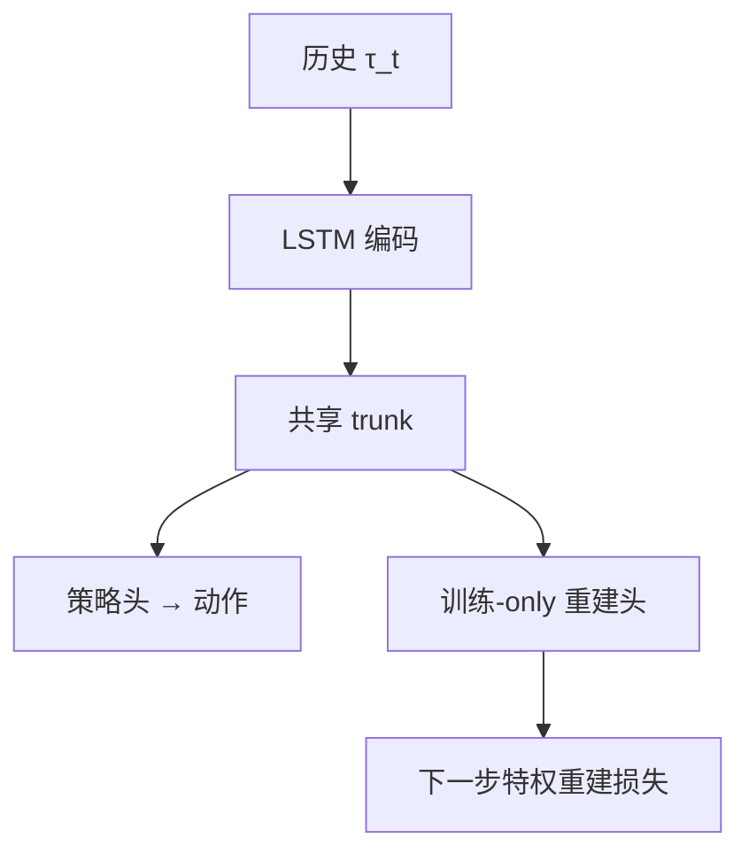

# SleepWalking (SWAQ)：特权表征塑造盲走

**SleepWalking / SWAQ**（[arXiv:2608.30883](https://arxiv.org/abs/2608.30883)）由 **西北工业大学（NWPU）、上海交通大学（SJTU）、云睦智能制造** 提出（公众号周更 ingest 见 [策展索引](../../sources/blogs/wechat_shenlan_weekly_papers_2026-09-04.md)）。

## 一句话定义

盲走的关键不是 **估计器接口**，而是训练期让策略内部历史 **保留** 下一步物理量——部署不必显式喂回重建量。

## 英文缩写速查

| 缩写 | 英文全称 | 简要说明 |
|------|----------|----------|
| SWAQ | SleepWAlking for Robot Locomotion | 本文框架名 |
| DWAQ | DreamWaQ | 单阶段非外感受基线 |
| MAC | Multiply-Accumulate | 推理乘加计算量 |
| POMDP | Partially Observable MDP | 部分可观马尔可夫决策 |

## 为什么重要

Teacher–student 与 DWAQ 把特权信息 **接到 actor 输入**；SWAQ 用辅助损失 **塑表征** 而不改部署拓扑。

## 核心信息

| 项 | 内容 |
|----|------|
| **机构** | 西北工业大学（NWPU）、上海交通大学（SJTU）、云睦智能制造 |
| **开源** | 见 [工程实践](#工程实践) |

## 核心原理

共享 LSTM+trunk：actor 头出动作；训练-only 解码器预测 $Y_{t+1}$（机体状态+局部地形）；$\mathcal{L}=\mathcal{L}_{PPO}+\lambda\mathcal{L}_{rec}$ 只回传 encoder。

### 流程总览

## 源码运行时序图

**不适用** — 截至 **2026-09-07** 无可运行官方代码（或本文为硬件/协议类工作）。

## 工程实践

| 项 | 说明 |
|----|------|
| 开源状态 | 见论文摘录与项目页核查结论 |
| 复现入口 | 以 arXiv 为准 |

## 实验与评测

| 对照 | 峰值平均地形等级 | 推理 MAC/步 |
|------|------------------|-------------|
| SWAQ vs DWAQ | **+15.0%** | **−44.4%** |
| vs Causal Transformer 基线 | 更高（原文曲线） | 更低 |

## 结论

SWAQ 证明 **语义辅助目标** 可替代部分 **架构分解**；与 DWAQ 同属盲走主线，Teacher 特权信息读者应优先对照本文。

1. 层探针：重建量在动作头前仍 **线性可解码**。
2. 理论节连重建误差与 return gap。
3. 单阶段，无需 teacher 蒸馏。
4. 云睦产业合作方。
5. **未开源**。

## 局限与风险

仿真地形域为主；重建目标需设计者选特权量。

## 关联页面

- [dreamwaq](../methods/dreamwaq.md)
- [locomotion](../tasks/locomotion.md)
- [paper-fwbc-vla.md](./paper-fwbc-vla.md)

## 参考来源

- [sleepwalking_arxiv_2608_30883.md](../../sources/papers/sleepwalking_arxiv_2608_30883.md)
- [公众号周更策展](../../sources/blogs/wechat_shenlan_weekly_papers_2026-09-04.md)

## 推荐继续阅读

- [https://arxiv.org/abs/2608.30883](https://arxiv.org/abs/2608.30883)
