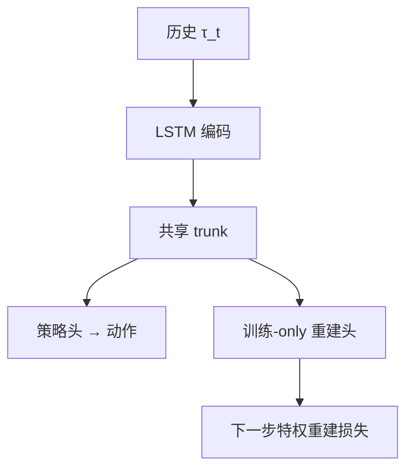

# SleepWalking (SWAQ)：特权表征塑造盲走

**SleepWalking / SWAQ**（[arXiv:2608.30883](https://arxiv.org/abs/2608.30883)）由 **西北工业大学（NWPU）、上海交通大学（SJTU）、云睦智能制造** 提出（公众号周更 ingest 见 [策展索引](../../sources/blogs/wechat_shenlan_weekly_papers_2026-09-04.md)）。

## 一句话定义

盲走的关键不是 **估计器接口**，而是训练期让策略内部历史 **保留** 下一步物理量——部署不必显式喂回重建量。

## 英文缩写速查

| 缩写 | 英文全称 | 简要说明 |
|------|----------|----------|
| SWAQ | SleepWAlking for Robot Locomotion | 本文框架名 |
| DWAQ | DreamWaQ | 单阶段非外感受基线 |
| MAC | Multiply-Accumulate | 推理乘加计算量 |
| POMDP | Partially Observable MDP | 部分可观马尔可夫决策 |

## 为什么重要

Teacher–student 与 DWAQ 把特权信息 **接到 actor 输入**；SWAQ 用辅助损失 **塑表征** 而不改部署拓扑。

## 核心信息

| 项 | 内容 |
|----|------|
| **机构** | 西北工业大学（NWPU）、上海交通大学（SJTU）、云睦智能制造 |
| **开源** | 见 [工程实践](#工程实践) |

## 核心原理

共享 LSTM+trunk：actor 头出动作；训练-only 解码器预测 $Y_{t+1}$（机体状态+局部地形）；$\mathcal{L}=\mathcal{L}_{PPO}+\lambda\mathcal{L}_{rec}$ 只回传 encoder。

### 流程总览

## 源码运行时序图

**不适用** — 截至 **2026-09-07** 无可运行官方代码（或本文为硬件/协议类工作）。

## 工程实践

| 项 | 说明 |
|----|------|
| 开源状态 | 见论文摘录与项目页核查结论 |
| 复现入口 | 以 arXiv 为准 |

## 实验与评测

| 对照 | 峰值平均地形等级 | 推理 MAC/步 |
|------|------------------|-------------|
| SWAQ vs DWAQ | **+15.0%** | **−44.4%** |
| vs Causal Transformer 基线 | 更高（原文曲线） | 更低 |

## 结论

SWAQ 证明 **语义辅助目标** 可替代部分 **架构分解**；与 DWAQ 同属盲走主线，Teacher 特权信息读者应优先对照本文。

1. 层探针：重建量在动作头前仍 **线性可解码**。
2. 理论节连重建误差与 return gap。
3. 单阶段，无需 teacher 蒸馏。
4. 云睦产业合作方。
5. **未开源**。

## 与其他工作对比

盲走这条线的共同问题是「**特权信息怎么用**」——SWAQ 的立场是「用来塑表征，不进部署拓扑」：

| 路线 | 特权信息怎么进模型 | 部署时拓扑 | 训练阶段数 | 与本文 |
|------|--------------------|------------|------------|--------|
| **SWAQ（本文）** | **训练-only 解码器** 重建下一步 $Y_{t+1}$，梯度只回传 encoder | history → action（**不喂重建量**） | **1**（单阶段 AC） | 本页；峰值地形 +15.0%、MAC −44.4% vs DWAQ |
| [DreamWaQ](../methods/dreamwaq.md) | 隐式估计量 **接回 actor 输入** | history → 估计 → action | 1 | 本文主基线；差别是「改输入接口」vs「改表征目标」 |
| [Teacher–Student / DAgger 蒸馏](../methods/teacher-student-dagger-training.md) | teacher 直接吃特权观测，再蒸馏给 student | history → action | **2** | SWAQ 省掉第二阶段与 teacher 训练成本 |
| [特权训练](../concepts/privileged-training.md)（范式总览） | 各式 | 各式 | — | 本文是该范式下「**辅助损失** 而非 **架构分解**」的一支 |
| Causal Transformer 基线 | 靠更强序列模型吸收历史 | history → action | 1 | 论文报更高地形等级与更低 MAC；序列模型强 ≠ 表征里留住了物理量 |

**可迁移判断：** 论文的层探针显示重建量在动作头前 **仍线性可解码**——这是本文最有说服力的一处证据，说明收益来自 **表征里真留住了下一步物理量**，而非单纯多一个正则项。代价是 **要设计者挑对特权量**，这一步没有自动化配方。

## 局限与风险

仿真地形域为主；重建目标需设计者选特权量。

## 关联页面

- [dreamwaq](../methods/dreamwaq.md)
- [locomotion](../tasks/locomotion.md)
- [paper-fwbc-vla.md](./paper-fwbc-vla.md)
- [特权训练](../concepts/privileged-training.md) — 范式总览
- [Teacher–Student DAgger 训练](../methods/teacher-student-dagger-training.md) — 两阶段蒸馏对照

## 参考来源

- [sleepwalking_arxiv_2608_30883.md](../../sources/papers/sleepwalking_arxiv_2608_30883.md)
- [公众号周更策展](../../sources/blogs/wechat_shenlan_weekly_papers_2026-09-04.md)

## 推荐继续阅读

- [https://arxiv.org/abs/2608.30883](https://arxiv.org/abs/2608.30883)
