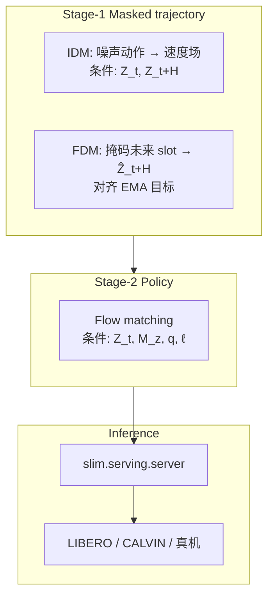
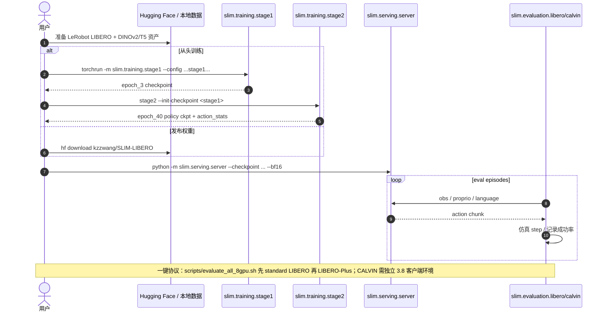

# SLIM-0.5B（动作接地预测隐变量策略 · arXiv:2608.09771）

**SLIM-0.5B**（*Learning Action-Grounded Predictive Latents for Robot Manipulation*，[arXiv:2608.09771](https://arxiv.org/abs/2608.09771)；[项目页](https://kzz1031.github.io/slim-project-page/)；[代码](https://github.com/kzz1031/SLIM)；权重 [SLIM-LIBERO](https://huggingface.co/kzzwang/SLIM-LIBERO)）来自 **复旦大学（Fudan）** / **北京智源人工智能研究院（BAAI）** / **清华大学（Tsinghua）** / **中国人民大学（RUC）**：用 **掩码轨迹自监督** 在观测 latent 空间学动作接地表示，再以紧凑 **Mixture-of-Transformers（MoT）+ flow matching** 做语言条件操纵，避免大 VLM 骨干与像素级未来生成。

## 一句话定义

**别用大 VLM 或像素世界模型扛控制**——先在 latent 里学会「动作解释变化 / 变化可被动作预测」，再用 0.5B 级 MoT 做低延迟 flow 策略。

## 英文缩写速查

| 缩写 | 英文全称 | 简要说明 |
|------|----------|----------|
| SLIM | Self-supervised Latent Interaction Model | 本文方法名 |
| MoT | Mixture-of-Transformers | 观测流与动作流的双流交互骨干 |
| IDM | Inverse Dynamics Model | Stage-1：由当前/未来 latent 重构动作（flow velocity） |
| FDM | Forward Dynamics Model | Stage-1：由当前 latent+动作预测未来 latent |
| EMA | Exponential Moving Average | FDM 目标编码器；消融显示对 OOD 关键 |
| FM | Flow Matching | Stage-2 / 部署时的连续动作生成 |

## 为什么重要

- **对准操纵真正需要的计算：** 开域语义可由小语言条件承担；控制更需要观测–动作交互。
- **保留 WAM「动作有后果」动机，去掉像素 rollout 成本：** 未来预测只作训练信号，不进控制环。
- **部署账本清楚：** 参数 ~0.47B、真机端到端约 **77 ms**、policy-server 显存约 **2 GiB**。
- **与 DeFI / VLA-JEPA 形成对照：** 正逆动力学同骨干、同观测 latent，而非外挂大 VLM 或独立动力学模块。

## 核心信息

| 字段 | 内容 |
|------|------|
| 机构 | 复旦大学；BAAI；清华大学；中国人民大学 |
| 发表 | arXiv preprint（2026-08） |
| arXiv | [2608.09771](https://arxiv.org/abs/2608.09771) |
| 项目页 | <https://kzz1031.github.io/slim-project-page/> |
| 代码 | [kzz1031/SLIM](https://github.com/kzz1031/SLIM) |
| 权重 | [kzzwang/SLIM-LIBERO](https://huggingface.co/kzzwang/SLIM-LIBERO) · [SLIM-CALVIN](https://huggingface.co/kzzwang/SLIM-CALVIN) |
| 骨干 | DINOv2-B/14 + T5-small + MoT（\(d=768\)） |
| 默认 LIBERO 配方 | Stage-1 H8、IDM:FDM=0.125:1、3 ep+EMA；Stage-2 40 ep |

## 核心原理

### 输入 / 输出

| 侧 | 内容 |
|------|------|
| 输入 | 多视角图像 → \(\mathbf{Z}_t=g_\psi(\mathbf{o}_t)\)；本体 \(\mathbf{q}_t\)；语言 \(\ell=g_{\mathrm{lang}}(y)\) |
| Stage-1 监督 | 干净动作块 / 未来 latent（EMA） |
| Stage-2 / 推理 | 当前 \(\mathbf{Z}_t\) + 未来 slot 嵌入 \(\mathbf{M}_z\) + \(\mathbf{q}_t\) + \(\ell\) → 动作块 \(\mathbf{A}_t\) |
| 输出 | 连续 action chunk（无离散化） |

### 流程总览

### 关键机制（压缩）

1. **双向接地：** IDM 问「什么动作解释 \(\mathbf{Z}_t\to\mathbf{Z}_{t+H}\)」；FDM 问「动作可预测哪些未来因素」。
2. **同骨干双流：** MoT joint attention 专管观测–动作；语言只作 per-stream 条件，避免语言解码器吞掉控制计算。
3. **推理不看未来：** Stage-2 用学过的 predictive slots，但**不**输入真实 \(\mathbf{Z}_{t+H}\)，也**不**生成像素。
4. **配方敏感：** 报告最佳 IDM:FDM=0.125:1；EMA 把 LIBERO-Plus 从 66.82% 拉到 77.45%。

## 源码运行时序图

对齐官方 README：`slim.training.stage1/2`、`slim.serving.server`、`slim.evaluation.libero.evaluate`：

## 工程实践

| 项 | 建议 / 论文设定 |
|----|----------------|
| 环境 | 训练 Python 3.12 + CUDA 12.4；LIBERO / LIBERO-Plus / CALVIN 分环境（包名冲突） |
| 全局 batch | 128（8 GPU 默认脚本可改 `NPROC_PER_NODE`） |
| 权重目录 | 保持 HF release 根目录完整（`config.yaml`、`action_stats.json`） |
| 真机读数 | latency **77.3 ms**；GPU mem **~2.01 GiB**（policy server） |
| 复现入口 | 见 [仓库归档](../../sources/repos/slim.md) |

## 实验与评测

| 设定 | 结果要点 |
|------|----------|
| LIBERO overall | **97.5%**（0.47B） |
| LIBERO-Plus zero-shot | **77.45%**（表中 VLA-JEPA 3B 为 79.5%） |
| CALVIN ABC→D | avg length **4.556** / 5 |
| 真机五任务 | avg progress **67.8**（nominal + distractor/lighting/background） |
| 消融 | 无 Stage-1 / 无 EMA / 错 loss 比 → OOD 与长程下降 |

## 结论

**在操纵控制环里，把「动作接地的 latent 动力学」当作表示学习目标，往往比堆更大 VLM 或推理时滚视频更划算。**

1. **先看参数–延迟–显存三角** — 本文主叙事是逼近/超过更大基线的同时显著更轻。
2. **Stage-1 不是可选项** — 消融表明它对 LIBERO-Plus 与 CALVIN 都关键。
3. **IDM:FDM 比例要调** — 默认 0.125:1；别默认 1:1。
4. **与像素 WAM 选型：** 若部署延迟敏感、且不需要可解释视频想象，优先 latent 训练信号路线。
5. **与 DeFI 对照：** DeFI 分模块学正逆动力学；SLIM 同 MoT 内双向掩码——迁移时注意骨干是否共享。
6. **开源可复现** — HF 权重 + server/client 分离，适合作为轻量基线接入评测栈。

## 局限与风险

- **语言侧故意变小：** 极端开域语义/长指令可能弱于大 VLA。
- **依赖 DINOv2/T5 初始化资产路径** — 环境变量配错会静默用错缓存。
- **多环境评测运维重：** LIBERO vs LIBERO-Plus 包冲突需隔离。
- **真机五任务仍属实验室桌面** — 不自动外推移动操作/全身人形。
- **误区：** 把 SLIM 当成推理时世界模型；或当成「无语言」策略。

## 与其他工作对比

| 路线 | 未来/动力学信号 | 推理时是否生成未来 | 骨干尺度 |
|------|-----------------|--------------------|----------|
| 大 VLA（π / OpenVLA 等） | 多隐式于动作监督 | 否 | 数 B–数十 B |
| 像素/视频 WAM | 显式未来帧/视频 | 常需要或可选 | 中–大 |
| VLA-JEPA | 大 VLM + JEPA 未来 latent | 否 | 大 |
| DeFI | 分模块正逆动力学 | 否 | 视实现 |
| **SLIM（本文）** | **同 MoT 内 IDM+FDM 掩码轨迹** | **否** | **~0.47B** |

## 关联页面

- [World Action Models](../concepts/world-action-models.md) — 动作后果建模坐标（本文 latent 训练信号分支）
- [VLA](../methods/vla.md) — 大骨干对照
- [DeFI](../methods/defi-decoupled-dynamics-vla.md) — 正逆动力学预训练对照
- [Action Chunking](../methods/action-chunking.md) — chunk 动作输出
- [LIBERO](./libero-benchmark.md) — 主仿真榜
- [CALVIN](./calvin-benchmark.md) — 长程组合榜
- [Manipulation](../tasks/manipulation.md) — 任务域

## 参考来源

- [论文归档 SLIM-0.5B（arXiv:2608.09771）](../../sources/papers/slim_05b_arxiv_2608_09771.md)
- [项目页归档](../../sources/sites/kzz1031-slim-project-page.md)
- [仓库归档](../../sources/repos/slim.md)

## 推荐继续阅读

- [项目页](https://kzz1031.github.io/slim-project-page/) — 结果图与消融
- [GitHub README](https://github.com/kzz1031/SLIM) — 训练/评测命令
- [HF SLIM-LIBERO](https://huggingface.co/kzzwang/SLIM-LIBERO) — 发布权重与评测摘要
