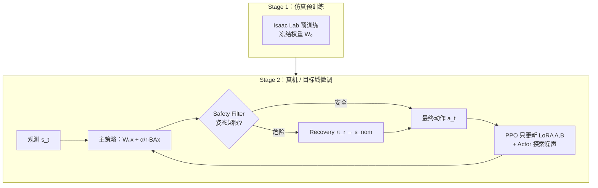

# SLowRL：安全低秩 RL 真机运动微调

**SLowRL**（*Safe Low-Rank Adaptation Reinforcement Learning for Locomotion*，arXiv:2603.17092）针对 **动态腿足策略的 sim-to-real 后微调**：不全参更新预训练网络，而用 **LoRA 低秩扰动** 吸收环境差异，并用 **任务无关 Recovery Policy + Safety Filter** 把探索限制在安全集内。在 **Unitree Go2** 的 trot / jump 上，相对标准 **全参 PPO 微调** 报告约 **46.5%** 墙钟缩短与 **近零** 训练期摔倒。

## 为什么重要

- **真机微调的安全–效率折中：** 直接 FFT 在脆弱预训练策略上易摔倒（trot 无安全基线平均 **14.25** 次/seed）；SLowRL 将 trot 摔倒压到 **0**，jump 到 **2**（仍远低于 FFT+安全 **17.5**）。
- **PEFT 进入高频控制：** 将 LLM 领域的 LoRA 用于 **50–200 Hz 级腿足闭环**，可训练参数约减 **99%**，且 **rank-1 即够**——支持「sim2real gap 主要是低维对齐」的工程判断。
- **与 DR / RMA 互补：** [Sim2Real](../concepts/sim2real.md) 常见路径是随机化或在线隐变量适应；本文强调 **已有策略上的保守、局部更新 + 显式安全层**，适合「仿真已能跑、真机要抠最后几成性能」阶段。

## 流程总览

## 核心机制（归纳）

### 1）LoRA-PPO 与秩

- 每层线性输出：$h = W_0 x + \frac{\alpha}{r} B A x$，$W_0$ 冻结，$B=0$ 初始化保证起步行为等于仿真策略。
- **Actor 与 Critic 均需适配**：冻结 Critic 会在 IsaacLab→MuJoCo/真机分布偏移下给出错误 advantage，Actor-only LoRA **不收敛**。
- **Rank 消融：** $\rho=1$ 在固定 75 min 墙钟内最快回到预训练回报；更高秩在接触不连续 + 安全重置下反而更慢。

### 2）安全：Recovery + 滤波

- Recovery 用强 **域随机化** 训练，从可恢复状态拉回 **名义直立低速度** $s_{nom}$（仅本体感知定义，任务无关）。
- Safety Filter 每步监测 pitch/roll 等，超限则 **覆盖** 主策略输出——与「仅依赖仿真训练的安全 critic」相比，降低安全信号自身的 sim2real 风险（论文 Related Work 论点）。

### 3）实验协议

- **Sim-to-sim：** IsaacSim(PhysX) 预训练 → MuJoCo 实时适配（接触求解器/积分器差异 + 实时约束）。
- **Sim-to-real：** Go2 + Vicon 真值；4 seeds；jump / trot；对比 Zero-shot、FFT、FFT+安全。
- **平滑性：** 训练期动作变化率相对 FFT 在 trot 上约 **88.9%** 额外下降（相对自身起点），低秩约束抑制 bang-bang 高频指令。

## 常见误区

1. **「LoRA 只改 Actor 就够」：** 本文实验表明 **Critic 必须一起低秩适配**，否则价值估计仍活在源仿真分布里。
2. **「rank 越大越强」：** 在固定真机时间预算下，**rank-1 往往最优**；额外自由度主要放大接触 RL 的梯度噪声。
3. **「Recovery 等于任务恢复策略」：** $\pi_r$ 是 **回到安全名义态**，与 jump/trot 任务策略解耦，一套 recovery 可服务多下游微调任务。
4. **「等于 RMA」：** RMA 从状态历史估计环境参数；SLowRL 在 **固定预训练行为流形上** 加低秩残差，并 **硬切换** 安全策略。

## 参考来源

- [SLowRL（arXiv:2603.17092）](../../sources/papers/slowrl_arxiv_2603_17092.md)
- Daneshmand et al., *SLowRL: Safe Low-Rank Adaptation RL for Locomotion* (2026)
- Hu et al., *LoRA* (2021) — 低秩微调范式来源

## 关联页面

- [Sim2Real](../concepts/sim2real.md)、[Locomotion](../tasks/locomotion.md)
- [Sim2Real Gap 缩减实战](../queries/sim2real-gap-reduction.md)、[Sim2Real 方法对比](../comparisons/sim2real-approaches.md)
- [四足机器人](./quadruped-robot.md)、[Unitree](./unitree.md)
- [FastStair](./paper-faststair-humanoid-stair-ascent.md) — 同仓库内另一 LoRA 用于 **多专家融合**（人形楼梯），目标不同

## 推荐继续阅读

- [arXiv:2603.17092](https://arxiv.org/abs/2603.17092) — 方法与消融表
- [Unitree RL Lab](https://github.com/unitreerobotics/unitree_rl_lab) — Go2 Isaac Lab 训练与部署参考栈
- [Deployment-Ready RL](https://thehumanoid.ai/deployment-ready-rl-pitfalls-lessons-and-best-practices/) — 真机 RL 工程教训
