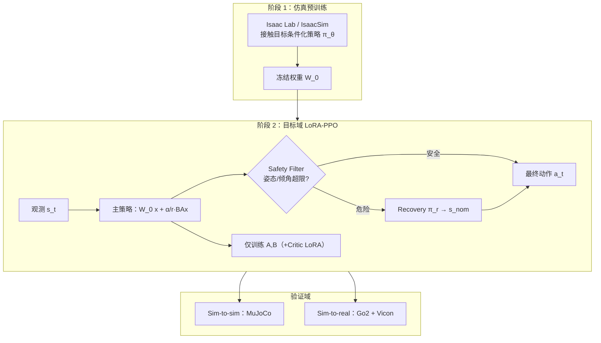

# SLowRL：安全低秩 RL 真机微调

**SLowRL**（*Safe Low-Rank Adaptation Reinforcement Learning for Locomotion*）针对 **仿真已训好、部署后仍需短时段 on-robot 微调** 的腿足场景：在 **Unitree Go2** 上把 **LoRA 参数高效微调** 与 **任务无关 recovery policy** 组合，在 **trot / jump** 任务中同时压样本墙钟与训练期机械风险（arXiv:2603.17092）。

## 为什么重要

- **真机微调是 sim2real 的最后一公里：** [Domain Randomization](../concepts/sim2real.md) 常换来保守策略；完全零样本又常掉性能——SLowRL 论证 **不必全参重训**，**rank-1** 子空间 + 安全兜底即可恢复。
- **安全与效率不可分：** 全参 PPO 微调在脆弱预训练策略上易 **高频 bang-bang 动作** 与大量跌倒；LoRA 限制可更新自由度，recovery 在姿态越界时接管。
- **与跨机体 PEFT 对照：** [Any2Any](./paper-any2any-cross-embodiment-wbt.md) 解决 **不同人形 WBT 迁移**；SLowRL 解决 **同机体跨仿真/真机动力学对齐**——二者共用 LoRA 思想但问题设定正交。

## 流程总览

## 核心机制（归纳）

### 1）LoRA 作为「现实扰动」子空间

- 每层并行路径：$h = W_0 x + \frac{\alpha}{r} B A x$，$W_0$ 冻结；$B{=}0$ 初始化保证 **微调起点 = 预训练行为**。
- **可训练参数约 0.91%**（相对 FFT）；默认 **ρ=1** 在 75 min 墙钟预算内最快恢复源域回报，更高 rank 反而因接触不连续与梯度噪声变慢。
- **必须同时适配 Actor 与 Critic：** 仅 Actor LoRA 时冻结 Critic 仍按源仿真估值，优势估计错误导致不收敛。

### 2）Recovery + 安全滤波

- $\pi_r$：**任务无关**，DR 训练，把可恢复状态拉回 $s_{nom}$（直立、低速度、纯本体感知定义）。
- Safety Filter：每步监测 $s_t$，超限则 **覆盖** 主策略输出——探索被限制在安全集内，主策略 LoRA 在「安全壳」内学习。

### 3）实验协议与基线

| 基线 | 含义 |
|------|------|
| Zero-Shot | 直接部署预训练策略 |
| FFT | 全参 on-robot / on-target PPO |
| FFT + safety | 全参 + 同一 recovery（隔离 LoRA 收益） |
| SLowRL | LoRA + recovery |

- **Sim-to-sim：** IsaacSim 预训练 → **MuJoCo** 实时闭环（接触求解器/积分器差异 + 实时约束）。
- **Sim-to-real：** Vicon 真值速度/位置；4 seed；20 核 CPU + RTX 3080 Ti 实时推理。

## 常见误区

1. **LoRA 初始化不是随机策略：** $B=0$ 时策略等同预训练；早期探索靠 Actor 末层 **可训练噪声** 与 PPO，而非大幅改 $W_0$。
2. **Recovery 不能替代 LoRA：** FFT+安全 仍显著多于 SLowRL 的跌倒次数——低秩本身也抑制 destabilizing 梯度方向。
3. **≠ 语言模型 LoRA 超参：** 真机 LoRA 学习率 **高于** FFT 一个数量级（$10^{-2}$ vs $10^{-3}$），需按控制频率与任务单独调。

## 参考来源

- [SLowRL（arXiv:2603.17092）](../../sources/papers/slowrl_arxiv_2603_17092.md)
- Hu et al., *LoRA: Low-Rank Adaptation of Large Language Models* (2022) — 方法来源
- Eysenbach et al., *Recovery RL* (2021) — 安全微调对照线

## 关联页面

- [Sim2Real](../concepts/sim2real.md)、[Locomotion](../tasks/locomotion.md)、[Balance Recovery](../tasks/balance-recovery.md)
- [四足机器人](./quadruped-robot.md)、[Unitree](./unitree.md)
- [Any2Any 跨机体 WBT](./paper-any2any-cross-embodiment-wbt.md)

## 推荐继续阅读

- [Sim2Real 方法横向对比](../comparisons/sim2real-approaches.md)
- [Query：如何缩小 sim2real gap](../queries/sim2real-gap-reduction.md)
- arXiv:2603.17092 — <https://arxiv.org/abs/2603.17092>
