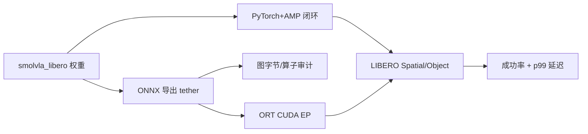
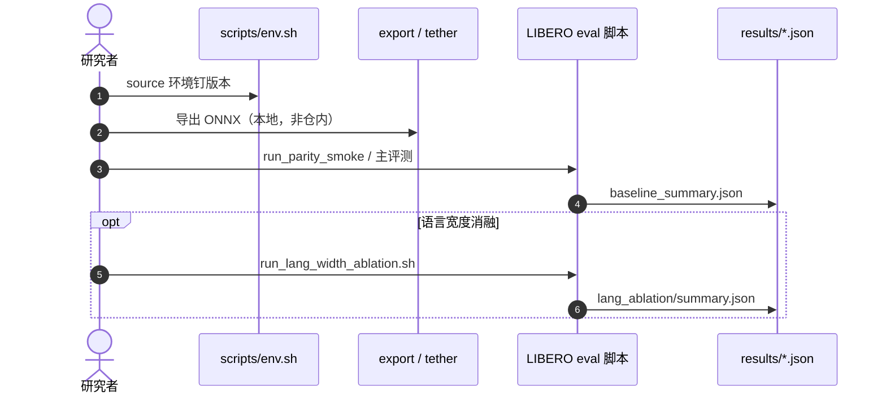

# SmolVLA ONNX LIBERO：闭环部署审计

**SmolVLA ONNX LIBERO 部署研究**（*When Faster VLA Deployment Changes Closed-Loop Behavior: Task Success-Latency Analysis of SmolVLA Across PyTorch and ONNX Variants*，[arXiv:2609.14146](https://arxiv.org/abs/2609.14146)，[代码](https://github.com/rafiqul713/smolvla-libero-onnx)）由 Rafiqul Islam 发布：在 **RTX 2060 6 GB** 上对 `HuggingFaceVLA/smolvla_libero` 做 **PyTorch+AMP vs ONNX Runtime CUDA EP** 的 **LIBERO 闭环审计** — 证明 **更快推理会改变任务行为**，部署评估必须同时报告 **延迟、图审计、接口约束与成功率**。

## 一句话定义

**VLA 部署不是离线 bench 越快越好：ONNX 换栈后 Spatial 成功率可腰斩，根因常是语言 token 宽度与导出图语义，而非「INT8 量化魔法」。**

## 英文缩写速查

| 缩写 | 英文全称 | 简要说明 |
|------|----------|----------|
| VLA | Vision-Language-Action | SmolVLA 450M 轻量 VLA |
| ONNX | Open Neural Network Exchange | 本文导出与 ORT CUDA EP 运行时 |
| AMP | Automatic Mixed Precision | PyTorch 半精度推理基线 |
| LIBERO | Lifelong Robot Learning | Spatial / Object 等仿真操作套件 |
| ORT | ONNX Runtime | `tether inspect` / 统一 bench 推理后端 |

## 为什么重要

- **反「latency-only」叙事：** p99 从 **1181 ms → 532 ms** 时 Spatial 可从 **70% → 40%** — Object 仍 **~89%**，说明 **任务对闭环时序敏感度不同**。
- **图审计必要：** requested-FP16 与 requested-INT8 导出 **字节相同 FP32 图** — 不能把 601 vs 532 ms 误读为 INT8 量化收益。
- **语言宽度是隐藏旋钮：** 默认 static width **16** 截断 **5/10** Spatial 指令；width **24** 可把 Spatial 拉回 **75%** 并约减半延迟。
- **可复现脚本开源：** MIT 仓含 eval / parity / ablation JSON — 适合接 [VLA 部署指南](../queries/vla-deployment-guide.md)。

## 核心信息

| 项 | 内容 |
|----|------|
| **底座** | `HuggingFaceVLA/smolvla_libero` |
| **栈** | MuJoCo **3.3.2**，LeRobot **0.6.1**，seed **42** |
| **硬件** | NVIDIA RTX 2060 **6 GB**（无 Jetson / 无真机） |
| **开源** | **已开源** — [rafiqul713/smolvla-libero-onnx](https://github.com/rafiqul713/smolvla-libero-onnx)；ONNX 权重需 tether 本地导出 |

## 流程总览

## 源码运行时序图

关键复现路径：`docs/REPRODUCE.md` → `bash scripts/run_parity_smoke.sh`；主数字在 `results/baseline_summary.json`。

## 实验与评测

**主表（100 episode/suite）：**

| 配置 | Spatial | Object | p99 |
|------|--------:|-------:|----:|
| PyTorch+AMP | **70.0%** | **88.0%** | 1181 ms |
| ONNX req-FP16 (w=16) | 41.0% | 89.0% | 601 ms† |
| ONNX req-INT8 (w=16) | 40.0% | 89.0% | 532 ms† |
| ONNX w=24 | **75.0%** | 90.0% | 587.7 ms‡ |
| ONNX w=32 | 71.0% | 87.0% | 591.3 ms‡ |

† `tether inspect bench`；‡ 统一 ORT bench — **不可混比 harness**。

**配对验证（300 episode/suite）：** Spatial **56.7% → 33.0%**；Object **73.3% → 74.0%**。

**统计：** width-24 ONNX vs PyTorch Spatial 成功率 Wilson 区间重叠（χ² p=0.53）— 可「近似无损换栈」，但 width-16 不行。

## 与其他工作对比

| 路线 | 关系 |
|------|------|
| [ROS2SmolVLA](./paper-ros2smolvla.md) | 真机 UR10e 部署；本文是 **仿真 LIBERO + ONNX 审计** |
| [MINERVA](./paper-minerva-libero.md) | 同 LIBERO 容量/效率议题；MINERVA 压模型，本文压 **运行时与导出** |
| [VLA 部署指南](../queries/vla-deployment-guide.md) | 本文提供 **可 cite 的负例**：快但掉分 |

## 局限与风险

- **单卡消费级 GPU：** RTX 2060 结论不自动外推到 Jetson / 真机异步栈。
- **无随仓 ONNX：** ~2+ GB 需自行导出，复现门槛在 tether 环境。
- **LIBERO 闭集：** Spatial 对语言宽度敏感，不代表开放指令真机。
- **Harness 不可混：** tether inspect 与 uniform ORT bench 数字不能横向拼表。

## 结论

**SmolVLA 换 ONNX 可以减半延迟，但默认导出会毁掉 Spatial 成功率；部署前必须做图审计 + 语言宽度消融 + 闭环评测，不能只贴 bench ms。**

1. **先审计图** — FP16/INT8 标签不等于算子精度。
2. **查 language width** — 16 token 截断是 Spatial 暴跌的首要嫌疑。
3. **分 suite 报告** — Object 稳、Spatial 崩是本文典型模式。
4. **固定 harness** — 对比延迟时统一 tether 或统一 ORT bench。
5. **用开源 JSON 复核** — `results/baseline_summary.json` 为论文数字锚点。

## 关联页面

- [VLA 方法](../methods/vla.md)
- [VLA 真机部署指南](../queries/vla-deployment-guide.md)
- [LIBERO 基准](./libero-benchmark.md)
- [LeRobot](./lerobot.md)

## 推荐继续阅读

- [GitHub: smolvla-libero-onnx](https://github.com/rafiqul713/smolvla-libero-onnx)
- [arXiv:2609.14146](https://arxiv.org/abs/2609.14146)
- [SmolVLA 论文](https://arxiv.org/abs/2506.01844) — 450M 底座

## 参考来源

- [论文摘录](../../sources/papers/smolvla_onnx_libero_arxiv_2609_14146.md)
- [smolvla-libero-onnx 仓库归档](../../sources/repos/smolvla-libero-onnx.md)
