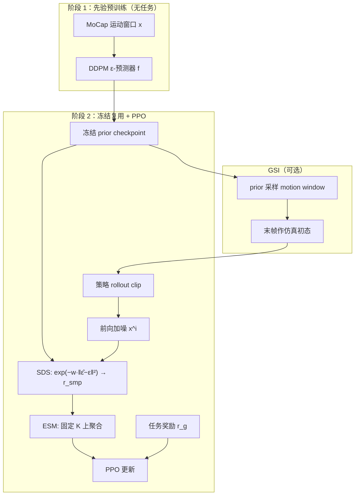
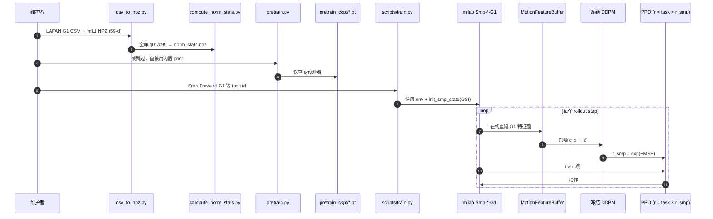

# SMP：可复用 Score-Matching 运动先验

**SMP**（*SMP: Reusable Score-Matching Motion Priors for Physics-Based Character Control*，[arXiv:2512.03028](https://arxiv.org/abs/2512.03028)，ACM TOG / SIGGRAPH 2026）由 Yuxuan Mu、Ziyu Zhang 等提出，收录于 [AMP 运动先验专题](https://mp.weixin.qq.com/s/YZsm3855iP3TNTTt1aou7w) **第 03/19** 篇（**01 分布约束与先验组件化**）。核心：把运动扩散模型**预训练后冻结**，用 **Score Distillation Sampling (SDS)** 将 ε-预测误差变成可插拔的 **SMP 奖励**，下游 RL **无需再访问原始 MoCap**。

## 一句话定义

**先在无任务 MoCap 上训练运动 DDPM 并冻结，再用 SDS 把策略 rollout 与参考分布对齐为奖励——先验模块化、可跨任务复用，并可经风格条件与组合派生百种风格专用先验。**

## 英文缩写速查

| 缩写 | 英文全称 | 简要说明 |
|------|----------|----------|
| SMP | Score-Matching Motion Prior | 可复用的 score-matching 运动先验模块 |
| SDS | Score Distillation Sampling | 用冻结扩散模型 ε-误差作引导奖励 |
| ESM | Ensemble Score-Matching | 多扩散 timestep 聚合 SDS，降方差 |
| GSI | Generative State Initialization | 用 prior 采样窗口作 reset 初态，替代 RSI |
| AMP | Adversarial Motion Prior | 对抗判别风格先验；SMP 的对照基线 |
| DDPM | Denoising Diffusion Probabilistic Model | 本文先验的扩散骨干 |
| G1 | Unitree G1 Humanoid | 论文附录与 G1 复现的目标平台 |

## 为什么重要

- **先验组件化：** 相对 [AMP](./paper-amp-survey-01-amp.md) 每换策略常重训判别器，SMP 先验**一次预训练、冻结复用**，RL 阶段可**丢弃原始数据集**。
- **生成式路线：** 与对抗模仿同属分布匹配，但用**冻结扩散 + SDS** 替代在线判别器，避免对抗训练不稳定。
- **风格可组合：** 100STYLE 条件先验经 classifier-free guidance 与 ε-空间混合，可合成数据集中不存在的新风格。
- **真机验证：** 附录在 **Unitree G1** 上部署自然 locomotion；工程向见 [MimicKit](./mimickit.md) 与 [G1 mjlab 复现](./smp-g1-mjlab.md)。

## 核心信息

| 项 | 内容 |
|----|------|
| **机构** | 西蒙菲莎大学（SFU）、英伟达（NVIDIA）、索尼（Sony）、斯坦福大学（Stanford）、斯纳普（Snap）等 |
| **作者** | Yuxuan Mu、Ziyu Zhang、Yi Shi、Dun Yang（共同一作）等；通讯脉络含 **Xue Bin Peng** |
| **平台** | 仿真人形多任务；附录 **Unitree G1** 真机 |
| **数据** | LaFAN1、100STYLE、人–物/人–场景交互 MoCap 等 |
| **任务** | 速度跟踪、转向、落点、躲避球、搬运、楼梯、起身等 |
| **开源** | **已开源** — 官方 [MimicKit](https://github.com/xbpeng/MimicKit)（`docs/README_SMP.md`）；G1 端到端复现 [senlanke/mimic](https://github.com/senlanke/mimic)（内置三套 SMP prior；同仓另有 CMoE 移植与未验证 AME） |

## 流程总览

## 源码运行时序图

以下对齐 [senlanke/mimic](https://github.com/senlanke/mimic)（G1 + mjlab 可运行入口）；官方 [MimicKit](./mimickit.md) 逻辑相同，环境为 Isaac Gym / Isaac Lab。

复现路径：`uv sync` →（可选）`uv run scripts/pretrain.py` → `uv run scripts/train.py Smp-Forward-G1`；内置 `pretrained_loco.pt` 等可跳过预训练。

## 核心机制（归纳）

### 1）SMP 奖励

对策略 clip 加噪得 \(\mathbf{x}^i\)，冻结网络预测 \(\hat\epsilon=f(\mathbf{x}^i)\)：

\[
r^{\mathrm{smp}} = \exp\left(- w_s \|\hat{\epsilon} - \epsilon\|_2^2 \right)
\]

与 AMP 同属分布匹配，但**无对抗训练**；不要求逐帧复现某条参考。

### 2）ESM 与 Adaptive Normalization

- **ESM：** 在固定 timestep 集合 \(\mathbb{K}=\{22,15,8\}\) 上聚合 SDS，降低 PPO 奖励方差。
- **Adaptive Normalization：** 各 timestep SDS 误差按 running mean 归一化，减轻 checkpoint 间超参敏感。

### 3）GSI

用冻结 prior **采样** motion window 作 reset 初态，替代 Reference State Initialization（RSI）对原始 MoCap 的依赖。

### 4）风格组合

100STYLE 条件扩散 → classifier-free guidance 得风格专用先验；ε-空间 per-body-part mixing 可合成新风格。

## 工程实践

| 项 | 做法 |
|----|------|
| 官方栈 | [MimicKit](./mimickit.md) `docs/README_SMP.md`；奖励 **加性** `w_g·r_g + w_smp·r_smp` |
| G1 复现 | [senlanke/mimic](./smp-g1-mjlab.md)；**乘性** `r = task × r_smp`；`uv` + mjlab；任务前缀 `Smp-*-G1`（勿与同仓 `CMoE-G1` / `AME-*` 混用） |
| 预置 prior | `pretrained_loco.pt` / `pretrained_lafan_run.pt` / `pretrained_getup_f2s2.pt` 对应四类任务 |
| 特征维 | G1：**59 维/帧**（根位姿 + 29 关节 + 末端 + 根速度） |
| 归一化 | 在**宽数据集**（如全 LaFAN G1）上算 q01/q99；窄集会导致 RL 期 OOD 饱和 |
| 对照 | [AMP_mjlab](./amp-mjlab.md) 对抗路线；[CMP](./paper-cmp.md) 把 SMP 改成上下文条件先验 |

## 实验与评测

- **多任务：** Steering、Target Location、Dodgeball、Object Carry、Stair 等；相对纯任务奖励，运动质量显著提升。
- **与 AMP：** 多任务 normalized return 与运动质量**相当**；SMP 样本效率 wall-clock 常更高（先验更大）。
- **数据效率：** 仅 3 秒走/跑 clip 即可涌现走→ jog→ sprint 切换。
- **真机：** Unitree G1 自然 locomotion 与扰动恢复（论文附录）。

## 结论

**SMP 把「像人」从对抗判别器改成了冻结扩散上的 SDS 奖励，于是先验可以一次训练、跨任务插拔，且 RL 阶段不必再抱着原始 MoCap。**

- 真正起作用的是 **Modular + Reusable**：先验与策略解耦预训练，冻结后仅通过 SDS 误差注入自然度，下游可完全丢弃参考数据集（GSI 进一步去掉 RSI 对 MoCap 的依赖）。
- **ESM + Adaptive Normalization** 是 PPO 能训稳的关键工程件：单 timestep SDS 方差极大，固定 \(\mathbb{K}\) 聚合与 running-mean 归一化比裸 SDS 或手调 \(w_s\) 更可靠。
- 风格侧的价值在 **Composable**：100STYLE 条件先验经 guidance 与 ε-空间混合可派生数据集中不存在的行为，但算力成本高于 AMP（作者报告同采样量 SMP ~11.5h vs AMP ~6.2h）。
- 选型边界：需要**预训练扩散**两阶段；乘性 `task × r_smp`（G1 复现）比 MimicKit 加性形式更少手调权重，但仍是启发式变体。
- 今天读 SMP 应同时看 **[MimicKit 官方](./mimickit.md)** 与 **[senlanke/mimic G1 管线](./smp-g1-mjlab.md)**；上下文适配见 [CMP](./paper-cmp.md)。

## 局限与风险

- **两阶段成本：** 需先训扩散再 RL；wall-clock 常高于 AMP。
- **奖励调参：** \(w^{\mathrm{smp}}\)、\(\mathbb{K}\) 选择仍影响稳定性。
- **平台差异：** 论文主结果在仿真人形；G1 真机细节在附录，工程复现以 mjlab 栈为准。

## 与其他页面的关系

- 方法归纳：[smp.md](../methods/smp.md)
- AMP 源流：[paper-amp-survey-01-amp.md](./paper-amp-survey-01-amp.md)
- 先验变体选型：[amp-add-smp-motion-prior-variants.md](../comparisons/amp-add-smp-motion-prior-variants.md)
- 上下文扩展：[paper-cmp.md](./paper-cmp.md)

## 参考来源

- [sources/papers/smp.md](../../sources/papers/smp.md)
- [sources/sites/smp-project.md](../../sources/sites/smp-project.md)
- [sources/repos/mimickit.md](../../sources/repos/mimickit.md)
- [sources/repos/senlanke_mimic.md](../../sources/repos/senlanke_mimic.md)
- [humanoid_amp_survey_03_smp_reusable_score_matching_motion_priors_for_ph.md](../../sources/papers/humanoid_amp_survey_03_smp_reusable_score_matching_motion_priors_for_ph.md)
- Mu et al., *SMP: Reusable Score-Matching Motion Priors for Physics-Based Character Control*, ACM TOG 2026

## 推荐继续阅读

- [SMP 项目页](https://yxmu.foo/smp-page/) — 视频、多任务演示与 BibTeX
- [arXiv:2512.03028](https://arxiv.org/abs/2512.03028) — 论文 PDF
- [MimicKit README_SMP](https://github.com/xbpeng/MimicKit/blob/main/docs/README_SMP.md) — 官方实现
- [senlanke/mimic](https://github.com/senlanke/mimic) — G1 + mjlab；SMP 完整，另挂 CMoE/AME
- [AMP 专题长文（微信公众号）](https://mp.weixin.qq.com/s/YZsm3855iP3TNTTt1aou7w) — 03/19 策展坐标
