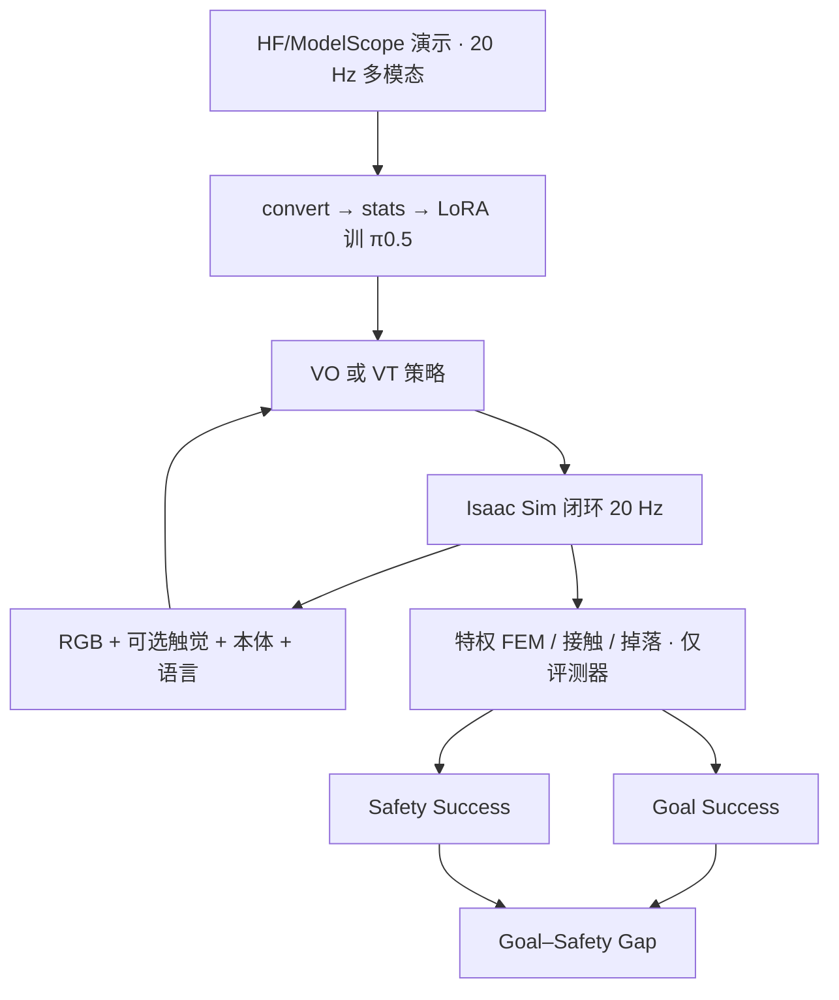
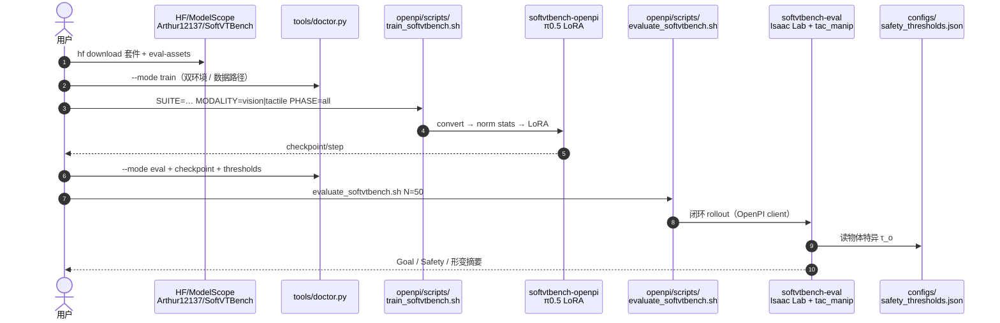

# SoftVTBench（安全感知视触觉可变形操作基准 · arXiv:2607.04234）

**SoftVTBench**（*SoftVTBench: A Safety-Aware Visuo-Tactile Benchmark for Physically Constrained Robotic Manipulation of Deformable Objects*，[arXiv:2607.04234](https://arxiv.org/abs/2607.04234)，[项目页](https://softvtbench.github.io/)，[代码](https://github.com/TuojingAI/SoftVTBench)）由 **拓境智能、清华大学、港大** 等联合提出：在 Isaac Sim 的 FEM 软体上做 **接触丰富视触觉** 闭环评测，并把 **目标成功** 与 **物理安全成功** 拆开报告，暴露 success-only 评测藏住的过压/掉落。

## 一句话定义

**SoftVTBench 用策略不可见的 FEM 特权态判定「放到目标且未掉、未过压」，证明仅 Goal Success 会严重高估可变形操作策略，而触觉主要抬高 Safety Success。**

## 英文缩写速查

| 缩写 | 英文全称 | 简要说明 |
|------|----------|----------|
| SoftVTBench | Soft Visuo-Tactile Benchmark | 本文基准：可变形体安全感知视触觉评测 |
| FEM | Finite Element Method | PhysX soft-body 形变仿真；评测用、策略不可见 |
| VO / VT | Vision-Only / Visuo-Tactile | π₀.₅ 基线：无触觉 vs 含触觉 RGB+marker |
| GelSight | GelSight Mini | 双指光学触觉；Taxim 光学 + FOTS marker |
| LIBERO | Lifelong Robot Learning benchmark | 刚体对照套件的任务风格来源 |
| RMS | Root Mean Square | 去刚体后的 FEM-RMS 形变，相对包围盒对角线 |

## 为什么重要

- **Success-only 骗人：** 软体 Object-Soft 上 Goal ~70%，Safety 可低至 ~21%——多数「成功」其实过压或不稳。
- **安全包络可操作：** 过松 → 滑/掉；过紧 → 过形变；中间窗口才同时满足任务与安全。
- **模态结论可复现：** 同协议下 VT 改善软体 Safety 与形变分布，刚体 Goal 增益不一致。
- **工程入口齐：** 代码 + HF/ModelScope 数据 + 安全阈值 JSON；可直接当接触安全评测脚手架。

## 核心信息

| 项 | 内容 |
|----|------|
| 机构 | 拓境智能、清华、KCL、东南大学、Stevens、HKUST-GZ、曼彻斯特、Simple AI、帝国理工、CMU、浙大、北航、港大 |
| 平台 | Isaac Sim 4.5 / Isaac Lab；Franka Panda + 双指 GelSight Mini |
| 观测 | 第三人称/腕部 RGB、触觉 RGB、marker motion、本体、语言；20 Hz |
| 动作 | 绝对 EE 位姿 + 夹爪（VO 二进制 / VT 连续） |
| 套件 | Object-Soft / Spatial-Soft / Object-Rigid / Spatial-Rigid |
| 规模 | 论文 4 suites · 2,000 episodes · 33 assets；公开托管约 1,628 demos |
| 基线 | π₀.₅ LoRA（OpenPI）；horizon 50，评测执行 10 步再规划 |
| 代码 | [TuojingAI/SoftVTBench](https://github.com/TuojingAI/SoftVTBench)（Apache-2.0） |
| 数据 | [HF Arthur12137/SoftVTBench](https://huggingface.co/datasets/Arthur12137/SoftVTBench) |
| 开源核查 | **已开源**（2026-07-29）：代码+数据+阈值；**参考 SoftVTBench checkpoint 待发** |

## 核心原理（方法）

### 评测协议

- **Goal Success：** 目标物体进入目标区域/容器并保持短终端视界。
- **Safety Success（软体）：** Goal ∧ NoDrop ∧ \(D_{\mathrm{peak}}\le\tau_o\)。
- \(D(t)\)：去全局刚体运动后的物体尺寸归一 FEM-RMS 形变（相对包围盒对角线 %）。
- \(\tau_o\)：离线抓取–提升–压缩标定得到的物体特异阈值；策略不可见。

### 2×2 任务套件

| Suite | 物体 | 变化轴 | 用途 |
|-------|------|--------|------|
| Object-Soft | 可变形 | 物体身份/顺应性 | 安全可变形抓放主评测 |
| Spatial-Soft | 可变形 | 布局 + 语言指代双实例 | 空间与语言 grounding 下的安全 |
| Object-Rigid | 刚体 | 物体身份 | 基线操作能力诊断 |
| Spatial-Rigid | 刚体 | 空间布局 | 空间鲁棒性诊断 |

### π₀.₅ 基线差异

| | VO | VT |
|--|----|----|
| 视觉/本体/语言 | ✓ | ✓ |
| 触觉 RGB 历史 + marker | ✗ | ✓（双指拼成 4×4 网格喂同一视觉编码器） |
| 夹爪动作 | 二进制开合 | 连续宽度 |

### 流程总览

## 源码运行时序图

节点对齐 [`sources/repos/softvtbench.md`](../../sources/repos/softvtbench.md) 与官方 README。

- **训练最短路径：** 装双环境 → 下数据 → `doctor.py --mode train` → `train_softvtbench.sh`。
- **评测最短路径：** 下 `eval-assets` + 触觉运行时资产 → `doctor.py --mode eval` → `evaluate_softvtbench.sh`。
- **烟测：** `N=1 TASKS_STR=0`。

## 工程实践

| 项 | 实践要点 |
|----|----------|
| 双 Python | 仿真 **3.10**（`softvtbench-eval`）与 OpenPI **3.11**（`uv` venv）分离 |
| 数据外置 | 勿把 HDF5/USD/权重 commit 进 Git；用 `SOFTVTBENCH_DATA` |
| 上游资产 | Tabero/LIBERO 与 `Tactile_Manipulation_Dataset` 需另下并 symlink |
| 训练资源 | 默认 8×A100、global batch 256；单卡 v0.1 未验证 |
| 指标读法 | 软体必看 Safety + 形变分布；勿只报 Goal |
| 权重 | SoftVTBench 参考 ckpt **待发**；需自训或等官方 |

## 实验与评测

| Suite | Method | Goal Success | Safety Success |
|-------|--------|--------------|----------------|
| Object-Rigid | VO | 38.8% | N/A |
| Object-Rigid | VT | 32.4% | N/A |
| Spatial-Rigid | VO | 56.4% | N/A |
| Spatial-Rigid | VT | 63.4% | N/A |
| Object-Soft | VO | 70.4% | 21.4% |
| Object-Soft | VT | 71.8% | **35.6%** |
| Spatial-Soft | VO | 74.2% | 32.6% |
| Spatial-Soft | VT | **84.2%** | **44.6%** |

形变（FEM-RMS，包围盒对角线 %）：Object-Soft mean 16.10→15.12、P95 44.70→38.81；Spatial-Soft 同向下移——触觉平移整段分布，而非只抬阈值通过率。

## 结论

**SoftVTBench 把可变形操作评测从「放到没」升级为「放到且物理安全」；触觉在软体上的主收益是接触调节与 Safety Success，不是刚体 Goal 的万能加成。**

1. **读榜先看 Gap** — Goal−Safety 才是虚假成功量；只比 Goal 会选到过压策略。
2. **软体必上触觉消融** — VO/VT 同协议才能归因到局部接触，而非视觉捷径。
3. **刚体对照别误读** — Object-Rigid 上 VT 可更差；触觉价值在形变约束在场时最大。
4. **形变分布比阈值更稳** — 看 mean/median/P95，避免阈值敏感刷分。
5. **复现预算** — 双环境 + 多资产源 + 多卡 LoRA；参考权重待发时先跑 `doctor` 烟测。
6. **与 TacO 分工** — TacO 答「哪种触觉硬件」；SoftVTBench 答「如何测接触安全」。

## 与其他工作对比

| 对照 | SoftVTBench（本页） | [TacO](./paper-taco-tactile-sensor-benchmark.md) | LIBERO / 常规操作基准 |
|------|---------------------|--------------------------------------------------|------------------------|
| **问题** | 可变形过程安全 | 跨模态传感器选型 | 终身/语言条件操作成功 |
| **评测** | Goal + Safety + FEM GT | 真机 IL 成功率 | 终端成功谓词 |
| **触觉** | GelSight 仿真固定栈 | 六硬件四模态 | 通常无 |
| **开源** | 代码+数据；ckpt 待发 | 代码+硬件；数据链弱 | 视具体仓 |

## 局限与风险

- **仿真≠真机软体：** 论文自承 FEM/资产覆盖有限，真实软体动力学更复杂。
- **基线族窄：** 主结果围绕 π₀.₅；扩散策略 / 其他 VLA / WAM 未系统对比。
- **开源边界：** 参考 SoftVTBench checkpoint 待发；项目页 Paper/Dataset 按钮文案滞后于 README。
- **依赖链重：** Isaac Sim EULA、Tabero 上游资产、触觉 runtime、OpenPI base ckpt 缺一不可。
- **刚体 Safety N/A：** 勿把软体 Safety 结论直接外推到无变形约束设定。

## 关联页面

- [视触觉融合](../concepts/visuo-tactile-fusion.md) — VO/VT 消融语境
- [Tactile Sensing](../concepts/tactile-sensing.md) — GelSight / marker 模态
- [接触丰富操作](../concepts/contact-rich-manipulation.md) — 过程级接触约束
- [触觉专题](../overview/topic-tactile.md) / [具身评测基准专题](../overview/topic-embodied-eval-benchmark.md)
- [Manipulation](../tasks/manipulation.md) / [VLA](../methods/vla.md) / [Imitation Learning](../methods/imitation-learning.md)
- [TacO（传感器基准）](./paper-taco-tactile-sensor-benchmark.md) — 互补选型证据
- [具身评测基准选型闭环](../queries/embodied-eval-benchmark-selection-loop.md) — 第③层策略成功率读法
- [RL 中的触觉反馈](../queries/tactile-feedback-in-rl.md)

## 参考来源

- [SoftVTBench 论文归档](../../sources/papers/softvtbench_arxiv_2607_04234.md)
- [项目页归档](../../sources/sites/softvtbench-github-io.md)
- [代码归档](../../sources/repos/softvtbench.md)
- 论文：Jing et al., *SoftVTBench…*, arXiv:2607.04234

## 推荐继续阅读

- 项目页与视频：<https://softvtbench.github.io/>
- 官方代码：<https://github.com/TuojingAI/SoftVTBench>
- 数据集：<https://huggingface.co/datasets/Arthur12137/SoftVTBench>
- OpenPI / π₀.₅：<https://github.com/Physical-Intelligence/openpi>
- 上游仿真参考 Tabero：<https://github.com/NathanWu7/Tabero>
