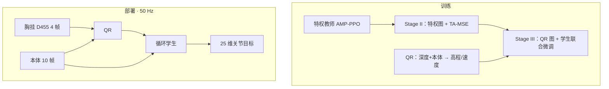

# SOLO：稳定全地形长程感知人形运动

**SOLO**（*Stable Omni-terrain Long-Horizon Perceptive Humanoid Locomotion*，[arXiv:2608.26583](https://arxiv.org/abs/2608.26583)，[项目页](https://sunpihai-up.github.io/solo/)）由 **中国科学技术大学**、**北京人形机器人创新中心（X-Humanoid）** 与港大 / 澳国立 / 港科广 / 交大 / 清华 / 港中文联合提出：针对感知人形在 **连续部署** 中误差累积，用 **Query Reconstructor（QR）** 保住动作关键地形边界，用 **Trajectory-Aware MSE（TA-MSE）** 给师生蒸馏补上轨迹级信用。

## 一句话定义

**逐格查询重建局部高程，并把「下一步更难模仿教师」写进 PPO 回报，让单胸深相机学生在连续公里级路线上不把局部成功耗光。**

## 英文缩写速查

| 缩写 | 英文全称 | 简要说明 |
|------|----------|----------|
| SOLO | Stable Omni-terrain Long-Horizon | 本文感知行走框架 |
| QR | Query Reconstructor | 每格 Fourier 查询交叉注意深度–本体记忆 |
| TA-MSE | Trajectory-Aware MSE | 下一步师生 MSE 进入 PPO 奖励 |
| AME | Attention-based Map Encoder | 师生共享的高程编码骨干 |
| GAE | Generalized Advantage Estimation | 把未来分歧惩罚回传到更早动作 |
| AMP | Adversarial Motion Prior | 教师与蒸馏阶段的步态风格正则 |

## 为什么重要

- **短试次成功 ≠ 长程稳定：** 重置会清掉局部误差；连续路线重复地形切换与视角变化，稠密重建的糊边界和短视 MSE 会把误差焊进后续状态。
- **同团队升级 DPL：** [DPL](./paper-notebook-dpl-depth-only-perceptive-humanoid-locomotion-vi.md) 已用交叉注意力重建高程；SOLO 把解码从共享稠密头改成 **逐格查询**，并把蒸馏从点态 MSE 改成 **回报通道**。
- **长程硬件锚点：** 单 D455、无外定位，连续 **1.5 km** 户外，对照 [SSR](./paper-ssr-humanoid-open-world-traversal.md) 的 1.3 km（不同本体与感知栈）。
- **踏石是试金石：** 稠密重建变体踏石成功率 **0–3%**，QR **96%**——边界保真直接变成可穿越性。

## 核心信息

| 项 | 内容 |
|----|------|
| **机构** | 中国科学技术大学；北京人形机器人创新中心（X-Humanoid）；香港大学；澳大利亚国立大学；香港科技大学（广州）；上海交通大学；清华大学；香港中文大学 |
| **平台** | 天工 **Omni**；胸挂 Intel RealSense D455；25 关节；策略 **50 Hz** |
| **栈** | Isaac Lab 大规模并行 PPO；教师 / 学生共享 AME；学生加 LSTM 本体旁路 |
| **感知** | 深度史 4 帧（113×64，stride 4）+ 本体史 10 帧 → 16×32 高程 + 3-D 基座速度 |
| **训练** | 4×H800：教师 ~90 h / 蒸馏 ~64 h / QR 微调 ~20 h |
| **开源** | **确认未开源**（截至 2026-08-29）：项目页与论文均未列 GitHub / 权重 |

## 核心原理（方法）

教师观测特权高程 \(m_t\)、真实基座速度与本体；学生只看深度史与本体史。QR 把深度 ResNet token 与本体 MLP token 拼成记忆 \(M_t\)，每格 Fourier 查询交叉注意 \(M_t\) 出高度，另用速度查询出 \(\hat{v}_t\)。重建损失是高程 / 速度 L1。

TA-MSE 在学生访问的 \(s_{t+1}\) 上算师生动作 MSE，stop-gradient 后从任务奖励里减去，经 GAE 影响更早动作；同时保留当前态辅助 MSE。PPO-only（\(\lambda{=}\beta{=}0\)）、MSE+PPO（\(\beta{=}0\)）、TA-MSE（两者都开）在同一教师上可比。

三阶段：① 特权教师 AMP-PPO；② 特权地形上 TA-MSE 蒸馏学生（QR 未接入）；③ 用 QR 估计替换特权图，学生与 QR 在学生 on-policy 缓冲上联合微调。部署去掉教师、critic、AMP 与特权标签。

### 流程总览

## 源码运行时序图

**不适用**（截至 2026-08-29 项目页未列 GitHub，论文未给可运行入口）。若后续发布训练 / 部署仓，应补 `sources/repos/` 并画 Isaac Lab 三阶段 → TensorRT 50 Hz 时序。

## 工程实践

| 项 | 说明 |
|----|------|
| 命令接口 | **手柄给平面速度**；策略只负责地形感知与全身跟踪，不是自主导航 |
| 机载预算 | Jetson AGX Thor 上 TensorRT 推理 **1.03±0.21 ms**，全管线 **1.15 ms**，远小于 20 ms |
| 重建监督 | Stage III 在学生访问分布上更新 QR，避免离线重建与闭环错位 |
| 对照重建器 | 同教师 / 同 TA-MSE 下比 START 稠密循环头与 DPL 式交叉注意力头 |
| 赛事读法 | 项目页 2026 世界人形运动会金银铜是 **技术同源展示**，不是论文 Table 1 的试验协议 |

## 实验与评测

| 设定 | 数字 |
|------|------|
| 在线高程 L1（难度 0.99） | QR **2.29 cm** vs START **7.59** / DPL **9.26**（3.3–4.0×） |
| 离线匹配重建 | 总体 L1 **2.98** vs 4.32–4.36 cm；Edge F1@1 **0.386** vs 0.214–0.242 |
| 应力成功率 | 平均 **97.5%** vs 75.0–75.6%；最差地形 **92%**；踏石 **96%** vs 0–3% |
| 课程 | TA-MSE 顶到约 **5.5**；MSE+PPO ~5.1；PPO <5.0 |
| 真机孤立地形 | **69/70**（踏石 9/10，其余 10/10） |
| 真机长程 | 连续 **1.5 km** 户外；室内楼梯–踏石–沟–下楼–可动物；**>100** 级楼梯 |

## 结论

**SOLO 把长程感知行走的故障拆成「地图糊了」和「蒸馏看不见未来」；逐格查询主要救踏石/台阶，TA-MSE 主要救课程顶端，二者都要，缺一就回到 75% 应力成功率。**

1. **看踏石与台阶沿，不要只看平均 L1** — 稠密头平均误差也能「看起来可以」，但踏石成功率会掉到 0–3%。
2. **点态 MSE 不够** — 把下一步师生分歧送进 PPO 回报，才在最难课程上继续涨。
3. **Stage III 必须 on-policy 监督 QR** — 重建标签要跟学生自己走出的状态对齐。
4. **1.5 km 是命令条件行走** — 人给速度，策略过地形；不要写成自主导航里程碑。
5. **单前向深度有后盲区** — 倒走与身后地形需额外记忆或后相机（作者指向 LF2WB 一类工作）。
6. **复现入口尚未开放** — 选型可先读方法与数字，不能当可训练基线。

## 与其他工作对比

| 对照 | 差异读法 |
|------|----------|
| [DPL](./paper-notebook-dpl-depth-only-perceptive-humanoid-locomotion-vi.md) | 同团队单深度交叉注意力重建 + 多教师；平台 TienKung Ultra；SOLO 改逐格查询 + TA-MSE，平台 Omni，强调连续公里级 |
| [SSR](./paper-ssr-humanoid-open-world-traversal.md) | 单阶段深度 PPO + 想象落脚；X2 户外 **1.3 km**；SOLO 是教师–学生 + 显式高程，**1.5 km** |
| [RPL](./paper-rpl-robust-humanoid-perceptive-locomotion.md) | 前后双深度、载荷、约 50 m 课；SOLO 单前向深度、更长连续路线 |
| START / [AME](./paper-ame-attention-based-map-encoding.md) | START 稠密循环解码；AME 是共享地图编码器（SOLO 骨干），不是 QR 的逐格查询头 |
| [CReF](./paper-cref.md) | 本体查询交叉注意但 **不重建高程**，直接深度→动作 |

## 局限与风险

- **未开源** — 无法核对接线与随机种子；数字以论文 / 项目页为准。
- **命令条件** — 长程成功依赖操作员给合理速度，不是目标点导航。
- **2.5D 高程** — 每格单地面；透明 / 反光深度会坏。
- **后盲区** — 前向胸相机；后退换向风险高于 SSR / RPL 等多向感知。

## 关联页面

- [楼梯与障碍 Locomotion](../tasks/stair-obstacle-perceptive-locomotion.md) — 感知楼梯 / 踏石索引
- [DPL](./paper-notebook-dpl-depth-only-perceptive-humanoid-locomotion-vi.md) — 同团队单深度重建前作
- [SSR](./paper-ssr-humanoid-open-world-traversal.md) — 户外公里级对照
- [X-Humanoid](./x-humanoid.md) — 机构与天工本体
- [Privileged Training](../concepts/privileged-training.md) — 教师–学生配方
- [Terrain Adaptation](../concepts/terrain-adaptation.md) — 深度 / 高程闭环

## 参考来源

- [solo_arxiv_2608_26583.md](../../sources/papers/solo_arxiv_2608_26583.md) — 论文摘录
- [solo-github-io.md](../../sources/sites/solo-github-io.md) — 项目页开源核查

## 推荐继续阅读

- 论文 — <https://arxiv.org/abs/2608.26583>
- 项目页（视频与赛事）— <https://sunpihai-up.github.io/solo/>
- [DPL](https://arxiv.org/abs/2510.07152) — 同团队单深度重建
