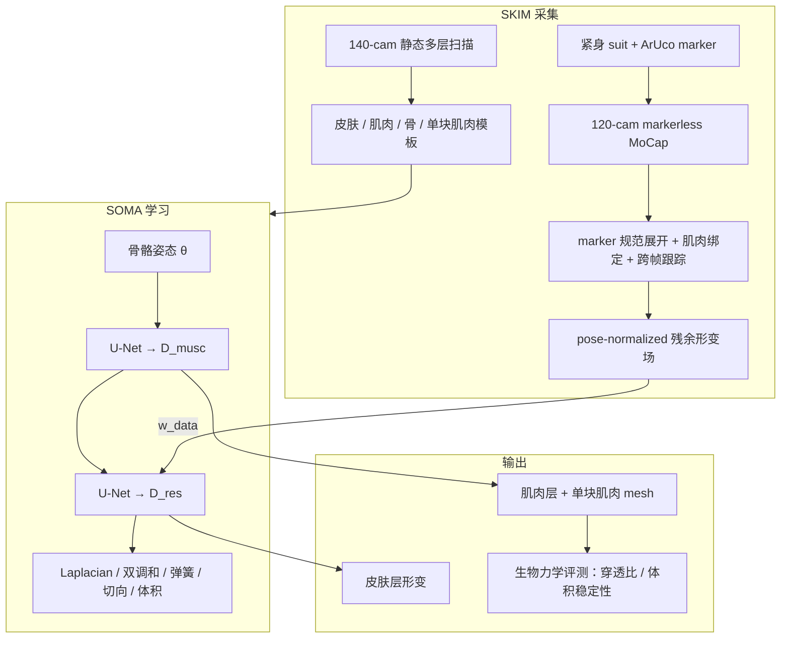
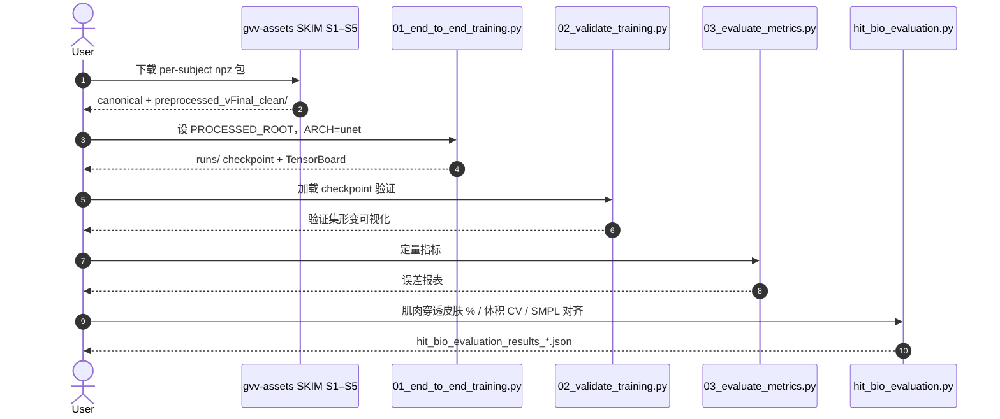

# SOMA：从体表观测到肌肉解剖

**SOMA**（*Surface Observations to Muscle Anatomy*，[arXiv:2606.09246](https://arxiv.org/abs/2606.09246)，[项目页](https://vcai.mpi-inf.mpg.de/projects/SOMA/)，ECCV 2026）由 **马克斯·普朗克信息学研究所（MPI-INF）** 与 **多特蒙德工业大学（TU Dortmund）** 提出：在参数化人体模型只覆盖皮肤表面的局限下，从 **可见体表信号** 反演 **person-specific 肌肉层时空形变**，并发布 **SKIM**（Skin-to-Internal Muscle）多层解剖数据集。方法用 **级联 U-Net** 预测肌肉位移与皮肤残余滑动，以生物力学启发的几何/体积正则替代传统 **FEM** 软组织仿真。

> **命名消歧：** 本页 SOMA 指 MPI-INF 肌肉解剖反演工作，**不是** NVIDIA [SOMA-X](./soma-x.md)（统一参数化人体拓扑）或 [SOMA Retargeter](./soma-retargeter.md)（BVH→人形重定向）。

## 一句话定义

**用 SKIM 提供的规范空间 marker 残余监督级联 U-Net，在多层皮肤–肌肉–骨模板上学 pose-dependent 形变，并以 Laplacian/双调和/体积保持等正则把肌肉鼓胀与皮肤滑动绑到可观测体表，从而无需 FEM 即得解剖可信的肌肉动画。**

## 英文缩写速查

| 缩写 | 英文全称 | 简要说明 |
|------|----------|----------|
| SOMA | Surface Observations to Muscle Anatomy | 本文方法与模型通称 |
| SKIM | Skin-to-Internal Muscle | 配套五被试多层解剖与 marker 残余数据集 |
| FEM | Finite Element Method | 传统软组织仿真；准确但计算昂贵 |
| LBS | Linear Blend Skinning | 骨骼驱动蒙皮；marker 与层间绑定基础 |
| U-Net | — | 级联非线性形变场预测骨干 |
| SMPL | Skinned Multi-Person Linear Model | 评测脚本含与 SMPL 体表对齐指标 |
| MoCap | Motion Capture | 120 相机棚拍提供骨骼姿态与多视角 RGB |

## 为什么重要

- **填补「只有皮肤」的参数化人体空白：** SMPL/SMPL-X 等模型服务动画与重定向，但肌肉/软组织对生物力学、医学与逼真形变仍关键；SOMA 把 **内层解剖** 拉回可学习、可渲染管线。
- **可扩展替代 FEM：** 传统有限元准确却难用于实时/大规模内容生产；学习型多层形变 + 体积/平滑先验提供 **成本更低** 的近似路径。
- **首个多视角 RGB 设定下的肌肉反演主张：** 论文强调从 **体表观测**（项目页与摘要面向 RGB 多视角；训练入口以 SKIM **marker 残余 + 姿态** 为主）恢复肌肉形变，对 performance capture 与数字人研究有新基准。
- **机器人语境（间接）：** 不输出关节指令，但为 **人体运动理解 / 生物力学可信形变 / 高保真数字人** 提供与 [MAMMA](./paper-mamma-markerless-motion-capture.md)、[UMA](./paper-uma.md) 互补的 **MPI 人体捕获谱系** 纵深；下游仍经 [Motion Retargeting Pipeline](../concepts/motion-retargeting-pipeline.md) 映射到机器人。

## 核心信息

| 项 | 内容 |
|----|------|
| **机构** | 马克斯·普朗克信息学研究所（Max Planck Institute for Informatics）；多特蒙德工业大学（TU Dortmund University） |
| **发表** | ECCV 2026 |
| **输入（训练/推理）** | 骨骼姿态 + 规范空间 **marker 残余**（来自 SKIM 或 suit 跟踪管线） |
| **输出** | 皮肤层、聚合肌肉层、**单块肌肉 mesh** 的时空形变与热图可视化 |
| **数据** | SKIM：5 被试，~45 min 多视角运动，多层解剖 GT + marker 轨迹 |
| **开源（截至 2026-09-09）** | **已开源**：[GitHub](https://github.com/edualvarado/SOMA)（MIT）全阶段源码 + 训练/评测；[数据集](https://gvv-assets.mpi-inf.mpg.de/soma) 独立下载 |

## 核心原理

### 1. 多层 corrective blendshape

| 层 | 作用 |
|----|------|
| 肌肉层 | U-Net 预测 \(D_{\mathrm{musc}}\)，驱动肌肉 **鼓胀** |
| 皮肤层 | 第二级 U-Net 预测 \(D_{\mathrm{res}}\)，允许皮肤 **滑动、压缩**，非刚性贴附肌肉 |
| 骨层 | 刚性骨架驱动；与肌肉/皮肤通过 LBS 与预计算绑定关联 |
| 单块肌肉 | 边界形变经 **重心绑定** 传播到高分辨率 per-muscle mesh |

### 2. 监督与正则

| 类型 | 内容 |
|------|------|
| **数据项** | SKIM 规范 marker 残余（经重心插值跟踪） |
| **平滑** | 面积归一 Laplacian（肌肉/皮肤） |
| **弯曲** | 双调和能量（抑制非物理褶皱） |
| **力学** | 边拉伸、切向滑动约束 |
| **体积** | 棱柱体 Gauss 积分 **体积保持**（近似软组织不可压） |

### 流程总览

## 源码运行时序图

官方仓可运行入口对齐 [`sources/repos/soma-surface-muscle.md`](../../sources/repos/soma-surface-muscle.md)。

关键复现路径：下载 SKIM → 配置 `PROCESSED_ROOT` → `05-Training/01_end_to_end_training.py` 训练 → 验证与 `hit_bio_evaluation.py` 生物力学评测。从原始 suit 视频重建数据需跑 `01`–`04` 阶段（`04-Blender` 依赖本机 Blender）。

## 工程实践

| 项 | 建议 / 仓库设定 |
|----|----------------|
| **环境** | Python 3.9+；`pip install -r requirements.txt` + 按 CUDA 装 PyTorch；Blender 阶段需 **Blender 内置 Python** |
| **数据** | [gvv-assets.mpi-inf.mpg.de/soma](https://gvv-assets.mpi-inf.mpg.de/soma)；每被试含 `canonical.npz`、packed `preprocessed_vFinal_clean/<shot>.npz` |
| **训练** | `05-Training/01_end_to_end_training.py`；`ARCH` ∈ {linear, mlp, unet}；`LAMBDAS` 调 data/smooth/biharmonic/spring/tangent/vol |
| **划分** | 90/10 train-val；首次运行生成 `S{N}_validation_filepaths.json` |
| **可视化** | `Residuals-Python/` Viser viewer；`05-Training/C_animation_meshes.py` 等 |
| **评测** | `hit_bio_evaluation.py`：肌肉–皮肤 intersection、体积 frame-to-frame 稳定性、`smpl_alignment.py` |
| **开源边界** | 源码与数据 **已发布**；checkpoint **不入 git**，需本地训练 |
| **机器人下游** | 输出解剖 mesh 动画，非 SMPL 关节轨迹；若接人形栈需另建骨骼/表面桥接 |

## 实验与评测（索引级）

- **定性：** 项目页展示单姿态下皮肤 / 肌肉层 / 单块肌肉 / 形变热图时间同步；多层 stack 纹理与热图并排。
- **定量（仓库）：** `03_evaluate_metrics.py` + `hit_bio_evaluation.py`（穿透比、体积 CV、SMPL 对齐）。
- **held-out：** 三支运动序列上预测 vs GT 多层形变（项目页 Results）。
- **局限：** 仅 **5 被试**；需定制 suit 与重型扫描/棚拍；当前公开训练以 **marker 残余** 为强监督，端到端 RGB 前馈若存在需对照 README 阶段边界。

## 结论

**SOMA 把「肌肉形变」从 FEM 仿真搬到了可学习的多层 corrective 场：真增益来自 SKIM 的多层 GT + marker 残余监督，以及体积/平滑先验对 ill-posed 逆问题的约束。**

1. **真影响机制：** 级联 U-Net 分离 **肌肉鼓胀** 与 **皮肤滑动**，比单层皮肤 blendshape 更贴近生物力学叙事。
2. **真影响资产：** SKIM 提供 **皮肤/肌肉/骨/单块肌肉** 与 45 分钟运动，填补多层软组织动态基准空白。
3. **真影响工程：** 六阶段开源管线（含 Blender 与纯 Python 残余分支）使 **数据构建→训练→生物力学评测** 可复现。
4. **次要代价：** 个体扫描 + suit 成本高；五人规模；与 SMPL 系 **并行存在** 而非替换。
5. **部署读法：** 面向 **医学/体育/娱乐** 解剖动画与软组织研究，**不是** 机器人关节策略或 NVIDIA SOMA 骨架统一。
6. **命名陷阱：** 检索「SOMA」务必区分 [SOMA-X](./soma-x.md) 与 [SOMA Retargeter](./soma-retargeter.md)。

## 与其他工作对比

| 对照 | 差异读法 |
|------|----------|
| [SOMA-X](./soma-x.md) | NVIDIA **参数化人体拓扑统一**；无肌肉层反演 |
| [SOMA Retargeter](./soma-retargeter.md) | BVH→人形 CSV；消费 somaskel77，与解剖反演无关 |
| [UMA](./paper-uma.md) | 同 MPI-INF VCAI 组；**着装外观 avatar + 6K 纹理**，不建模肌肉 |
| [MAMMA](./paper-mamma-markerless-motion-capture.md) | 多视角 **SMPL-X mocap**；输出关节化人体，无内层肌肉 |
| FEM / OpenSim 系 | 物理准确、难扩展；SOMA 用学习近似换速度 |
| SMPL / SMPL-X | 皮肤层参数化；SOMA 评测含对齐但目标为 **肌肉形变** |

## 局限与风险

- **采集门槛：** 120/140 相机与个体解剖扫描，非野外单目方案。
- **规模：** 5 被试；泛化到新体型需重新扫描/微调。
- **监督形态：** 训练强依赖 **marker 残余**；与摘要「RGB cameras」的长期产品形态需读代码阶段划分。
- **机器人：** 无直接重定向接口；肌肉 mesh 进仿真仍须网格–刚体/关节映射。
- **误区：** 把本 SOMA 当成 NVIDIA 重定向 SOMA 会导致仓库与骨架全错。

## 关联页面

- [UMA](./paper-uma.md) — 同组超精细可驱动人体 avatar
- [MAMMA](./paper-mamma-markerless-motion-capture.md) — MPI 多视角 SMPL-X mocap 对照
- [Face Anything](./paper-face-anything-4d-face-reconstruction.md) — 同 VCAI 人体/面部捕获谱系
- [SOMA-X](./soma-x.md) — 同名不同工作（拓扑统一）
- [SOMA Retargeter](./soma-retargeter.md) — 同名不同工作（人形重定向）
- [SMPL-X](../concepts/smpl-x.md) — 参数化人体与评测对齐参照
- [Motion Retargeting Pipeline](../concepts/motion-retargeting-pipeline.md) — 人体运动→机器人参考链
- [Human Motion 论文索引](../overview/paper-notebook-category-14-human-motion.md)

## 参考来源

- [SOMA 论文摘录（arXiv:2606.09246）](../../sources/papers/soma_arxiv_2606_09246.md)
- [SOMA 项目页归档](../../sources/sites/vcai-mpi-inf-soma.md)
- [edualvarado/SOMA 代码归档](../../sources/repos/soma-surface-muscle.md)

## 推荐继续阅读

- 项目页与视频：<https://vcai.mpi-inf.mpg.de/projects/SOMA/>
- [GitHub `edualvarado/SOMA`](https://github.com/edualvarado/SOMA) — 安装、SKIM 布局与训练脚本
- [arXiv:2606.09246](https://arxiv.org/abs/2606.09246) — 完整方法与消融
- [SKIM 数据页](https://gvv-assets.mpi-inf.mpg.de/soma) — 注册与下载
- [UMA 项目页](https://vcai.mpi-inf.mpg.de/projects/UMA/) — 同组外观级数字人对照
