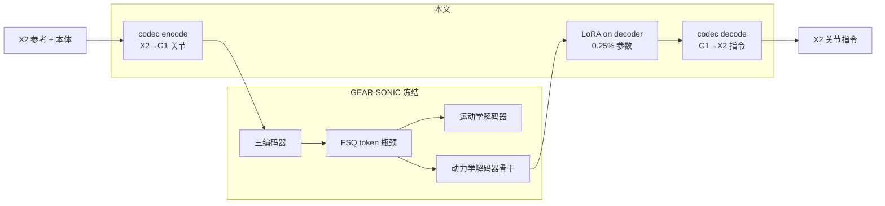
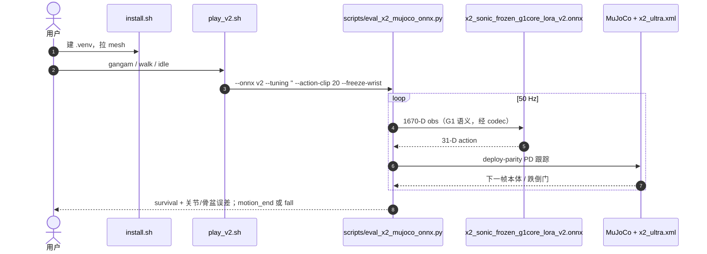

# SONIC-Transfer：冻结全身控制器的解析 codec + LoRA 跨具身迁移

**SONIC-Transfer**（*Cross-Embodiment Transfer of a Frozen Humanoid Whole-Body Controller via Analytic Codec and LoRA Adapters*，[项目页](https://sonic-agibot-x2.github.io/sonic-transfer/)，[draft PDF](https://sonic-agibot-x2.github.io/sonic-transfer/static/pdfs/paper.pdf)；Sitarama Chekuri · Claude Fable 5 / Anthropic AI co-author；**draft v0.1，2026-08-16**）把公开发布的 [GEAR-SONIC](../methods/sonic-motion-tracking.md)（Unitree G1）当作 **不可改的平台**：闭式关节 codec 包住 G1 接口，只在动力学解码器上插 [LoRA](../concepts/lora.md)，把全身跟踪迁到 **AgiBot X2 Ultra**。

> **落地状态：** 入库时 **无 arXiv**。推理 **已开源可跑**（[`meetsitaram/sonic-x2`](https://github.com/meetsitaram/sonic-x2) 的 `./play_v2.sh` + HF 权重）；**无 SPDX LICENSE**；**LoRA 训练不在 play 仓**。选中 checkpoint 的真机验证文中写 ongoing。

## 一句话定义

**近亲骨架上，冻结的公开 WBT 先验 + 一张 affine 表 + 0.25% 解码器 LoRA，可以在约 2% 平台 cited 算力下，于 OOD 内容上打过为目标机从头训的 tracker。**

## 英文缩写速查

| 缩写 | 英文全称 | 简要说明 |
|------|----------|----------|
| WBT | Whole-Body Tracking | 全身参考运动跟踪控制 |
| FSQ | Finite Scalar Quantization | SONIC 把多编码器压到共享 motion token 的瓶颈 |
| LoRA | Low-Rank Adaptation | 只训动力学解码器线性层的低秩旁路 |
| PHUMA | Physically Reliable HUMAnoid locomotion dataset | 本文 OOD 切片（1,931 clips），任何模型都未见过训练 |
| G1 | Unitree G1 | 源平台 29-DoF 身体 |
| X2 | AgiBot X2 Ultra | 目标机 31-DoF（含灵巧手通道；演示冻腕） |
| PPO | Proximal Policy Optimization | 适配阶段沿用平台 on-policy 跟踪目标 |
| ONNX | Open Neural Network Exchange | play 仓导出的部署格式 |

## 为什么重要

- **把「专家搬家」推到更严的冻结合同：** [Any2Any](./paper-any2any-cross-embodiment-wbt.md) 已证明 Gear-SONIC 能以 ~1% 算力迁到形态差更大的 LimX 机，主张是 **parity**。本文在 **关节一一对应** 的近亲对上，把对齐改成闭式表、把可训范围缩到 **一个 decoder**，并报告 **OOD reversal**（69.0 vs 59.0）。
- **in-dist 会骗你：** novel500 上两模型 ~96%/33 mm 不可分；差距只在 tail 与 PHUMA。选型时不要只用「标准 held-out」。
- **冻结让边界可测：** embodiment floor（所有 X2 谱系 OOD 均值误差卡在 41–43 mm）和腕关节信息瓶颈（扰动穿透 11% vs 肘 73%）都依赖「上游完全不能动」。
- **工程当天能看：** 官方 play 默认就是 transfer ONNX，不是「视频将至」。

## 核心信息

| 项 | 内容 |
|----|------|
| **机构** | Anthropic（AI 共著标注）；目标硬件智元 AgiBot X2 Ultra；源平台 NVIDIA GEAR-SONIC |
| **预印本** | draft v0.1（2026-08-16）；截至 2026-08-17 **无 arXiv** |
| **源 / 目标** | G1 29-DoF → X2 Ultra（树与关节命名对齐；踝/腰每公斤力矩约半） |
| **可训参数** | 动力学解码器 LoRA ≈ 平台 **0.25%**（~26M 策略参数中的一角） |
| **算力** | 选中谱系 ~**135 GPU-h**（8 卡一夜）；分母取 ~9k GPU-h → 约 **2%**；相对 incumbent ~1,600 GPU-h 约 **1/8** |
| **开源** | **部分开源**：MuJoCo 推理 + v2 ONNX + codec sidecar **可运行**；训练脚本不在 play 仓；无 LICENSE |

## 核心原理

### 方法栈

| 模块 | 机制 |
|------|------|
| 冻结平台 | 三编码器 + FSQ token + 运动学解码器 **bit-identical**；动力学解码器骨干冻结 |
| Analytic codec | 成对重定向拟合的 per-joint affine；腕轴命名交换、步长/高度尺度；sidecar 表，非网络 |
| Decoder LoRA | 只插动力学解码器线性层；零初始化，优化从平台行为出发 |
| 训练 | Isaac Lab on-policy；目标机重定向语料经 codec 喂入；breadth → polish |
| 双裁判 | IsaacLab 严格跟踪门 + MuJoCo survival；OOD 两闸下降即停 |

### 流程总览

与 [Any2Any](./paper-any2any-cross-embodiment-wbt.md) 同是「对齐 + LoRA」，但本文对齐 **无可学参数**，LoRA **只进一个 decoder**。companion [冻结规划器页](https://sonic-agibot-x2.github.io/kplanner/) 把残差头放在输出侧——规划器有下游 tracker 当安全网；闭环 WBC 没有，校正必须进 decoder 隐状态。

### 源码运行时序图

官方可运行入口是 [`meetsitaram/sonic-x2`](https://github.com/meetsitaram/sonic-x2) 的 **MuJoCo ONNX 回放**（归档见 [`sources/repos/sonic-x2.md`](../../sources/repos/sonic-x2.md)）。**不适用训练复现**（LoRA / Isaac Lab 脚本不在该仓）。

v2 **不要**套 incumbent 的 `bigrun.yaml` deviation clamp。完整真机栈在 sibling `GR00T-WholeBodyControl-X2-review`，本页不把它当成已核可运行训练入口。

## 工程实践

| 步骤 | 要点 |
|------|------|
| 1. 确认骨架匹配 | 配方前置是 **关节一一对应**；形态差大应回 [Any2Any](./paper-any2any-cross-embodiment-wbt.md) 可学习对齐 |
| 2. 先测 codec-only | 零样本能走但 200-clip 生存约 75% vs incumbent 98% → 几何过了、动力学没过 |
| 3. 只训 decoder LoRA | 零初始化；breadth 至 in-dist 平台，再 polish 小份额演示库 |
| 4. 用 OOD 做停止信号 | in-dist 会平台；OOD 过峰后继续训会专精吃泛化 |
| 5. 双仿真裁判 | 部署候选需 IsaacLab 严格门 **和** MuJoCo survival 都过 |
| 6. 腕关节 | 冻结平台看不见腕 pose；部署钉死默认姿态，不要指望辅助奖励救回 |
| 7. 本地看动作 | `./install.sh && ./play_v2.sh gangam` |

## 实验与评测

IsaacLab 严格门，同一机器；单元格为成功% / 幸存者 mean mm / p95 mm；PHUMA survival 为 MuJoCo 第二裁判。

| model | novel500（in-dist） | hard300v3（tail） | PHUMA（OOD） | PHUMA survival |
|-------|---------------------|-------------------|--------------|----------------|
| incumbent（原生 X2） | 96.4 / 33.6 / 43.8 | 70.0 / 40.6 / 56.0 | 59.0 / 42.6 / 67.4 | 87.4 |
| transfer（breadth） | 95.6 / 33.7 / 42.9 | 71.0 / 40.0 / 56.4 | 61.6 / 42.9 / 60.9 | 89.4 |
| transfer（selected） | 96.2 / 33.1 / 42.9 | 72.3 / 39.9 / 55.8 | **69.0** / 41.7 / 60.6 | **90.7** |

校准：发布 GEAR-SONIC 在作者 held-out 为 98.7%/23.2 mm，在本文 novel500 为 98.2%/25.7 mm。作者 PHUMA 97.0% **未能在本文协议下复现**（本文同模型 82.8%）；故表内 PHUMA **只做内部对比**。

G1 本体对照（去 codec）：演示库从 93.6% 饱和恢复；novel500 **98.6%/23.0 mm vs 发布 98.2%/25.7 mm**。

## 结论

**近亲骨架上，真正值钱的是冻结先验的 OOD 泛化；闭式 codec 只过几何，0.25% 解码器 LoRA 过动力学——in-dist 榜看不出这场胜负。**

1. **先问骨架有多像** — 关节一一对应才能把对齐做成 sidecar 表；差一档形态回到 Any2Any 可学习 \(\Phi_r\)。
2. **OOD 才是选 checkpoint 的闸** — novel500 上 incumbent 与 transfer 不可分；PHUMA 十个点、breadth 阶段已经领先。
3. **过训有形** — polish 峰值后 OOD 69.0→64.4，幸存者误差反而更好；两闸下降就停。
4. **地板买不回来** — 所有 X2 谱系 OOD 均值误差 41–43 mm vs G1 上 32 mm；训练改覆盖不改地板。
5. **看不见的关节救不回** — 腕扰动只穿透 11%；辅助奖励失败。部署冻腕。
6. **同配方可给源机做可逆专精** — 适配器是文件，删掉即回到发布权重。
7. **今天能跑的是回放** — `play_v2.sh`；不要默认训练已随仓。

## 局限与风险

- **一对近亲机器人**；跨厂商、闭链/髋轴差的对未测。
- **draft + AI 共著**；无 arXiv；数字以项目页 PDF 为准。
- 真机验证 **ongoing**；硬件证据目前是双仿真裁判。
- play 仓无 LICENSE；训练不可从该仓复现。
- 勿把 codec-only 零样本当成方法贡献——作者自己标成相似前置测量。
- 勿把 incumbent 调参套到 v2。

## 与其他工作对比

| 维度 | SONIC-Transfer | Any2Any | 单具身重训 incumbent |
|------|----------------|---------|----------------------|
| 源资产 | 冻结公开 GEAR-SONIC | 冻结 SONIC 或自研 Oli-WBT | 不复用策略权重 |
| 运动学 | 闭式 affine 表 | 可学习两级 \(\Phi_r\) | 重定向后从头训 |
| 可训范围 | **一个** dynamics decoder LoRA | 按机对选 actor/critic 等 | 全策略 |
| 主张 | 近亲对 OOD **反超** | 跨形态 **parity ~1% 算力** | 单机最稳、最烧卡 |
| 真机 | 文中 ongoing；play 为 MuJoCo | 多组 LimX/Unitree 真机 | 本页 incumbent 已上 X2 |

规划器 companion 是 **输出侧残差头、零梯度改权重**；与本页「进 decoder 的闭环 LoRA」不要混成同一条配方。

## 关联页面

- [SONIC](../methods/sonic-motion-tracking.md) — 被冻结的源平台
- [Any2Any](./paper-any2any-cross-embodiment-wbt.md) — 同骨干、更宽形态差的后训练对照
- [跨具身策略迁移选型](../queries/cross-embodiment-transfer-strategy.md) — 本页是 Any2Any 路径在近亲骨架上的变体
- [Whole-Body Tracking Pipeline](../concepts/whole-body-tracking-pipeline.md) — 阶段 5
- [LoRA](../concepts/lora.md)、[GR00T-WholeBodyControl](./gr00t-wholebodycontrol.md)、[Unitree G1](./unitree-g1.md)
- [PHUMA](./dataset-bfm-phuma.md) — OOD 切片来源
- [人形运动跟踪方法选型](../queries/humanoid-motion-tracking-method-selection.md)

## 参考来源

- [论文摘录](../../sources/papers/sonic_transfer_frozen_wbc_codec_lora.md)
- [项目页归档](../../sources/sites/sonic-transfer-github-io.md)
- [sonic-x2 仓归档](../../sources/repos/sonic-x2.md)

## 推荐继续阅读

- [项目页](https://sonic-agibot-x2.github.io/sonic-transfer/) — 三列视频与主表
- [draft PDF](https://sonic-agibot-x2.github.io/sonic-transfer/static/pdfs/paper.pdf)
- [`meetsitaram/sonic-x2`](https://github.com/meetsitaram/sonic-x2) — `./play_v2.sh`
- [Any2Any arXiv:2605.23733](https://arxiv.org/abs/2605.23733) — 跨形态差更大的对照
- [GEAR-SONIC](https://nvlabs.github.io/GEAR-SONIC/) — 源平台
- [冻结规划器 companion](https://sonic-agibot-x2.github.io/kplanner/) — 同站、输出侧配方，本条未升格
