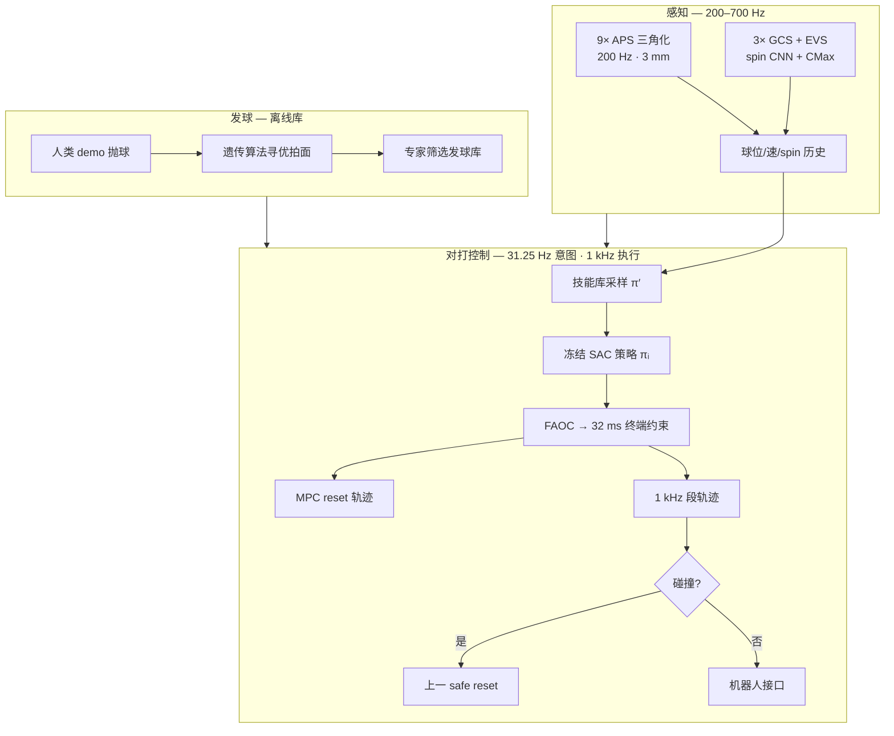
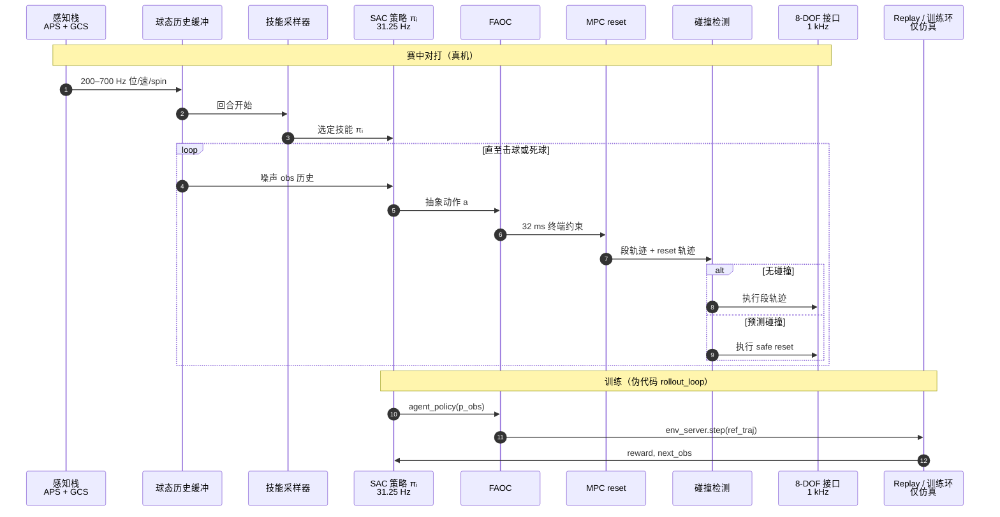

# Sony AI Ace：自主竞技乒乓球机器人

**Ace**（[Nature 2026](https://doi.org/10.1038/s41586-026-10338-5)，Sony AI / Sony Research；[项目页](https://sonyresearch.github.io/ace_public/)，[GitHub](https://github.com/SonyResearch/ace_public)）是首个在 **未改 ITTF 规则、奥运尺寸场地** 下与 **精英/职业** 人类选手对打并取得 **多场正式胜利** 的自主乒乓球系统。核心贡献是 **高 spin 感知**（APS 三角化 + 三 GCS 事件相机）与 **仿真训、真机零样本** 的 **非对称 SAC 技能库**，经 **FAOC + MPC reset + 碰撞回退** 映射为 1 kHz 无碰撞轨迹。

## 一句话定义

**用事件相机测 spin、用非对称 SAC 学多技能回球、用凸优化把抽象动作变成安全轨迹，在真机乒乓球里首次稳定战胜精英人类选手。**

## 英文缩写速查

| 缩写 | 英文全称 | 简要说明 |
|------|----------|----------|
| Ace | Autonomous Competitive Expert（项目名） | Sony AI 自主竞技乒乓球系统 |
| SAC | Soft Actor-Critic | 对打策略的 off-policy RL 算法 |
| FAOC | Fixed Action Output Controller | 将策略动作映射为 32 ms 终端约束的控制器 |
| GCS | Gaze Control System | 振镜 + 电调远摄 + EVS 的球 spin 跟踪子系统 |
| EVS | Event-based Vision Sensor | 事件相机；低延迟捕捉高速旋转 logo |
| APS | Active Pixel Sensor | 常规 CMOS；9 路 200 Hz 球位置三角化 |
| ITTF | International Table Tennis Federation | 国际乒联；Ace 遵循其竞赛规则 |
| MPC | Model Predictive Control | 计算 reset 轨迹的近时最优运动规划 |
| RL | Reinforcement Learning | 策略在仿真中单拍任务上训练 |

## 为什么重要

- **物理 AI 新标杆：** 在 **<0.5 s 拍间**、**>20 m/s 球速**、**~1000 rad/s spin** 的对抗场景下，AI 首次在 **正式规则** 下击败多名 **十年以上训练** 的精英选手（3/5 场）。
- **Spin 被正视：** 相对大量忽略 spin 的既往乒乓球机器人，Ace **测量**（GCS + CNN/CMax）并在仿真 **建模** Magnus / 球–桌 / 球–拍接触，对 ≤450 rad/s 来球回球率 **>75%**。
- **非对称 actor–critic 真机迁移：** critic 吃仿真 **真值球态**，actor 仅见 **噪声传感历史** — 与 privileged training / sim2real 主线直接相关。
- **抽象动作 + 安全层：** 策略不在关节空间裸输出，而经 **FAOC → 32 ms waypoint → MPC reset**；预测碰撞则执行 ** guaranteed-safe** 上一 reset — 可借鉴到其他高速 manipulator。
- **对本库读者：** 与 [PhysicsPingPong 分层仿真](./../methods/table-tennis-strategy-skill-learning.md)、[人形乒乓球占位页](./paper-notebook-towards-versatile-humanoid-table-tennis.md) 形成 **仿真动画 / 人形 RL / 真机竞技** 三角对照。

## 核心信息

| 项 | 内容 |
|----|------|
| **机构** | 索尼（Sony）— Sony AI（Zürich / Tokyo / New York）等 |
| **发表** | Nature **652**(8111), 886–891（2026-04-23）；DOI [10.1038/s41586-026-10338-5](https://doi.org/10.1038/s41586-026-10338-5) |
| **评测** | 2025-04；5 elite BO3 + 2 pro（T.League）BO5；JTTA 持证裁判；7 m×7 m×5 m 人类侧 |
| **硬件** | 定制 **8-DOF**（2 prismatic + 6 revolute）；Scalmalloy 连杆；Butterfly 胶皮 + 发球杯 |
| **开源** | **部分** — match CSV + 近似伪代码 + 视频；权重/感知部署/硬件 **未发布**（见 [ace-public.md](../../sources/repos/ace-public.md)） |

## 流程总览

## 核心机制（归纳）

### 感知

- **位置：** 9 相机 CMA-ES 优化布局；FPGA 2D 球分割 → 中心服务器三角化；**200 Hz**，平均误差 **3.0 mm**，延迟 **10.2 ms**。
- **Spin：** 每 GCS = EVS + 电调远摄 + 双轴振镜跟踪；**CNN**（15 ms 事件面，异方差不确定度）与 **CMax**（高准确、高延迟）异步融合；三 GCS 按不确定度合并；平均 spin 误差 **24.8 rad/s**。
- **坐标：** 桌心原点；x 朝人类侧；z 向上（与 [`match_data.csv`](https://github.com/SonyResearch/ace_public/blob/main/data/match_data.csv) 一致）。

### 对打控制

- **训练：** 仿真 **单拍** SAC；critic 见真值球态，actor 见 **N 步噪声测量**；奖励塑造 **desired landing skill**（落点/旋转类型）；多策略异步并行采样。
- **部署：** 31.25 Hz 查询当前技能策略；动作经 **FAOC** 映射为 **32 ms 后** 关节位/速终端约束；**MPC** 生成到 reset posture 的轨迹；接口 **1 kHz** 执行；碰撞预测则 **不执行** 新段而回退 safe reset。
- **技能库：** 训练多种 desired post-bounce 球态（如高上旋）；赛中 **policy sampler** 切换 — 论文强调 Ace 制胜球 spin 类型 **多样**，非单纯提速。

### 发球

- **抛球：** 人类 demo 轨迹，满足 ITTF（垂直抛、≥16 cm）。
- **击球：** 仿真 **遗传算法**（pygad）优化拍面 pose/速度；真机专家评估入库。
- **选用：** 与近期发球 **相异度** 或估计 **制胜概率**。

### 仿真物理

- 飞行：drag + **Magnus**（$c_M$ 随 $\|v\|, r\|\omega\|$ 变）+ 重力。
- 球–桌 / 球–拍：**滑动/滚动** 接触模型；参数由实验标定。

## 源码运行时序图

官方 GitHub 提供 **近似伪代码**（[`pseudo_code/`](https://sonyresearch.github.io/ace_public/pseudo_code/)），**非**可运行完整栈；下图对齐 **训练期 rollout worker** 与 **赛中对打环** 的模块边界：

- **最短「读代码」路径：** clone [`SonyResearch/ace_public`](https://github.com/SonyResearch/ace_public) → 读 `pseudo_code/` 中 `train_loop`、`rollout_loop`、`step_sac` → 对照 [`match_data.csv`](https://github.com/SonyResearch/ace_public/blob/main/data/match_data.csv) 分析 post-event 球态。
- **不可运行：** 无 `env_server`、权重、感知 TensorRT 与硬件接口实现。

## 实验与评测

| 指标 | Ace | 备注 |
|------|-----|------|
| vs **精英**（5 人） | **3/5 场胜**，7/13 局 | BO3；首次对 robot |
| vs **职业**（T.League×2） | 0/2 场，1/7 局 | BO5 |
| 回球（速度） | ≤14 m/s 与人类相当或更好；>16 m/s 下降 | Fig. 3c |
| 回球（spin） | >75% @ ≤450 rad/s | 远超既往 robot 文献 |
| 产出上限 | 16.4 m/s · 600 rad/s | 可回对手至 19.6 m/s · 867 rad/s |
| 发球 ace | 16 vs 人类 8（elite 合计） | 15 种 serve 类型 |
| 平均回合 | 5.0±3.0 拍 | 人类典型 3.9±2.0 |
| 触网反应 | ~49 ms 后轨迹分叉并成功回球 | Fig. 4 |

- **得分结构：** 人类 Won 球线/角速度 **高于** Returned；Ace 两分布 **相近** → **稳定回球 + spin 多样性** 而非 brute-force 提速（Welch *P*：robot 0.88 vs human <0.001）。

## 工程实践

| 项 | 建议 |
|----|------|
| **开源读法** | **部分开源** — 用 CSV 做 spin/速度统计与战术分析；用伪代码理解 **非对称 SAC + FAOC** 数据流，勿误以为可复现 Nature 对打 |
| **sim2real 借鉴** | 非对称 critic、单拍仿真、噪声历史 obs、抽象动作 + 凸安全层 — 可对照 [privileged training](../concepts/privileged-training.md) |
| **感知借鉴** | GCS 多视角 + CNN/CMax 双路径 — 高速 spin 测量与 EVS 跟踪的参考轴 |
| **乒乓球选型** | 仿真分层技能 → [Table Tennis Strategy & Skill Learning](../methods/table-tennis-strategy-skill-learning.md)；人形 RL → [Towards Versatile Humanoid Table Tennis](./paper-notebook-towards-versatile-humanoid-table-tennis.md)；**真机竞技** → 本页 |
| **硬件边界** | 8-DOF 非人形；与 loco-manip / 全身 WBC 论文 **正交** |

## 局限与风险

- **部分开源：** 无权重、无感知部署、无机器人接口与 **8-DOF 硬件** — 无法仅凭 GitHub 复现系统（[`ace-public.md`](../../sources/repos/ace-public.md)）。
- **对手建模：** 训练目标为 **单拍 skill**，非直接优化「赢局」；职业球员仍明显更强 — 战术/对手建模仍是缺口（论文 Discussion）。
- **场地与安全：** 人类仅允许半台活动；非通用「任意房间乒乓球」。
- **许可：** Nature **CC BY-NC-ND**；数据集/伪代码以 GitHub 仓库声明为准。

## 与其他工作对比

| 对照 | 差异读法 |
|------|----------|
| [PhysicsPingPong](../methods/table-tennis-strategy-skill-learning.md) | **仿真角色动画** + 分层 ASE/CVAE；无 spin 真机、无 ITTF 正式对局 |
| [Towards Versatile Humanoid Table Tennis](./paper-notebook-towards-versatile-humanoid-table-tennis.md) | 人形 **统一 RL** 占位；Ace 为 **固定 8-DOF + 竞技评测** |
| [PACE（161-119）](./paper-loco-manip-161-119-n119.md) | 人形端到端 RL + 物理增强；不同平台与任务设定 |
| 既往 competitive ping-pong robot 文献 | 常改规则/缩小场地/忽略 spin；Ace **全规则 + spin + elite 胜场** |

## 结论

**Ace 证明：在乒乓球这类毫秒级对抗物理任务里，「测 spin + 仿真非对称 SAC 技能库 + 凸优化安全轨迹」可以零样本打到 elite 人类胜率 — 但职业层级与完整开源复现仍是硬边界。**

1. **真影响：竞技结果** — ITTF 规则下 **3/5 胜 elite**，不是 demo 回球率。
2. **真影响：spin 闭环** — 感知（GCS）+ 仿真物理 + 回球统计 **一致强调 spin**。
3. **真影响：控制栈结构** — 抽象 RL 动作 → **FAOC/MPC/碰撞回退**，分离「学什么」与「怎么安全执行」。
4. **次要代价：平台专用** — 定制 8-DOF + 场外多相机，非即插即用 manipulator API。
5. **开源读法：部分** — CSV + 伪代码 **够分析、不够复现**；权重与硬件未发布。
6. **部署读法：** 制造/服务机器人可借鉴 **事件视觉 + 高速 safe motion generation**；与 loco-manip 人形栈 **互补而非替代**。

## 关联页面

- [Table Tennis Strategy & Skill Learning](../methods/table-tennis-strategy-skill-learning.md) — 仿真分层乒乓球
- [Reinforcement Learning](../methods/reinforcement-learning.md) — SAC 与非对称 critic 背景
- [Sim2Real](../concepts/sim2real.md) — 噪声 obs 历史迁移
- [Privileged Training](../concepts/privileged-training.md) — critic 真值 / actor 传感
- [Towards Versatile Humanoid Table Tennis](./paper-notebook-towards-versatile-humanoid-table-tennis.md) — 人形 RL 占位
- [SMPLOlympics](./smplolympics.md) — 仿真乒乓球 benchmark 环境

## 参考来源

- [sony_ace_nature_2026.md](../../sources/papers/sony_ace_nature_2026.md) — Nature 论文策展摘录
- [ace-sony-research-github-io.md](../../sources/sites/ace-sony-research-github-io.md) — 项目 / 补充材料页
- [ace-public.md](../../sources/repos/ace-public.md) — GitHub 开源核查
- 论文：<https://doi.org/10.1038/s41586-026-10338-5>

## 推荐继续阅读

- [Ace 补充材料站](https://sonyresearch.github.io/ace_public/)
- [Sony AI 官方新闻](https://ai.sony/news/sony-ai-announces-breakthrough-research-in-real-world-artificial-intelligence-and-robotics)
- [GitHub: SonyResearch/ace_public](https://github.com/SonyResearch/ace_public)
- [PMC 全文](https://pmc.ncbi.nlm.nih.gov/articles/PMC13102714/)
