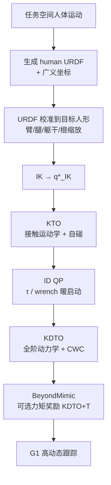

# SPARK（Skeleton-Parameter Aligned Retargeting）

**SPARK**（*Skeleton-Parameter Aligned Retargeting on Humanoid Robots with Kinodynamic Trajectory Optimization*，[arXiv:2603.11480](https://arxiv.org/abs/2603.11480)，[项目页](https://www.leggedai.com/publication/2026_spark/)）由 **威斯康星大学麦迪逊分校（UW–Madison）**、**加州大学伯克利分校（UC Berkeley）** 与 **上海创智学院（Shanghai Innovation Institute）** 提出：先把任务空间人体运动建成可校准的 **human URDF**，对齐目标人形尺寸后再 IK，再经 **KTO → 逆动力学 → KDTO** 渐进轨迹优化，得到动力学一致状态与 **关节力矩参考**，供 [BeyondMimic](../methods/beyondmimic.md) / IsaacLab 跟踪高动态动作（含 side flip）。

> **同名消歧：** 本页是 **骨架参数对齐重定向** 论文。Paper Notebooks 中的 [SPARK 工具箱占位](./paper-notebook-spark.md)（*Safe Humanoid Autonomy and Teleoperation*）是另一条目，勿混链。

## 一句话定义

**用可解释的 human URDF 骨架校准降低跨机型 IK 误差，再用渐进 kinodynamic TO 恢复动力学可行性与力矩监督，服务高动态跟踪。**

## 英文缩写速查

| 缩写 | 英文全称 | 简要说明 |
|------|----------|----------|
| SPARK | Skeleton-Parameter Aligned Retargeting | 本文两阶段重定向框架 |
| URDF | Unified Robot Description Format | 人体侧可校准骨架表示 |
| KTO | Kinematic Trajectory Optimization | 接触运动学与自碰精炼 |
| ID | Inverse Dynamics | 为力矩/接触提供暖启动 |
| KDTO | Kinodynamic Trajectory Optimization | 联合运动学+全阶动力学 |
| Empbpe | Mean Per-Body Position Error | IK / RL 跟踪主指标 |
| CWC | Contact Wrench Cone | stance 脚接触可行锥 |

## 为什么重要

- **改骨架而不是狂调 IK 权重：** 相对 [GMR](../methods/motion-retargeting-gmr.md) 的 root–keyframe 缩放，结构对齐后多机型 Empbpe 下降约 **65–83%**（Table I）。
- **高动态需要动力学层：** side flip 倒立段上，仅 KTO 会长时间 plateau；KDTO 与 **KDTO+T**（力矩奖励）明显加速收敛。
- **运动编辑友好：** 跳高、首尾接站立等编辑引入的间断/重力不一致，可用 TO 修补后再训。
- **与 KDMR 互补：** [KDMR](./paper-kdmr.md) 吃 **GRF**；SPARK 吃 **任务空间人体 + 接触标签**，强调跨形态校准与力矩参考。

## 核心信息

| 项 | 内容 |
|----|------|
| **机构** | 威斯康星大学麦迪逊分校（University of Wisconsin–Madison）；加州大学伯克利分校（UC Berkeley）；上海创智学院（Shanghai Innovation Institute） |
| **平台评测** | IK：G1 / H1 / Booster T1 / EngineAI PM01 / Kuavo 4Pro；RL：Unitree G1 |
| **下游** | BeyondMimic + IsaacLab |
| **开源** | **未开源** — 截至 2026-08-08 [项目页](https://www.leggedai.com/publication/2026_spark/) 仅 PDF/Cite/Video，**无**官方代码仓 |

## 流程总览

## 源码运行时序图

**不适用（项目页未列可运行官方代码）。** 截至 2026-08-08：Legged AI 项目页无 GitHub/HF 实现链接。若后续开源，应补：URDF 校准 → KTO/ID/KDTO → BeyondMimic 训练的 `sequenceDiagram`。

## 工程实践

| 项 | 建议 / 论文设定 |
|----|----------------|
| 何时用 | 多机型共享人体库、要减少 per-motion IK 调参；或编辑/高动态参考需动力学修补 |
| 校准复用 | **机器人 + 人体格式固定后**，同一 URDF 校准可复用 |
| 腕朝向 | 机器人腕 DoF < 3 时放弃腕朝向跟踪，避免过约束 |
| 渐进 TO | 勿直接甩全阶 KDTO；按 KTO→ID→KDTO warm-start |
| 高动态 | 优先开 **KDTO**；需要更快收敛时加 \(\tau\) 跟踪奖励（KDTO+T） |
| 对照 | 同数据 [GMR](../methods/motion-retargeting-gmr.md)；有 GRF 的实验室管线另评 [KDMR](./paper-kdmr.md) |
| 复现 | **等开源**；现阶段用项目页视频与 Table I 做选型 |

## 实验与评测

- **IK（AMASS ACCAD）：** URDF 校准相对 GMR：G1 **9.37→1.60 cm**（−82.9%），H1 −64.9%，T1 −71.9%，PM01 −74.0%，Kuavo 4Pro −75.8%。
- **跳高编辑：** 脚 z×4 且按 CoM 高变化插值时间；KDTO 最终 Empbpe 显著优于 raw / KTO。
- **接站立段：** 速度间断为主；KTO 已够用，与 KDTO 接近。
- **Side flip（Fig. 8）：** KTO 在倒立段约 500 iter plateau；KDTO 缩短；KDTO+T 更快——把「学跟踪」与「补动力学」解耦。

## 结论

**先对齐骨架参数，再渐进强制动力学：前者降跨机型 IK 误差，后者决定高动态与编辑动作是否可学。**

1. **真影响：URDF 结构校准** — 比任务空间启发式缩放更稳，多机型 Empbpe 大幅下降。
2. **真影响：KDTO（及力矩监督）** — side flip 等动作上样本效率明显好于纯运动学 TO。
3. **真影响：无 per-motion 狂调 IK** — 固定机型与人体格式后校准复用。
4. **次要代价：TO 栈复杂** — 三阶段求解与接触标签质量仍依赖工程实现。
5. **部署读法：** 适合「人体库 → 多人形」数据工厂；要测力日程时看 KDMR。
6. **工程读法：代码未开放** — 选型先对照已开源的 GMR / DSMS / SBTO。

## 与其他工作对比

| 对照 | 差异读法 |
|------|----------|
| [GMR](../methods/motion-retargeting-gmr.md) | 局部任务空间修正；SPARK 改底层链路长度再 IK |
| [KDMR](./paper-kdmr.md) | GRF 多接触 NLP；SPARK 不依赖测力，强调校准 + 渐进 TO |
| [PHC](./phc.md) | SMPL shape 拟合；SPARK 主张 URDF 校准更可解释、少出分布扭曲 |
| [DynaRetarget](../methods/dynaretarget-sbto-motion-retargeting.md) / [DSMS](./paper-shooting-for-contact.md) | 同属动力学精炼；求解范式分别为采样 SBTO / 接触隐式打靶 |
| [BeyondMimic](../methods/beyondmimic.md) | 下游跟踪；SPARK 可额外提供 \(\tau\) 监督 |

## 局限与风险

- **接触标签仍需来自人体运动：** 日程错误会传给 KTO/KDTO。
- **未开源：** 无法复现 Table I / side flip 训练曲线的实现细节。
- **同名冲突：** 勿与 [安全自主 SPARK 工具箱占位](./paper-notebook-spark.md) 混用。
- **高动态成功依赖动力学层：** 只做 URDF+IK 不够支撑 side flip 级参考。

## 关联页面

- [KDMR](./paper-kdmr.md) — GRF 锚定多接触 TO（文内互引）
- [GMR](../methods/motion-retargeting-gmr.md) / [BeyondMimic](../methods/beyondmimic.md)
- [DynaRetarget / SBTO](../methods/dynaretarget-sbto-motion-retargeting.md) / [Shooting for Contact](./paper-shooting-for-contact.md)
- [Motion Retargeting](../concepts/motion-retargeting.md) / [Pipeline](../concepts/motion-retargeting-pipeline.md) / [知识链汇总](../overview/hub-motion-retargeting.md)
- [SPARK 工具箱占位（同名消歧）](./paper-notebook-spark.md)

## 参考来源

- [spark_skeleton_aligned_retargeting_arxiv_2603_11480.md](../../sources/papers/spark_skeleton_aligned_retargeting_arxiv_2603_11480.md) — 论文摘录
- [spark-leggedai.md](../../sources/sites/spark-leggedai.md) — 项目页与开源核查
- [arXiv:2603.11480](https://arxiv.org/abs/2603.11480) — 原文
- [Legged AI 项目页](https://www.leggedai.com/publication/2026_spark/) — PDF / Video

## 推荐继续阅读

- [Retargeting Matters / GMR](https://arxiv.org/abs/2510.02252) — 任务空间缩放基线
- [BeyondMimic](https://arxiv.org/abs/2508.08241) — 下游跟踪与扩散控制
