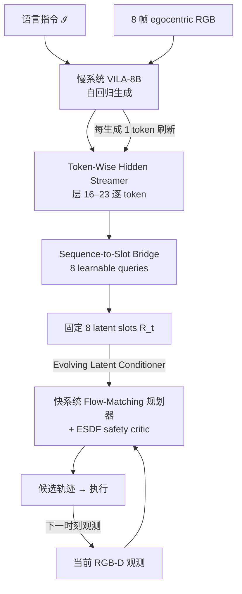

# SPARK-VLN（动态社会视觉–语言导航）

**SPARK-VLN**（*Token-Wise Latent Streaming from Slow Reasoners to Fast Planners for Dynamic Vision Language Navigation*，[arXiv:2607.16806](https://arxiv.org/abs/2607.16806)，[项目页](https://hutslib.github.io/SPARK-VLN.dc.html)）由 **HKUST / HKUST-GZ / NUS / ZJU** 等提出：在 **动态人中心** VLN 中，慢 **VILA-8B** 自回归推理的同时，经 **Token-Wise Hidden Streamer → Sequence-to-Slot Latent Bridge → Evolving Latent Conditioner** 把逐 token 隐状态压成 **8 个固定 latent slot**，实时条件化 **rectified flow-matching** 快规划器，缓解 **observation staleness**（推理窗口内场景已变、动作却基于旧观测）。

## 一句话定义

**不等 VLM 说完再规划：把生成过程中的隐状态当成「正在更新的语义遥控」，边推理边用 flow-matching 快规划器重规划轨迹。**

## 英文缩写速查

| 缩写 | 英文全称 | 简要说明 |
|------|----------|----------|
| SPARK-VLN | Streaming Progressively Aggregated latent Reasoning Knowledge for VLN | 本文快慢双系统框架全称缩写 |
| VLN | Vision-and-Language Navigation | 视觉–语言导航任务 |
| VLM | Vision-Language Model | 视觉–语言多模态模型；本文慢系统为 VILA-8B |
| PSC | Personal Space Compliance | 社会导航中保持与行人合适距离的比例 |
| ORCA | Optimal Reciprocal Collision Avoidance | 行人局部避碰算法，基准中驱动动态行人 |
| ESDF | Euclidean Signed Distance Field | 欧氏符号距离场；快规划器 safety critic 的监督信号 |
| SR | Success Rate | 任务成功率 |
| SPL | Success weighted by Path Length | 成功且惩罚绕路的路径效率指标 |

## 为什么重要

- **把「推理延迟」写进 VLN 协议：** 主流 R2R/VLN-CE 在推理时 **冻结仿真**，latency 不影响分数。本文 **Realistic Dynamic Environment** 在推理时行人继续移动，所有方法从 Idealized 迁到 Realistic 均退化——说明 staleness 不是纸面问题。
- **双系统的瓶颈在「交接时机」而非「有没有快系统」：** [DualVLN](https://arxiv.org/abs/2512.06224) 等只在慢 VLM **结束后** 才给快规划器一次 latent；SPARK-VLN 论证可用知识在 **中间 token** 就已出现，W-t-A 同骨干下 Realistic SR 仅 24.8% vs Stream **34.8%**（**+10 pp**）。
- **快规划器可独立打社会 PointNav：** 仅快系统（Ours-S1）在 Idealized PointNav SR **70.7%**，超 NavDP **+9.6 pp**，碰撞率 **5.9%**；为 streamed 语言引导提供可复用的运动底座叙事。
- **与 [ABot-N1](./paper-abot-n1.md) / [FSD-VLN](./paper-fsd-vln.md) 的对照轴：** 同为慢–快 VLN，但 SPARK-VLN 的接口是 **隐状态 token 流 + flow 轨迹**，不是像素目标或空中语义缓冲；评测强调 **社会合规 + 非阻塞仿真**。

## 核心信息

| 字段 | 内容 |
|------|------|
| 机构 | 香港科技大学（HKUST）；香港科技大学（广州）（HKUST-GZ）；新加坡国立大学（NUS）；浙江大学（ZJU） |
| arXiv | [2607.16806](https://arxiv.org/abs/2607.16806)（v1，2026-07-22） |
| 项目页 / 代码 | [项目页](https://hutslib.github.io/SPARK-VLN.dc.html) 有 **Code 占位**（`href="#"`）；**确认未开源**（截至 **2026-09-07**） |
| 慢系统 | VILA-8B；8 帧 egocentric RGB + 语言；decoder 层 16–23 逐 token 抽隐状态 |
| 快系统 | Rectified flow-matching 轨迹生成（5 步 Euler）+ ESDF 安全 critic；PointNav 预训练，VLN 时无坐标目标、仅靠 streamed slots |
| 仿真 | 室内多场景（卧室/办公室/大厅/走廊）；ORCA 行人；Idealized（推理暂停）vs Realistic（推理不暂停） |
| 真机 | **无** |
| 主要基线 | Seq2Seq、CMA、NaVid、Uni-NaVid、NaVILA、DualVLN；PointNav：iPlanner、NavDP、ORCA 等 |

## 核心原理

### 输入 / 输出

| 侧 | 内容 |
|------|------|
| 观测 | Egocentric RGB-D；8 帧 RGB 历史喂慢系统；当前帧喂快规划器 |
| 语言 | 自然语言导航指令（动作/方向/地点/物体词表） |
| 慢路输出 | 逐 token 多层隐状态流 → **N=8** latent slots $\mathbf{R}_t$ |
| 快路输出 | 连续轨迹 waypoints；critic 选最安全候选并执行 |
| VLN 条件 | 语言目标模式下 $\mathbf{z}_g^{(\text{language})}=\mathbf{R}_t$，随生成 **动态刷新** |

### 流程总览

### 关键机制（压缩）

1. **Token-Wise Hidden Streamer：** 不等 $K$ 个 token 全部生成，每步 $k$ 收集指定层隐状态，形成前缀 $\mathbf{H}^{(k_t)}$。
2. **Sequence-to-Slot Bridge：** 层/时间位置编码 + 投影后，$N{=}8$ 可学习 query 做 cross-attn，把变长高维流压成规划器可用的固定矩阵（优于 Mean-Pool **+9.6 pp** SR）。
3. **Evolving Latent Conditioner + Flow 规划器：** 观测 token 与 slots 拼接为条件，rectified flow 生成 $N_c$ 条轨迹；**目标无关** critic 只评碰撞与平滑度。
4. **VLN 适配：** 快系统 PointNav 预训练；评测 VLN 时 **goal coordinate 置空**，语言意图 **只经 streamed slots** 进入规划器。
5. **基准两阶段：** Idealized 作无延迟上界；Realistic 量化 staleness——本文相对单系统/阻塞双系统优势在后者更明显。

## 源码运行时序图

**不适用**：截至 **2026-09-07**，[项目页](https://hutslib.github.io/SPARK-VLN.dc.html) Code 按钮为 `#` 占位，arXiv 未列官方仓库或权重；无法对齐 README 训练/评测入口绘制复现时序。若后续开源，应补 `sources/repos/` 与本节 sequenceDiagram。

## 工程实践

| 项 | 建议 / 论文设定 |
|----|----------------|
| 评测协议 | 动态社会 VLN 必须报告 **Idealized + Realistic** 两阶段；只看冻结仿真分数会高估部署表现 |
| 双系统交接 | 避免「慢系统整段推理结束才写一次 latent」；中间 token 隐状态可作 **渐进语义遥控** |
| Bridge 设计 | 变长隐流 → 固定 slot 优先 **cross-attn**，Mean-Pool 会丢 token 结构与社会避障细节 |
| 快系统底座 | PointNav 预训练 + streamed 语言条件可解耦；VLN 不必从零联合训一个大 VLA |
| 延迟口径 | Stream 有效 per-update **0.185 s**（RTX 4090）；与 W-t-A **0.788 s** 对比看 staleness 统计 |
| 复现现状 | **无官方代码/权重/基准包**；选型读方法，跑通栈仍走 [四范式开源路径](../overview/vln-open-source-repro-paradigms.md) |

## 实验与评测

| 设置 | 结果要点 |
|------|----------|
| VLN Idealized（Table I） | SPARK-VLN SR **41.6%** / SPL **34.67%** / PSC **96.2%**；NaVILA 37.2% / 34.47%；DualVLN 26.2% |
| VLN Realistic（Table I） | SPARK-VLN SR **34.8%** / SPL **28.68%** / Col **29.3%**（最低）；NaVILA 29.0%；DualVLN 22.9% |
| PointNav Idealized（Table II） | Ours-S1 SR **70.7%** / SPL **70.1%** / Col **5.9%**；NavDP 61.1% / 9.8% |
| PointNav Realistic（Table II） | Ours-S1 SR **61.2%**；NavDP 53.2%；oracle PathFollower 56.7% |
| 交接策略消融（Table III） | Stream vs W-t-A：SR **+10.0 pp**，NE 7.45→**6.21 m** |
| Bridge 消融（Table IV） | Cross-Attn vs Mean-Pool：SR **+9.6 pp**，Col 36.5%→**29.3%** |
| 运行时（Table V） | Stream Lat **0.185 s** avg；行人位移 avg **0.050 m** vs W-t-A 0.213 m |

## 结论

**SPARK-VLN 的核心贡献是把双系统 VLN 的「知识交接」从阻塞式整段 latent 改成逐 token 隐状态流，并用非阻塞仿真基准证明这对动态社会导航的安全与成功率是决定性因素。**

1. **Realistic 协议才测得出真差距** — 所有方法从 Idealized 到 Realistic 都掉分；只报冻结仿真 SR 会掩盖 observation staleness。
2. **+10 pp 来自交接机制，不是换更大的 VLM** — W-t-A 与 Stream 共享 VILA-8B + 同一快规划器；token streaming 单独解释 Realistic SR 24.8%→34.8%。
3. **Bridge 不能偷懒 Mean-Pool** — Cross-Attn 再 +9.6 pp SR、碰撞率降 7.2 pp，说明社会场景需要保留 token 级结构。
4. **快规划器本身够强** — Ours-S1 单独 PointNav 已超 NavDP 并逼近/超过部分 oracle；语言侧 streaming 是在坚实运动底座上叠加。
5. **延迟与行人位移统计一致** — 0.185 s per-update 对应推理期行人平均只移动 0.05 m，与更低碰撞率、更高 PSC 同向。
6. **工程状态仍是方法论文** — 无代码/权重/基准发布；与 [NaVILA](./paper-notebook-navila-legged-robot-vision-language-action-model.md)（已开源腿式 VLN）或 [ABot-N1](./paper-abot-n1.md)（基准开源）互补阅读，勿当可跑栈。

## 局限与风险

- **仅仿真：** 室内 ORCA 行人；无真机、无感知噪声与定位漂移验证。
- **确认未开源：** 项目页 Code 占位；无法复现 benchmark 与训练细节。
- **绝对 SR 仍中等：** Realistic 34.8% 说明任务难，不是「已可部署」。
- **与腿式/户外栈不同域：** 连续轨迹 + 轮式/点质量代理；勿与 [HumanoidVLN](./paper-humanoidvln.md) 摔倒协议或 [DA-Nav](./paper-da-nav.md) 公里级户外直接横比。
- **误区：** 把本文当成 [StreamVLN](https://arxiv.org/abs/2507.05240) 的重复——StreamVLN 侧重 **历史上下文 SlowFast**，本文侧重 **推理中隐状态流 + flow 规划器 + 社会动态基准**。

## 与其他工作对比

| 路线 | 慢–快接口 | 动态社会 / 延迟评测 | 开源 |
|------|-----------|---------------------|------|
| **NaVILA** | 单系统 VILA → 语言动作 | 传统冻结仿真 VLN-CE | **已开源** |
| **DualVLN** | 慢推理完才交 latent | 本文 Realistic 下 SR 22.9% | 待核实 |
| **ABot-N1** | CoT + **像素目标** → 快航点 | 城市 Point/POI 闭环；非行人动态 | 基准开源 |
| **FSD-VLN** | VLSF 缓冲 + DiT 快路 | 空中长程；未见动态行人 | 未开源 |
| **SPARK-VLN（本文）** | **逐 token 隐状态 slot** + flow 轨迹 | **Idealized/Realistic 人中心 suite** | **未开源** |

## 关联页面

- [视觉–语言导航（VLN）](../tasks/vision-language-navigation.md) — 任务总览；本页补 **动态社会 + 非阻塞推理评测**
- [NaVILA](./paper-notebook-navila-legged-robot-vision-language-action-model.md) — VILA 单系统强基线
- [ABot-N1](./paper-abot-n1.md) — 慢–快像素接口双系统对照
- [FSD-VLN](./paper-fsd-vln.md) — 空中快慢双系统对照
- [HumanoidVLN](./paper-humanoidvln.md) — 人形物理与社会 VLN 评测对照
- [具身大模型实时性 ↔ 泛化取舍](../concepts/embodied-fm-latency-generalization-tradeoff.md) — token streaming 缓解 τ 的工程实例
- [VLA](../methods/vla.md) — flow-matching 动作/轨迹生成族
- [VLN 四范式开源复现](../overview/vln-open-source-repro-paradigms.md) — 可跑通栈（本文暂不可跑）

## 推荐继续阅读

- [arXiv:2607.16806](https://arxiv.org/abs/2607.16806) — 原文与 Table I–V
- [SPARK-VLN 项目页](https://hutslib.github.io/SPARK-VLN.dc.html) — 范式对比图与基准轴说明
- [DualVLN（ICLR 2026）](https://arxiv.org/abs/2512.06224) — 阻塞式双系统直接基线
- [StreamVLN（arXiv:2507.05240）](https://arxiv.org/abs/2507.05240) — SlowFast 流式 VLN 对照

## 参考来源

- [SPARK-VLN 论文摘录（arXiv:2607.16806）](../../sources/papers/spark_vln_arxiv_2607_16806.md)
- [SPARK-VLN 项目页归档](../../sources/sites/spark-vln.md)
