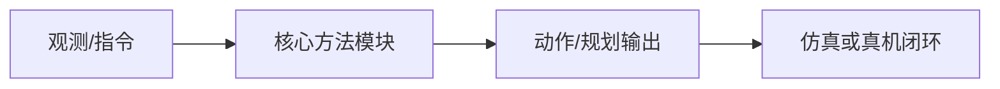
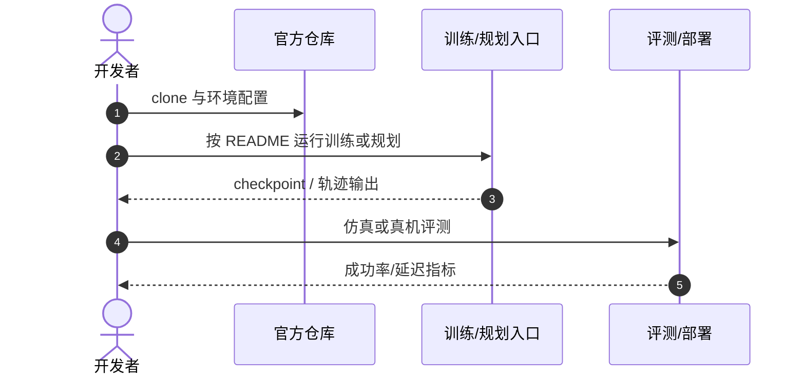

# SparkVLA

**SparkVLA: Stop-Aware Hierarchical VLA with Adaptive Action Chunking for Long-Horizon Manipulation**（[arXiv:2608.16172](https://arxiv.org/abs/2608.16172)，[项目页](https://icr-lab.github.io/SparkVLA)）——（见论文作者列表；项目页标注 Anonymous Authors）。

## 一句话定义

**停机判断与 action chunk 长度必须在同一接口上联合决策，而不是拆成两个阈值问题。**

## 英文缩写速查

| 缩写 | 英文全称 | 简要说明 |
|------|----------|----------|
| VLA | Vision-Language-Action | 视觉-语言-动作大模型 |
| AC | Action Chunking | 动作分块执行 |
| HPE | Hierarchical Planning Executor | 层级规划执行基线对照 |

## 为什么重要

- 纳入 [具身智能小站 2026-08-23 九篇盘点](../../sources/blogs/wechat_embodied_station_9_papers_open_source_2026-08-23.md) 的「长视野 VLA → 动作分布 → 真实交互」主线。
- 开源状态（入库日）：**已开源**。

## 核心信息

| 项 | 内容 |
|----|------|
| **机构** | （见论文作者列表；项目页标注 Anonymous Authors） |
| **出处** | arXiv:2608.16172（2026-08） |
| **开源** | **已开源** |

### 流程总览

## 评测

| 项 | 内容 |
|----|------|
| **主结果** | RoboCerebra 平均成功率 **47.12%**（官方层级 baseline 30.57%）；三任务真机平均 **69.3%**。 |

- 数据出处：[ingest 摘录](../../sources/papers/sparkvla_arxiv_2608_16172.md)。

## 结论

**长视野层级 VLA 的接口决策应把 Stop 与所有 action-prefix 放进同一排序问题。**

- Stop 与 prefix 统一候选集排序，减少阈值调参
- Anchor-Conditioned Context Encoding 缓存子任务锚点
- RoboCerebra 显著超过官方层级 baseline
- 真机多步任务验证收益
- 官方 GitHub 已链

## 源码运行时序图

## 与其他页面的关系

- [vla](../methods/vla.md)
- [action-chunking](../methods/action-chunking.md)
- [manipulation](../tasks/manipulation.md)
- [vla-robustness-9-papers-technology-map](../overview/vla-robustness-9-papers-technology-map.md)

## 参考来源

- [sparkvla_arxiv_2608_16172](../../sources/papers/sparkvla_arxiv_2608_16172.md)
- [sparkvla](../../sources/sites/sparkvla.md)
- [sparkvla](../../sources/repos/sparkvla.md)
- [wechat_embodied_station_9_papers_open_source_2026-08-23](../../sources/blogs/wechat_embodied_station_9_papers_open_source_2026-08-23.md)

## 推荐继续阅读

- [arXiv:2608.16172](https://arxiv.org/abs/2608.16172)
- [官方代码](https://github.com/huhuhushou/SparkVLA)
