# Sparse-WAM：无需额外训练的 WAM 稀疏加速

## 一句话定义

Sparse-WAM 根据动作对未来图像区域的关注，只重算相关未来 token，并复用选择与缓存，降低视频–动作联合去噪的推理成本。

## 英文缩写速查

| 缩写 | 英文全称 | 简要说明 |
|---|---|---|
| WAM | World Action Model | 本页研究联合生成未来视觉和动作的策略 |
| VLA | Vision-Language-Action | 对照的视觉语言动作策略家族 |
| SR | Success Rate | 比加速比更需同步观察的任务成功率 |
| FLOPs | Floating Point Operations | 计算量指标，不等同于实测延迟 |
| BF16 | Brain Floating Point 16 | Appendix B.4 的延迟测试数值格式 |
| RPC | Remote Procedure Call | 论文计时排除的远程调用开销 |

## 为什么重要

WAM 每次生成 action chunk 时可能反复处理大量未来视觉 token。对控制有用的区域只是其中一部分；删除 token 能省算力，却也可能破坏动作。本文用动作相关性分配预算，并把筛选、打包和缓存的实际开销纳入计时。

## 核心信息

| 项目 | 内容 |
|---|---|
| 机构 | 南京大学、香港科技大学、哈尔滨工业大学、洛桑联邦理工学院 |
| 输入 / 输出 | 当前观测、指令、本体状态 → 联合去噪 → action chunk 与未来视觉预测 |
| 开放状态 | 截至 2026-10-02，所给论文摘要页/v1 全文未列官方发布入口；实现开放尚未核实 |
| training-free | 加速机制不新增训练；基座 WAM 的训练和真机任务微调仍有成本 |

## 核心原理与流程总览

先按时间对齐动作 query 与未来帧 key 的注意力，再挑选逐帧核心 token 与跨帧稳定的空间锚点。所有观测和动作 token 保留，锚点只共享位置，各帧特征独立更新。

```mermaid
flowchart TD
  A["观测、指令、本体状态"] --> B["首个完整去噪步"]
  B --> C["动作相关核心区域与共享锚点"]
  B --> D["缓存完整未来预测"]
  C --> E["Pilot 稀疏去噪与打包复用"]
  D --> E
  E --> F["更新未来 latent 与动作"]
  F --> E
  F --> G["输出 action chunk"]
```

默认一个 chunk 首步完整计算并建立选择，后续稀疏步骤复用位置与打包信息。省略区域仍使用缓存预测参与采样，动作每步重新预测。新 chunk 重新筛选，不能把位置选择永久固定。Pilot 避免物化全注意力矩阵，降低打分开销。

## 源码运行时序图

**不适用**：尚未核实官方可运行实现。上图依据论文展示机制，不虚构 `train.py` / `infer.py` 等源码入口。

## 工程实践

复现前先定位可访问的联合视频–动作骨干及注意力接口，再记录 token 保留预算、刷新次数、后端和 chunk 长度。实现后要同时量测成功率、完整 chunk 延迟与筛选开销，保留 dense 对照；筛选成本可能吃掉理论 FLOPs 收益。

Appendix B.4 的计时包含编码、打分、选择、打包、恢复、缓存与采样，不含视频解码、CPU 输出拷贝、RPC 或仿真。464.95 ms 是生成一个 chunk 的测量值；不能直接当作电机控制周期或整个系统实时频率。

## 实验与评测

| 模型 / 任务 | dense → sparse 平均 SR | 加速比与参照 |
|---|---|---|
| FastWAM-Joint / LIBERO | 98.75% → 98.45% | 1.98×，参照 dense eager |
| Cosmos 3 Edge / RoboLab-120 | 22.90% → 23.00% | 1.85×，参照 dense eager |
| Cosmos 3 Nano Policy / RoboLab-120 | 36.75% → 35.50% | 1.81×，参照 dense eager |

全部策略推理在 RTX 4090 上测量。主表包含稀疏化和执行优化收益，不能把 1.85× 全归因于剪枝。

| Edge 后端对照（Table 5） | 延迟 / chunk | 加速比 |
|---|---|---|
| 双方 eager | 859.31 → 555.55 ms | 1.55× |
| 双方启用 CUDA Graphs 与 torch.compile | 727.44 → 464.95 ms | 1.56× |

## 结论

**动作相关稀疏计算能减少想象成本，但应以同后端延迟与控制成功率共同验收。**

1. training-free 是无需额外训练加速模块；基座训练/微调仍需预算。
2. 保留观测与动作 token，把稀疏预算放在未来视觉区域；不能随意剪动作。
3. 缓存选择和省略区域预测，保证省算力后采样过程仍完整。
4. 宣传约 2× 时注明 dense eager 参照；Edge 同后端结果是 1.56×。
5. 报告平均 SR 时仍检查复杂任务，不能把平均保持解释为逐任务无损。

## 与其他工作对比

| 路线 | 优化对象与区别 |
|---|---|
| 通用视觉剪枝 / 缓存 | 强调视觉保真或输入冗余；本文针对动作所需的未来区域 |
| [GlanceWAM](./paper-glancewam.md) | 从异步稀疏前瞻组织系统；本文在联合去噪内部选择 token |
| [LocoWM](./paper-locowm.md) | 小型动力学预测指导加性残差；本文不改变控制任务，而是加速已有联合 WAM |

## 局限与风险

注意力是相关性代理，未必覆盖突发接触与稀有关键事件；缓存会引入过时预测。结果依赖骨干、剪枝预算和后端，不能直接外推到 Jetson 或人形运控频率。当前未核实官方代码、权重或数据入口，工程步骤属于论文导出的复现建议。

## 关联页面

- [世界–动作模型](../concepts/world-action-models.md)
- [GlanceWAM](./paper-glancewam.md)
- [LocoWM](./paper-locowm.md)

## 参考来源

- [Sparse-WAM 论文摘录与开放核查](../../sources/papers/sparse_wam_arxiv_2609_38984.md)

## 推荐继续阅读

- [arXiv:2609.38984](https://arxiv.org/abs/2609.38984)
- [论文全文，尤其 Appendix B.4](https://arxiv.org/html/2609.38984v1)
