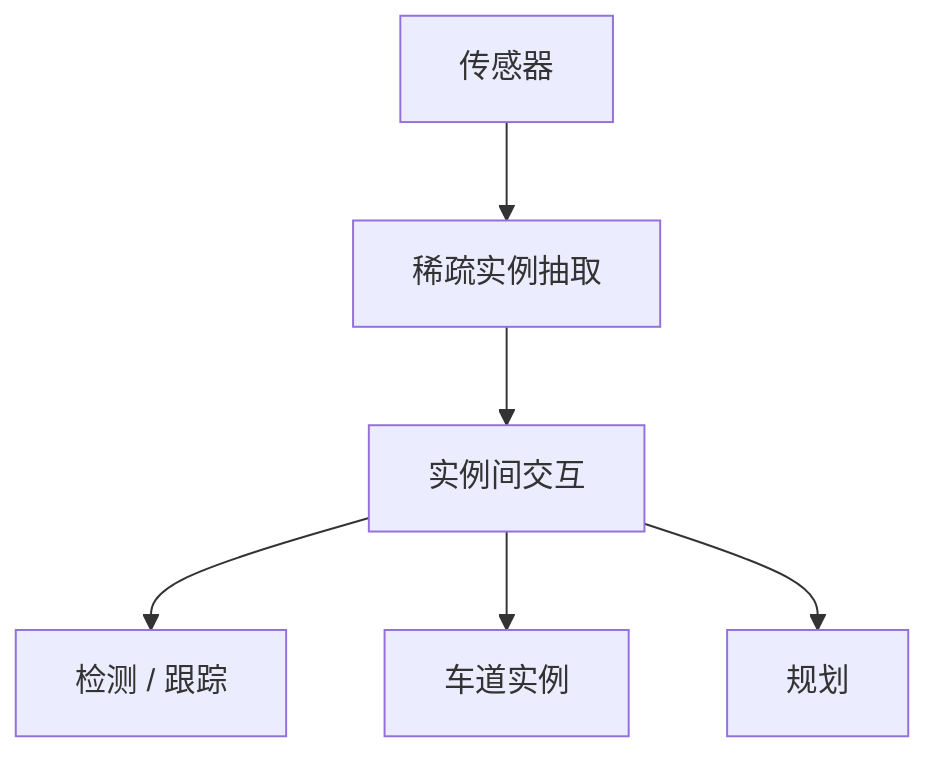
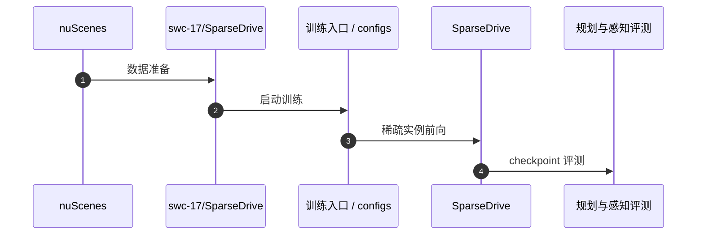

# SparseDrive（SparseDrive: End-to-End Autonomous Driving via Sparse Scene Representation · arXiv:2405.19620）

**SparseDrive**（*SparseDrive: End-to-End Autonomous Driving via Sparse Scene Representation*，[2405.19620](https://arxiv.org/abs/2405.19620)，arXiv 2024）由 **地平线（Horizon Robotics）等** 提出，收录于深蓝AI《端到端自动驾驶：十大前沿算法盘点》**稀疏中心** 线索代表作。

## 一句话定义

把动态参与者与静态车道全部表示为稀疏实例，前向过程不再构建稠密 BEV 特征图，降低延迟并聚焦关键交互。

## 英文缩写速查

| 缩写 | 英文全称 | 简要说明 |
|------|----------|----------|
| SparseDrive | Sparse End-to-End Driving | 稀疏场景表示端到端驾驶 |
| BEV | Bird's-Eye View | 本文刻意避免的稠密鸟瞰图 |
| E2E | End-to-End | 端到端自动驾驶 |
| FPS | Frames Per Second | 推理速度 |
| nuScenes | nuScenes Dataset | 常用开环评测集 |

## 为什么重要

- VAD 虽向量化，底层仍常依赖密集特征；车端部署的算力墙要求「算力∝实例数」而非「∝感知面积」。
- 注意力只在关键实例间交互，减少背景噪声。
- 代表量产友好的稀疏 E2E 范式。

## 核心信息

| 字段 | 内容 |
|------|------|
| **机构** | 地平线（Horizon Robotics）等 |
| **arXiv** | [2405.19620](https://arxiv.org/abs/2405.19620) |
| Venue | arXiv 2024 |
| **演进线索** | 稀疏中心 |
| **开源** | **已开源** — [`swc-17/SparseDrive`](https://github.com/swc-17/SparseDrive) |
| **指标索引** | nuScenes 上与主流稠密模型安全性能相当或更优，同时显著提升推理速度（以论文表为准）。 |

## 核心原理

### Sparse Instances

驾驶元素（车辆/行人/车道等）→ 稀疏实例集合；全程无稠密 BEV。

优势：
1. **极致高效**：计算量随实例数增长；
2. **聚焦关键**：实例间注意力，抑制背景。

### 流程总览

## 源码运行时序图

关键复现路径：[`swc-17/SparseDrive`](https://github.com/swc-17/SparseDrive)（arXiv HTML 官方代码链）。

## 实验与评测

| 维度 | 记录 |
|------|------|
| 数据集 | nuScenes |
| 报告点 | 安全指标对齐/优于稠密基线，同时显著降延迟 |
| 对照 | 稠密 BEV E2E、VAD 类向量化 |

## 与相邻路线对比

| 路线 | 相对 SparseDrive | 取舍 |
|------|------------------|------|
| [VAD](./paper-vad-vectorized-scene.md) | 向量化但未必去稠密底 | 实现更早、生态熟 |
| [UniAD](./paper-uniad.md) | 中间任务更全 | 算力墙 |
| [MomAD](./paper-momad.md) | 补帧间一致 | 可与稀疏骨干正交叠加 |

## 工程实践

| 维度 | 记录 |
|------|------|
| 典型评测 | nuScenes / NAVSIM / Bench2Drive / Waymo Open（依论文） |
| 开源状态 | **已开源** — [`swc-17/SparseDrive`](https://github.com/swc-17/SparseDrive) |
| 复现入口 | https://github.com/swc-17/SparseDrive |
| 工程关注点 | 延迟、帧间一致性、可解释中间量表征、与模块化栈的接口 |

## 局限与风险

- 稀疏召回失败（漏检关键实例）会直接伤害规划。
- 与稠密占用/开放词汇感知的结合仍需工程取舍。
- 开环指标外推到闭环控制需额外验证。

## 关联页面

- [e2e-autonomous-driving-top10-algorithms](../overview/e2e-autonomous-driving-top10-algorithms.md) — 十大盘点父节点
- [自动驾驶核心算法盘点专辑](../overview/autonomous-driving-core-algorithms-series.md) — 模块化栈姊妹篇
- [生成式世界模型](../methods/generative-world-models.md)
- [S²-VLA](./paper-s-squared-vla.md) — 驾驶 VLA / NAVSIM 对照
- [M⁴World](./paper-m4world.md) — 驾驶世界模型后继
- [VLA](../methods/vla.md)

## 参考来源

- [深蓝AI：端到端自动驾驶十大前沿算法盘点](../../sources/blogs/wechat_shenlan_ai_ad_e2e_top10.md)
- [e2e_ad_sparsedrive.md](../../sources/papers/e2e_ad_sparsedrive.md) — 论文 source
- arXiv: [2405.19620](https://arxiv.org/abs/2405.19620)
- [repos/sparsedrive.md](../../sources/repos/sparsedrive.md)

## 推荐继续阅读

- 论文 PDF：<https://arxiv.org/pdf/2405.19620.pdf>
- 官方代码：<https://github.com/swc-17/SparseDrive>
