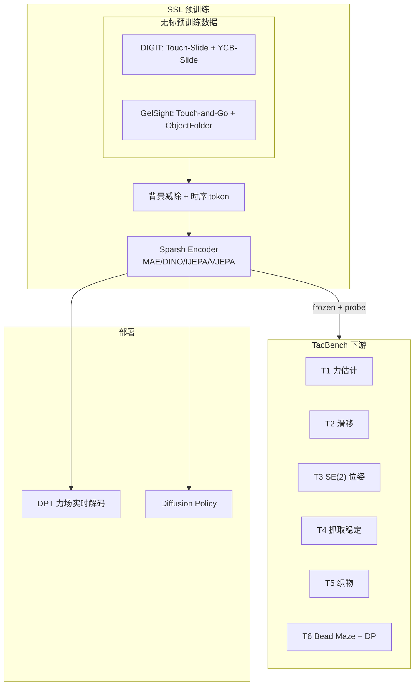
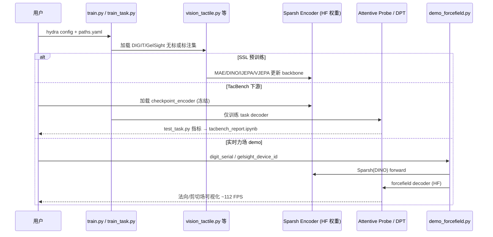

# Sparsh：视觉触觉自监督表征（CoRL 2024 · arXiv:2410.24090）

**Sparsh**（*Self-supervised touch representations for vision-based tactile sensing*，[arXiv:2410.24090](https://arxiv.org/abs/2410.24090)，[CoRL 2024](https://openreview.net/forum?id=xYJn2e1uu8)，Carolina Higuera 等 · **Meta FAIR / UW / CMU**；[项目页](https://sparsh-ssl.github.io/)）在 **460k+** 无标触觉图像上用 **MAE / DINO / IJEPA / V-JEPA** 训练跨 **DIGIT、GelSight 2017、GelSight Mini** 的通用触觉表征，并以 **TacBench** 六任务 frozen probe 标准化评测。

## 一句话定义

**用视觉 SSL 配方（背景减除 + ~80 ms 时序窗）在三种主流 VBTS 上预训练通用触觉 encoder，下游 frozen probe 平均较 task-specific E2E 提升 95.1%（33% 标注预算）。**

## 英文缩写速查

| 缩写 | 英文全称 | 简要说明 |
|------|----------|----------|
| Sparsh | — | 本文 SSL 触觉表征家族 |
| VBTS | Vision-Based Tactile Sensing | 图像式触觉传感 |
| SSL | Self-Supervised Learning | 自监督预训练 |
| TacBench | — | 六任务 frozen 评测基准 [T1–T6] |
| MAE | Masked Autoencoder | Sparsh 预训练配方之一 |
| IJEPA | Image Joint Embedding Predictive Architecture | latent 空间最优配方之一 |
| DPT | Dense Prediction Transformer | 力场解码头 |

## 核心信息

| 项 | 内容 |
|----|------|
| 机构 | Meta FAIR；University of Washington；Carnegie Mellon University |
| 会议 | CoRL 2024 |
| 预训练数据 | **~661k** 图策展，**462.7k** 用于 SSL（Touch-Slide、YCB-Slide、Touch-and-Go、ObjectFolder 等） |
| 传感器 | DIGIT、GelSight 2017、GelSight Mini |
| 推理速度 | 最高 **112 FPS**（RTX 3080）；~80 ms 两帧 stride-5 @60 FPS |
| 开源（2026-09-23） | **已开源（ARCHIVED）** — [`facebookresearch/sparsh`](https://github.com/facebookresearch/sparsh)；权重 [HF `facebook/sparsh`](https://huggingface.co/collections/facebook/sparsh-67167ce57566196a4526c328) |

## 为什么重要

- **停止重复造 VBTS E2E 轮子：** 力、滑移、位姿标注难规模化；SSL 预训练 + 轻量 probe 更数据高效。
- **跨传感器标准化：** 覆盖 DIGIT + 两代 GelSight；背景减除 + 短窗时序 token 对 slip/pose 等 **时序任务关键**。
- **TacBench 分层评测：** 触觉属性（力/滑移）→ 物理感知（位姿/抓取稳定）→ 操作规划（织物/Bead Maze），给后续 VTLA（如 [OmniVTLA](./paper-sa-2508-08706-omnivtla-vision-tactile-language-action-model-wi.md)）提供 **可插拔 encoder 对照**。
- **综述锚点：** [Vision-Based Tactile Intelligence](./paper-vision-based-tactile-intelligence.md) 将 Sparsh 列为 tactile foundation model 代表。

## 核心贡献/方法

| 模块 | 要点 |
|------|------|
| **Sparsh 家族** | MAE、DINO/DINOv2、IJEPA、V-JEPA 适配 VBTS |
| **Tokenization** | 背景减除；$I_t \oplus I_{t-5}$ → 6 通道；V-JEPA 用 4 帧 clip |
| **TacBench [T1–T6]** | 力 RMSE、滑移、SE(2) 位姿、抓取稳定、织物识别、Bead Maze + Diffusion Policy |
| **Frozen eval** | Encoder 冻结 + attentive probe vs E2E；33% 标注 **+95.1%** 平均 |
| **力场解码** | Frozen Sparsh + DPT；photometric warp 损失预测法向/剪切场 |
| **操作策略** | Franka teleop Bead Maze；Sparsh 特征策略略优 E2E encoder |

## 流程总览

## 评测与指标

| 任务 | 要点 | Sparsh vs E2E |
|------|------|---------------|
| TacBench 宏平均 | 33–50% 标注预算 | **+95.1%** vs task-specific E2E |
| T1 力估计 | 三轴法向/剪切 RMSE | DINO/IJEPA latent 最优 |
| T2 滑移 | 时序敏感 | 短窗 token 关键 |
| T3 位姿 | SE(2) + 三指 DIGIT | frozen probe 优势大 |
| T6 Bead Maze | Diffusion Policy | Sparsh 特征 **略优** E2E |
| 实时力场 | RTX 3080 | **112 FPS** 推理 |

## 与其他工作对比

| 路线 | 表征目标 | 相对 Sparsh |
|------|----------|-------------|
| Task-specific E2E | 单传感器单任务 | TacBench 平均低 95.1% |
| T3 / UniT 等并发 SSL | 触觉表征 | Sparsh 覆盖三 VBTS 族 + TacBench |
| [OmniVTLA SA-ViT](./paper-sa-2508-08706-omnivtla-vision-tactile-language-action-model-wi.md) | 语义对齐 VTLA | Sparsh 通用 SSL vs ObjTac 三模态对齐 |
| [TaF-VLA](./paper-sa-2601-20321-taf-vla-tactile-force-alignment-in-vision-langua.md) | 触觉–力对齐 | Sparsh 对齐视觉语义；TaF 对齐物理力 |
| [AnySkin](./painode-146-anyskin.md) | 磁通低维 | 硬件 replaceability vs VBTS 表征 |

## 结论

**Sparsh 证明 VBTS 可以像 CV 一样先做 SSL 再 frozen probe——在 33% 标注下 TacBench 平均 +95.1%，DINO/IJEPA 的 latent 空间最值得当下游默认 backbone。**

1. **预训练配方** — 背景减除 + ~80 ms 窗是 slip/pose 的必要条件，不是可选增强。
2. **选 encoder** — DINO/IJEPA 在 TacBench latent 指标上 consistently 最优。
3. **Frozen > E2E** — 新任务优先 frozen Sparsh + 轻量 probe，而非从头 E2E。
4. **仓库 ARCHIVED** — 代码/权重仍可用；后续 Sparsh-X 在独立仓。
5. **与 VTLA 接口** — encoder 可插 [OmniVTLA](./paper-sa-2508-08706-omnivtla-vision-tactile-language-action-model-wi.md) dual-path 的通用 ViT 支路。
6. **力场 demo** — `demo_forcefield.py` + HF decoder 权重可 112 FPS 实时验证。

## 源码运行时序图

[`facebookresearch/sparsh`](https://github.com/facebookresearch/sparsh) 主路径：**SSL 预训练 → frozen 下游 → 力场 demo**。

## 局限与风险

- 主仓 **ARCHIVED**；长期维护依赖社区 fork 或 Sparsh-multisensory 扩展仓。
- 预训练偏 DIGIT/GelSight 族；力阵列/磁触觉（[AnySkin](./painode-146-anyskin.md)）不在覆盖范围。
- Bead Maze 等策略增益为 **略优** E2E，非数量级碾压。
- 背景图需按传感器补充 `bgs/` 文件夹，否则 markerless 预处理失效。

## 关联页面

- [触觉传感](../concepts/tactile-sensing.md) — VBTS 表征学习轴
- [视触觉融合](../concepts/visuo-tactile-fusion.md) — 多模态下游
- [VLA](../methods/vla.md) — VTLA 可插 Sparsh encoder
- [OmniVTLA](./paper-sa-2508-08706-omnivtla-vision-tactile-language-action-model-wi.md) — dual-path 触觉编码对照
- [触觉智能九篇地图](../overview/tactile-intelligence-nine-papers-map.md) — Hardware/SSL 层节点
- [VBTS 综述](./paper-vision-based-tactile-intelligence.md) — foundation model 章节

## 参考来源

- [Sparsh 论文归档（arXiv:2410.24090）](../../sources/papers/sparsh_arxiv_2410_24090.md)
- [Sparsh 项目页归档](../../sources/sites/sparsh-ssl-github-io.md)

## 推荐继续阅读

- [项目页](https://sparsh-ssl.github.io/) — TacBench 雷达图、跨传感器图
- [GitHub: facebookresearch/sparsh](https://github.com/facebookresearch/sparsh) — `train.py` / `demo_forcefield.py`
- [HF: facebook/sparsh](https://huggingface.co/collections/facebook/sparsh-67167ce57566196a4526c328) — 预训练与 decoder 权重
- [OpenReview](https://openreview.net/forum?id=xYJn2e1uu8) — CoRL 2024 正式版
