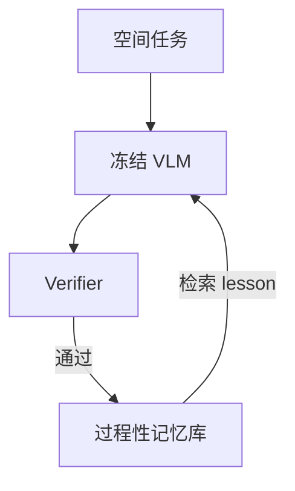

# Spatial Memory Agent：不调参也能长空间记性

**Spatial Memory Agent（SMA）**（*Experience-Grounded Procedure Memory for Spatial Intelligence*；[arXiv:2608.12743](https://arxiv.org/abs/2608.12743)，[项目页](https://aim-uofa.github.io/SMA/)）走 **互补路线**：不更新 VLM 参数、推理时不调外部 3D 专家，把 **已验证的空间经验** 写成可复用 **过程性 lesson**。

## 一句话定义

**空间智能不必靠后训练或深度估计工具链——把 verifier 认可的经验存成记忆，检索时按语义 + 可靠性排序。**

## 英文缩写速查

| 缩写 | 英文全称 | 简要说明 |
|------|----------|----------|
| SMA | Spatial Memory Agent | 本文记忆 agent 框架 |
| VLM | Vision-Language Model | 冻结的基础多模态模型 |
| TRS | Transfer Reliability Score | 记忆可靠性校准分数 |
| CoT | Chain-of-Thought | 部分 spatial 任务中的推理链 |
| macro avg | Macro Average | 跨 benchmark 宏平均 |

## 为什么重要

- **参数冻结降低部署成本：** 适合已有 base VLM 不能动权重的场景。
- **过程记忆 vs 事实缓存：** 存的是 **操作性 spatial lesson**，不是复读题库。
- **跨 base 模型增益：** 4 个基础 VLM 上各 block 最高 macro average，说明 memory 层可插拔。

## 核心信息

| 项 | 内容 |
|----|------|
| **出处** | arXiv:2608.12743（2026-08） |
| **写入** | verifier-guided reflection → procedure memory |
| **检索** | 语义过滤 + similarity-TRS 排名 |
| **开源（截至 2026-08-19）** | **待发布**（Code Coming Soon） |

## 核心原理

## 工程实践

| 项 | 建议 |
|----|------|
| 源码运行时序图 | **不适用**（代码未发布） |
| 与 Seeker 对照 | [Seeker](./paper-seeker.md) 改 **看哪**；SMA 改 **记住怎么做** |
| TRS | 部署时必须用可靠性分过滤，否则旧错经验会回流 |

## 结论

**SMA 把 spatial intelligence 从「再训一个大模型」改成「可审计的经验层」。**

1. **冻结 VLM 仍可有增益** — memory 层承担适应。
2. **Verifier 是质量门** — 没验证的经验不应写入。
3. **TRS 防幻觉记忆** — 检索不是最近邻就够。
4. **代码待发布** — 无法本地复现 macro avg 表格。

## 局限与风险

- 记忆规模与遗忘策略未在实体页展开，需读原文。
- 无开源实现，verifier 与 TRS 细节不可核对。
- 对需要 metric 3D 几何的任务，冻结 VLM + 记忆可能仍有上限。

## 实验与评测

5 个 spatial benchmark × 4 个基础 VLM：每个 base-model block **macro average 最高**（项目页/摘要）。具体 benchmark 名单以论文 Table 为准。

## 与其他工作对比

相对后训练 spatial VLM：本文 **零参数更新**。相对外部 3D 工具链：本文 **推理时不调深度/重建专家**。

## 关联页面

- [世界模型与真实执行 10 篇技术地图](../overview/world-model-exec-10-papers-technology-map.md)
- [VLA](../methods/vla.md)
- [Seeker](./paper-seeker.md)
- [具身基础模型分类](../queries/embodied-fm-taxonomy-loop.md)

## 参考来源

- [SMA 论文摘录](../../sources/papers/spatial_memory_agent_arxiv_2608_12743.md)
- [项目页归档](../../sources/sites/spatial-memory-agent.md)
- [具身智能小站 10 篇盘点（2026-08-19）](../../sources/blogs/wechat_embodied_station_world_model_exec_10_papers_2026-08-19.md)

## 推荐继续阅读

- [SMA 项目页](https://aim-uofa.github.io/SMA/)
- [arXiv:2608.12743](https://arxiv.org/abs/2608.12743)
