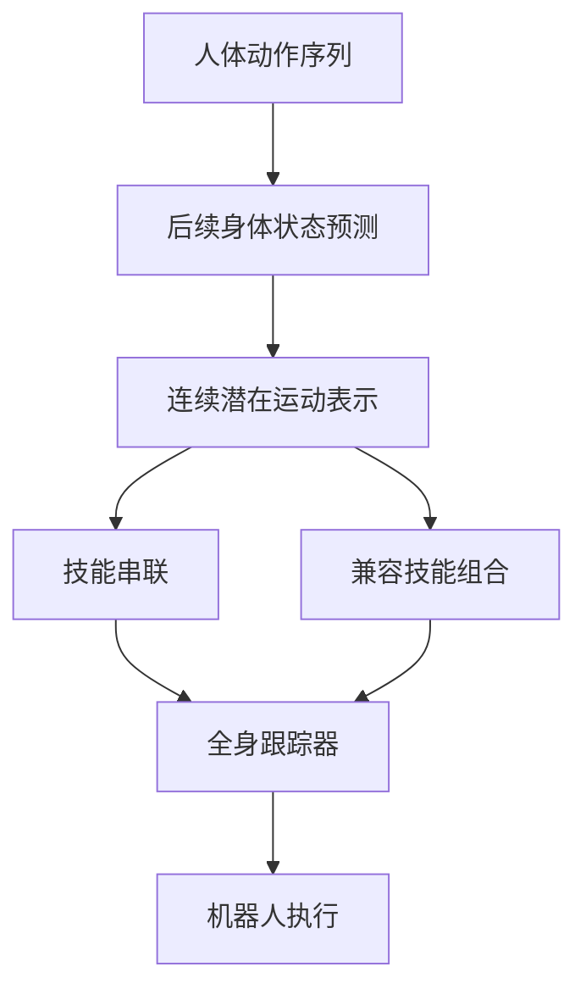

# Learning Expressive and Compositional Motion Representation via Spectral Skills

**Spectral Skills**（[arXiv:2609.37677](https://arxiv.org/abs/2609.37677)，[项目页](https://spectral-skill.github.io/)）提出连续动作表示，作为上层规划器与人形跟踪控制器之间的技能接口。

## 一句话理解

用连续潜变量描述身体接下来会怎样变化，让同一跟踪器执行、串联或组合技能。

## 英文缩写速查

| 缩写 | 英文全称 | 简要说明 |
|---|---|---|
| BFM | Behavior Foundation Model | 行为基础模型 |
| DoF | Degrees of Freedom | 自由度 |

## 流程总览

以下按本页已归纳的机制与资料绘制，表示模块或阅读路径关系。

## 方法要点

- 通过预测后续身体状态学习运动表示，而非只重建输入动作。
- 潜变量可在兼容方向组合，控制器将其转换为机器人运动。
- 文章报告 Unitree G1 上的动作跟踪、技能串联、组合和语言条件规划演示；定量结论以论文为准。

## 与相邻工作

- [ASE](../methods/ase.md)学习可选择的潜在技能。
- [BFM-Zero](./paper-bfm-zero.md)使用目标提示调用预训练行为。
- Spectral Skills重点在连续运动表示的可组合性。

## 参考来源

- [arXiv:2609.37677](https://arxiv.org/abs/2609.37677)
- [项目页](https://spectral-skill.github.io/)
- [Day 2 文章来源索引](../../sources/blogs/humanoid_motion_intelligence_day2_locomotion_motion_priors_2026_10_03.md)

## 评测

文章报告 29-DoF Unitree G1 的全局跟踪误差较对比方法下降 62%，并展示技能串联与组合。

## 与其他工作对比

与 [ASE](../methods/ase.md)的离散潜在技能选择相比，Spectral Skills侧重连续运动表示的串联和组合。

## 结论

Spectral Skills把连续可组合运动表示作为规划器和冻结跟踪器之间的接口。

## 关联页面

- [ase](../methods/ase.md)
- [paper-bfm-zero](./paper-bfm-zero.md)
- [paper-behavior-foundation-model-humanoid](./paper-behavior-foundation-model-humanoid.md)
