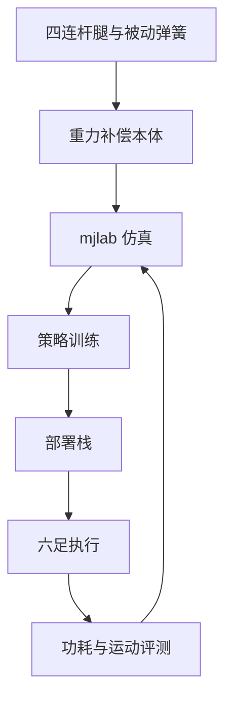
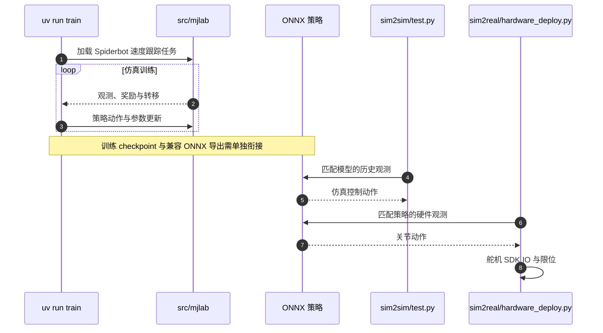

# Spiderbot（arXiv:2609.26989）

**Spiderbot**（*Spiderbot: An Open-Source Energy-Efficient Hexapod with Passive Gravity Compensation*，[arXiv:2609.26989](https://arxiv.org/abs/2609.26989)）来自 [senlanke 具身运控lab 周更盘点](../../sources/blogs/wechat_senlanke_weekly_humanoid_quadruped_2026-09-21_25.md)（2026-09-21–25）。

## 一句话定义

**两 DoF 四连杆+被动弹簧支撑；站立 1.5 W；<$400；开源 CAD/mjlab/部署。**

## 英文缩写速查

| 缩写 | 英文全称 | 简要说明 |
|------|----------|----------|
| RL | Reinforcement Learning | 强化学习 |
| WBC | Whole-Body Control | 全身控制 |
| MPC | Model Predictive Control | 模型预测控制 |

## 为什么重要

- 三 DoF 腿增重与支撑力矩。

## 流程总览

以下按本页已归纳的机制与资料绘制，表示模块或阅读路径关系。

## 核心机制

| 项 | 内容 |
|----|------|
| **arXiv** | [2609.26989](https://arxiv.org/abs/2609.26989) |
| **开源** | **已开源**（步骤 2.5，2026-09-28） |
| **方法摘要** | Passive gravity-compensated hexapod legs + open mjlab stack. |

## 源码运行时序图

入口对应 [SpiderBot 仓库归档](../../sources/repos/spiderbot.md)。先用 `sim2sim/test.py` 校验 ONNX 与观测、XML、动作缩放，再接 `sim2real/hardware_deploy.py`；默认 sim2sim 策略路径是占位值，不能直接当作已可用权重。

## 实验与评测

- 斜坡/粗糙/台阶 Sim2Real（印度 BITS 果阿，以 PDF 为准）。
- 读法：先对齐任务设定、传感器与成功定义，再解读 headline 数字。

## 与其他工作对比

| 维度 | 读法 |
|------|------|
| **同周对照** | 见对应 [周更盘点](../../sources/blogs/wechat_senlanke_weekly_humanoid_quadruped_2026-09-21_25.md) 映射表，勿跨任务直接比 SR |
| **开源状态** | **已开源** — 部署前以项目页/arXiv 为准 |

## 结论

**Spiderbot 是低成本开源六足+RL 训练栈样本。**

1. 开源：**已开源**；勿凭公众号摘要臆断可复现性。
2. 指标须连同实验条件解读（仿真/真机、平台、成功阈值）。
3. 关注 arXiv 版本更新与代码发布。

## 关联页面

- [locomotion](../tasks/locomotion.md)
- [reinforcement-learning](../methods/reinforcement-learning.md)

## 参考来源

- [官方源码运行入口归档](../../sources/repos/spiderbot.md)

- [spiderbot-hexapod-open-source_arxiv_2609_26989.md](../../sources/papers/spiderbot-hexapod-open-source_arxiv_2609_26989.md)
- [wechat_senlanke_weekly_humanoid_quadruped_2026-09-21_25.md](../../sources/blogs/wechat_senlanke_weekly_humanoid_quadruped_2026-09-21_25.md)
- [arXiv:2609.26989](https://arxiv.org/abs/2609.26989)

## 推荐继续阅读

- [arXiv PDF](https://arxiv.org/pdf/2609.26989)
