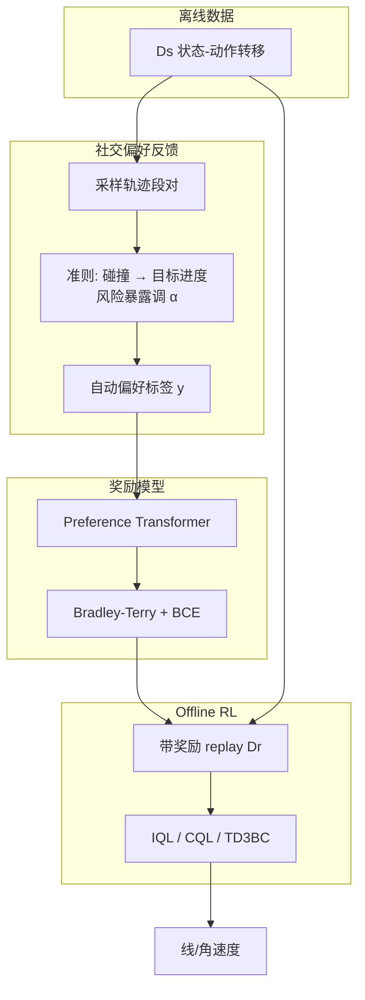

# SPLC（社交偏好学习的人群机器人导航）

**SPLC**（*Social Preference Learning for Crowd Robot Navigation*，[arXiv:2607.01925](https://arxiv.org/abs/2607.01925)）来自 **武汉科技大学（Wuhan University of Science and Technology）**：针对人群导航 Offline RL 中 **手调奖励难量化社交规范、人工偏好标注贵且有主观偏差** 的问题，提出 **社交偏好反馈机制**——用碰撞、目标进度、风险暴露三项准则自动给轨迹段对打偏好标签，再以 **Preference Transformer** 学奖励，并挂到 **IQL / CQL / TD3BC**；仿真与 **TurtleBot4** 真机表明相对手调奖励（HR）与人工/鲁棒偏好基线（HPR / RPR）更稳。

## 一句话定义

**别手调人群奖励，也别雇人标偏好**——用「碰撞优先 → 目标进度 → 风险暴露」自动打标签，Preference Transformer 学奖励，再喂 Offline RL 学让行。

## 英文缩写速查

| 缩写 | 英文全称 | 简要说明 |
|------|----------|----------|
| SPLC | Social Preference Learning for Crowd robot navigation | 本文离线社交偏好奖励学习框架 |
| PbRL | Preference-based Reinforcement Learning | 从轨迹比较学隐式奖励的范式 |
| IQL | Implicit Q-Learning | 本文挂接的 Offline RL 算法之一 |
| CQL | Conservative Q-Learning | 保守 Q 学习；手调奖励下最易崩溃的对照 |
| TD3BC | Twin Delayed DDPG + Behavior Cloning | 带 BC 正则的 Offline RL 基线 |
| ORCA | Optimal Reciprocal Collision Avoidance | 仿真行人运动模型 |
| POMDP | Partially Observable Markov Decision Process | 本文人群导航问题形式化 |
| CORL | Clean Offline RL library | 文中 Offline RL 实现来源库 |

## 为什么重要

- **把「社交规范」写成可自动标注的准则：** 词典序优先保安全（碰撞），再比效率（Goal Progress），用 Risk Exposure 调节偏好软标签强度——比稀疏到达/碰撞奖励更能抑制近视绕行。
- **绕开人工偏好标注瓶颈：** 相对 HPR（人工偏好）与 RPR（抗噪声偏好），自动准则减少标注成本与标注者主观偏差（作者称 reward bias）。
- **插件式接 Offline RL：** 奖励模型与 IQL/CQL/TD3BC 解耦；对 **CQL** 提升最显著（Success 36.4%→95.4%），说明保守算法更吃准确奖励。
- **真机链短而清晰：** LiDAR 腿检测 + 里程计状态 → 笔记本上 SPLC-IQL → TurtleBot4 执行，适合对照 [Sim2Real](../concepts/sim2real.md) 学习型局部层。
- **开源边界清醒：** 官方仓截至入库日仍是 **coming soon**；可读方法与数字，不可当可跑栈。

## 核心信息

| 字段 | 内容 |
|------|------|
| 机构 | 武汉科技大学（Wuhan University of Science and Technology）；湖北工业系统智能信息处理与实时技术重点实验室 |
| 发表 | arXiv preprint（2026-07-02） |
| arXiv | [2607.01925](https://arxiv.org/abs/2607.01925) |
| 代码 | <https://github.com/sklus949/SPLC> — **待发布**（README coming soon，截至 2026-08-10） |
| 演示 | [YouTube](https://youtu.be/vkWjg4Qcybg) |
| 平台 | 仿真圆域人群（ORCA 行人）；真机 TurtleBot4 + RPLIDAR-A1 |
| 训练 | Preference Transformer（BT 偏好损失）→ Offline RL（CORL：IQL/CQL/TD3BC） |
| 主要基线 | 奖励：HR / HPR / RPR × 算法：IQL / CQL / TD3BC |

## 核心原理

### 输入 / 输出

| 侧 | 内容 |
|------|------|
| 状态 | 机器人中心坐标：\(s^r=[d_g,v_{pref},\bar r,v_x,v_y,\theta]\)；行人 \(s^i\) 含相对位姿/速度/距离 |
| 动作 | \(a_t=(v_t,\omega_t)\)，\(v\in(0,1)\)，\(\omega\in(-1,1)\) |
| 离线数据 | \(\mathcal{D}_s=\{s^{jn}_t,a_t,s^{jn}_{t+1}\}\)（文中容量 \(5\times10^5\)） |
| 偏好数据 | 段对 \((\sigma^0,\sigma^1)\) + 软标签 \(y\)（查询数 2000，段长 15） |
| 输出 | 逐步奖励 \(\hat r_{\psi,t}\) → Offline RL 策略 \(\pi\) |

### 流程总览

### 关键机制（压缩）

1. **Collision Occurrence：** 段内是否与行人碰撞；无碰撞段词典序优先，标签 \((0.9,0.1)\) 或对偶。
2. **Goal Progress：** \(\eta=\|p_1-p_g\|-\|p_L-p_g\|\)；优胜侧得 \((0.7-\alpha,0.3+\alpha)\)。
3. **Risk Exposure：** \(\mu\) 为进入行人危险区频率；\(\alpha=0.1\tanh((\mu^0-\mu^1)/(\mu_{\max}-\mu_{\min}))\) 软化强度。
4. **Preference Transformer：** 非马尔可夫加权奖励 + BT 模型；最小化偏好交叉熵后，用 \(\hat r\) 标注 \(\mathcal{D}_s\) 并训 Offline RL。

## 源码运行时序图

**不适用**：截至 **2026-08-10**，官方仓 [sklus949/SPLC](https://github.com/sklus949/SPLC) 仅含 `README.md` 与 `Graphical Abstract.png`；README 写明 **The source code is coming soon**，无可对齐的训练 / 推理入口。注释中拟议的 `mechanism.py` → `train_reward_model.py` → `offline/iql.py` **不能当作已发布实现**；代码正式开放后再补本图。

## 工程实践

| 项 | 建议 / 论文设定 |
|----|----------------|
| 仿真设定 | 半径 4 m 圆、6 行人 ORCA、到达即换目标；保持动态交互 |
| 偏好查询 | 段长上限 100、query length 15、queries 2000；Transformer 1 层 / 4 头 / emb 256 |
| Offline RL | 用 CORL 实现 IQL/CQL/TD3BC；奖励模型梯度步 \(10^4\)，AdamW \(1\mathrm{e}{-4}\) |
| 真机感知 | RPLIDAR-A1 + 腿检测估行人相对位姿/速度；底盘里程计 |
| 真机算力 | 笔记本（文中 R9-7940HX + RTX 4060）推理，TurtleBot4 执行 |
| 复现现状 | **代码未发布**；见 [仓库归档](../../sources/repos/splc.md) |
| 与经典栈关系 | 学习型 **局部社交控制器**，不替代 Nav2 全局层；对照 [DWA](../methods/dwa.md) / [分层规划选型](../comparisons/mobile-robot-navigation-planning-methods.md) |

## 实验与评测

| 设置 | 结果要点（以论文 Table I/III 为准） |
|------|-----------------------------------|
| 离线库质量 | Success 76.2%、Collision 23.6%、Timeout 0.2%、均时 11.7 s、\(5\times10^5\) |
| 测试协议 | 500 cases；指标 Success / Collision / Timeout / Time |
| SPLC-IQL | Success **94.60%**、Collision **5.40%**（优于 HR/HPR/RPR-IQL） |
| SPLC-CQL | Success **95.40%**、Collision **4.60%**（相对 HR-CQL 36.40% 提升最大） |
| SPLC-TD3BC | Success **90.60%**、Time **11.90 s**（相对 HPR 超时 30.80% 明显更稳） |
| 轨迹定性 | SPLC 更早绕开稠密区、少贴身穿行（Fig. 2） |
| 真机 | 5 行人场景到达且避碰（定性；完整演示见视频） |

## 结论

**人群 Offline RL 的瓶颈常常是「奖励是否诚实编码社交规范」，不是再换一个更花的 Q 学习器——自动准则偏好 + Preference Transformer 比手调或人工偏好更可扩展。**

1. **先看 Success + Collision** — 本文主故事是更高到达、更少撞；Time 次之。
2. **CQL 最吃奖励质量** — HR-CQL 几乎不可用，SPLC-CQL 拉回 >95% Success，说明保守算法对奖励偏差极敏感。
3. **词典序比单标量奖励更贴社交** — 碰撞压倒进度，风险只调软标签，避免「为赶路贴人」。
4. **自动标注 ≠ 无归纳偏置** — 准则本身仍是工程先验；换场景需重审危险区定义与 \(\alpha\)。
5. **真机证据是定性链** — TurtleBot4 + LiDAR 腿检测可迁移，但尚非大规模统计表。
6. **选型边界** — 相对 [iCrowdNav](./paper-icrowdnav.md)（在线 PPO + 视觉意图）与 [PioneeR](./paper-notebook-learning-social-navigation-from-positive-and-neg.md)（正负示范密度奖励），本文专攻 **Offline RL + 无人工偏好标注**；代码未开源前只作对照。

## 局限与风险

- **代码待发布：** 无法核对实现细节、超参与数据生成脚本。
- **准则先验：** 社交规范被压缩为碰撞/进度/风险三轴，难覆盖文化差异与群体「隐式车道」等细粒度礼仪。
- **仿真行人：** ORCA 合作式避障 ≠ 真实非合作人群；离线库中等难度，极端拥挤未充分覆盖。
- **真机感知简化：** 腿检测 + 相对速度估计在遮挡、推车、儿童场景会退化。
- **误区：** 把 SPLC 当成 Nav2 替代，或当成语言 VLN——任务是 **坐标目标 + 社交避障** 的局部决策层。

## 与其他工作对比

| 路线 | 监督信号 | 学习范式 | 开源/复现 |
|------|----------|----------|-----------|
| **手调社交奖励 DRL** | 到达/碰撞/距离 shaping | 多为 Online DRL | 依赖场景手调 |
| **iCrowdNav** | 简单奖励 + 姿态意图表征 | Online PPO | 代码待发布；见 [iCrowdNav](./paper-icrowdnav.md) |
| **PioneeR** | 正负示范密度 + 规则 | Teacher 蒸馏 MDN | 项目页有演示、无代码；见 [笔记实体](./paper-notebook-learning-social-navigation-from-positive-and-neg.md) |
| **人工偏好 PbRL（HPR）** | 人标轨迹偏好 | Offline 奖励 + RL | 标注贵、主观 |
| **SPLC（本文）** | **自动准则偏好** | Preference Transformer + Offline RL | **仓占位，代码 coming soon** |
| **CommNav** | 路人口语线索 | 主动信息寻求找人 | 任务不同；见 [CommNav](./paper-commnav.md) |

## 关联页面

- [Online RL vs Offline RL](../comparisons/online-vs-offline-rl.md) — Offline 范式与 IQL/CQL/TD3BC 坐标
- [Reinforcement Learning](../methods/reinforcement-learning.md) — RL 方法总览
- [Sim2Real](../concepts/sim2real.md) — 仿真训、真机部署语境
- [导航·SLAM·自动驾驶开源栈总览](../overview/navigation-slam-autonomy-stack.md) — 经典栈坐标；学习型局部社交层对照
- [移动机器人导航规划方法对比](../comparisons/mobile-robot-navigation-planning-methods.md) — 全局/局部分层选型
- [iCrowdNav](./paper-icrowdnav.md) — 视觉意图 + 在线 PPO 人群导航对照
- [社会导航（正负示范）](./paper-notebook-learning-social-navigation-from-positive-and-neg.md) — 示范/规则奖励另一路线
- [CommNav](./paper-commnav.md) — 主动问路找人（任务边界）
- [偏好条件多目标 RL 笔记](./paper-notebook-preference-conditioned-multi-objective-rl-for-in.md) — 偏好条件 RL 相关深读
- [导航纵深路线](../../roadmap/depth-navigation.md) — Stage 3 学习型导航入口

## 参考来源

- [SPLC 论文摘录（arXiv:2607.01925）](../../sources/papers/splc_arxiv_2607_01925.md)
- [SPLC 仓库归档](../../sources/repos/splc.md)

## 推荐继续阅读

- Chen et al., *SPLC: Social Preference Learning for Crowd Robot Navigation* — [arXiv:2607.01925](https://arxiv.org/abs/2607.01925)
- [GitHub 占位仓（跟进代码发布）](https://github.com/sklus949/SPLC)
- [演示视频](https://youtu.be/vkWjg4Qcybg)
- Kim et al., *Preference Transformer* — arXiv:2303.00957（文中奖励骨干）
- Kostrikov et al., *IQL*；Kumar et al., *CQL*；Fujimoto & Gu, *TD3+BC*
