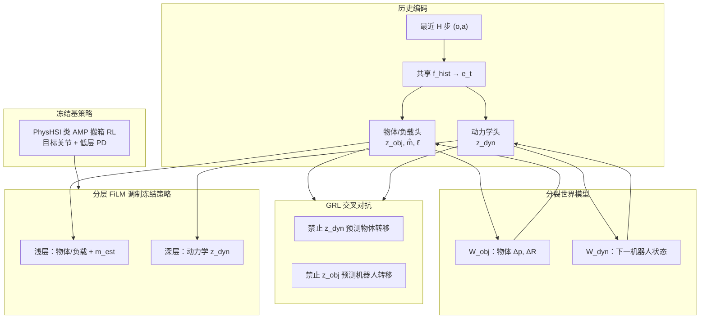

# SplitAdapter（Load-Aware Humanoid Loco-Manipulation via Factorized Adaptation）

**SplitAdapter** 是 Samsung Future Robot AI Group 的人形 **负载感知 loco-manipulation 适配** 论文（arXiv:2606.03297，2026）：在 **冻结** 的 [PhysHSI](./paper-amp-survey-15-physhsi.md) 风格 **AMP 搬箱策略** 上，学习 **因子化** 的在线适配模块，把 **物体/负载变化** 与 **机器人侧动力学失配** 分到两条 latent 支路，经 **分裂世界模型** 与 **GRL 交叉对抗** 抑制信息泄漏，再用 **分层 FiLM** 注入冻结策略。论文在 **MuJoCo sim-to-sim** 与 **Unitree G1 零样本真机** 上验证，相对基策略与 **统一 latent 的 WM-FiLM** 基线，在 **2/4/6 kg** 与 **0/30/60 cm** 搬放高度下提高 **Lift-up** 与 **Full-task**（接近–抬起–搬运–放置全流程）成功率，**6 kg 重载**（含训练质量范围外与 **0 cm 地面搬起**）改进最明显。

## 英文缩写速查

| 缩写 | 英文全称 | 简要说明 |
|------|----------|----------|
| Sim2Real | Simulation to Real | 把仿真中学到的策略迁移落地真机的工程主线 |
| AMP | Adversarial Motion Prior | 用对抗判别约束状态转移接近专家运动分布的先验 |
| MuJoCo | Multi-Joint dynamics with Contact | 接触丰富的刚体物理仿真引擎 |
| G1 | Unitree G1 Humanoid | 宇树入门级教育科研人形平台 |
| Manipulation | Robot Manipulation | 抓取、移动、操作物体的任务总称 |
| AI | Artificial Intelligence | 人工智能 |
| WM | World Model | 学习环境动态以供想象/规划的世界模型 |
| RMA | Rapid Motor Adaptation | 从历史轨迹隐式估计环境参数的快速运动自适应 |
| Isaac Gym | NVIDIA Isaac Gym | GPU 并行刚体仿真训练环境 |
| RL | Reinforcement Learning | 通过与环境交互最大化长期回报来学习策略的范式 |
| PD | Proportional–Derivative | 关节位置/阻抗底层控制，策略输出常为其 setpoint |
| MLP | Multi-Layer Perceptron | 多层感知机，处理本体向量等低维输入 |
| VLA | Vision-Language-Action | 视觉-语言-动作多模态基础策略方向 |

## 为什么重要

- 在 [运动小脑 64 篇技术地图](../overview/humanoid-motion-cerebellum-technology-map.md) 中归类为 **H 真实任务**（54/64）：任务：负载变化下的分解式适配。
- **对准 sim2real 中的「负载 × 动力学」耦合：** 更重箱子或更低搬起点会改变全身协调；同时电机/接触模型误差会让同一载荷在真机上表现不同——**单 latent 历史适配** 易把两类因素混编，重载搬运时尤甚。
- **工程上可插拔：** **不重训** 全身 AMP 策略，只训适配器，与「大策略预训练 + 小模块在线修正」的部署叙事一致（对照 [RMA](../concepts/sim2real.md) 的外参估计思路，但针对 **人形搬箱** 做 **显式因子分解**）。
- **证据链覆盖 sim-to-sim 与真机：** Isaac Gym 训练 → MuJoCo 验证 → G1 **无额外微调** 部署，并报告 **人机递接、大箱/透明箱** 等扩展场景（项目页视频）。

## 流程总览

## 核心机制（归纳）

### 冻结基策略

- **AMP RL** 学人形 **搬箱** 技能（论文以 [PhysHSI](https://arxiv.org/abs/2510.11072) 为参照实现）；动作 **目标关节位置**，低层 **PD** 跟踪。
- 预训练完成后 **策略权重冻结**；适配阶段 **共享原 RL 奖励** 只更新适配器与 FiLM 生成器。

### 双分支上下文

- 从 **观测–动作历史** 得共享嵌入，再分为：
  - **物体/负载支路：** latent \(z_{\mathrm{obj}}\) + 显式 **质量 \(\hat m\)**、**装载概率 \(\hat\ell\)**（有效载荷 \(m_{\mathrm{eff}}=\hat\ell\hat m\)）；
  - **动力学支路：** \(z_{\mathrm{dyn}}\) 承载 **残差动力学/环境失配**。
- 两路 **\(L_1\) 稀疏**；物体侧有 **质量/装载监督损失**。

### 分裂世界模型 + GRL

- **\(W_{\mathrm{obj}}\)** 预测 **物体位姿/朝向增量**；**\(W_{\mathrm{dyn}}\)** 预测 **下一机器人状态**；二者均条件于 **\(m_{\mathrm{est}}\)**，减少 latent 重复编码质量。
- **GRL 对抗头：** 用梯度反转使 \(z_{\mathrm{dyn}}\) **难以** 预测物体转移、\(z_{\mathrm{obj}}\) **难以** 预测机器人转移；**predictability gap** 在启用 GRL 时更大。
- 消融：**去掉 split latent** 对 **6 kg Full-task** 伤害最大；**去掉 GRL** 次之；**去掉分层 FiLM** 主要伤 **搬运/放置** 而 **Lift-up** 仍高——说明分层调制更利于 **抬起之后的全身协调**。

### 分层 FiLM

- 对冻结 MLP 中间层做 \(h'=\gamma(z)\odot h+\beta(z)\)：
  - **浅层：** \((z_{\mathrm{obj}}, m_{\mathrm{est}})\) → 载荷条件化抬升姿态；
  - **深层：** \(z_{\mathrm{dyn}}\) → 补偿 sim–real 动力学差。
- FiLM 参数 **初始化为恒等**，训练初期行为接近原策略。

## 与基线对比

| 方法 | Latent 结构 | 世界模型 | 调制 | MuJoCo Full-task（论文表 1） | G1 真机 Full-task（表 2） |
|------|-------------|----------|------|------------------------------|---------------------------|
| PhysHSI 基策略（冻结） | — | — | — | 71/90 | 16/27 (59.3%) |
| AnyAdapter 式 WM-FiLM | 统一 | 单一转移预测 | FiLM | 75/90 | （未单独报告） |
| SplitAdapter w/o split | 统一 | 分裂 | 分层 FiLM | 81/90 | — |
| SplitAdapter w/o GRL | 分裂 | 分裂 | 分层 FiLM | 84/90 | — |
| SplitAdapter w/o 分层 FiLM | 分裂 | 分裂 | 单层 FiLM | 81/90 | — |
| **SplitAdapter（完整）** | **物体 + 动力学** | **分裂 + GRL** | **分层 FiLM** | **86/90** | **26/27 (96.3%)** |

## 实验设定与结论（量级）

| 阶段 | 设置 | SplitAdapter vs 基线（论文表 1–2） |
|------|------|-----------------------------------|
| Sim-to-sim | MuJoCo；2/4/6 kg × 0/30/60 cm；每格 10 试 | Full-task **86/90** vs PhysHSI **71/90**、WM-FiLM **75/90**；Lift-up **90/90** |
| 真机 G1 | 9 条件×3 试；零样本 | Full-task **26/27 (96.3%)** vs **16/27 (59.3%)**；Lift-up **27/27** vs **22/27** |

- **最难格点：** **6 kg、0 cm** 地面搬起（sim 表 1 高亮）。
- **现象：** 基线与 WM-FiLM 常能 **抬起** 但在 **搬运/放置** 失稳；SplitAdapter 在 **6 kg 各高度** 维持高 Full-task。
- **局限（论文 §6）：** 仅 **刚性箱子** loco-manip；真机重载试验规模受 **G1 单臂约 3 kg 额定载荷** 与硬件耐久约束。

## 常见误区或局限

- **不是端到端重训 loco-manip：** 性能上界仍受 **冻结 PhysHSI 类策略** 能力束缚；适配器解决的是 **载荷/动力学变化下的残余误差**，非从零学新技能。
- **与统一 WM-FiLM 的差异在「分解」而非「是否有世界模型」：** AnyAdapter 式 **单 latent** 也能预测转移，但论文认为 **负载与动力学混编** 会削弱重载表现。
- **代码：** 截至 ingest 时 **项目页未给出公开仓库**；复现以论文与 arXiv 为准。

## 关联页面

- [Loco-Manipulation](../tasks/loco-manipulation.md) — 移动操作任务地图与 2025–2026 路线
- [Sim2Real](../concepts/sim2real.md) — RMA / 世界模型适配 / 冻结策略微调语境
- [PhysHSI（AMP 交互）](./paper-amp-survey-15-physhsi.md) — 冻结基策略来源族
- [Unitree G1](./unitree-g1.md) — 真机平台
- [DoorMan](./paper-doorman-opening-sim2real-door.md) / [LEGS](./paper-legs-embodied-gaussian-splatting-vla.md) — 对照：视觉 Sim2Real 开门 vs 合成数据 VLA 路线

## 推荐继续阅读

- 论文 HTML：<https://arxiv.org/html/2606.03297>
- 项目页：<https://splitadapter.github.io/>
- PhysHSI 原文：<https://arxiv.org/abs/2510.11072>

## 参考来源

- [splitadapter_arxiv_2606_03297.md](../../sources/papers/splitadapter_arxiv_2606_03297.md)
- [splitadapter-github-io.md](../../sources/sites/splitadapter-github-io.md)
