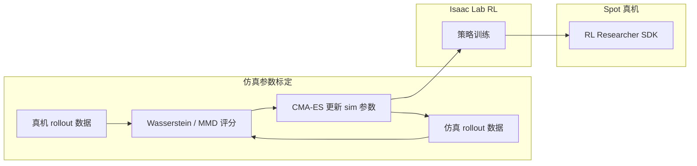

# Spot 高性能 RL（分布距离 Sim2Real 标定）

本工作（arXiv:2504.17857）公开 **Boston Dynamics Spot** 在 **Spot RL Researcher Development Kit** 低层电机接口上的 **端到端强化学习 locomotion** 全流程：在 **NVIDIA Isaac Lab** 训练、真机部署，并用 **Wasserstein 距离** 与 **最大均值差异（MMD）** 量化仿真—硬件数据分布差异，以 **CMA-ES** 自动标定难测仿真参数。

## 一句话定义

**用分布距离当 sim2real 评分、用进化策略搜仿真参数，把 Isaac Lab 里训出的 RL 步态零样本推到 Spot 真机并跑到出厂控制器数倍速度。**

## 英文缩写速查

| 缩写 | 英文全称 | 简要说明 |
|------|----------|----------|
| RL | Reinforcement Learning | 端到端策略学习低层关节目标 |
| Sim2Real | Simulation to Real | 仿真策略迁移真机 |
| MMD | Maximum Mean Discrepancy | 核方法度量两分布差异 |
| CMA-ES | Covariance Matrix Adaptation Evolution Strategy | 无梯度黑盒优化仿真参数 |
| DR | Domain Randomization | 训练时随机化仿真域参数 |
| Isaac Lab | NVIDIA Isaac Lab | Omniverse 机器人学习训练框架 |
| Spot | Boston Dynamics Spot | 四足硬件与 RL Researcher SDK |

## 为什么重要

- **接口里程碑：** 较早 **公开** 的 Spot **低层力矩/电机 API + 开源训练栈（Isaac Lab）+ 官方部署路径** 组合，降低四足 **数据驱动低层控制** 复现门槛。
- **Sim 标定方法论：** 将 **分布距离** 作为 **可优化标量**，比纯人工调 DR 更有系统性和可重复性。
- **性能叙事：** 报告 **>5.2 m/s**、**湿滑面**、**扰动抑制** 与 **含腾空相步态**，为 BD 经典 **模型驱动 WBC/MPC** 提供 **RL 对照上限**。

## 核心结构与方法栈

| 模块 | 作用 |
|------|------|
| **Spot RL SDK** | 访问 **低层电机**，绕过仅速度/姿态的高层接口 |
| **Isaac Lab 训练** | 并行仿真 PPO 类训练（论文语境为高性能 locomotion） |
| **真机—仿真数据采集** | 对齐状态—动作轨迹用于分布比较 |
| **Wasserstein / MMD 评分** | 度量 **sim2real gap** 作为参数搜索目标 |
| **CMA-ES** | 优化 **摩擦、电机等难测参数** |
| **多步态部署** | 含 **flight phase** 的快速步态与鲁棒行走 |

### 流程总览（标定—训练—部署）

## 评测

- **性能上限：** 报告真机 **>5.2 m/s** 高速行进、含 **腾空相（flight phase）** 的动态步态，作为 BD 经典模型驱动控制器的 **RL 对照上限**。
- **鲁棒性维度：** **湿滑面** 行走、外部 **扰动抑制**，以及多步态间的稳定切换。
- **Sim2Real 量化：** 以 **Wasserstein 距离 / MMD** 把仿真—真机轨迹分布差异转成 **可优化标量**，供 CMA-ES 搜索，取代纯人工 DR 调参的定性判断。

## 与其他工作对比

- **vs BD 模型驱动 WBC/MPC：** 经典 BD 路线以 **全身控制 / 模型预测** 为主；本文用 **端到端 RL** 给出同平台性能对照，二者可分层或并存。
- **vs 手工 Domain Randomization：** 传统 DR 靠经验设定随机范围；本文以 **分布距离评分 + 进化策略** 系统化标定难测参数，可重复性更强。
- **vs 同平台任务级自主：** 本页聚焦 **低层 locomotion**；同一 Spot 平台的 **任务级探索自主** 见 [Autonomous Spot / NeBula](./paper-autonomous-spot-nebula-exploration.md)。

## 常见误区或局限

- **误区：「BD 官方步态已被 RL 全面替代」。** 论文为 **研究演示**；产品默认控制器与 SDK 能力边界不同。
- **局限：** **分布匹配** 依赖采集覆盖与特征选择；极端地形或未建模动态仍可能失效。
- **与专利栈关系：** 低层 **电机—控制器一体化** 硬件见 [BD 专利栈](./patent-boston-dynamics-legged-control-stack.md)；**在线轨迹优化** 为经典 BD 控制路线，与本 RL 路线 **可并存或分层**。

## 关联页面

- [Boston Dynamics](./boston-dynamics.md)
- [四足机器人](./quadruped-robot.md)
- [Isaac Gym / Isaac Lab](./isaac-gym-isaac-lab.md)
- [Sim2Real](../concepts/sim2real.md)
- [Domain Randomization](../concepts/domain-randomization.md)
- [强化学习](../methods/reinforcement-learning.md)
- [Autonomous Spot / NeBula](./paper-autonomous-spot-nebula-exploration.md)
- [BD 足式控制专利栈](./patent-boston-dynamics-legged-control-stack.md)

## 参考来源

- [Spot RL 论文摘录（arXiv:2504.17857）](../../sources/papers/spot_rl_distributional_sim2real_arxiv_2504_17857.md)

## 推荐继续阅读

- 论文 PDF：<https://arxiv.org/pdf/2504.17857>
- NVIDIA Isaac Lab 文档：<https://isaac-sim.github.io/IsaacLab/>
- Boston Dynamics Spot SDK：<https://dev.bostondynamics.com/>
