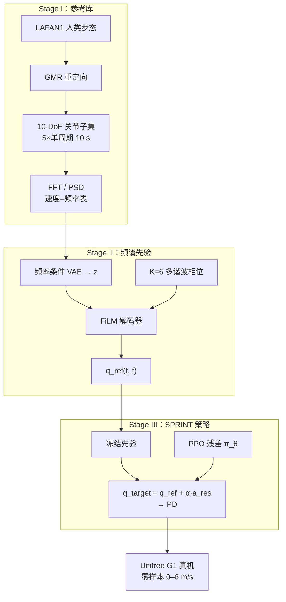

# SPRINT：人形竞技冲刺的高效频谱先验

**SPRINT**（*Efficient Spectral Priors for Humanoid Athletic Sprints*，国防科大 / 湖南大学，arXiv:2605.28549）针对「**参考极少 + 极速不稳定 + 步态难连续切换**」三条瓶颈：用 **频域周期性** 替代大规模 MoCap 或对抗先验，在 **仅 5 条单周期参考** 上训练 **频率自适应频谱生成器**，再与 **残差 RL** 分层，在 **Unitree G1** 真机实现 **峰值 6 m/s** 冲刺与 **0–6 m/s 无缝变速**，并报告 **零样本 sim2real**。

## 英文缩写速查

| 缩写 | 英文全称 | 简要说明 |
|------|----------|----------|
| Sim2Real | Simulation to Real | 把仿真中学到的策略迁移落地真机的工程主线 |
| PPO | Proximal Policy Optimization | 人形/足式 locomotion 中最常用的 on-policy 策略梯度算法 |
| G1 | Unitree G1 Humanoid | 宇树入门级教育科研人形平台 |
| MoCap | Motion Capture | 动作捕捉，参考动作与演示数据的主要来源 |
| RL | Reinforcement Learning | 通过与环境交互最大化长期回报来学习策略的范式 |
| AMP | Adversarial Motion Prior | 用对抗判别约束状态转移接近专家运动分布的先验 |
| GMR | General Motion Retargeting | 把人体/视频动作重定向为机器人可执行参考 |
| VAE | Variational Autoencoder | 变分自编码器，学习隐变量生成表示 |
| OOD | Out-of-Distribution | 分布外样本/未见场景，泛化评测关注点 |
| POMDP | Partially Observable Markov Decision Process | 部分可观测的 MDP，部署时观测受限的常见建模 |
| LLM | Large Language Model | 大语言模型，常作高层任务/语言接口 |
| AI | Artificial Intelligence | 人工智能 |
| Isaac Gym | NVIDIA Isaac Gym | GPU 并行刚体仿真训练环境 |
| Locomotion | Robot Locomotion | 足式/人形等无轮移动能力的总称 |

## 为什么重要

- **数据效率锚点：** 428 帧 / 14 s、5 条离散步态即可覆盖走–慢跑–跑–**参考分布外冲刺**——把「极速人形」从 **堆 MoCap** 转向 **频域归纳偏置 + 外推**。
- **与 AMP 族正交：** 不依赖对抗判别器；高动态下避免 AMP 常见的 **训练不稳定 / mode collapse**（论文动机与 [AMP](../methods/amp-reward.md) 对照实验）。
- **速度纪录语境：** 仿真峰值 **6 m/s**、真机 field 验证；高于 [Chasing Autonomy](../methods/chasing-autonomy-pipeline.md)（~3.3 m/s 户外）与 [SD-AMP](./paper-unified-walk-run-recovery-sdamp.md) 快速模式（~3 m/s），且强调 **单策略连续命令** 而非分模块 FSM。
- **工程可复用结构：** **冻结运动先验 + 残差稳定化 + AAC + 域随机** 与多条人形 sim2real 线一致，便于与 [Sim2Real](../concepts/sim2real.md) 检查清单对照。

## 流程总览

## 核心机制（归纳）

### 1）极少参考 + 频域外推

- 从 LAFAN1 经 [GMR](../methods/motion-retargeting-gmr.md) 得到 **5 条** 走 / 慢跑 / 跑单周期轨迹；锚定速度 $\{0.66,\ldots,3.40\}$ m/s 与主频 $\{0.68,\ldots,1.58\}$ Hz。
- **频谱先验**以目标频率 $f$ 为条件，用 VAE 潜变量 + 多谐波 $\sin/\cos(k\phi)$ + FiLM 解码生成 **10 关节**参考；在 **0.6–2.3 Hz**（含参考边界外）仍约束关节幅值，支撑 **OOD 速度外推**。

### 2）分层残差控制

- 先验 **冻结**；PPO 在 POMDP 下只学 **残差** $a^{\mathrm{res}}$，减轻纯任务奖励的「能走但不像人」。
- 奖励分解：平滑速度命令跟踪 $r_{\mathrm{task}}$、先验贴合 $r_{\mathrm{prior}}$、足端相位/滑移 $r_{\mathrm{feet}}$、躯干前倾等 $r_{\mathrm{reg}}$（高速需重心前移）。

### 3）Sim2real

- **非对称 Actor–Critic**：actor 仅本体感觉 + 命令 + 上步残差；critic 额外见线速度与先验参考。
- **渐进速度课程** + 质量/摩擦/电机延迟等 **动力学随机化** → 论文报告 **零样本** 真机，指标与仿真在全速域一致。

## 常见误区

1. **「5 条 clip = 只能复现 5 个速度」：** 先验在 **连续频率** 上生成轨迹；5 条仅提供 **归纳偏置**，外推至 6 m/s 是论文主 claim之一（需用 $E_{\mathrm{BA}}$、FID 等核对）。
2. **SPRINT = 又一个 AMP：** 先验是 **监督式频谱生成器**，非对抗分布匹配；与 [SD-AMP](./paper-unified-walk-run-recovery-sdamp.md) 的 **双判别器路由** 也不同。
3. **与 Stanford「SPRINT」推理模型同名：** 本仓库实体专指 **人形冲刺** arXiv:2605.28549；勿与 LLM 并行推理论文混淆。

## 实验与评测（索引）

| 维度 | 论文报告要点 |
|------|----------------|
| 先验 vs AI-CPG | $L_{\mathrm{rec}}$、FID、$E_{\mathrm{BA}}$ 显著更低 |
| 策略 vs Humanoid-Gym / AMP | 6 m/s 峰值、更低 FID 与 $E_{\mathrm{qpos}},E_{\mathrm{vel}}$、更快收敛 |
| 真机 | G1 零样本；连续步态切换；项目页含 1.1/1.3/1.7 m 先验可视化 |
| 训练成本 | Isaac Gym，单卡 RTX 4090 ~6.5 h |

定量表格与消融见 [参考来源](#参考来源) 中 arXiv 原文。

## 与其他工作对比

| 路线 | 先验 / 参考 | 连续全速域 | 论文峰值（G1） |
|------|-------------|------------|----------------|
| **SPRINT** | 5 条 + 频谱 VAE | 0–6 m/s 单策略 | **6 m/s 真机** |
| [SD-AMP](./paper-unified-walk-run-recovery-sdamp.md) | 3 条 LAFAN1 + 双 AMP | 走跑 + 起身 | ~3 m/s 快速模式 |
| [Chasing Autonomy](../methods/chasing-autonomy-pipeline.md) | 动态重定向周期库 | 目标条件奔跑 | ~3.3 m/s 户外 |
| AMP / Humanoid-Gym | 对抗 / 手工奖励 | 依实现而定 | 冲刺稳定性弱于 SPRINT（论文对照） |

## 参考来源

- [SPRINT（arXiv:2605.28549）](../../sources/papers/sprint_arxiv_2605_28549.md)
- [匿名项目页（视频与跨平台 demo）](../../sources/sites/sprint-anonymous-project-page.md)
- Wei et al., *SPRINT: Efficient Spectral Priors for Humanoid Athletic Sprints*, arXiv:2605.28549, 2026. <https://arxiv.org/abs/2605.28549>

## 关联页面

- [Humanoid Locomotion](../tasks/humanoid-locomotion.md)、[Locomotion](../tasks/locomotion.md)、[Sim2Real](../concepts/sim2real.md)
- [AMP & HumanX](../methods/amp-reward.md)、[GMR](../methods/motion-retargeting-gmr.md)、[LAFAN1](./lafan1-dataset.md)、[Unitree G1](./unitree-g1.md)
- [SD-AMP](./paper-unified-walk-run-recovery-sdamp.md)、[Chasing Autonomy Pipeline](../methods/chasing-autonomy-pipeline.md)
- [人形运动跟踪方法选型](../queries/humanoid-motion-tracking-method-selection.md)

## 推荐继续阅读

- [arXiv HTML（方法 III 节公式与 Table I–II）](https://arxiv.org/html/2605.28549v1)
- [匿名项目页](https://anonymous.4open.science/w/SPRINT-138A/) — 跨身高先验与真机视频
- [AI-CPG 相关 prior 线](https://arxiv.org/html/2605.28549v1#S2) — 论文 Related Work 中的频域 CPG 对照
