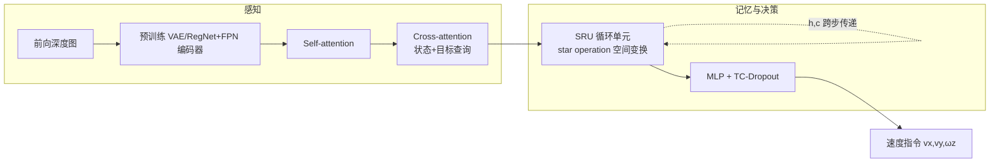

# SRU（Spatially-Enhanced Recurrent Memory）

**SRU**（*Spatially-Enhanced Recurrent Memory for Long-Range Mapless Navigation via End-to-End Reinforcement Learning*，IJRR 2025，[arXiv:2506.05997](https://arxiv.org/abs/2506.05997)，[项目页](https://michaelfyang.github.io/sru-project-website/)）来自 **ETH Zurich RSL**：在 **端到端强化学习** 的无地图导航中，指出 **LSTM / GRU / S4 / Mamba-SSM** 等标准循环单元 **擅长时序记忆、却难以把不同视角的地标对齐到一致空间表示**；提出 **Spatially-Enhanced Recurrent Units（SRU）**——在 LSTM/GRU 递推中增加 **逐元素乘法（star operation）** 可学习空间变换项，配合 **双阶段空间注意力**、**TartanAir 大规模深度预训练** 与 **稀疏奖励 + DML + TC-Dropout**，用 **单目前向立体深度** 完成 **50–120 m 级** 目标导航，并在 **Unitree B2W** 上 **零样本** 真机部署。

## 一句话定义

**给 RNN 补上「空间配准」能力**——用轻量 star operation 让循环隐状态能记住「障碍曾在哪」，而不是只会记「上一帧发生了什么」。

## 英文缩写速查

| 缩写 | 英文全称 | 简要说明 |
|------|----------|----------|
| SRU | Spatially-Enhanced Recurrent Unit | 在 LSTM/GRU 上增强空间记忆的循环单元 |
| RNN | Recurrent Neural Network | 用隐状态融合历史观测的序列模型 |
| LSTM | Long Short-Term Memory | 带门控的长期依赖循环网络 |
| GRU | Gated Recurrent Unit | 简化门控的循环网络 |
| RL | Reinforcement Learning | 通过与环境交互学习策略 |
| DML | Deep Mutual Learning | 双策略并行 + KL 蒸馏防过拟合 |
| TC-Dropout | Temporally Consistent Dropout | 跨时间步共享 dropout mask 的稳定训练技巧 |
| FPN | Feature Pyramid Network | 多尺度特征金字塔，用于深度编码 |

## 为什么重要

- **厘清 RNN 在无地图导航中的真实短板：** 端到端导航常把 RNN 当「隐式地图」；本文用受控实验表明 **时序拟合 ≠ 空间配准**——LSTM 在楼梯、坑洞等需 **3D 空间记忆** 场景成功率仅 **~33%**，而 SRU 达 **~83%**。
- **简单可插拔：** SRU 是对现有 LSTM/GRU 的 **最小修改**（独立模块 [`sru-pytorch-spatial-learning`](https://github.com/ManifoldTechLtd/sru-pytorch-spatial-learning) 可 `pip install`），相对堆叠历史帧（GTRL）或显式建图（EMHP）更易嵌入既有 RL 栈。
- **长程隐式记忆：** 显式历史窗口约 **20 m** 后性能陡降；SRU 隐式记忆在 **50 m+** 仍 **>80%**、**120 m** 轨迹 **>70%**——适合走廊/森林等 **超长可达** 场景。
- **零样本 sim-to-real 范例：** **10 万+ 合成深度预训练 + 并行深度噪声增强** 后，**B2W + ZedX + Jetson Orin** 在办公室、露台、森林 **无需真机微调** 即部署；与 [Sim2Real](../concepts/sim2real.md) 中「感知域适应」讨论直接相关。
- **与 WAM / VLA 导航的对照轴：** 同为闭环导航，[NavWAM](./paper-navwam-goal-conditioned-visual-navigation-wam.md) 走 **扩散世界–动作联合**；SRU 走 **轻量循环记忆 + 注意力压缩**，算力与部署路径更贴近 **传统 on-policy RL + ONNX**（见 [SRU-Odin](./sru-odin.md)）。

## 核心结构

| 模块 | 作用 |
|------|------|
| **预训练深度编码器** | RegNet + FPN，在 TartanAir 等合成数据上自监督预训练；部署时仅吃 **单通道深度** |
| **Self-attention** | 为视觉特征注入全局上下文 |
| **Cross-attention** | 由 **机体状态 + 目标向量** 查询，压缩为任务相关空间线索（无显式注意力监督） |
| **SRU（LSTM-SRU / GRU-SRU）** | 融合历史 latent，执行 **隐式空间变换与记忆** |
| **MLP + TC-Dropout** | 输出 **机体坐标系速度指令**（训练用 PPO/MDPO，rsl_rl） |

### 流程总览

### 训练策略要点

| 技巧 | 目的 |
|------|------|
| **稀疏奖励** | episode 末时间奖励 + 随机早停，避免中间 shaping 破坏探索 |
| **DML（双策略 KL）** | 抑制循环网络早期过拟合到短视特征 |
| **TC-Dropout** | rollout/训练共享时间一致 mask，稳定 BPTT |
| **合成深度噪声 DR** | 桥接仿真深度与真机 ZedX / 其他深度相机 |

## 实验要点（索引级）

| 轴 | 报告口径 |
|----|----------|
| **仿真环境** | Maze / Pillars / Stairs / Pits 四类；IsaacLab `sru-navigation-sim` |
| **vs 标准 RNN** | Overall **78.9%** vs LSTM **63.5%** / GRU **61.0%**（**+23.5%**） |
| **vs 显式建图 EMHP** | **+29.6%** |
| **vs 堆叠帧 GTRL** | **+105%**；仅换 SRU 记忆即 **+73%** |
| **真机平台** | **Unitree B2W** + ZedX（105° FoV，10 m）+ Jetson AGX Orin（5 Hz 策略） |
| **真机范围** | 单目标 **70 m+**（训练最长 30 m）；森林单次 **100 m+** 穿行 |
| **定位** | DLIO LiDAR 里程计（**非建图导航**；策略本身无地图） |

### 与相邻范式的边界

| 范式 | 与 SRU 的分界 |
|------|----------------|
| **显式 SLAM + 规划** | SRU **无占据栅格/全局规划**；深度 + 目标向量端到端 |
| **历史帧堆叠（GTRL）** | 固定窗口、难长程；SRU **无限上下文式隐式记忆** |
| **NavWAM 等 WAM** | 扩散联合未来观测与动作；SRU 为 **轻量 RNN + 注意力** |
| **VLN** | 见 [视觉–语言导航](../tasks/vision-language-navigation.md)；SRU 为 **坐标/向量目标**，非自然语言 |
| **360° / 多相机导航** | SRU 刻意 **单前向深度**，强调可部署性 |

## 常见误区或局限

- **不是 SLAM 替代品：** 真机实验仍用 **DLIO** 做状态估计；策略不做全局一致地图，**定位误差会传导** 到目标相对几何。
- **目标表示：** 论文为 **相对目标向量/坐标**，与 **image-goal**（NavWAM）或 **语言目标**（VLN）不同，不可直接混比 benchmark。
- **硬件绑定：** 上游真机为 **轮足 B2W**；四足纯腿式需重新验证动力学（[SRU-Odin](./sru-odin.md) 在 Go2 上通过 **cmd_vel + 缩放** 做工程移植）。
- **训练栈重量：** 完整复现依赖 **IsaacLab + rsl_rl + 多仓扩展**；推理侧可 ONNX 化，但预训练深度编码器仍占算力。

## 关联页面

- [SRU-Odin](./sru-odin.md) — ManifoldTech **Odin1 + Go2** 移植、Docker 训练与 LLM 部署提示词
- [Sim2Real](../concepts/sim2real.md) — 合成深度预训练与零样本迁移语境
- [isaac-gym-isaac-lab](./isaac-gym-isaac-lab.md) — 训练仿真底座
- [Unitree](./unitree.md) — B2W / Go2 硬件族
- [NavWAM](./paper-navwam-goal-conditioned-visual-navigation-wam.md) — image-goal WAM 导航对照
- [视觉–语言导航](../tasks/vision-language-navigation.md) — 语言条件导航任务族

## 推荐继续阅读

- [SRU 项目页](https://michaelfyang.github.io/sru-project-website/) — 注意力可视化、轨迹对比与演示视频
- [IJRR 论文](https://doi.org/10.1177/02783649251401926)
- [sru-navigation-sim](https://github.com/ManifoldTechLtd/sru-navigation-sim) — IsaacLab 导航任务扩展
- [SRU-Odin 仓库](https://github.com/ManifoldTechLtd/SRU-Odin) — Go2 + Odin1 半天部署工作流

## 参考来源

- [SRU 论文归档](../../sources/papers/sru_spatially_enhanced_recurrent_memory_ijrr_2025.md)
- [SRU 项目页](https://michaelfyang.github.io/sru-project-website/)
