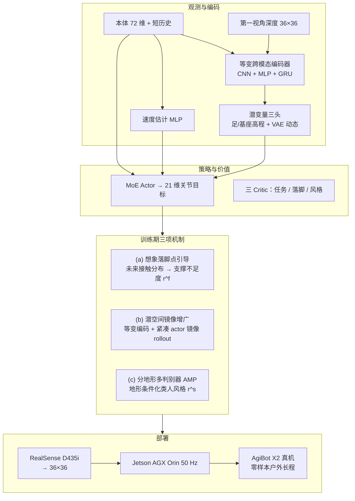

# SSR：开放世界人形安全对称穿越

**SSR**（*Scaling Surefooted and Symmetric Humanoid Traversal to the Open World*，浙江大学，arXiv:2605.30770）提出 **单阶段端到端** 第一视角深度人形穿越框架：从 **本体 + 36×36 深度** 直接学 **可靠落脚** 与 **协调、自然全身运动**，在 **AgiBot X2** 上零样本完成多样楼梯、**90 cm 沟壑**、**45 cm 高台** 与 **1.3 km 户外长程**；并报告 **1.8 m / 70 kg** 全尺寸人形跨形态验证。

## 英文缩写速查

| 缩写 | 英文全称 | 简要说明 |
|------|----------|----------|
| SSR | Scaling Surefooted and Symmetric Humanoid Traversal to the Open World | 本文框架：单阶段深度人形开放世界安全对称穿越 |
| PPO | Proximal Policy Optimization | 单阶段策略优化算法 |
| AMP | Adversarial Motion Priors | 对抗运动先验；分地形多判别器提供类人风格奖励 |
| MoE | Mixture of Experts | 策略 Actor 的多专家结构 |
| GRU | Gated Recurrent Unit | 跨模态编码器中的循环单元，处理深度时序 |
| VAE | Variational Autoencoder | 潜变量分支：预测下一时刻本体并正则化动态 |
| POMDP | Partially Observable Markov Decision Process | 部分可观测 MDP；部署时仅有深度 + 本体 |
| CNN | Convolutional Neural Network | 处理 36×36 第一视角深度 |
| MLP | Multi-Layer Perceptron | 处理本体向量与速度估计 |
| RL | Reinforcement Learning | 强化学习范式 |
| SFR | Support Footprint Ratio | 支撑比 >75% 的有效落脚占比（安全落脚指标） |
| MSR | Mean Support Ratio | 落脚平均支撑比（安全落脚指标） |
| OOD | Out-of-Distribution | 分布外 / 未见地形泛化评测 |
| Sim2Real | Simulation to Real | 仿真训练、真机零样本部署 |
| PHP | Perceptive Humanoid Parkour | 感知人形跑酷多阶段对照路线 |
| DCM | Divergent Component of Motion | 发散运动分量；FastStair 等路线的规划监督用语 |
| DAgger | Dataset Aggregation | 数据集聚合蒸馏（多阶段感知 locomotion 对照） |

## 为什么重要

- **开放世界 = 落脚 × 动态 × 长程：** 人类环境中穿越不止「能走」，还要在 **高动态摆动相** 里用视觉把脚引向 **足弓可支撑区域**；边缘落脚对平足人形尤其致命。
- **把稀疏接触安全信号前移：** 多数感知 locomotion 只在 **触地时/后** 评估落脚；SSR 的 **想象落脚点引导** 在摆动相预测未来接触分布并度量 **支撑不足度**，改善摆动相 credit assignment（消融 **NoImgn** 落脚仍偏边缘）。
- **视觉 RNN 上的对称学习可扩展：** 输入级镜像要重编码深度 + 滚动镜像隐藏态；**等变编码器 + 潜空间增广** 在 RTX 4090 上相对输入镜像 **省约 18% 显存** 且更快达最大地形难度。
- **单策略覆盖多地形 + 户外外推：** 相对 [HPL](./paper-hrl-stack-22-perceptive_humanoid_parkour.md) 等多阶段跑酷管线，SSR 强调 **统一单阶段** 与 **长程野外**（工业遗产公园 1.3 km）而不仅是结构化障碍课。

## 流程总览

## 核心机制（归纳）

### 1）想象落脚点引导（Imagined Foothold Guidance）

- 训练期 **落脚点想象模型** 由特权状态与动作预测双足 **高斯未来接触分布** $\hat{F}_{i,t}$；监督为摆动足 **首次有效未来接触**。
- 在 **22.5 cm × 10 cm** 鞋底 patch 上计算 **支撑不足度** $\rho(\mathbf{p})$：相对鞋底高度的有效支撑重叠越低，$\rho$ 越大（边缘/悬空更高）。
- 奖励 $r^f$：**支撑相** 评估当前接触；**摆动相** 对想象分布求期望不足度——把触地后稀疏信号变成 **摆动相密集纠正**。
- 早期步态噪声大时以 **地形等级** 作可靠性课程，超过阈值才启用预接触引导。

### 2）等变潜空间对称增广

- 高维深度 + RNN 的 **输入级镜像** 需额外前向与隐藏态 rollout；SSR 对 **紧凑 actor 输入**（本体、估计速度、潜变量）做镜像并拼入 PPO batch。
- **等变编码器** 保证「镜像观测 → 镜像潜变量」；潜变量按左右通道组组织，$\mathcal{M}_c$ 为组间交换。
- 相对 **NoSym**：八向速度跟踪更准、原地转向轨迹更对称，支持 **左右脚均可领先** 的沟壑/高台穿越；相对 **InpSym**：更高 episodic return、更快 curriculum 爬升。

### 3）分地形多判别器运动先验

- 每种训练地形一个 AMP 判别器 $D_i$，五帧 63 维运动片段；风格奖励 $r^s$ 鼓励 **地形适配的类人行为**。
- 消融 **NoStyle** 平均功率与峰值足端力升高；**SglDisc** 单判别器略逊，说明 **地形条件化风格** 对多场景统一策略有益。

### 4）单阶段 PPO 与架构要点

- **POMDP + 非对称 actor–critic**；**三 critic** 分别拟合任务、落脚、风格价值。
- 编码器解码足周/躯干 **特权高程图**（训练期）并 VAE 预测下一时刻本体；部署仅依赖深度 + 本体 + 估计速度。
- 仿真：**4096 AgiBot X2**、Isaac Gym + **NVIDIA Warp** 渲染与部署一致的自遮挡深度；约 **20k** 迭代 / RTX 4090。

## 常见误区

1. **「想象落脚点 = 在线规划器」** — 想象模型仅在 **训练期** 用特权信息塑形 $r^f$；部署是 **端到端深度策略**，不运行显式落点优化。
2. **「对称增广 = 数据翻倍」** — 关键在 **等变结构** 使潜变量镜像合法，避免对整张深度图与 RNN 状态做昂贵镜像前向。
3. **「单阶段 = 没有课程」** — 仍有 **地形难度课程** 与落脚引导的 **可靠性门控**；「单阶段」指相对 HPL 等 **无分阶段蒸馏/专家管线**。
4. **与 [FastStair](./paper-faststair-humanoid-stair-ascent.md) 混淆** — FastStair 用 **DCM 规划监督 + 分速专家 LoRA** 追 **高速上楼**（LimX Oli）；SSR 用 **深度端到端 + 想象落脚 + 对称 + 分地形 AMP** 覆盖 **上下楼梯、沟壑、高台与户外长程**（AgiBot X2）。

## 实验与评测（索引）

| 维度 | 论文报告要点 |
|------|----------------|
| 仿真成功率 | 训练难度近 **100%**；课程外 **90 cm 沟**、**45 cm 台** |
| 安全落脚 | **SFR / MSR** 全面领先；**NoFoothold / NoImgn** 降幅最大 |
| 对称与效率 | 相对 **InpSym** 显存 **23.7 vs 28.8 GB**；双侧领先能力 |
| 实验室零样本 | 15/30 cm 上下楼梯 **100%**；80 cm 沟 **95%**；40 cm 台 **100%** |
| OOD 实验室 | 90 cm 沟 **85%**；45 cm 台 **95%** |
| 户外长程 | **1.3 km / 40 min**；窄踢面/螺旋梯/高草/滑移面等 |
| 跨平台 | **1.8 m / 70 kg** 人形（项目页） |
| 对照 | **HPL、PIM** 随难度急剧退化 |

定量表格与消融见 [参考来源](#参考来源) 中 arXiv 原文。

## 与其他工作对比

| 路线 | 感知 | 落脚/安全信号 | 阶段 | 户外长程 |
|------|------|---------------|------|----------|
| **SSR** | 36×36 深度 | **想象未来接触 + 支撑不足度** | **单阶段 PPO** | **1.3 km** |
| [PHP](./paper-hrl-stack-22-perceptive_humanoid_parkour.md) | 深度 | motion tracking 参考 + DAgger | 多阶段蒸馏 | 跑酷障碍课 |
| [FastStair](./paper-faststair-humanoid-stair-ascent.md) | 高程图 | DCM 规划监督 | 三阶段 + LoRA | 螺旋梯/竞赛 |
| [Explicit Stair Geometry](./paper-explicit-stair-geometry-humanoid-locomotion.md) | 点云 BEV token | 几何条件化 PPO | 单阶段 | 长户外楼梯 |
| HPL（论文基线） | 深度 | 稀疏/间接 | 多阶段 | 结构化课 |

## 参考来源

- [SSR 论文摘录（arXiv:2605.30770）](../../sources/papers/ssr_arxiv_2605_30770.md)
- [ssr-humanoid.github.io 项目页归档](../../sources/sites/ssr-humanoid-github-io.md)
- Yu et al., *SSR: Scaling Surefooted and Symmetric Humanoid Traversal to the Open World*, arXiv:2605.30770, 2026. <https://arxiv.org/abs/2605.30770>

## 关联页面

- [楼梯与障碍 Locomotion](../tasks/stair-obstacle-perceptive-locomotion.md)、[Humanoid Locomotion](../tasks/humanoid-locomotion.md)、[Locomotion](../tasks/locomotion.md)
- [Terrain Adaptation](../concepts/terrain-adaptation.md)、[Footstep Planning](../concepts/footstep-planning.md)、[Privileged Training](../concepts/privileged-training.md)、[Sim2Real](../concepts/sim2real.md)
- [AMP & HumanX](../methods/amp-reward.md)、[Reinforcement Learning](../methods/reinforcement-learning.md)、[Isaac Gym / Isaac Lab](./isaac-gym-isaac-lab.md)
- [PHP](./paper-hrl-stack-22-perceptive_humanoid_parkour.md)、[FastStair](./paper-faststair-humanoid-stair-ascent.md)、[Explicit Stair Geometry](./paper-explicit-stair-geometry-humanoid-locomotion.md)

## 推荐继续阅读

- [arXiv HTML（方法 III 节与 Fig. 2–9）](https://arxiv.org/html/2605.30770v1)
- [项目页（长程户外与跨平台视频）](https://ssr-humanoid.github.io/)
- [楼梯与障碍中心节点](../tasks/stair-obstacle-perceptive-locomotion.md) — 带感知人形楼梯/越障横向对照
