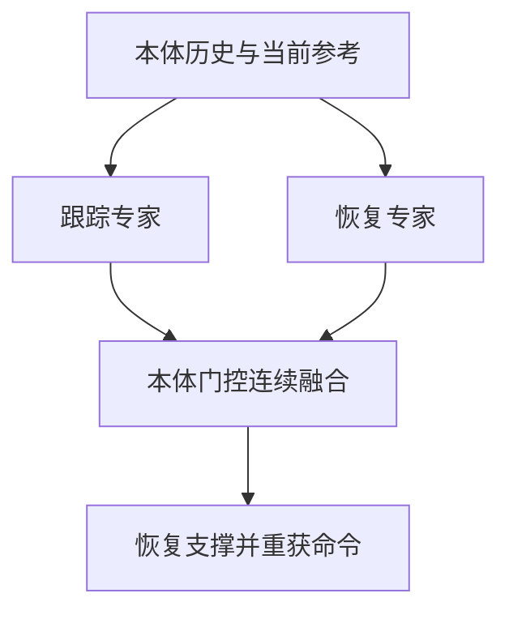

# StableMimic：人形动作跟踪与跌倒恢复

## 一句话定义

StableMimic 以跟踪专家、恢复专家和本体感觉门控统一处理人形动作跟踪、跌倒后恢复及当前命令重获。

## 英文缩写速查

| 缩写 | 英文全称 | 说明 |
|---|---|---|
| WBC | Whole-Body Control | 全身协调控制 |
| RL | Reinforcement Learning | 强化学习策略训练 |
| G1 | Unitree G1 Humanoid | 相关论文的真机平台 |

## 流程总览

## 方法与证据

论文用扰动重置覆盖俯卧、仰卧和中间地面接触状态。专用专家处理跟踪与恢复的不同状态分布，隐藏 successor-state 目标帮助策略回到可跟踪区域。论文报告 100 次配对推倒试验全部恢复；该结论限于其训练和测试协议。

## 局限与风险

结果依赖训练覆盖、机器人配置、传感器和论文中的任务协议。文章摘要可辅助定位；定量结果与代码开放状态应以论文和官方项目页为准。

## 结论

- 识别策略接收的目标和部署时实际可见的观测。
- 区分仿真评测、受控真机展示与开放场景能力。
- 结合接触、身体平衡和任务进度评估，不用单一成功率代表通用性。

## 参考来源

- [来源档案](../../sources/papers/stablemimic_arxiv_2608_02385.md)
- [arXiv:2608.02385](https://arxiv.org/abs/2608.02385)

## 推荐继续阅读

- [Day 4：移动操作](../overview/humanoid-motion-intelligence-day4-loco-manipulation.md)
