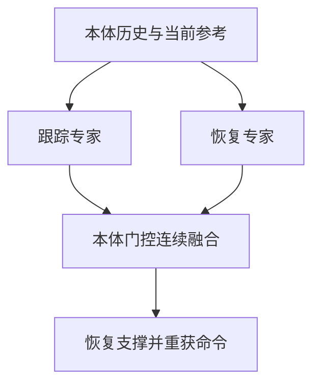

# StableMimic：人形动作跟踪与跌倒恢复

## 一句话定义

StableMimic 以跟踪专家、恢复专家和本体感觉门控统一处理人形动作跟踪、跌倒后恢复及当前命令重获。

## 英文缩写速查

| 缩写 | 英文全称 | 说明 |
|---|---|---|
| WBC | Whole-Body Control | 全身协调控制 |
| RL | Reinforcement Learning | 强化学习策略训练 |
| G1 | Unitree G1 Humanoid | 相关论文的真机平台 |

## 流程总览

## 方法与证据

论文用扰动重置覆盖俯卧、仰卧和中间地面接触状态。专用专家处理跟踪与恢复的不同状态分布，隐藏 successor-state 目标帮助策略回到可跟踪区域。论文报告 100 次配对推倒试验全部恢复；该结论限于其训练和测试协议。

## 实验与评测

- **平台与协议**：Unitree G1；所有方法在同一个名义 MuJoCo G1 环境中评测（仿真步长 0.005 s，确定性动作 50 Hz），测试时关闭随机化、观测噪声、延迟和提前终止。跟踪命令取自 retargeted LAFAN1 dance 子集；训练用 get-up 参考库取自 LAFAN1 get-up 子集，两者序列不重叠。
- **任务**：（1）全部 LAFAN1 dance 序列的完整跟踪；（2）跌倒后恢复并重获命令。恢复测试对每个方法使用同一组 100 次预生成扰动：+x/-x/+y/-y 各 25 次，持续 0.2 s、大小 525–575 N 的水平躯干推力，horizon 20 s。
- **基线**：Single-MLP 消融（同观测、奖励和 PPO 设置，1024–512–256 加宽主干，参数量超过 MoE Actor）、BeyondMimic-style tracker、KungFuAthlete、BFM-Zero；基线均保留原训练流程。
- **跟踪结果（论文报告，Table III）**：StableMimic (MoE) MPBPE 28.53 mm、MJAE 88.83×10⁻³ rad、MJAVE 798.22×10⁻³ rad/s，四项指标均为最低；BeyondMimic 为 32.37 mm / 104.50，Single-MLP 为 32.66 mm / 113.56，KungFuAthlete 为 56.04 mm，BFM-Zero 为 249.40 mm。
- **恢复结果（论文报告，Table IV）**：成功率 StableMimic 100/100、KungFuAthlete 100/100、Single-MLP 98/100、BFM-Zero 94/100、BeyondMimic 0/100。跌倒后 3 s 窗口内，StableMimic 的肢体速度 P95（4.91 m/s）、肢体行程（13.80 m）、关节速度 P95（5.26 rad/s）、恢复位移（1.32 m）、力矩 P95（19.64 N·m）和正功（0.61 kJ）均为最低；关节目标变化率最低的是 BFM-Zero（14.60 vs 17.35 rad/s）。
- **训练动态**：30,000 次迭代中，MoE 比 Single-MLP 更早稳定 episode 长度和奖励，策略标准差也更低。论文说明这些曲线只是描述性证据，不能直接证明专家相互独立。
- **真机**：导出单个 ONNX 策略，在 G1 上以 50 Hz 运行，输入只有实时命令和机载本体感觉。论文定性展示了 dance 跟踪与常值站立参考两种策略在人为推倒后恢复并继续任务；作者明确说明这不是安全认证，也没有做真机上的匹配对比。

## 与其他工作对比

| 对照 | 区别 | 取舍 |
|---|---|---|
| [BeyondMimic](../methods/beyondmimic.md) | 只做跟踪，命令不可达时继续追参考；本协议下 0/100 恢复，肢体运动和力矩最大 | 跟踪精度接近（MPBPE 32.37 vs 28.53 mm），但没有跌倒后的行为设计 |
| [KungFuAthlete](paper-kungfuathlete-humanoid-martial-arts-tracking.md) | 同样支持自主恢复和命令重获，也是 100/100 | StableMimic 的肢体行程、恢复位移、力矩和正功更低，跟踪误差也明显更低 |
| [BFM-Zero](paper-bfm-zero.md) | 用 promptable behavioral foundation model 覆盖多种行为，训练算力高 | 关节目标变化率最低，但恢复率 94/100，跟踪误差远大于其他方法（249.40 mm） |
| [SONIC](../methods/sonic-motion-tracking.md) | 大规模扩展动作跟踪，但不规定跟踪走廊外的人类式响应 | 论文只在 Table I 做定性对比，没有纳入定量评测 |
| [HoST](paper-host-humanoid-standingup.md) / [HumanUP](paper-humanup-getting-up.md) | 独立的起身策略，不做动作跟踪，也不恢复原命令 | 起身能力更专门，但需要和跟踪器切换；StableMimic 把恢复嵌入常驻跟踪器 |
| Single-MLP 消融 | 同接口同奖励，只换成单一加宽主干 | 参数更多但跟踪和恢复都更差（98/100），支持用专家拆分减少两种状态分布之间的更新干扰 |

## 局限与风险

结果依赖训练覆盖、机器人配置、传感器和论文中的任务协议。文章摘要可辅助定位；定量结果与代码开放状态应以论文和官方项目页为准。

## 结论

- 部署时 Actor 只看实时命令和本体历史；get-up 参考、相位和恢复标志只在训练中使用。
- 定量结论全部来自同一 MuJoCo 协议和 100 次推力扰动；真机只有定性展示。
- 评估恢复不能只看成功率：KungFuAthlete 同为 100/100，差异体现在肢体速度、行程、力矩和能量上。

## 关联页面

- [平衡恢复任务](../tasks/balance-recovery.md)
- [Day 3：动作跟踪与全身控制](../overview/humanoid-motion-intelligence-day3-motion-tracking-wbc.md)

## 参考来源

- [来源档案](../../sources/papers/stablemimic_arxiv_2608_02385.md)
- [arXiv:2608.02385](https://arxiv.org/abs/2608.02385)

## 推荐继续阅读

- [Day 4：移动操作](../overview/humanoid-motion-intelligence-day4-loco-manipulation.md)
