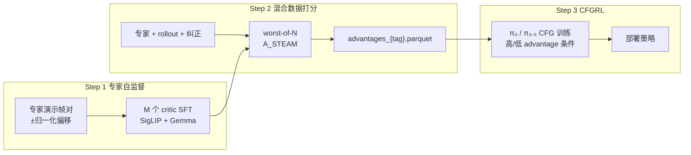

# STEAM：自监督时序 Ensemble Advantage 建模

**STEAM**（*Self-Supervised Temporal Ensemble Advantage Modeling for Real-World Robot Learning*，[arXiv:2606.29834](https://arxiv.org/abs/2606.29834)，清华、中科院自动化所、Stride AI、鹏城实验室、无问芯穹等）提出 **无标签帧级 advantage** 框架：仅在 **专家演示** 上，用帧对 **signed 时间偏移**（含反序伪倒退）作自监督目标，训练 **M 个 SigLIP+Gemma 时序分箱分类器**；推理时对混合数据取 **\(A_{\mathrm{STEAM}}=\min_m A_m\)** 保守打分，再经 **分源 quantile 二值化 + CFGRL** 优化 **π₀** 策略——**全程无需在线 rollout、手工奖励或人工标注**。在四项真机操作（折毛巾、薯片结账、可乐补货、抓取放置）上，成功率 **75–93.8%**，较 BC 绝对提升 **16.2%–59%**，显著超过 **RECAP**（VLM 价值估计）与 **HG-DAgger**；官方工程管线见 [RLinf STEAM 文档](https://rlinf.readthedocs.io/en/latest/rst_source/examples/embodied/steam.html)。

## 一句话定义

**用专家轨迹内帧对的归一化时间效率作自监督信号，ensemble worst-of-N 保守估计帧级 advantage，再以 CFGRL 从混合质量演示与 rollout 中筛出高进展帧来提纯 VLA。**

## 英文缩写速查

| 缩写 | 英文全称 | 简要说明 |
|------|----------|----------|
| STEAM | Self-supervised Temporal Ensemble Advantage Modeling | 本文自监督时序 ensemble advantage 框架 |
| CFGRL | Classifier-Free Guidance RL | 用 CFG 思想做可控策略改进的离线 RL 范式（Frans et al. 2025） |
| VLA | Vision-Language-Action | 视觉–语言–动作策略；本文用 π₀ 骨干 |
| BC | Behavior Cloning | 仅模仿专家演示的监督基线 |
| HG-DAgger | Human-Gated DAgger | 人类专家在线纠正的模仿学习基线 |
| RECAP | — | VLM 价值估计 + CFGRL 的经验学习对照（Amin et al. π\*0.6 系） |

## 核心信息

| 字段 | 内容 |
|------|------|
| **机构** | 清华大学（Tsinghua University）等；通讯 Xinlei Chen、Chao Yu |
| **arXiv** | [2606.29834](https://arxiv.org/abs/2606.29834) |
| **策略** | π₀ + CFGRL |
| **Critic** | SigLIP-SO400M + Gemma-3-270M；默认 **N=32 bins**，**M=3** ensemble |
| **实现** | [RLinf/RLinf](https://github.com/RLinf/RLinf) · [STEAM 文档](https://rlinf.readthedocs.io/en/latest/rst_source/examples/embodied/steam.html) |
| **数据** | LeRobot 格式：**sft**（专家）+ **rollout**（自主+纠正） |

## 为什么重要

- **帧级信用分配：** rollout/干预轨迹常在 **同一条 episode 内** 质量骤变；STEAM 的 advantage 曲线能标出 **停滞、失败、人类接管后恢复**（论文 Figure 4），比轨迹级过滤更细。
- **完全自监督：** 不依赖手工奖励、人工进度标注或大规模 VLM 价值预训练；相对 **ARM**（人工标注帧对）与 **TimeRewarder**（密集回报回归），直接用 **专家时序结构** 作监督。
- **保守 ensemble 是关键：** 单模型在 OOD rollout 状态 **过估计 advantage**；**worst-of-N min** 将 towel folding 成功率从 **72.7%（M=1）** 拉到 **92.3%（M=3）**。
- **真机闭环可复现：** RLinf 提供与 RECAP 共享 CFG 阶段的 **三阶段脚本**（critic SFT → advantage parquet → `cfg_rl_openpi`），降低「论文 advantage、工程落不了地」摩擦。

## 方法栈（核心结构）

| 模块 | 角色 |
|------|------|
| **归一化时序偏移** | \(\tilde\Delta=(j-i)\cdot L_{\max}/L_\tau\)；正/反序帧对监督前进与倒退 |
| **分箱分类 critic** | SigLIP 视觉 + Gemma 语言 → **N-bin** 分布；CE 损失 |
| **标量 advantage** | \(A_m=\frac{2}{N}(E[b]-b_{\mathrm{ref}})\in[-1,1]\)；固定 lookahead **H** |
| **Ensemble min** | \(A_{\mathrm{STEAM}}=\min_m A_m\) 抑制 OOD false positive |
| **分源 quantile 标签** | expert / non-expert 池独立阈值 → 二值 \(o_{k,i}\) |
| **CFGRL** | 高 advantage → conditional；低 → unconditional；优化 **π₀** flow 策略 |

### 流程总览

## 实验要点（摘要级）

> 数字以 [arXiv:2606.29834](https://arxiv.org/abs/2606.29834) 与 [RLinf STEAM 文档](https://rlinf.readthedocs.io/en/latest/rst_source/examples/embodied/steam.html) 为准。

| 任务 | 机器人 | STEAM Succ. | BC | RECAP | HG-DAgger |
|------|--------|-------------|-----|-------|-----------|
| Towel Folding | ARX 双臂 | **92.3%** | 33.3% | 55.6% | 40% |
| Chips Checkout | ARX 双臂 | **93.8%** | 39.5% | 53.3% | 53.3% |
| Cola Restocking | ARX 双臂 | **75%** | 52% | 52.9% | 58.3% |
| Pick-and-Place | Franka 单臂 | **80%** | 63.8% | 53.8% | — |

**吞吐：** STEAM 在 towel folding **58** ep/h，RECAP **39**（未剔除慢进展 rollout 帧）。

**数据消融（Figure 7）：** 仅专家（STEAM Exp）在三项长程任务仍超 BC；pick-and-place 短程一致任务上纯专家略低于 BC，但加入 rollout+纠正（STEAM Full）恢复并超越。

**设计消融（towel, full data）：**

| 设定 | Succ. |
|------|-------|
| N=2 bins | 27.3% |
| N=32 bins（默认） | **92.3%** |
| M=1 ensemble | 72.7% |
| M=3 ensemble（默认） | **92.3%** |

## RLinf 工程管线（三阶段）

1. **Value Model SFT** — `run_steam_sft.sh`；`data.k` 最大 signed stride；`ensemble_size`、`num_bins`。
2. **Compute Ensemble Advantages** — `run_compute_advantages_ensemble.sh`；`label_mode=quantile|threshold`；输出 `meta/advantages_{tag}.parquet`。
3. **CFG Training** — `run_cfg_rl.sh cfg_rl_openpi data.advantage_tag=...`（与 RECAP 共享）。

数据需 **LeRobot** 格式，区分 `type: sft` 与 `type: rollout`；Step 1/2 的 `data.k` 与 `camera_keys` 必须一致。

## 结论

**混合质量演示/rollout 的帧级信用分配，可用专家时序自监督 advantage + worst-of-N 保守打分完成，再经 CFGRL 提纯 VLA——全程离线、无需在线交互或人工标注。**

1. **监督信号是归一化时间偏移** — 专家帧对 ±signed 偏移训分箱 critic；标量 advantage 再分源 quantile 二值化供 CFGRL。
2. **Ensemble min 抑制 OOD 过估计** — $A_{\mathrm{STEAM}}=\min_m A_m$；towel 上 M=1→M=3 约 **72.7%→92.3%**。
3. **分箱要够细** — N=2 仅 **27.3%**，默认 N=32 达 **92.3%**（towel, full data）。
4. **真机显著超 BC/RECAP/HG-DAgger** — 四任务成功率 **75–93.8%**，较 BC 绝对 **+16.2%–59%**。
5. **吞吐可读** — towel 约 **58** ep/h vs RECAP **39**（未剔慢进展帧）。
6. **工程落 RLinf 三阶段** — critic SFT → advantages parquet → `cfg_rl_openpi`；LeRobot 区分 sft/rollout，`data.k` 与相机键必须一致。
7. **勿当在线 RL** — 只标注已有数据；短程一致任务可先 STEAM Exp，再加 rollout+纠正拉满。

## 常见误区或局限

- **误区：** 把 STEAM 当成在线 RL——全程 **离线** 标注已有数据，**不需新环境交互**（与 [LWD](../methods/lwd.md) 的车队 online buffer 不同）。
- **误区：** 认为 ensemble 只是集成学习技巧——论文强调其作用是 **OOD advantage 过估计抑制**，M=1→M=3 带来 **+19.6 pt** 成功率。
- **误区：** 把 RLinf 当策略权重仓——它是 **训练系统**；策略仍来自 **OpenPI/π₀.₅** checkpoint（见 [VLA 开源景观](../overview/vla-open-source-repro-landscape-2025.md)）。
- **局限：** 同偏移不同任务阶段贡献被等同（论文建议借鉴 SPARS 等 **阶段感知** 奖励）；主要依赖 **视觉**，细微非视觉状态差可能漏检。

## 与其他工作对比

| 对照对象 | STEAM 的差异 |
|----------|-------------|
| **RECAP** | RECAP 用 **VLM 价值回归**；STEAM **直接 advantage**、**自监督时序偏移**；同 CFGRL 骨干下真机大幅领先 |
| **ARM** | 同为帧对进度；ARM 需 **人工标注**，STEAM **零标注** |
| **TimeRewarder / ReWiND** | 学 **密集回报** 供在线 RL；STEAM 产出 **帧级 advantage** 供 **离线 CFGRL** |
| **ROVE** | 人形 **全身干预 + OVE 状态价值**；STEAM 臂部桌面、**无 critic 预训练 VLM** |
| **HG-DAgger** | 直接模仿纠正；STEAM **筛选高 advantage 帧** 而非一律当专家 |
| **π\*0.6 / RECAP 系** | 同属 **部署经验 → advantage-conditioned** 族；STEAM 贡献在 **自监督 advantage 估计器** |

## 关联页面

- [VLA（Vision-Language-Action）](../methods/vla.md) — 部署经验后训练与 RECAP 语境。
- [π₀ Policy](../methods/π0-policy.md) — 本文策略骨干与 flow matching 动作头。
- [Behavior Cloning](../methods/behavior-cloning.md) — BC 基线与次优数据问题。
- [LWD](../methods/lwd.md) — 另一条车队级 **offline-to-online RL** 飞轮。
- [ROVE](./paper-rove-humanoid-vla-intervention.md) — 人形干预轨迹的价值引导提取。
- [LeRobot](./lerobot.md) — STEAM/RECAP 数据格式与 OpenPI 栈。
- [Learning to Fold（LeHome 2026）](./paper-lehome-learning-to-fold.md) — 在线异步 AWR+RECAP 飞轮对照（竞赛全链路开源）。
- [DEED](./paper-deed.md) — G1-Edu + GR00T N1.6 零售补货：Data-Efficient + 文本 advantage 前缀 RECAP（未开源）。
- [Manipulation](../tasks/manipulation.md) — 长程桌面/零售操作任务背景。
- [VLA 开源复现景观 2025](../overview/vla-open-source-repro-landscape-2025.md) — RLinf 系统定位。

## 推荐继续阅读

- 论文 PDF：[arXiv:2606.29834](https://arxiv.org/pdf/2606.29834)
- RLinf STEAM 教程：<https://rlinf.readthedocs.io/en/latest/rst_source/examples/embodied/steam.html>
- CFGRL 原论文：Frans et al., *Diffusion guidance is a controllable policy improvement operator*（[arXiv:2505.23458](https://arxiv.org/abs/2505.23458)）
- Physical Intelligence π\*0.6 / RECAP：<https://www.pi.website/blog/pistar06>

## 参考来源

- [STEAM 论文摘录](../../sources/papers/steam_arxiv_2606_29834.md)
- [RLinf 仓库与 STEAM 管线摘录](../../sources/repos/rlinf.md)
