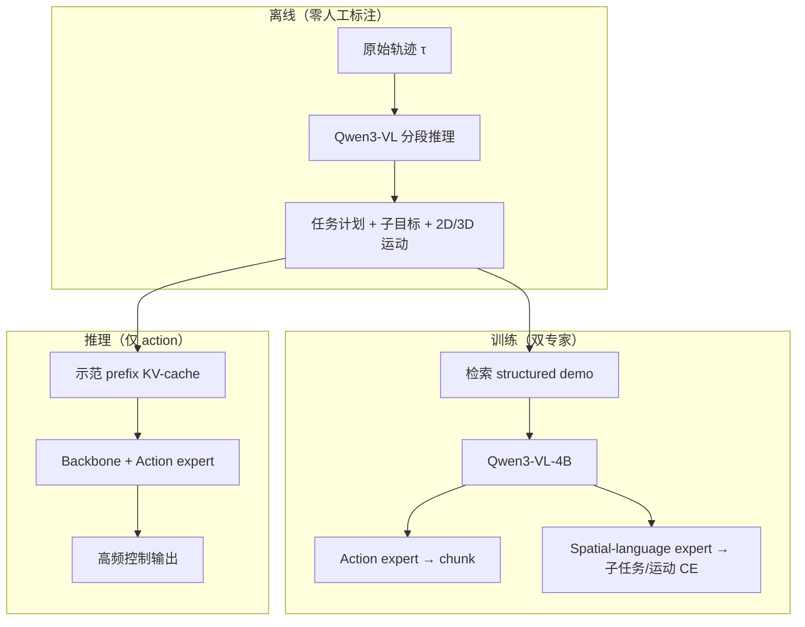

# StellaVLA（结构化 In-Context 示范 · VLA）

**StellaVLA**（*In-Context Structured Demonstration for Generalizable Vision-Language-Action Models*，[arXiv:2608.11671](https://arxiv.org/abs/2608.11671)，[VLA-Arena 排行榜](https://vla-arena.github.io/#leaderboard)）——StellarEdge AI 技术报告；arXiv 作者含 Sydney **Chang Xu** 组等（Siyu Xu、Yunke Wang、Zijian Wang、Dihao Zhu、Chenghao Xia、Chengbin Du、Daochang Liu、Tao Huang、Chang Xu）。

## 一句话定义

**把单次检索示范从「原始轨迹堆叠」升级为「可读的程序结构」：离线自动抽取子目标与 2D/3D 运动语义，训练时双专家内化推理，部署时零梯度、无语言解码开销地适应 OOD 操作。**

## 英文缩写速查

| 缩写 | 英文全称 | 简要说明 |
|------|----------|----------|
| VLA | Vision-Language-Action | 视觉-语言-动作统一策略 |
| ICL | In-Context Learning | 测试时不更新权重，靠上下文示范适应 |
| ICIL | In-Context Imitation Learning | 用检索示范作前缀的模仿学习框架 |
| OFT | Optimized Fine-Tuning | OpenVLA-OFT 风格轻量 action head 微调 |
| OOD | Out-of-Distribution | 场景/视角/物体分布外泛化 |

## 为什么重要

- **ICL 表征升级：** 相对 [BPP](./paper-behavior-prompting-policy.md) 等「原始 sensorimotor 示范作 prompt」，StellaVLA 显式编码 **why（子目标）** 与 **how（2D/3D 运动 verbalization）**，缓解 OOD 下的 behavioral inertia。
- **推理效率：** 与需自回归解码 reasoning 的 VLA 不同，**推理移除 spatial-language expert**，示范 prefix KV-cache 一次编码；真机 pipeline 约 **205 ms/action chunk**。
- **跨具身 context：** 人手 / XR / 真机示范统一结构化后再检索；可执行动作仍在目标机器人空间监督——与 [Zero-WAM](./paper-zero-wam.md) 的人视频任务规格、 [WAM-TTT](./paper-wam-ttt-human-video-test-time-steering.md) 的 fast-weight 记忆形成对照。

## 核心结构与方法栈

| 模块 | 作用 |
|------|------|
| **离线结构化管线** | Qwen3-VL 因果推断分段 → 任务计划 + 子目标 \(s_t\) + verbaliser \(\Phi\) 生成 2D/3D 运动描述 |
| **Qwen3-VL-4B 骨干** | 编码当前观测、指令与检索到的结构化示范 prefix |
| **Action expert** | OpenVLA-OFT 风格 MLP，\(L_1\) 回归 action chunk |
| **Spatial-language expert** | 训练期 CE 监督子任务 + 2D/3D 运动（\(\lambda=0.3\)）；**推理移除** |
| **检索** | 同任务单条 structured demonstration；评测可干预 correct / none / wrong-task |

### 流程总览

## 实验与评测

| 基准 | StellaVLA 要点 | 强基线对照 |
|------|----------------|------------|
| **LIBERO** | 平均 **98.8%** SR | StarVLA-OFT **96.6%**（同骨干无 structured context） |
| **VLA-Arena** | Overall **0.63**；L0/L1/L2 均值 **0.84/0.62/0.43** | \(\pi_{0.5}\) **0.44**；LingBot-VLA **0.22** |
| **LIBERO-Plus** | 零样本 **85.1%** | StarVLA-OFT **75.0%**；视角扰动 **+23.5** |
| **真机 OOD** | 机器人 / 人手 / XR 示范均可作 structured context | 详见论文 §4.3 |
| **三向干预（LIBERO 均值）** | 正确示范 **98.8** / 无示范 **62.4** / 错误示范 **44.9** | 错 < 无 → 策略**主动**用上下文（四篇中唯一该实验） |
| **模态消融（LIBERO-Plus）** | Text-only **98.8/84.4** ≈ Image+Text；Image-only OOD **75.7** | 可迁移信息主要在语言，非像素轨迹 |

**消融要点：** 去掉 3D 运动 verbalization 使 LIBERO 均值降至 **97.8%**；去掉 2D 投影路径降至 **97.3%**——2D 分量对视觉 grounding 更关键。语言监督权重 **λ=0.3** 时 LIBERO-Plus OOD **85.1%**，而 **λ=0 达 86.9%**——若重 OOD 可优先试更低 λ。

## 结论

**StellaVLA 把机器人 ICL 从「模仿像素轨迹」推进到「模仿可读的程序结构」：结构化示范 + 训练期语言监督换来 OOD 鲁棒性，推理时靠 KV-cache 示范前缀即可，无需 TTT 梯度或全模型微调。**

- 真影响指标的是 **结构化示范内容**（子目标 + 2D/3D 运动），而非单纯多塞一条原始轨迹；wrong-task 示范会显著拉低成功率（论文 Table 5）。
- 相对 StarVLA-OFT，增益在 **Goal/Long** 与 **VLA-Arena L1/L2** 更明显——当前观测不足以定结果时长程/子目标顺序更吃 structured context。
- VLA-Arena **Long Horizon L1/L2** 全体方法仍近零：固定 prefix 能指定程序，**不能**在执行漂移后重规划——部署读法应区分「程序迁移」与「闭环纠错」。
- 与 [RoboTTT](./paper-robottt-test-time-training-vla-context.md)、[WAM-TTT](./paper-wam-ttt-human-video-test-time-steering.md) 不同：本方法 **权重不变**，适应靠 **单次检索 + 结构化上下文**；代价是依赖离线 VLM 管线质量与同任务示范库。
- 开源边界保守：截至入库日 **无官方 StellaVLA 代码/权重**；复现可关注 StarVLA 社区栈与 VLA-Arena 开源基准，勿与本文方法混称。

## 工程实践

| 项 | 内容 |
|----|------|
| **训练** | Qwen3-VL-4B-Instruct 全参微调 **30k steps**，global batch **128**；有同任务示范时 context dropout **0.0**，否则 **0.5** |
| **推理** | 移除 spatial-language expert；示范 prefix KV-cache；第三人称 + 腕部 RGB + 语言化机器人状态 |
| **复现入口** | **不适用**（截至入库日无官方仓库）；基准与数据见 [VLA-Arena](https://vla-arena.github.io/) |
| **选型读法** | OOD 桌面操作、可检索同任务示范、需保持高频控制且不愿在线 TTT → 优先考虑；长程漂移纠错 → 对照 RoboTTT / DAgger 线 |

## 源码运行时序图

**不适用**（截至入库日 arXiv 与 VLA-Arena 页均未发布 StellaVLA 可运行官方代码；论文对照基线 StarVLA 见 [arXiv:2604.05014](https://arxiv.org/abs/2604.05014)，非本文官方实现）。

## 常见误区或局限

- **误区：** 与 [RoboTTT](./paper-robottt-test-time-training-vla-context.md) 同为「测试时适应」——RoboTTT **每步写 fast weights**；StellaVLA **零梯度 ICL**。
- **误区：** 结构化示范等于语言链式思考解码——推理 **不** 自回归生成子任务，语言专家仅训练期存在。
- **局限：** 依赖 **同任务示范检索**；物体布局强扰动时增益小（LIBERO-Plus Layout **+0.1**）；无官方代码。

## 与其他工作对比

| 路线 | 适应机制 | 示范形态 | 与 StellaVLA |
|------|----------|----------|--------------|
| **StellaVLA** | ICL，权重不变 | 结构化计划 + 子目标 + 2D/3D 运动 | 本页 |
| [BPP](./paper-behavior-prompting-policy.md) | ICL | 原始人类示范 sensorimotor prompt | 无结构化 why/how 抽取 |
| [RoboTTT](./paper-robottt-test-time-training-vla-context.md) | TTT fast weights | 机器人 visuomotor 流 / 人视频 prefix | 需梯度更新，可 8K 步记忆 |
| [WAM-TTT](./paper-wam-ttt-human-video-test-time-steering.md) | TTT on 冻结 WAM | 人视频批次记忆 | WAM 分支，非 VLA ICL |
| [Zero-WAM](./paper-zero-wam.md) | WAM in-context | 人视频任务规格 | 世界-动作联合，非 VLA 检索示范 |

## 关联页面

- [机器人 In-Context Learning](../concepts/robot-in-context-learning.md) — 真 ICL vs TTT vs 映射选择 taxonomy
- [VLA](../methods/vla.md) — 长程记忆与部署期适应分支
- [Manipulation](../tasks/manipulation.md) — OOD 桌面操作与 VLA-Arena 评测语境
- [BPP](./paper-behavior-prompting-policy.md) — 原始示范 prompting 对照
- [RoboTTT](./paper-robottt-test-time-training-vla-context.md) — 层内 TTT 上下文 scaling

## 参考来源

- [StellaVLA 论文摘录](../../sources/papers/stellavla_arxiv_2608_11671.md)
- [VLA-Arena 站点归档](../../sources/sites/vla-arena.md)
- [每日智能四篇 ICL 纵横向解读（2026-08-31）](../../sources/blogs/wechat_meiri_zhineng_embodied_icl_four_papers_2026-08-31.md)

## 推荐继续阅读

- 论文 PDF：<https://arxiv.org/abs/2608.11671>
- VLA-Arena 基准：<https://vla-arena.github.io/>
- StarVLA 社区代码库（对照基线，非官方 StellaVLA）：<https://arxiv.org/abs/2604.05014>
