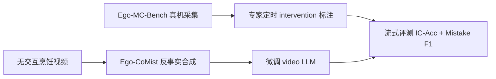
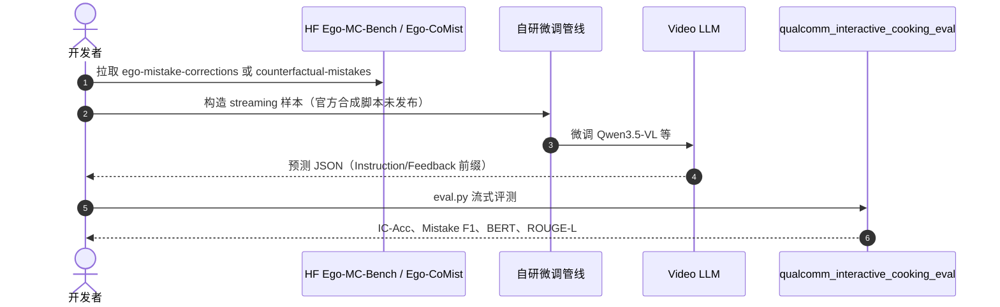

# Streaming Interventions：Ego-MC-Bench 与 Ego-CoMist

**Streaming Interventions**（*Can Video Large Language Models Correct Mistakes as They Occur?*，[arXiv:2606.09547](https://arxiv.org/abs/2606.09547)，[项目页](https://apratimbh.github.io/livecookv2/)）在 [LiveCook](./paper-livecook.md) 的流式烹饪指导线上，聚焦 **错误刚出现时的主动干预**，发布 **Ego-MC-Bench** 真机 benchmark 与 **Ego-CoMist** 反事实合成训练集。

## 一句话定义

**Video LLM 的下一道门槛不是「会不会解说步骤」，而是 streaming 下对 mistake 的及时检测与纠错话术——真机 Ego-MC-Bench 上论文所测的最强通用 video LLM 仍接近失效，Ego-CoMist 用反事实合成把小规模高效模型拉到可部署区间。**

## 英文缩写速查

| 缩写 | 英文全称 | 简要说明 |
|------|----------|----------|
| VLLM | Video Large Language Model | 视频大语言模型 |
| Ego-MC | Egocentric Mistake Corrections | 第一视角真机纠错基准（Ego-MC-Bench） |
| CoMist | Counterfactual Mistakes | 反事实错误合成数据集（Ego-CoMist） |
| IC-Acc | Instruction Completion Accuracy | 步骤完成判定准确率 |

## 为什么重要

- **Ego-MC-Bench** 在真实厨房采集，专家给出 instruction–feedback 对，多视角同步标注 mistake 出现时刻——比仿真/纯 CaptainCook4D 更接近部署场景。
- 实验证明 **论文对照的最强 video LLM 几乎不会纠错**：per-recipe step 上 Gemini-3-Flash mistake F1 仅 **0.18**，多数开源模型 F1 为 0。
- **Ego-CoMist** 把大量无交互烹饪视频转为「带反事实错误 + 纠正反馈」监督样本，缓解 mistake-intervention 训练数据稀缺。
- 微调后 **Qwen3.5-2B（Ego-CoMist+）** 达 F1 **0.20**，显示小模型 + 合成数据对边缘端助手的潜力。

## 核心信息

| 项 | 内容 |
|----|------|
| **机构** | 高通人工智能研究院（Qualcomm AI Research）等 |
| **前作** | [LiveCook / Qualcomm Interactive Cooking](./paper-livecook.md)（NeurIPS 2025） |
| **开源** | **部分开源** — 评测、Ego-MC-Bench、Ego-CoMist HF 数据；反事实合成与官方微调脚本 **未发布** |

### 流程总览

## 评测与指标

| 设定 | 读法 |
|------|------|
| **Zero-shot streaming（per-recipe step）** | Gemini-3-Flash F1 **0.18** 已属前列；多数 7B–38B 开源模型 F1 **0.00** |
| **Zero-shot（full recipes）** | 更长上下文下 F1 进一步下降（如 Gemini-3-Flash **0.08**）— 误差跨步累积 |
| **Ego-CoMist+ 微调** | Qwen3.5-2B F1 **0.20**，BERT **0.444**，ROUGE-L **0.272** — 小模型性价比最高 |
| **对比 ProAssist** | 专用助手基线 F1 0.14；Ego-CoMist+ 在 2B 规模上超越 |

## 结论

**Streaming Interventions 把 LiveCook 的「会不会流式指导」推进到「会不会及时纠错」，并用 Ego-CoMist 证明合成 mistake 数据是小模型可用的关键杠杆。**

- 真机 Ego-MC-Bench 比纯仿真/CC4D 更能暴露 **时序定位 + 主动沟通** 短板；勿用 turn-based 或离线 caption 分数替代。
- 任务需要同时优化 **何时干预** 与 **说什么**；高 Rec 低 Prec（如 Videollm-online）不等于可用教练。
- **Ego-CoMist / Ego-CoMist+** 对 2B 级模型增益最大，适合边缘端低延迟助手选型。
- Full-recipe 评测比 per-step 更苛刻，产品验收应两种口径都看。
- 开源停在数据与评测；合成管线需读者自研，但 HF 数据已足够支撑微调实验。
- 与 [LiveCook](./paper-livecook.md) 共用 `qualcomm_interactive_cooking_eval`，横向对比应固定同一 `eval.py` 与预测 JSON 格式。

## 源码运行时序图

## 工程实践

| 步骤 | 说明 |
|------|------|
| 数据 | [Ego-MC-Bench](https://huggingface.co/datasets/qualcomm/qualcomm-interactive-cooking-dataset-ego-mistake-corrections)；训练用 [Ego-CoMist](https://huggingface.co/datasets/qualcomm/qualcomm-interactive-cooking-dataset-counterfactual-mistakes) |
| 评测 | 与 LiveCook 相同 [eval 仓库](https://github.com/Qualcomm-AI-research/qualcomm_interactive_cooking_eval) |
| 微调 | 论文使用 Qwen3.5-2B/9B/27B 等；读者需自建 streaming fine-tune（无官方脚本） |
| 博客 | [Ego-MC-Bench 导读](https://apratimbh.github.io/blogs/ego-mc-bench/) 补充采集与指标说明 |

## 与其他工作对比

| 维度 | Ego-MC-Bench / Ego-CoMist | [LiveCook](./paper-livecook.md) CC4D 线 | Videollm-online / LiveCC |
|------|---------------------------|----------------------------------------|--------------------------|
| 场景 | **真厨房** 专家干预 | CaptainCook4D 仿真/标注扩展 | 通用在线视频理解 |
| 任务焦点 | **纠错时机 + 话术** | 步骤指导 + mistake alert | 流式 caption / 对话 |
| 训练数据 | Ego-CoMist **反事实合成** | ICAug / CFAug | 预训练为主 |
| Mistake F1（最强基线量级） | Gemini-3-Flash **~0.18** zero-shot | 同量级 streaming 难点 | 高 Rec、低 Prec 假象 |

- **勿与 turn-based 分数横比：** LiveCook 论文已证明 streaming 比单步隔离难一个数量级。
- **小模型路线：** Ego-CoMist+ 对 2B 模型增益大于 27B，边缘部署应优先看小模型+合成数据而非盲目放大参数量。

## 局限与风险

- **合成数据偏差：** Ego-CoMist 来自反事实变换，真机 mistake 分布可能更广。
- **合成管线未开源：** 复现需推断数据格式或联系作者。
- **指标仍偏低：** 即使微调后 F1≈0.2，离可靠教练仍有距离。
- **烹饪域限定：** 迁移到其他 procedural 技能需新 benchmark。

## 关联页面

- [LiveCook / Qualcomm Interactive Cooking](./paper-livecook.md) — 前作基准、LiveMamba 与 CaptainCook4D 脉络
- [VLA](../methods/vla.md) — 视觉–语言–动作与具身助手
- [Manipulation](../tasks/manipulation.md) — 操作与 procedural 任务
- [Awesome Egocentric Vision](./awesome-egocentric-vision.md) — 第一视角研究索引

## 参考来源

- [streaming_interventions_arxiv_2606_09547.md](../../sources/papers/streaming_interventions_arxiv_2606_09547.md)
- [livecookv2-streaming-interventions 项目页](../../sources/sites/livecookv2-streaming-interventions.md)
- [qualcomm-interactive-cooking-eval](../../sources/repos/qualcomm-interactive-cooking-eval.md)

## 推荐继续阅读

- [Streaming Interventions 项目页](https://apratimbh.github.io/livecookv2/)
- [arXiv:2606.09547](https://arxiv.org/abs/2606.09547)
- [Ego-MC-Bench 博客导读](https://apratimbh.github.io/blogs/ego-mc-bench/)
