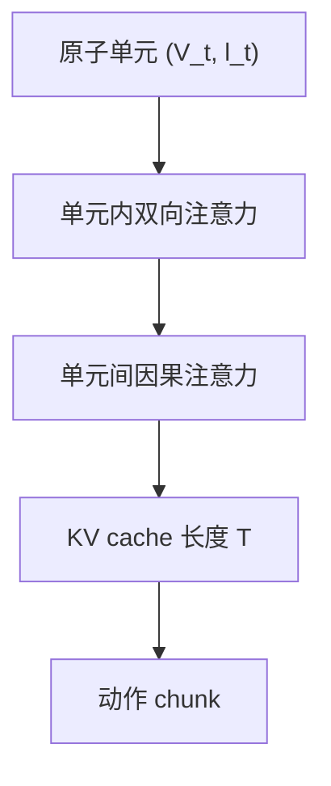

# StreamPI

**StreamPI: Streaming Multimodal Temporal Modeling for Vision-Language-Action Models**（[arXiv:2608.26067](https://arxiv.org/abs/2608.26067)，[项目页](https://happinesslz.github.io/projects/StreamPI)）——香港大学（HKU）；ACE Robotics。

## 一句话定义

**不必把模型做大：改注意力结构与训练节奏，单帧 VLA 也能带着历史做流式推理。**

## 英文缩写速查

| 缩写 | 英文全称 | 简要说明 |
|------|----------|----------|
| VLA | Vision-Language-Action | 视觉-语言-动作策略 |
| KV | Key-Value cache | 流式推理缓存历史单元 |
| LIBERO | Lifelong Robot Learning benchmark | 四套操作仿真基准 |
| CALVIN | Composing Actions from Language and Vision | 长链指令跟随基准 |

## 为什么重要

- 纳入 [具身智能小站 2026-08-28 九篇盘点](../../sources/blogs/wechat_embodied_station_wam_vla_cross_embodiment_9_papers_2026-08-28.md)：时间上下文可以持续流入策略。
- 开源状态（入库日）：**待发布**（官方仓计划 2026-08-30）。

## 核心信息

| 项 | 内容 |
|----|------|
| **机构** | 香港大学（HKU）；ACE Robotics |
| **出处** | arXiv:2608.26067（2026-08） |
| **开源** | **待发布** |

### 流程总览

## 工程实践

| 项 | 内容 |
|----|------|
| **骨干** | 继承 π0.5 / openpi 单帧权重，零新增参数 |
| **训练** | 随机间隔 δ∼U[3,7] + 最早 k 帧随机遮蔽 |
| **推理** | 只编码新单元，cache 超 T 则 flush |
| **延迟** | RTX 4090 上 T=1→5 仅 +9.2 ms（20 次均值） |
| **真机** | AgileX PiperX 6-DoF，前视 D455 + 双腕 D435，100 条 30 FPS 示范 / 任务 |

## 评测

| 项 | 内容 |
|----|------|
| **LIBERO T=5** | Spatial 98.8 / Object 99.8 / Goal 99.6 / Long 95.0，平均 **98.3%**（π0.5 为 96.9%） |
| **真机** | Cup Insertion 60→**92%**；Pen Insertion 40→**66.7%**；Rolling Object 26.7→**63.3%**；Shell Game 46.7→**80%** |
| **CALVIN ABC→D** | 平均链长 **4.547** vs π0.5 的 4.313 |

- 数据出处：[ingest 摘录「评测」](../../sources/papers/streampi_arxiv_2608_26067.md)。

## 结论

**VLA 的时间能力首先是注意力结构与部署节奏一致，而不是再堆参数。**

1. 指令必须在每个时间单元重新锚定，否则长视野会把语言稀释掉。
2. 随机间隔训练是异步真机的关键，而不是固定 δ=1。
3. 记忆依赖与精细插入任务的增益远大于 LIBERO-Spatial 这种已经饱和的套件。
4. 入库日代码未公开，数字以项目页表为准。

## 源码运行时序图

**不适用**（截至 **2026-08-28**）：官方实现计划 2026-08-30 随仓库发布。

## 局限与风险

- 训练仍一次性加载全部时间帧，极长上下文成本高。
- 随机间隔不能覆盖极端异步。
- 项目页自承需自适应 KV 剪枝与超 100 帧训练。

## 与其他工作对比

- 相对窗口拼接历史：序列不随帧数线性膨胀到不可训，且语言不被稀释。
- 相对 [π0.5](./paper-pi05-open-world-vla.md) 单帧范式：同权重可切单帧/多帧推理。
- LIBERO 上相对 MemoryVLA / ST-π 的读法：StreamPI 报最高平均，但对比表来自项目页而非统一复现。

## 关联页面

- [VLA](../methods/vla.md)
- [LIBERO](./libero-benchmark.md)
- [Manipulation](../tasks/manipulation.md)
- [WAM / VLA / 跨本体 9 篇技术地图](../overview/wam-vla-cross-embodiment-9-papers-technology-map.md)

## 参考来源

- [streampi_arxiv_2608_26067](../../sources/papers/streampi_arxiv_2608_26067.md)
- [streampi 项目页](../../sources/sites/streampi.md)
- [具身智能小站 9 篇盘点](../../sources/blogs/wechat_embodied_station_wam_vla_cross_embodiment_9_papers_2026-08-28.md)

## 推荐继续阅读

- [arXiv:2608.26067](https://arxiv.org/abs/2608.26067)
- [StreamPI 项目页](https://happinesslz.github.io/projects/StreamPI)
