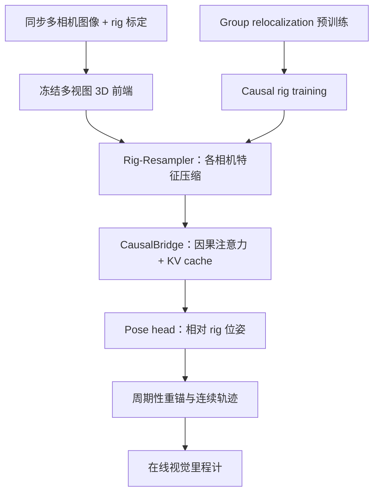
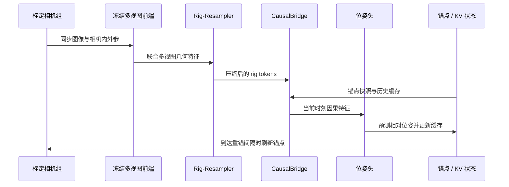

# StreamRig：利用相机组内几何实现流式多相机里程计

**StreamRig: Exploiting Intra-Rig Geometry for Streaming Multi-Camera Odometry**  
作者：Yufei Wei、Shuhao Ye、Qi Wang、Xin Zheng、Qing Huang、Rong Xiong、Yue Wang  
机构：浙江大学、华南理工大学  
论文：arXiv:2609.40244，2026-09-30 提交。作者主页标注 ICRA 2027 under review（尚非录用论文）。

## 一句话理解

把同一时刻多台**已同步、已标定**相机的图像当作一个整体来理解；先用冻结的 3D 多视图基础模型提取几何，再用轻量因果模块从连续相机组估计机器人位姿。

## 它解决什么问题

许多在线 3D 视觉模型按单目视频设计，直接逐帧处理 rig 中的多台相机，可能浪费相机间的固定几何关系。StreamRig 利用相机内外参，让冻结前端在每个时刻联合看整个 rig，再把多相机几何信息压缩到小型时序状态中。

**它是相机里程计 / 位姿估计方法，不是运动控制策略。** 对人形机器人来说，它可以作为视觉状态估计的候选前端；实际接入仍需处理相机标定、时间同步、位姿坐标系和控制系统的延迟接口。

## 方法拆解

1. **联合感知 rig：** 冻结的多视图 3D 基础模型读取同步图像与 rig 标定，不训练整套视觉骨干。项目默认使用 MapAnything；项目页还报告 Depth Anything 3 与 π³X 可作为替代前端。
2. **压缩相机特征：** Rig-Resampler 将每个相机的特征压缩为少量 latent tokens；项目页指出每台相机用 16 个 tokens。
3. **因果读取历史：** CausalBridge 使用 causal attention 与 KV cache，把当前 rig 特征和锚点快照、历史状态关联起来。
4. **回归相对位姿：** 轻量 pose head 输出 rig 位姿；训练监督仅使用相对位姿。
5. **周期性重锚：** 将最新 rig 设为下一段参考锚点，再把相对位姿组合成连续轨迹，限制活跃状态随序列长度无界增长。

可训练部分共 **74.6M 参数**。两阶段训练先学习 group relocalization，再学习 causal rig odometry；论文摘要称移除第一阶段后性能明显变差，具体消融数值和配置见项目页。

### 架构与训练流程

### 一帧 rig 到在线位姿的推理时序

## 数据集与结果

| 数据集 | 相机 rig / 场景 | 数据与训练边界 |
|---|---|---|
| NCLT | 5 相机，真实室外跨季节 | README 提供训练、评测脚本和权重 |
| TartanGround | 4 相机，仿真校园场景 | 论文项目页列为评测集 |
| KITTI-360 | 4 相机，立体 + 两个鱼眼 | README 提供训练、评测脚本和权重 |
| ZJH | 4 相机，自采人形机器人 | 用仿真训练权重进行真实世界零样本评测 |

官方仓库 README 报告的复现结果如下。指标协议不同或序列不同的结果不可直接横向比较。

| 数据集 | 序列 | 平移漂移 t_rel ↓ | 旋转漂移 r_rel ↓ | ATE ↓ |
|---|---|---:|---:|---:|
| NCLT | 2012-02-19、2012-08-20 | 2.77% | 1.39°/100 m | 28.4 m |
| KITTI-360 | 0009、0010 | 2.59% | 0.98°/100 m | 63.7 m |

仓库说明 t_rel / r_rel 按 KITTI odometry 协议在 100–800 m 子段上计算（stride 3）；ATE 在完整序列上做 SE(3) 对齐。项目页另报告 5 相机输入耗时 26.2 ms / 2.6 GiB，作者主页则描述四相机设置达到 50 Hz；这两项来自不同硬件 / 相机设置口径，不能合并成一个速度指标。

## 对机器人部署的意义

- **适合研究的问题：** 多相机环视、相机组的在线位姿估计，以及仿真训练到真机视觉里程计的迁移。
- **人形机器人关联：** ZJH 数据集来自人形机器人，提供了与相机 rig 里程计相关的真实平台验证；这不等价于验证了双足运动中的控制稳定性。
- **与 G2G 的关系：** 官方 StreamRig 训练配置用 G2G 重定位 checkpoint warm-start；G2G 提供跨组重定位预训练，StreamRig 再做因果流式里程计。
- **不是 IMU 融合器：** 公开方法以多相机图像及标定为核心，论文摘要未描述 IMU / 轮速融合。若用于机器人控制，不能把它当作完整状态估计器的替代品。
- **接入检查：** 需评估相机同步与标定质量、基座坐标转换、重锚策略带来的位姿连续性，以及端到端延迟是否满足控制频率。

## 复现入口与资源限制

- **项目详情：** [StreamRig 独立项目页](./streamrig.md)
- **代码：** [GitHub 仓库](https://github.com/WeiYuFei0217/StreamRig)，包含 NCLT / KITTI-360 训练和评测说明。
- **权重：** [Hugging Face](https://huggingface.co/feixue22/StreamRig)；README 也链接百度网盘并提供 SHA256 校验。
- **许可：** StreamRig 代码 CC BY-NC 4.0；vendored MapAnything 保留 Apache 2.0。CC BY-NC 不是商业使用许可。
- **计算开销：** 特征缓存约 NCLT 470 GiB、KITTI-360 104 GiB；仓库评测 NCLT 约 35 GB 主机内存。按官方安装说明还需 CUDA 12.8 / PyTorch 2.9.1 和 DINOv2-Large 主干权重。
- **复现边界：** 项目页列出四组评测，但公开 README 的脚本和权重表重点覆盖 NCLT、KITTI-360；TartanGround 与 ZJH 的完整公开运行步骤仍需以仓库更新为准。

## 局限

- 方法依赖高质量的多相机同步与内外参标定；标定误差会直接影响组内几何先验。
- 公开摘要主要报告与被测模型的相对比较；不能推导出在任意机器人、镜头布局或计算设备上都占优。
- 大型冻结前端、特征缓存和重定位预训练增加复现门槛；这不是轻量单目 VO 替换件。
- 对控制系统而言，估计漂移指标不等于闭环行走稳定性；需要接入具体机器人后评估时延、失效检测与恢复逻辑。

## 关联页面

- [StreamRig 项目详情](./streamrig.md) — 官方代码、权重、训练和部署复现
- [G2G](./paper-g2g.md) — StreamRig 使用其 group relocalization checkpoint warm-start
- [状态估计知识链](../overview/hub-state-estimation.md)
- [导航 / SLAM / 自主系统栈](../overview/navigation-slam-autonomy-stack.md)
- [State Estimation](../concepts/state-estimation.md)

## 参考来源

- [arXiv:2609.40244](https://arxiv.org/abs/2609.40244)
- [StreamRig 官方项目页](https://weiyufei0217.github.io/StreamRig/)
- [StreamRig 官方代码与复现说明](https://github.com/WeiYuFei0217/StreamRig)
- [StreamRig 论文来源归档](../../sources/papers/streamrig_arxiv_2609_40244.md)
