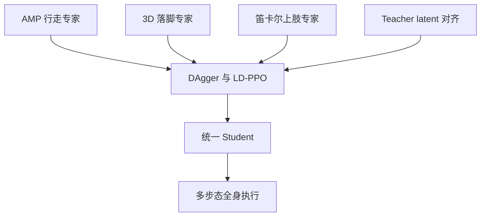
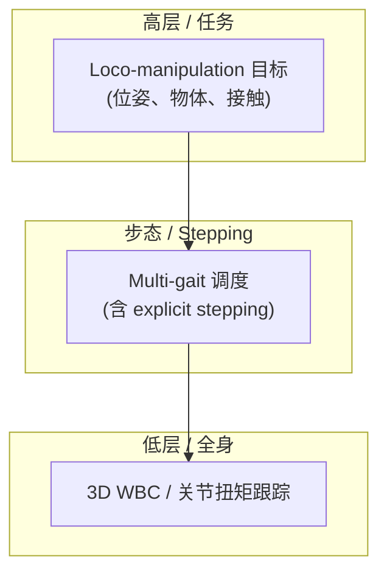

# STRIDER（arXiv:2609.23483）

**STRIDER**（*STRIDER: Stepping-Enabled Multi-Gait Hierarchical 3D Loco-Manipulation Framework for Humanoid Robots*，[arXiv:2609.23483](https://arxiv.org/abs/2609.23483)）来自 [senlanke 具身运控lab 周更盘点](../../sources/blogs/wechat_senlanke_weekly_humanoid_quadruped_2026-09-21_25.md)（2026-09-21–25）。

## 一句话定义

**AMP 行走 + 3D 落脚专家 + 笛卡尔上肢；LD-PPO 在线 RL + DAgger + Teacher latent 对齐蒸馏统一 Student。**

## 英文缩写速查

| 缩写 | 英文全称 | 简要说明 |
|------|----------|----------|
| RL | Reinforcement Learning | 强化学习 |
| WBC | Whole-Body Control | 全身控制 |
| MPC | Model Predictive Control | 模型预测控制 |

| Loco-Manip | Loco-Manipulation | 移动与操作联合任务 |
| Sim2Real | Simulation to Real | 仿真策略真机部署 |
| HRL | Hierarchical Reinforcement Learning | 分层策略/技能组合 |

## 为什么重要

- 速度指令策略难控三维落点；单独踏步策略难与行走/操作统一。

## 流程总览

以下按本页已归纳的机制与资料绘制，表示模块或阅读路径关系。

## 核心机制

| 项 | 内容 |
|----|------|
| **arXiv** | [2609.23483](https://arxiv.org/abs/2609.23483) |
| **开源** | **待发布**（步骤 2.5，2026-09-28） |
| **方法摘要** | Multi-expert + LD-PPO with DAgger and teacher-conditioned latent alignment. |

## 源码运行时序图

**不适用**（截至 2026-09-28 未发布可运行官方代码或待核实）。

## 实验与评测

- X-Humanoid 平台分层 loco-manip（以 PDF 为准）。
- 读法：先对齐任务设定、传感器与成功定义，再解读 headline 数字。

## 与其他工作对比

| 维度 | 读法 |
|------|------|
| **同周对照** | 见对应 [周更盘点](../../sources/blogs/wechat_senlanke_weekly_humanoid_quadruped_2026-09-21_25.md) 映射表，勿跨任务直接比 SR |
| **开源状态** | **待发布** — 部署前以项目页/arXiv 为准 |

## 结论

**STRIDER 用 latent 蒸馏把异构专家合成可踏步的多步态 loco-manip 框架。**

1. 开源：**待发布**；勿凭公众号摘要臆断可复现性。
2. 指标须连同实验条件解读（仿真/真机、平台、成功阈值）。
3. 关注 arXiv 版本更新与代码发布。

## 项目资源与工程补充

### 核心信息

| 字段 | 内容 |
|------|------|
| 机构 | 北京人形机器人创新中心（X-Humanoid） |
| 公开材料 | [YouTube demo](https://youtu.be/gf5RWjCZXtA) |
| 论文 / arXiv | **未公开**（2026-09-23） |
| 开源状态 | **未公开** |
| 上传者（视频页） | Yuanzhuo Li |

### 核心原理（待核实）

从标题与 demo 语境可 **假设**（非论文结论）：

- **Stepping-Enabled：** 落脚/换步扩展操作 reachable workspace（与 [loco-manipulation](../tasks/loco-manipulation.md) 中「腿为臂让路」同族问题）。
- **Multi-Gait：** 行走/站定/可能的特殊步态切换，服务非结构化 3D 场景。
- **Hierarchical：** 任务层与步态/低层控制分离，降低单策略 reward 工程难度（对照 [OmniContact](./paper-omnicontact-humanoid-loco-manipulation.md) 的 meta-skill 分层）。

### 工程实践

| 检查项 | 建议 |
|--------|------|
| 一手来源 | 等待 X-Humanoid 发布 PDF / 项目页后再读数值与接口 |
| 开源边界 | 截至入库日 **无代码**；勿与 XR-1 仓库混为同一 release |
| 选型 | 仅作路线跟踪；正式 benchmark 出来前不参与算法对比 |

### 源码运行时序图

**不适用**（截至 2026-09-23 无官方可运行代码或 README 入口）。

### 实验与评测

- 演示视频 **未附** 定量 SR/成功率、仿真器或真机平台说明。
- 发布后应对齐：embodiment、任务集、是否与 Wise KaiWu / XR-1 共用数据或低层 API。

### 局限与风险

- **证据不足：** 任何关于算法族（RL / MPC / VLA）的猜测均待论文核实。
- **Unlisted 视频：** 链接可能变更；入库日以 [`sources/sites/strider-demo-youtube.md`](../../sources/sites/strider-demo-youtube.md) 为准。

## 关联页面

- [humanoid-locomotion](../tasks/humanoid-locomotion.md)
- [reinforcement-learning](../methods/reinforcement-learning.md)
- [sim2real](../concepts/sim2real.md)

- [loco-manipulation](../tasks/loco-manipulation.md)
- [whole-body-control](../concepts/whole-body-control.md)
- [paper-omnicontact-humanoid-loco-manipulation](./paper-omnicontact-humanoid-loco-manipulation.md)

## 参考来源

- [strider-multi-gait-loco-manip_arxiv_2609_23483.md](../../sources/papers/strider-multi-gait-loco-manip_arxiv_2609_23483.md)
- [wechat_senlanke_weekly_humanoid_quadruped_2026-09-21_25.md](../../sources/blogs/wechat_senlanke_weekly_humanoid_quadruped_2026-09-21_25.md)
- [arXiv:2609.23483](https://arxiv.org/abs/2609.23483)

- [strider_x_humanoid_demo_2026.md](../../sources/papers/strider_x_humanoid_demo_2026.md)
- [strider-demo-youtube.md](../../sources/sites/strider-demo-youtube.md)
- [演示视频](https://youtu.be/gf5RWjCZXtA)

## 推荐继续阅读

- [arXiv PDF](https://arxiv.org/pdf/2609.23483)

- [X-Humanoid Tien Kung 3.0 新闻稿](https://www.prnewswire.com/news-releases/x-humanoid-introduces-embodied-tien-kung-3-0--a-more-open-and-practical-humanoid-robotics-platform-302688505.html)
- [Open-X-Humanoid/XR-1](https://github.com/Open-X-Humanoid/XR-1)
