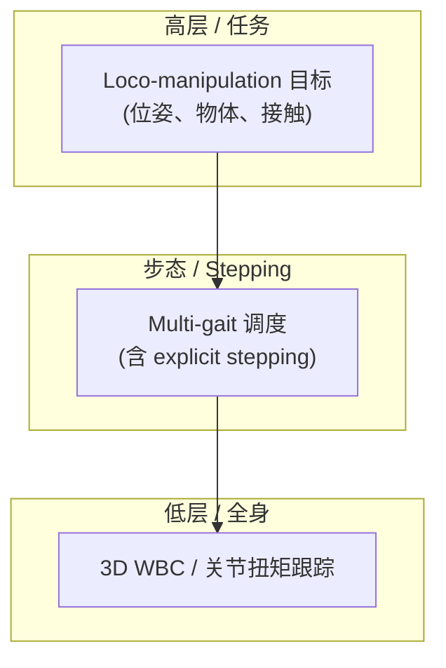

# STRIDER（X-Humanoid 演示）

**STRIDER**（*Stepping-Enabled Multi-Gait Hierarchical 3D Loco-Manipulation Framework for Humanoid Robots*）由 **北京人形机器人创新中心（X-Humanoid）** 对外展示；截至 **2026-09-23**，公开材料仅为 [YouTube 演示片](https://youtu.be/gf5RWjCZXtA)（约 4:51，Unlisted），**尚无 arXiv / 项目页 / 源码**。本页为 **演示级** 知识节点，方法细节待正式论文发布后再升级。

## 一句话定义

X-Humanoid 展示的 **多步态 stepping + 分层 3D 全身移动操作** 人形控制框架演示，当前仅有视频证据、无公开技术报告。

## 英文缩写速查

| 缩写 | 英文全称 | 简要说明 |
|------|----------|----------|
| WBC | Whole-Body Control | 全身协调控制 |
| Loco-Manip | Loco-Manipulation | 移动与操作联合任务 |
| RL | Reinforcement Learning | 常见人形技能学习范式 |
| Sim2Real | Simulation to Real | 仿真策略真机部署 |
| HRL | Hierarchical Reinforcement Learning | 分层策略/技能组合 |

## 为什么重要

- **机构信号：** X-Humanoid 同期推进 [Tien Kung 3.0](https://www.prnewswire.com/news-releases/x-humanoid-introduces-embodied-tien-kung-3-0--a-more-open-and-practical-humanoid-robotics-platform-302688505.html) 与 [XR-1 VLA](https://github.com/Open-X-Humanoid/XR-1)；STRIDER 命名指向 **步态切换 + 3D loco-manip** 控制栈，补全「人形分层 loco-manip」观察列表。
- **阅读边界：** 在 PDF 发布前，本页 **不能** 支撑复现或性能对比；仅用于跟踪 X-Humanoid 技术路线。

## 核心信息

| 字段 | 内容 |
|------|------|
| 机构 | 北京人形机器人创新中心（X-Humanoid） |
| 公开材料 | [YouTube demo](https://youtu.be/gf5RWjCZXtA) |
| 论文 / arXiv | **未公开**（2026-09-23） |
| 开源状态 | **未公开** |
| 上传者（视频页） | Yuanzhuo Li |

## 核心原理（待核实）

从标题与 demo 语境可 **假设**（非论文结论）：

- **Stepping-Enabled：** 落脚/换步扩展操作 reachable workspace（与 [loco-manipulation](../tasks/loco-manipulation.md) 中「腿为臂让路」同族问题）。
- **Multi-Gait：** 行走/站定/可能的特殊步态切换，服务非结构化 3D 场景。
- **Hierarchical：** 任务层与步态/低层控制分离，降低单策略 reward 工程难度（对照 [OmniContact](./paper-omnicontact-humanoid-loco-manipulation.md) 的 meta-skill 分层）。

## 工程实践

| 检查项 | 建议 |
|--------|------|
| 一手来源 | 等待 X-Humanoid 发布 PDF / 项目页后再读数值与接口 |
| 开源边界 | 截至入库日 **无代码**；勿与 XR-1 仓库混为同一 release |
| 选型 | 仅作路线跟踪；正式 benchmark 出来前不参与算法对比 |

## 源码运行时序图

**不适用**（截至 2026-09-23 无官方可运行代码或 README 入口）。

## 实验与评测

- 演示视频 **未附** 定量 SR/成功率、仿真器或真机平台说明。
- 发布后应对齐：embodiment、任务集、是否与 Wise KaiWu / XR-1 共用数据或低层 API。

## 与其他工作对比

截至入库日 STRIDER **无公开论文与代码**，下表比较的是 **公开证据等级** 与 **路线定位**，不是方法性能：

| 维度 | STRIDER（本页） | [OmniContact](./paper-omnicontact-humanoid-loco-manipulation.md) | 端到端 loco-manip VLA |
|------|------------------|-------------------------------------------------------------------|------------------------|
| 公开材料 | **仅 YouTube demo**（Unlisted，约 4:51） | 论文 + 方法细节 | 论文/代码视项目而定 |
| 分层假设 | 标题指向 HRL：任务层 → multi-gait stepping → 3D WBC | meta-skill 分层 | 单策略端到端 |
| 可引用性 | **不可** 用于性能对比或复现 | 可 | 可 |
| 本页作用 | 路线跟踪锚点 | 方法对照 | 方法对照 |

- **唯一可做的对照是「问题相同」：** stepping 扩展可达工作空间、腿为臂让路，这些与 [loco-manipulation](../tasks/loco-manipulation.md) 页归纳的同族问题一致；但 **任何关于算法族（RL / MPC / VLA）的归类都属推测**，正式论文发布前不应写进对比表。
- **与同机构 XR-1 分开记账：** [XR-1](https://github.com/Open-X-Humanoid/XR-1) 是已开源的 VLA 线，与本页 demo 不是同一 release，**不要把 XR-1 的开源状态回填给 STRIDER**。
- **升级条件：** 出现 arXiv / 项目页 / 代码任一后，应回写 `sources/papers/`、更新开源状态与 `status`，并把本节替换为真正的方法对比。

## 结论

**STRIDER 当前是 X-Humanoid 的「分层 3D loco-manip + 多 gait stepping」公开演示锚点，不是已可引用的技术论文。**

1. 仅有 YouTube demo；**无 arXiv、无项目页、无代码**（2026-09-23）。
2. 标题暗示 **HRL + stepping + multi-gait**，与 WholeBodyVLA / OmniContact / VisualMimic 等同题，但 **零方法细节**。
3. 跟踪 X-Humanoid 正式 release 后应回写 `sources/papers/`、开源状态与本页 `status`。
4. 勿将 demo 画面直接当作已复现 SOTA。
5. 与同机构 [XR-1](https://github.com/Open-X-Humanoid/XR-1) 分开记账：后者是已开源 VLA 线。

## 局限与风险

- **证据不足：** 任何关于算法族（RL / MPC / VLA）的猜测均待论文核实。
- **Unlisted 视频：** 链接可能变更；入库日以 [`sources/sites/strider-demo-youtube.md`](../../sources/sites/strider-demo-youtube.md) 为准。

## 关联页面

- [loco-manipulation](../tasks/loco-manipulation.md)
- [whole-body-control](../concepts/whole-body-control.md)
- [paper-omnicontact-humanoid-loco-manipulation](./paper-omnicontact-humanoid-loco-manipulation.md)
- [reinforcement-learning](../methods/reinforcement-learning.md)

## 参考来源

- [strider_x_humanoid_demo_2026.md](../../sources/papers/strider_x_humanoid_demo_2026.md)
- [strider-demo-youtube.md](../../sources/sites/strider-demo-youtube.md)
- [演示视频](https://youtu.be/gf5RWjCZXtA)

## 推荐继续阅读

- [X-Humanoid Tien Kung 3.0 新闻稿](https://www.prnewswire.com/news-releases/x-humanoid-introduces-embodied-tien-kung-3-0--a-more-open-and-practical-humanoid-robotics-platform-302688505.html)
- [Open-X-Humanoid/XR-1](https://github.com/Open-X-Humanoid/XR-1)
