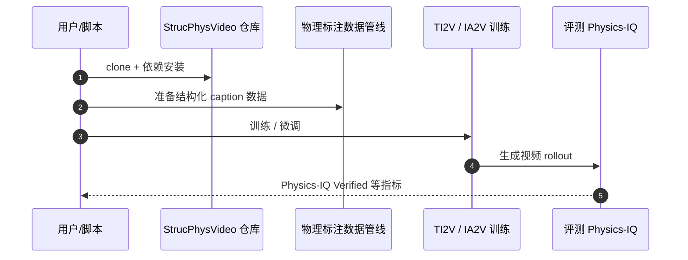

# StrucPhysVideo（arXiv:2609.18430）

**StrucPhysVideo**（*Learning Physical Dynamics from Structured Captions and Robot Actions*，[arXiv:2609.18430](https://arxiv.org/abs/2609.18430)，[GitHub](https://github.com/westlakedi-awomo/StrucPhysVideo)，[项目页](https://westlakedi-awomo.github.io/StrucPhysVideo-Page/)）来自 [具身智能小站 9 篇盘点](../../sources/blogs/wechat_embodied_station_9_papers_perception_action_transfer_2026-09-17.md)。

## 一句话定义

**用结构化物理标注（接触、形变、状态转移、相机运动）训练视频世界模型，使 TI2V/IA2V 生成不只会「看起来连贯」，还要遵守物理事件因果。**

## 英文缩写速查

| 缩写 | 英文全称 | 简要说明 |
|------|----------|----------|
| TI2V | Text-Image-to-Video | 文本+参考图生成未来视频 |
| IA2V | Image-Action-to-Video | 参考图+机器人动作生成视频 |
| WM | World Model | 预测未来观测的世界模型 |

## 为什么重要

- 普通视频 caption 忽略物理事件，导致 WM **视觉连贯但动力学错误**。
- IA2V 把 **末端动作** 接入生成，连接「命令运动」与「场景如何变」。
- 开源结论：**已开源**（2026-09-17）。

## 核心机制

| 项 | 内容 |
|----|------|
| **arXiv** | [2609.18430](https://arxiv.org/abs/2609.18430) |
| **开源** | **已开源** |
| **数据** | 物理管线过滤交互；结构化描述场景/实体/材料/事件 |
| **文内指标** | Physics-IQ Verified 45.5% |

## 源码运行时序图

## 实验与评测

| 项 | 内容 |
|----|------|
| 主 benchmark | **Physics-IQ**，文内报告 Verified **45.5%** |
| 指标性质 | 考的是「生成视频是否遵守物理事件因果」，不是画面清晰度或时序连贯度 |
| 读法 | 45.5% 远未饱和，适合当 **相对 baseline** 比较监督粒度的影响，不能当绝对部署保证 |
| 两种生成模式 | TI2V（文本+图）与 IA2V（图+机器人动作）共享同一套物理监督数据，评测时需按用途分开看 |
| 可复现性 | 代码 **已开源**，训练/评测链路可独立跑通（见 [参考来源](#参考来源)） |

## 与其他工作对比

| 对照对象 | 差异 |
|----------|------|
| 普通视频 caption 训练的世界模型 | caption 忽略接触/形变/状态转移，模型学到「视觉连贯但动力学错误」；本文把物理事件写进 **结构化标注** |
| 纯 TI2V 生成 | 只由文本与参考图外推，命令与场景变化之间无显式通路；IA2V 把 **末端动作** 接进条件 |
| [DeformSmith](./paper-deformsmith.md) | 同属「物理可信」方向但产物不同：DeformSmith 产 **可仿真资产**，本文产 **视频 dynamics** |
| 物理引擎仿真（Isaac / MuJoCo） | 动力学精确但建模成本高、场景覆盖窄；视频 WM 覆盖广但物理只在 45.5% 量级——两者当前是互补而非替代 |
| [World-Action Models](../concepts/world-action-models.md) 路线 | WAM 直接输出动作；本文停在 **预测未来观测**，需另接策略层才闭环 |

## 结论

**StrucPhysVideo 说明视频 WM 的上限取决于物理监督粒度——结构化 caption 是可比 Physics-IQ 的前提，而非可选增强。**

1. TI2V 与 IA2V 共享物理数据哲学，部署时选对生成模式（纯预测 vs 动作条件）。
2. 45.5% Physics-IQ 仍远非饱和，宜作相对 baseline 而非绝对部署保证。
3. 与 [DeformSmith](./paper-deformsmith.md) 同属「物理可信数据/生成」方向，一个偏资产，一个偏视频 dynamics。

## 关联页面

- [generative-world-models](../methods/generative-world-models.md)
- [world-action-models](../concepts/world-action-models.md)
- [manipulation](../tasks/manipulation.md)
- [9 篇技术地图](../overview/perception-action-transfer-9-papers-technology-map.md)

## 参考来源

- [strucphysvideo_arxiv_2609_18430.md](../../sources/papers/strucphysvideo_arxiv_2609_18430.md)
- [wechat_embodied_station_9_papers_perception_action_transfer_2026-09-17.md](../../sources/blogs/wechat_embodied_station_9_papers_perception_action_transfer_2026-09-17.md)

## 推荐继续阅读

- [GitHub: westlakedi-awomo/StrucPhysVideo](https://github.com/westlakedi-awomo/StrucPhysVideo)
- [arXiv PDF](https://arxiv.org/pdf/2609.18430)
